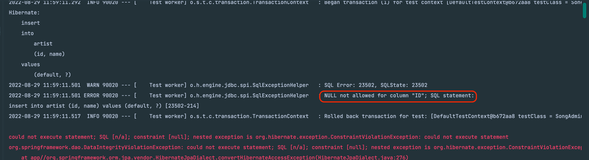
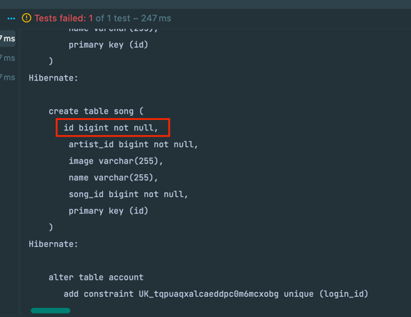
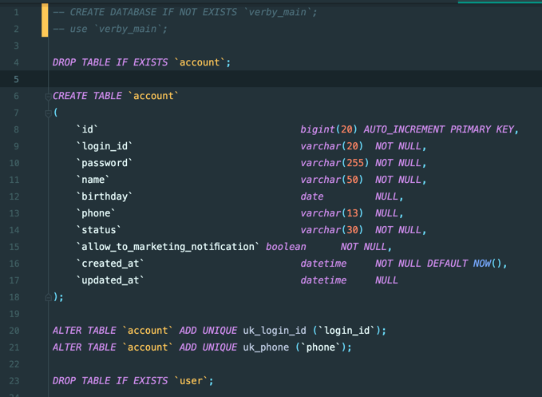
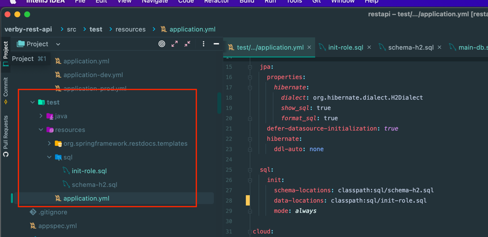
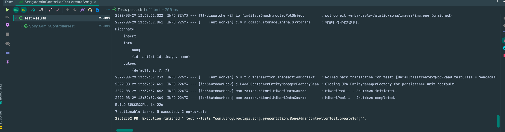

# H2 - CQRS에서 조회 모델으로 DDL을 생성하는 이슈 해결!

## 문제 발생

최근에 사이드 프로젝트에서 DDD와 CQRS를 적용해서 개발하다가 갑자기 테스트가 깨지는 현상이 발생했다.

각 모델은 다음과 같이 정의되어있었다. (간략화)

**Command Model**
```java
@Getter
@Entity
@NoArgsConstructor(access = AccessLevel.PROTECTED)
public class Song {

    @Id
    @GeneratedValue(strategy = GenerationType.IDENTITY)
    private Long id;

    private long artistId;

    private String name;

    private String image;

    public Song(long artistId, String name, String image) {
        this.artistId = artistId;
        this.name = name;
        this.image = image;
    }
}

```

**Command Model**
```java
@Getter
@Entity
@Table(name = "song")
@NoArgsConstructor(access = AccessLevel.PROTECTED)
public class SongData {

    @Id
    private Long id;

    private long artistId;

    private String name;

    private String image;

}
```

테스트 코드에서 에러가 발생한 부분은 Repository.save()를 통해 생성하는 부분이다.

`songRepository.save()`

에러 내용은 다음과 같다.



주의 깊게 볼 부분은 `Null not allowed for column "ID"`라는 부분이다. 



이후 h2에서 DDL을 실행한 부분을 찾아보니까 AUTO_INCREMENT 부분이 빠져있음을 알 수 있었다.

즉, 정리하면 H2에서 테이블 데이터를 만들 때 Command 모델인 Song 엔터티가 아니라, Query 모델인 SongData 모델을 참조해서 DDL을 생성해서 실행했다.

이를 해결하려면 SongData 엔터티에서도 Song 엔터티처럼 @GenerateValue 애노테이션을 붙여주고 생성이 가능하도록 처리할 수 있다. 하지만, 조회 모델은 조회에서만 사용하기 때문에 적절한 처리가 아니라고 판단했다.

## 해결

해당 방법을 해결하기 위해서 테스트 환경의 프로퍼티를 정의해서 직접 정의한 DDL을 실행하도록 처리했다.

먼저 본인 환경의 h2 환경에서의 DDL을 직접 작성해야 한다.

본인의 경우 MariaDB DDL을 사용하고 있었는데 해당 DDL을 그대로 사용하면 에러가 나왔다.

(그래서 **MySQL to H2**라는 인텔리 제이 플러그인을 사용해봤다.)

해당 플러그인을 사용해서 MySQL DDL -> H2 DDL을 변환해봤는데 큰 차이가 없었다.



이미지와 같이 DB 스키마를 생성하는 부분만 주석 처리하면 H2 데이터베이스 DDL로 잘 작동헀다.

그리고 테스트 환경의 application.yml/properties 파일에 아래의 설정을 추가한다.
```yml
spring:
  jpa:
    properties:
      hibernate:
        dialect: org.hibernate.dialect.H2Dialect
    defer-datasource-initialization: true
    hibernate:
      ddl-auto: none

  sql:
    init:
      schema-locations: classpath:sql/schema-h2.sql
      data-locations: classpath:sql/init-role.sql
      mode: always
```
아래는 잘 모를 수 있는 환경들에 대한 설명이다.
- spring.jpa.defer-datasource-initialization: true 
  - Hibernate에 의한 DB설정이 끝난 이후 sql을 실행하도록 설정
- spring.jpa.hibernate.ddl-auto: none
  - Hibernate가 지원하는 DDL 자동 생성을 사용하지 않도록 명시 (sql로 직접 정의하기 때문)
- spring.sql.init.schema-locations
  - DDL (테이블 정의) 경로
- spring.sql.init.schema-data-locations
  - DML (데이터 정의) 경로 -> ADMIN, USER 등의 권한 생성을 위해 사용했음
- spring.sql.init.mode: always
  - 앱 실행시마다 spring.sql.init 프로퍼티를 통한 DB 데이터 생성 및 초기화를 사용

schema-locations랑 data-locations는 아래와 같이 해당 환경의 resources 경로를 생각하면 된다.



이후에 테스트를 돌려보면 깔끔하게 성공한다.



해당 방법 이외에도 TestContainers를 사용하면 자동화 테스트를 하면서도 MySQL을 적용할 수 있다.

하지만 개인적으로 해당 방법은 테스트가 너무 오래걸려서 테스트 유연성과, 리팩토링 내성을 잃는다고 생각해서 H2를 적용하는 방식으로 진행하였다.


