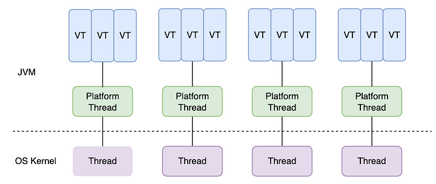

이번 포스팅에서는 Java 21이 2023년 9월(작성일 기준 이번달)에 출시한다.

개인적으로 Java 21의 패치 내용이 되게 인상깊은데 Java 21 버전의 변경사항에 대해 알아보자.

## SequencedCollection

기존에 `List`에서 첫 번째 요소와 마지막 요소를 구할 때는 아래와 같이 코드를 작성했다. 

```java
String first = list.get(0); // 첫 번째 요소
String last = list.get(list.size() - 1) // 마지막 요소
```

이런 부분들 구현을 외부에 노출하므로 가독성이 많이 떨어진다.

Java 21부터는 `SequencedCollection`이라는 인터페이스를 제공한다.

```java
public interface SequencedCollection<E> extends Collection<E> {
    void addFirst(E e);
    void addList(E e);
    E getFirst();
    E gitLast();
    E removeFirst();
    E removeLast();
    
    SequencedCollection<E> reversed();
}
```

해당 인터페이스를 구현하면 구현을 밖으로 드러내지 않고 명시적인 개념을 드러내서 가독성 좋게 코드를 작성할 수 있다.

Java 21의 ArrayList 역시 해당 인터페이스를 구현하고 있다. 그래서 아래와 같이 코드를 변경할 수 있다.

```java
String first = list.getFirst(); // 첫 번째 요소
String last = list.getLast() // 마지막 요소
```

reversed()를 사용하면 리스트를 쉽게 뒤집을 수 있다.

```java
List<String> reversed = list.reversed();
```

이와 유사한 아래 인터페이스도 추가된다.
- SequencedSet
  - SequencedCollection을 상속
  - reversed()의 리턴 타입만 SequencedSet으로 변경
- SequencedMap
  - LinkedHashMap과 TreeMap이 구현

## Record 패턴

기존에 상위 타입으로 변환할 때 아래와 같이 코드를 작성했었다.

```java
if(obj instanceof Student) {
    Student student = (Student) obj;
    student.study();
    String name = student.getName():
    System.out.println(name);
}
```
위 코드는 다소 지저분해보이고 의도를 알 수 없다.

자바 16에서 instanceof에 패턴 변수를 사용할 수 있게 되었다.

```java
if (obj instanceof Student student) {
    student.study();
    String name = student.getName():
    System.out.println(name);
}
```

자바 21에서는 레코드의 구성 요소까지 패턴 변수로 사용할 수 있다.

아래 코드를 보자.

```java
if (obj instanceof Student(String name)) {
    student.study();
    System.out.println(name);
}
```

다소 과한 것처럼 보이기도 한다. 하지만 **제너릭과의 호환**이 좋아졌다. 아래 코드를 보자.

```java
record Hero<T weapon> {
}

if(obj instanceof Hero(Sword sword)) {
    // 짧은 사거리의 적을 공격한다.
} else if (obj instanceof Hero(Arrow arrow)) {
    // 긴 사거리의 적을 공격한다.
}
```

## Switch

#### null 비교

Java 14부터 가독성 증가 및 break문 누락 방지 등을 개선한 Switch 표현식을 사용할 수 있게 되었다.

하지만 switch문에서 null을 사용하려면 여전히 복잡한 코드를 짜야 했다.

```java
if (value == null) {
    return "default";
}

return switch(value) {
    case 1 -> A;
    case 2 -> B;
    default -> "default";
}
```

Java 21 부터는 switch문 내부에서 null 처리가 가능해졌다.

```java
return switch(value) {
    case null, default -> "default";
    case 1 -> A;
    case 2 -> B;
}
```

#### Pattern

기존에는 타입을 분기하려면 반드시 if + instanceof 문을 태웠어야 헀다.

Java 21에서는 switch를 사용할 수도 있다.

```java
switch(weapon) {
    case Sword sword -> System.out.println("가까운 거리의 적을 공격합니다.");
    case Arrow arrow -> System.out.println("먼 거리의 적을 공격합니다.");
    case Special(String name) -> System.out.println("특수 무기 " + name + "으로 적을 공격합니다.");
    case default -> System.out.println("적을 공격합니다.");
}
```

#### when

Java 21에서는 switch에 when 키워드를 사용해서 범위와 같은 조건식을 사용할 수 있게 되었다.

```java
String s = switch (score) {
    case 100 -> "Perfect!";
    case Integer i when i >= 90 -> "Very Good!";
    case Integer i when i >= 80 -> "Good!";
    default -> "Bad";
}
```

패턴과 when 등을 사용하면서 누락된 케이스가 생기지는 않을까? 그렇지 않다!

누락된 케이스가 넣으면 Java에서 컴파일 에러를 내기 때문에 안전하게 사용할 수 있다.

## 가상 쓰레드

트래픽이 많고, I/O가 자주 발생하는 요청 당 쓰레드 모델의 경우 많은 메모리를 사용하고 CPU를 낭비하게 된다.
- 쓰레드당 메모리 사용
- I/O 응답 대기, 컨텍스트 스위칭에 따른 CPU 낭비

일반적인 해결 방법은 아래와 같다.
- 비동기 I/O + 적은 쓰레드
- **경량 쓰레드 + I/O 연동**

가상 쓰레드란 I/O 중심 작업에서 처리량(성능)을 늘리기 위한 기능이다.
- 대표적인 예: DB나 파일 시스템을 사용하는 웹 서버

Java 19에 요청 당 쓰레드 모델 구조에서의 HW 최적화를 목적으로 preview로 추가된 가상 쓰레드가 **Java 21부터 정식으로 포함**된다.

```java
Thread virtual = Thread.ofVirtual()
        .name("virtual")
        .start(() -> {
            callMethod();
        });

virtual.join
```

```java
try (ExecutorService executor = Executors.newVirtualThreadperTaskExecutor()) {
    executor.submit(() -> someCode())
}
```

쓰레드 간 구조는 아래와 같다.



각 쓰레드의 동작은 아래와 같다.
- PlatformThread는 Virtual Thread를 실행해서 작업 수행을 시킨다.
- Virtual Thread에서 **Blocking**이 발생하면 PlatformThread는 **다른 VirtualThread에게 다른 작업을 시킨다.**
- PlatformThread는 Blocking된 Virtual Thread의 블로킹이 해제되면 해당 쓰레드의 작업을 이어서 수행시킨다.

성능 상 이점은 아래와 같다.
- 스케줄링(Context Switching) 부하: Virtual Thread < Platform Thread
- 메모리 사용: Virtual Thread < Platform Thread
- I/O 블로키엥 따른 대기시간 낭비: Virtual Thread < Platform Thread

문제는 **Pinned**가 발생할 수 있다는 점이 있다.
- Platform Thread가 다른 Virtual Thread를 실행할 수 없게되는 현상
- ex. synchronized 블록에서 I/O 블로킹이 발생할 경우, Native method나 foreign function을 사용할 경우

VirtualThread의 경우 **기존 코드를 수정할 필요가 없으며** 풀링할 필요 없이 **필요할 때 생성**하면 된다.


## 정리

Java 21에서는 `SequencedCollection`를 통해 `Collection`을 사용할 때 index를 사용해서 구현을 밖으로 노출하는 것이 아니라 가독성 좋은 코드와 자율적인 객체를 통해 더 객체지향적으로 프로그래밍을 할 수 있게 된 것 같다.
- 개인적으로는 ArrayList를 for문으로 loop 돌리기를 위한 isLastIndex() 등과 같은 메서드도 지원해주면 좋겠다.
- (`if(index == list.size() - 1)`가 읽기 불편해서 메서드를 추출해서 쓰고 있다.)

그래도 충분히 좋아진 것 같다는 생각이 든다. `record`와 `switch` 문의 패치도 유용하다고 생각되는 부분이 많다.

**Virtual thread**를 통해 코드 수정 없이 성능을 늘릴 수 있다. 사내 코드의 경우에도 파일 시스템이나 RDB에 많이 접근하기 때문에 꽤 유용할 수 있을 것 같다는 생각이 든다.

빨리 충분한 POC 후 적용하고 싶다.

## 참고
- https://www.youtube.com/watch?v=EUDnGF6mHjE&t
- https://www.youtube.com/watch?v=8rVhPMEr2zQ
- https://www.youtube.com/watch?v=srpOD6WIasM&t=36s
- https://medium.com/javarevisited/how-to-use-java-19-virtual-threads-c16a32bad5f7
- https://findstar.pe.kr/2023/04/17/java-virtual-threads-1/