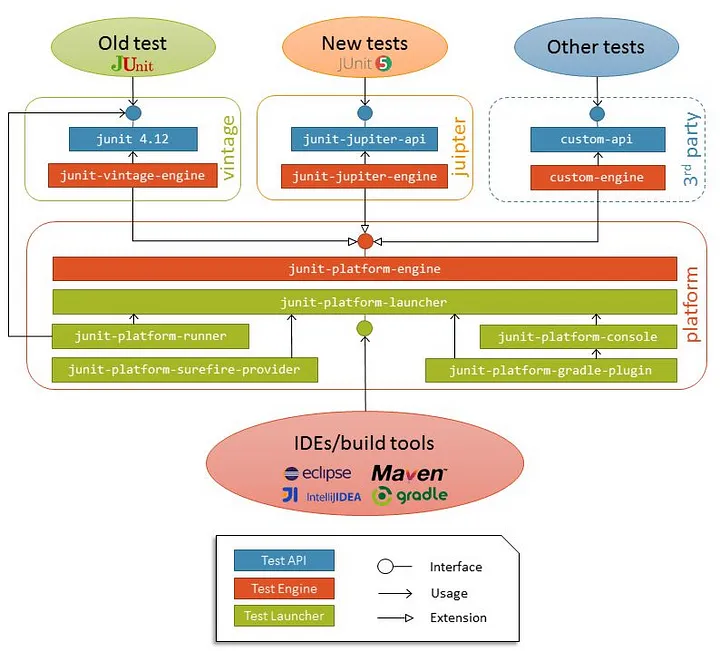
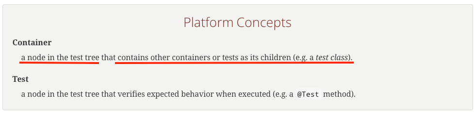

JUnit은 Java에서 가장 많이 사용하는 테스트 프레임웤의다. 사실 사용 방법은 익숙하게 사용을 하고 있는데, 내부적으로는 잘 몰라서 포스팅 하게 되었다.

그래서 사용 방법보다는 내부 원리에 대해서 살펴볼 생각이다.

## Architecture

아래는 JUnit의 전체적인 아키텍처이다.

JUnit5는 JUnit Platform, JUnit Jupiter, JUnit Vintage로 구성된다.

#### JUnit Platform

JUnit Platform은 JVM에서 테스트 프레임워크 실행을 위한 기반을 제공
- JUnit이 Test를 발견하고 실행 계획을 생성해서 TestEngine 인터페이스를 만들 수 있도록 규격을 제공
- IDE, 빌드툴 등에서 JUnit을 실행할 수 있게 지원

#### JUnit Jupiter

JUnit Jupiter는 JUnit5만의 신규 어노테이션과 프로그래밍 모델을 제공한다.
- JUnit Platform의 TestEngine 인터페이스를 구현해서 테스트를 생성하는 기능을 제공

#### JUnit Vintage

JUnit3, 4로 작성된 테스트를 실행할 수 있게 JUnit Platform의 TestEngine을 구현한다.
- JUnit5에서도 JUnit 3, 4의 테스트를 실행할 수 있다.

## Container

JUnit에서 컨테이너란 다른 컨테이너나 Test를 포함할 수 있는 노드를 말한다.

즉, JUnit의 Container와 Test는 트리 형태를 가지고 1개의 Container는 여러 개의 Container나 Test를 가질 수 있다.

 

## 참고

- https://manningbooks.medium.com/junit-5-architecture-6d5bcc31d107