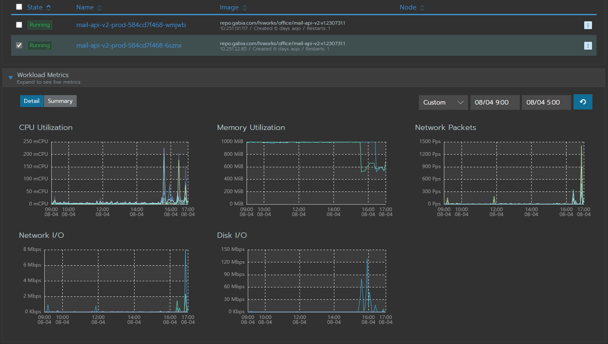
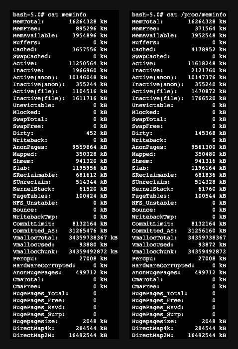

## 확인 내용

운영중인 서버에서 메모리 사용량이 튀는 문제가 발생했습니다.


해당 시간을 보면 zip 업로드 요청이 들어온 것을 확인할 수 있었습니다.


로직을 확인한 결과 MultipartFile에서 path에 파일을 쓰는 것 밖에 없습니다.

## 로컬 환경 Snapshop 확인


로컬에서 Heap Snapshot을 찍어봤는데 Heap Memory가 거의 올라가지 않았어요. (많이 올라가봐야 80MB -> 90MB..?)

여기서 의심한 부분은 아래와 같습니다.
- 로컬 환경이 아니라 실제 네트워크를 활용하는 외부 환경에서만 발생하는 경우
- 애플리케이션의 HeapMemory 문제가 아니라 서버의 Memory 문제

## 서버 자원 문제

아래를 보면 요청 시 1.26GB 임을 알 수 있습니다.


1.26GB는 dev 서버 자원의 한계를 돌파한 수치입니다.
- Heap: 410m
- Metaspace: 150m

더 정확한 확인을 위해 APM 도구인 Grafana를 붙여봤어요!


Grafana에서는 메모리 사용량이 거의 없었습니다.

즉, 서버 자원이 문제인 것 같아요!

> 스토리지 마운트를 하면서 메모리를 사용하는 건가..?

## 다른 end-point로 시도

### 파일 업로드
궁금해서 파일 업로드 End-point 에서 동일한 파일을 올려봤습니다. (900 MB)

동일하게 메모리가 상승하는 것을 볼 수 있었습니다.


**근데 왜 올라가지..**

분명 에러는 떨어졌습니다!


### /health ?


/health에 파일을 올려봤어요!


그래도 메모리가 튀네요!

## 힙덤프

Grafana로 붙여봤지만, 자세한 메모리 상황은 볼 수 없으니 dev 서버의 Heap dump를 떴습니다.
- 요청 수신 전 (Rancher Memory 사용량: 670MB)
- 동시 요청 6개 직후 (Rancher Memory 사용량: 1.39GB)


왼쪽은 요청을 보내기 전 상태이고 오른쪽은 요청을 보낸 후 상태입니다.

보시다시피 Heap 상황은 거의 비슷합니다.

내부도 확인해봤지만, 특이점은 없었습니다.


## 중간 정산

- Filter 내부로 요청이 들어온 이후 메모리가 튀고 있습니다.
  - 요청 직후 Filter 로그가 찍히고 있습니다.
- `/health`로 요청이 들어오더라도 첨부파일이 포함되면 수행 시간이 매우 깁니다.
- 자원은 **JVM 자원이 아닌 서버 자원**으로 예상됩니다.

## 디버깅

처리 소요 시간이 가장 긴 부분은 `StandardMultipartHttpServletRequest.parseRequest()`입니다.


그 안에서도 `Streams.copy()` 부분에서 대부분의 처리 시간을 사용합니다.


처리 시간은 이해가 되었습니다.

내부 코드를 본 결과 동작은 아래와 같습니다.
- 요청 본문 크기가 `spring.servlet.multipart.max-request-size`보다 크면 예외를 발생한다.
- 요청 파일이 `spring.servlet.multipart.max-file-size`보다 크면 예외를 발생한다.
- 요청 파일 크기가 `spring.servlet.multipart.file-size-threshold`보다 클 경우 메모리에서 그대로 Stream을 반환한다.
- 요청 파일 크기가 `spring.servlet.multipart.file-size-threshold`보다 작을 경우 임시 경로(Disk)에 파일을 저장한 후 사용한다.

application.yml 설정은 아래와 같습니다.

```yaml
spring:
  servlet:
    multipart:
      max-file-size: 2536MB
      file-size-threshold: 1MB
      max-request-size: 2536MB
```

파일은 디스크에 저장되었고, 위에서 언급했듯 JVM 메모리도 튀지 않았습니다.

결과적으로 **임시 파일을 디스크에 저장하는 과정에서 서버의 메모리가 튀었다..!** 인 것 같습니다.

## 결국 OOM..

으음.. 결국 찾지 못하고 반 포기(?)를 했었는데 결국 아래와 같이 OOM이 터졌습니다.



POD 1개당 성능은 아래와 같습니다.
- 서버 메모리: 1GB
- Heap: 750MB
- Metaspace: 200MB

이제.. 포기란 없다! 무조건 찾아야 하는 상황입니다..

## 디스크 캐시

`/proc/meminfo`에서 사용중인 메모리 정보를 자세히 볼 수 있었다.



각 요소를 비교하면 아래와 같습니다.
- MemFree: -500MB
- Cached: +500MB
- Active(file): +370MB
- Inactive(file): +150MB
- Dirty: +140MB

각 요소에 대한 설명은 아래와 같습니다.
- MemFree: 사용되지 않고 남아있는 물리적인 메모리 양
- Cached: 각 디스크 요청에 대해 부하가 많이 발생하기 때문에 디스크 내용을 메모리에 저장한다.
- Active(file): 커널이 I/O 성능향상을 위해 사용하는 영역
- Inactive(file): I/O 성능 향상을 위해 커널이 캐시 목적으로 사용하고 있는 영역
  - LRU 알고리즘으로 참조 시기가 오래된 페이지는 Inactive로 이동한다.
- Dirty: I/O 성능 향상을 위해 커널이 캐시 목적으로 사용하고 있는 영역 (지연 쓰기)

즉, 뭔가 디스크에 저장한 파일을 메모리 캐시에 담는 과정에서 메모리가 차는 것 같습니다.

여기서 전체 남아있는 메모리는 `MemFree` + `Buffers` + `Cached`입니다.

`Buffers`와 `Cached`의 경우 동적으로 조절됩니다. 그래서 **OOM이랑 크게 관련이 있어 보이지는 않는 것** 같습니다.

결론적으로 **메모리가 튀는 것(해당 내용)과 OOM은 별개로** 봐야 하지 않나.. 싶긴 합니다!

---

## vfs_cache_pressure

아래 블로그에 따르면 파일 입출력을 할때도 페이지 캐시라는 이유로 메모리를 사용합니다.
- https://help.iwinv.kr/manual/read.html?idx=464

위 지표에서도 해당 부분인 Active(file), Inactive(file) 때문에 Cached를 많이 사용하고 있습니다.

`/proc/sys/vm/vfs_cache_pressure`를 수정하면 이러한 캐시의 사용량을 튜닝할 수 있습니다.
- 숫자가 높을 수록 buffer의 비율을 높이고, cache의 비율을 낮춘다.

기본 값은 100이지만, 파일 시스템을 많이 사용하는 서버에서 일반적으로 10000정도로 설정하여 문제를 해소한 사례가 많이 보입니다.

자세한 설정은 아래 설명을 참고해주세요. 
- https://www.baeldung.com/linux/file-system-caching


### ...


개인적으로는 아래와 같이 GC가 안돌고 메모리가 안빠지는 상황(메모리가 점진적으로 차다가 1GB인 상태)에서 파일을 업로드해서 OOM이 발생한 것은 아닐까..? 라고 보고 있습니다.


즉, 파일을 업로드해서 메모리가 튀는 현상은 발생하지만, 그게 OOM의 원인은 아니고 정상적인 부분이며, 프로덕트에서 메모리 누수가 있는 것이 원인은 아닐까..?! 라는 생각을 조금 가지고 있습니다.

> 힙 덤프를 뜰 수 없어서 아쉬운 상황입니다..
> 의견을 구하고 싶습니다..!


## 참고
- https://www.baeldung.com/linux/file-system-caching


