## 확인 내용

운영중인 서버에서 메모리 사용량이 튀는 문제가 발생했습니다.

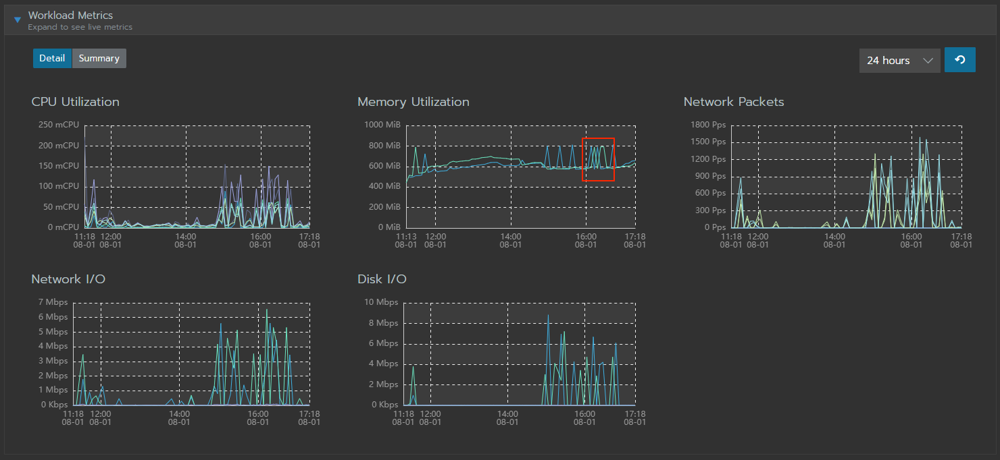

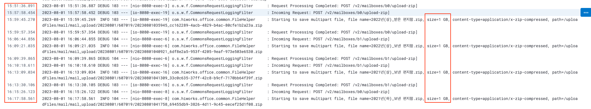

해당 시간을 보면 zip 업로드 요청이 들어온 것을 확인할 수 있었습니다.

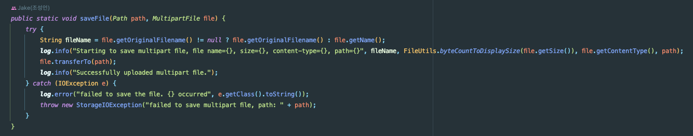

로직을 확인한 결과 MultipartFile에서 path에 파일을 쓰는 것 밖에 없습니다.

## 로컬 환경 Snapshop 확인

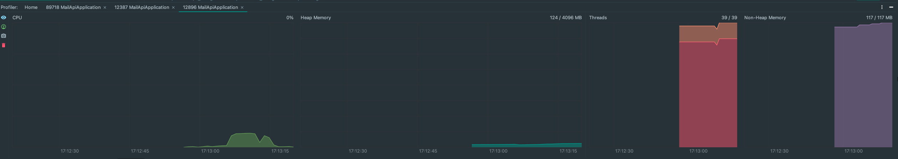

로컬에서 Heap Snapshot을 찍어봤는데 Heap Memory가 거의 올라가지 않았어요. (많이 올라가봐야 80MB -> 90MB..?)

여기서 의심한 부분은 아래와 같습니다.
- 로컬 환경이 아니라 실제 네트워크를 활용하는 외부 환경에서만 발생하는 경우
- 애플리케이션의 HeapMemory 문제가 아니라 서버의 Memory 문제

## 서버 자원 문제

아래를 보면 요청 시 1.26GB 임을 알 수 있습니다.

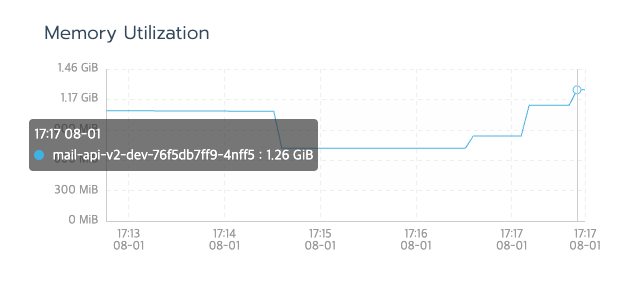

1.26GB는 dev 서버 자원의 한계를 돌파한 수치이다.
- Heap: 410m
- Metaspace: 150m

더 정확한 확인을 위해 APM 도구인 Grafana를 붙여봤어요!

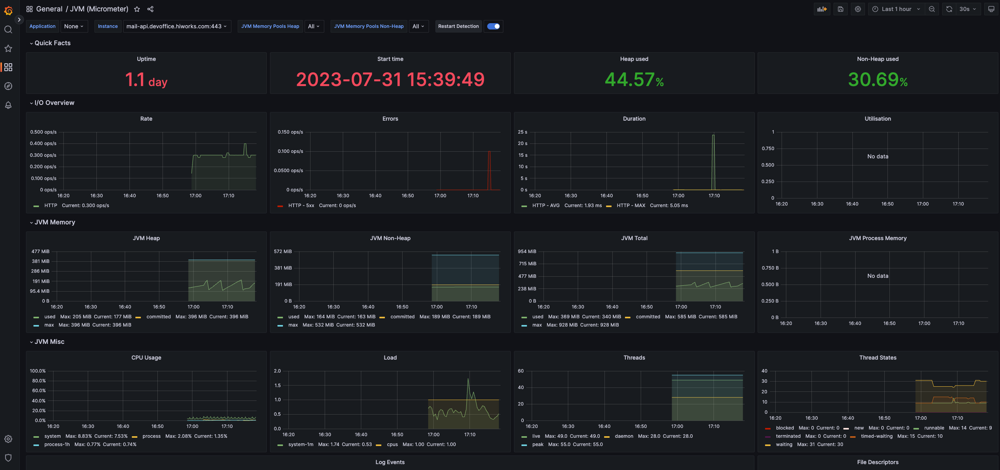
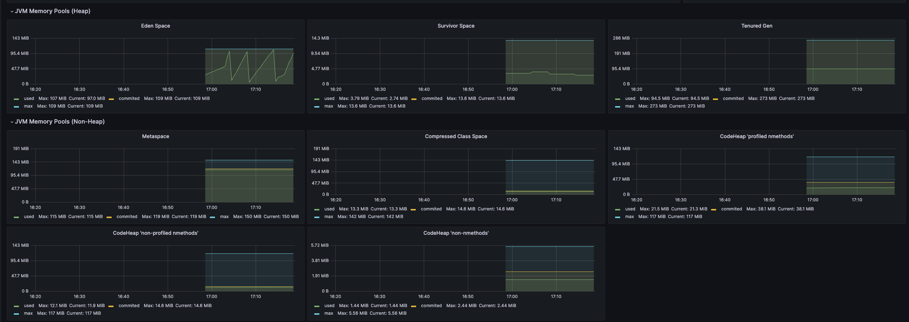

Grafana에서는 메모리 사용량이 거의 없었습니다.

즉, 서버 자원이 문제인 것 같아요!

> 스토리지 마운트를 하면서 메모리를 사용하는 건가..?

## 다른 end-point로 해볼까..?

### 임시 첨부파일 업로드
궁금해서 임시 첨부파일 업로드에다가 동일한 파일을 올려봤습니다. (900 MB)

동일하게 메모리가 상승하는 것을 볼 수 있었습니다.

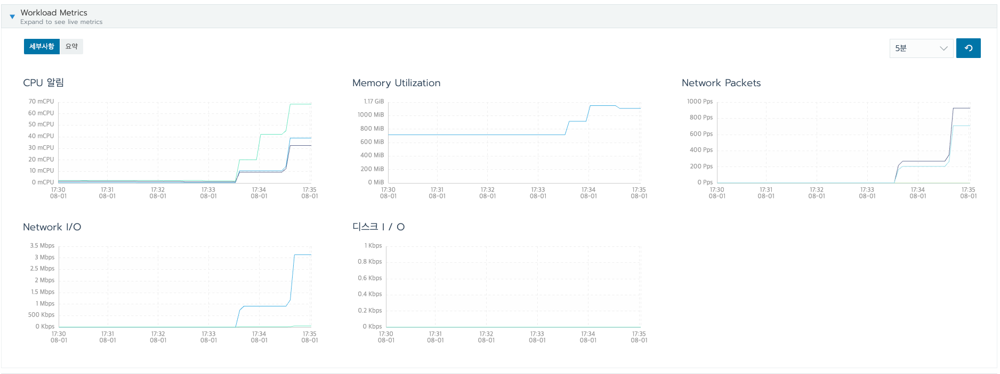

**근데 왜 올라가지..**

분명 에러는 떨어졌습니다!

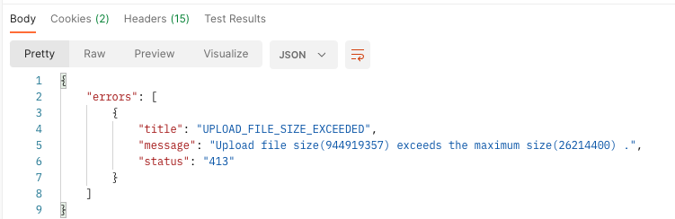

### /health ?

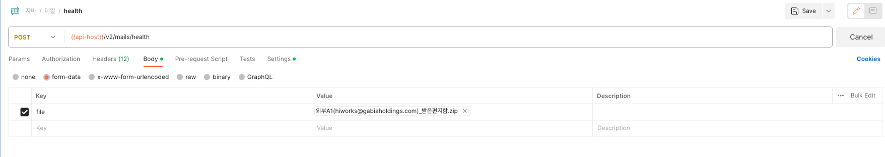

/health에 파일을 올려봤어요!

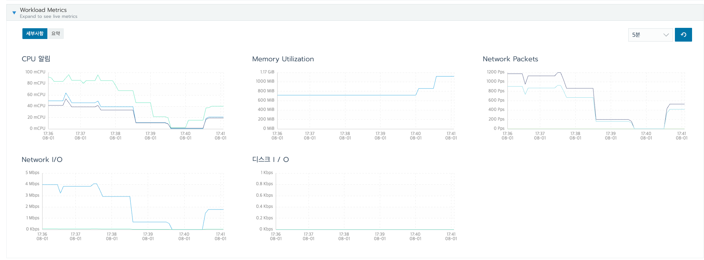

그래도 메모리가 튀네요!
