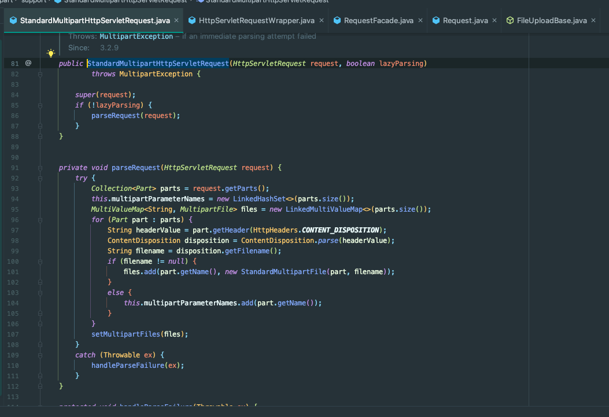

## 확인 내용

운영중인 서버에서 메모리 사용량이 튀는 문제가 발생했습니다.


해당 시간을 보면 zip 업로드 요청이 들어온 것을 확인할 수 있었습니다.


로직을 확인한 결과 MultipartFile에서 path에 파일을 쓰는 것 밖에 없습니다.

## 로컬 환경 Snapshop 확인


로컬에서 Heap Snapshot을 찍어봤는데 Heap Memory가 거의 올라가지 않았어요. (많이 올라가봐야 80MB -> 90MB..?)

여기서 의심한 부분은 아래와 같습니다.
- 로컬 환경이 아니라 실제 네트워크를 활용하는 외부 환경에서만 발생하는 경우
- 애플리케이션의 HeapMemory 문제가 아니라 서버의 Memory 문제

## 서버 자원 문제

아래를 보면 요청 시 1.26GB 임을 알 수 있습니다.


1.26GB는 dev 서버 자원의 한계를 돌파한 수치입니다.
- Heap: 410m
- Metaspace: 150m

더 정확한 확인을 위해 APM 도구인 Grafana를 붙여봤어요!


Grafana에서는 메모리 사용량이 거의 없었습니다.

즉, 서버 자원이 문제인 것 같아요!

> 스토리지 마운트를 하면서 메모리를 사용하는 건가..?

## 다른 end-point로 해볼까..?

### 임시 첨부파일 업로드
궁금해서 임시 첨부파일 업로드에다가 동일한 파일을 올려봤습니다. (900 MB)

동일하게 메모리가 상승하는 것을 볼 수 있었습니다.


**근데 왜 올라가지..**

분명 에러는 떨어졌습니다!


### /health ?


/health에 파일을 올려봤어요!


그래도 메모리가 튀네요!

## 힙덤프

Grafana로 붙여봤지만, 자세한 메모리 상황은 볼 수 없으니 dev 서버의 Heap dump를 떴습니다.
- 요청 수신 전 (Rancher Memory 사용량: 670MB)
- 동시 요청 6개 직후 (Rancher Memory 사용량: 1.39GB)


왼쪽은 요청을 보내기 전 상태이고 오른쪽은 요청을 보낸 후 상태입니다.

내부도 확인해봤지만, 특이점은 없었습니다.


## 중간 정산

- Filter 내부로 요청이 들어온 이후 메모리가 튀고 있습니다.
  - 요청 직후 Filter 로그가 찍히고 있다.
- `/health`로 요청이 들어오더라도 첨부파일이 포함되면 수행 시간이 매우 길다.
- 자원은 **JVM 자원이 아닌 서버 자원**으로 예상된다.

## 디버깅

처리 소요 시간이 가장 긴 부분은 `StandardMultipartHttpServletRequest.parseRequest()`입니다.



그 안에서도 `Streams.copy()` 부분에서 대부분의 처리 시간을 사용합니다.


처리 시간은 이해가 되었습니다.

내부 코드를 본 결과 동작은 아래와 같습니다.
- 요청 본문 크기가 `spring.servlet.multipart.max-request-size`보다 크면 예외를 발생한다.
- 요청 파일이 `spring.servlet.multipart.max-file-size`보다 크면 예외를 발생한다.
- 요청 파일 크기가 `spring.servlet.multipart.file-size-threshold`보다 클 경우 메모리에서 그대로 Stream을 반환한다.
- 요청 파일 크기가 `spring.servlet.multipart.file-size-threshold`보다 작을 경우 임시 경로(Disk)에 파일을 저장한 후 사용한다.

application.yml 설정은 아래와 같습니다.

```yaml
spring:
  servlet:
    multipart:
      max-file-size: 2536MB
      file-size-threshold: 1MB
      max-request-size: 2536MB
```

파일은 디스크에 저장되었고, 위에서 언급했듯 JVM 메모리도 튀지 않았습니다.

결과적으로 **임시 파일을 디스크에 저장하는 과정에서 서버의 메모리가 튀었다..!** 인 것 같습니다.

## 개발 서버 확인

그래서 서버 자원이라고 확신하고 아래와 같이 개발 서버에서 `ps -o`로 메모리를 확인해봤는데

아래는 요청을 보내기 전 메모리 상태이고,


아래는 요청을 보낸 후 메모리 상태입니다.


해당 부분 확인 결과 Java Application은 물론이고, 다른 프로그램도 크게 메모리를 사용하는 부분이 없었습니다.

즉, 서버 내부에서 사용하는 메모리 공간도 아닌 것을 확인하실 수 있습니다.

## 미궁속으로..

Rancher의 메모리 급증 원인은 무엇일까요..

