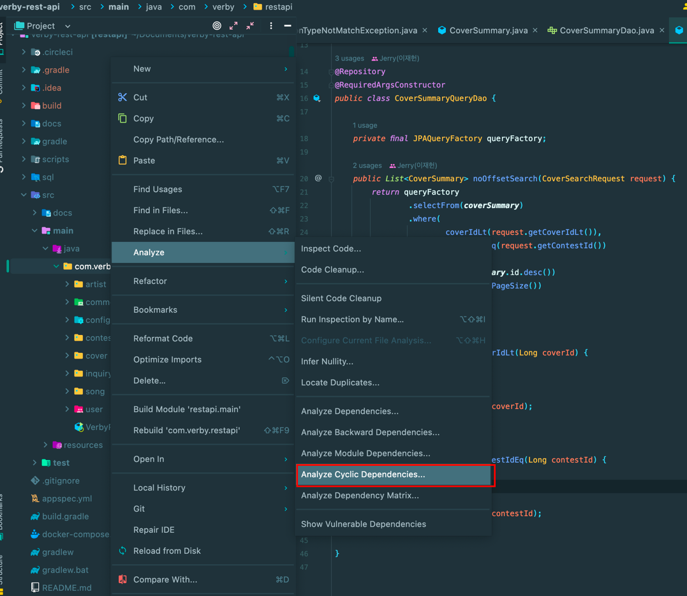
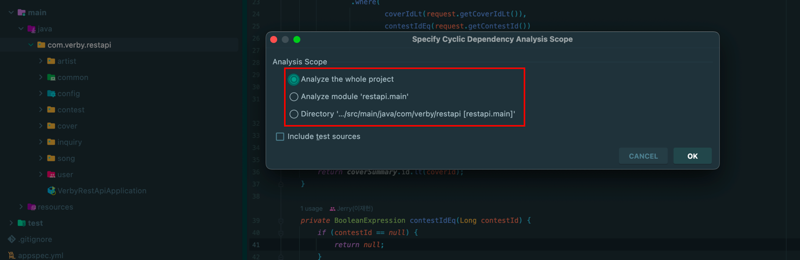
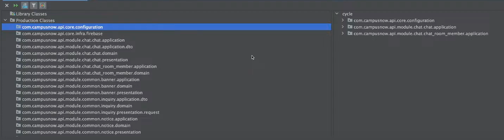
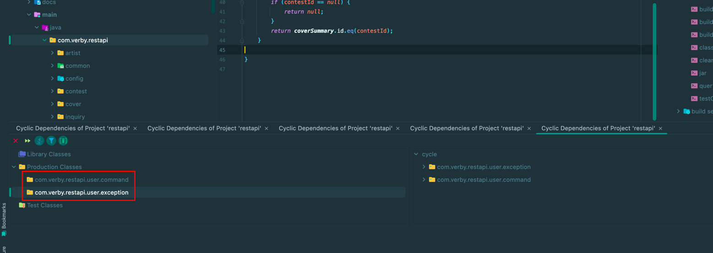
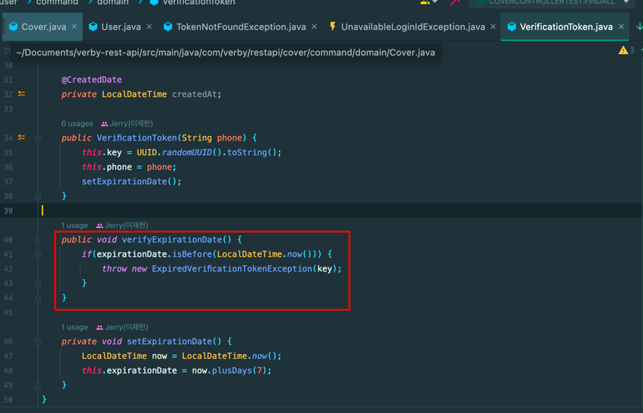
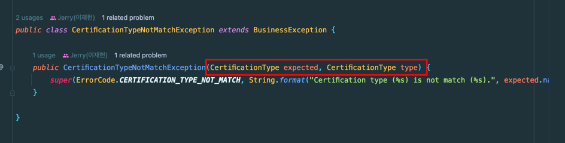
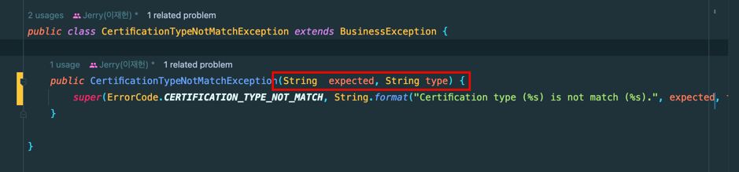

우아한 테크 세미나에서 발표한 **우아한 객체지향 by 우아한형제들 개발실장 조영호님** 강연을 무척 재밌게 봤다.

- Link: [https://www.youtube.com/watch?v=dJ5C4qRqAgA&t=5217s](https://www.youtube.com/watch?v=dJ5C4qRqAgA&t=5217s)

해당 영상에는 패키지 의존성 관련 내용이 주를 이룬다.

추가로 얼마 전 백기선님께 공개 코드 리뷰를 받으면서도 패키지 의존성 관련해서 대화를 많이 나눴다.

- Link: [https://jaehoney.tistory.com/276](https://jaehoney.tistory.com/276)

그래서 최근 진행하던 사이드 프로젝트의 패키지 의존성 사이클이 있는 지 검사해보기로 하였다.

## Analyze Cyclic Dependencies(feat. IntelliJ)

ArchUnit을 사용해서 의존성 검사를 자동화할 수도 있다.

- Custom한 Layered architecture(계층화 아키텍처)가 지켜지고 있는 지 검사
- 패키지 의존성 사이클 검사
- 네이밍 룰 검사
- ...

단, 해당 포스팅에서는 IntelliJ의 기능을 사용해서 의존성을 검사한다.

IntelliJ에서는 패키지 의존성 사이클을 검사해주는 기능이 존재한다.



위와 같이 `검사하고자 하는 패키지에 우 클릭 -> Analyze -> Analyze Cyclic Dependencies...`를 선택하면 된다.



이후에는 3가지 설정이 나온다.

- 프로젝트 전체를 검사
- Main 소스만 검사
- 선택한 디렉토리 내부만 검사

선택하고 확인하면 아래와 같이 **순환 참조가 발생하는 패키지의 목록**이 전부 나온다. (아래는 **참고 강연에서 가져온 예시**)



나는 프로젝트 전체를 검사하는 것(Analyze the whole project)를 선택했고 아래와 같은 결과를 얻을 수 있었다.



바운디드 컨텍스트 간 의존성 사이클은 존재하지 않는다.

아래는 바운디드 컨텍스트 간 의존성 사이클을 끊기 위해 노력한 것이다.

## Bounded Context 간 Dependency Cycle

### 1. 객체 참조와 ID 참조

연관 관계의 종류는 크게 객체 참조 방식과 ID 참조 방식도 있다. 여기서 객체 참조 방식은 가장 높은 결합도를 가진다.

객체 참조는 아래의 문제가 있다.
- 도메인 간의 결합도 상승
- 성능 이슈가 발생하기 쉽다. (모든 도메인을 한 번에 조회가 가능할 수도 있다.)
- 수정할 도메인의 경계 및 트랜잭션 경계가 모호해진다.
- 패키지 의존성 사이클이 돈다.

여기서는 패키지 의존성 부분을 다루므로 해당 부분만 다뤄보자.

```java
public class CoverService {
    private final CoverRepository coverRepository;
    private final CoverCommentService coverCommentService;
    
    public void deleteCover(Long id) {
        coverRepository.deleteById(id);
        coverCommentService.deleteByCoverId(id);
    }
}

@Entity
public class Comment {
    
    @ManyToOne
    @JoinColumn(name = "cover_id")
    private Cover cover;
    
}
```

Cover 바운디드 컨텍스트의 `CoverService`에서는 `CoverCommentService`에 의존하고 있다. Comment 바운디드 컨텍스트에서도 `Comment` 도메인 모델이 `Cover` 도메인 모델에 의존하고 있다.

이렇게 의존성 사이클이 돌면 코드 수정의 범위를 파악과 코드 관리가 어려워진다. 그래서 같은 바운디드 컨텍스트로 둘 지 의존성 사이클을 끊을 지 고민을 했다.

아래의 근거로 Cover와 Comment가 다른 바운디드 컨텍스트라고 판단했기 때문에 의존성 사이클을 끊어야 했다.
- 커버가 삭제 되어도 댓글은 남아 있어야 하는 요구사항이 생길 수 있다.
- 커버 댓글은 애그리거트 루트로 존재해야 한다.
  - 커버를 조회할 때 댓글 모두를 조회하면 큰 부하가 발생한다.
  - 유저별 댓글 전체 조회도 할 수 있어야 한다.
  - 댓글 주도적인 상호 작용 기능이 존재한다. (공유, 태그, 반응, 답글, 좋아요 등)
  - 관리자가 전체 댓글을 모니터링 할 수 있어야 한다.
- 같이 생성되고 삭제되는 것이 아니기에 가능한 분리되어야 한다.

그래서 다른 바운디드 컨텍스트 간 도메인 참조는 **객체 참조**가 아닌 **ID 참조**를 사용하도록 처리다.

```java
@Entity
public class Comment {
    
    private Long coverId;
    
}
```

이제 Comment 도메인 모델은 Cover 도메인 모델에 의존하지 않는다.

### 2. 이벤트 전파

여전히 패키지 의존성 사이클이 존재했는데 아래 이유 때문이었다.

```java
public class CoverService {
    private final CoverRepository coverRepository;
    private final CoverCommentService coverCommentService;
    
    public void deleteCover(Long id) {
        coverRepository.deleteById(id);
        coverCommentService.deleteByCoverId(id);
    }
}

public class CommentService {
    private final CommentRepository commentRepository;
    private final CoverService coverService;
    
    public void getCover(Long id) {
        Comment comment = commentRepository.findById(id);
        Long coverId = comment.getCoverId();
        coverService.valid(coverId);
        return comment;
    }
}
```

CommentService는 Cover의 존재 여부 등 검증을 위해 Cover 바운디드 컨텍스트에 의존한다. CoverService는 Comment도 함께 삭제하기 위해 Comment 바운디드 컨텍스트에 의존한다.

그래서 둘중 하나의 의존성은 끊어야겠다고 판단을 했고 CommentService에서 Cover 존재 여부를 파악하는 것은  적합한 의존성이지만 CoverService에서 Comment를 삭제하는 것은 강한 정합성이 필요한 부분이 아니라고 생각했다.

그래서 Comment 삭제 부분을 이벤트 전파로 처리해서 Comment 바운디드 컨텍스트에 대한 의존을 끊을 수 있었다.

```java
public class CoverService {
    private final CoverRepository coverRepository;
    private final ApplicationEventPublisher publisher;

    public void deleteCover(Long id) {
        coverRepository.deleteById(id);
        publisher.publishEvent(new CoverDeletedEvent(id));
    }
}
```

수정 후 Cover 바운디드 컨텍스트는 Comment 바운디드 컨텍스트에 의존하지 않는다.

### 3. 중간 객체 / DIP 활용

Song 바운디드 컨텍스트는 Artist 존재 여부 확인을 위해 Artist 바운디드 컨텍스트에 의존하고 있었다.

그런데 ArtistService에서 Song 개수를 알아야 한다고 가정해보자.

```java
public class ArtistService {
    private final ArtistRepository artistRepository;
    
    public Artist create(CreateArtistRequest request) {
        String name = request.getName();
        MusicGenre genre = MusicGenre.from(request.getMusicalGenre());
        Artist artist = new Artist(name, genre);
        return artistRepository.save(artist);
    }
}


```

이 부분은 아래와 같이 ArtistGenre라는 중간 객체를 활용해서 해결했다.

```java
public class ArtistService {
    private final ArtistRepository artistRepository;
    private final ArtistGenreService artistGenreService;
    
    public Artist create(CreateArtistRequest request) {
        String name = request.getName();
        ArtistGenre genre = artistGenreService.get(request.getArtistGenre());
        Artist artist = new Artist(name, genre);
        return artistRepository.save(artist);
    }
}

// Song 바운디드 컨텍스트에 있음
public class ArtistGenreServiceImpl implements ArtistGenreService {
    
    public ArtistGenre get(String genre) {
        SongGenre songGenre = SongGenre.from(genre);
        ArtistGenre artistGenre = SongGenre.toArtistGenre();
        return artistGenre;
    }
}
```

중간 객체나 DIP 원칙을 활용하면 의존성이 한 쪽으로 흐르도록 처리할 수 있다.

## Bounded Context 내부의 Dependency Cycle

바운디드 컨텍스트 단위의 패키지간에서 의존성 사이클는 의도했던 대로 잘 끊어졌다.

그런데 **user.command 패키지와 user.exception 패키지 간의 의존성 사이클**이 돌고 있다. 그래서 아래의 의문이 생겼다.

_**바운디드 컨텍스트 내부에서도 패키지 의존성 사이클을 끊어야 하나?!**_

**끊어야 한다!** 두 패키지 간의 의존성 사이클이 돈다는 것은 **user.command 패키지와 user.exception 패키지**가 **함께 변경됨**을 의미한다.

왜 잘못된 설계일까?!

- 두 패키지가 **함께 변경되어야 한다면 같은 패키지에 존재**해야 한다.
- 두 패키지가 **함께 변경되지 않아야 한다면 패키지 의존성 사이클이 돌면 안된다.**

그래서 할 수 있는 선택이 두 가지가 있었다.

- Exception을 Domain(도메인)으로 취급하고 패키지를 Domain으로 이동(Move)한다.
- 패키지의 양방향 의존을 끊는다.

사실 전자도 나쁘지는 않다고 생각했지만 Domain에서 터지는 Exception이 있고 Service(Business)에서 터지는 Exception도 있었다.

Business Exception을 Domain으로 포함 시키는 것을 원하지 않았다.

그래서 나는 후자를 택했다.

## 의존 끊기

해당 의존성 사이클에서는 당연히 2가지의 의존이 존재한다.

- domain에서 exception을 의존
- exception에서 domain을 의존

#### Domain에서 Exception 의존

첫 번째로 **Domain이 exception에 의존하는 것이 적합한 지**를 생각해보자.

아래 코드를 보면 Domain인 VerificationToken이 ExpiredVerificationTokenException에 의존하고 있다.



OOP의 객체의 자율화에 의하면 모든 도메인은 자신의 상태를 검증해야 한다. 즉, Exception을 발생하는 것은 맞아보인다.

이때 도메인 모델에서 IllegalStateException을 사용하면 내 패키지의 exception에는 의존하지 않을 수 있다.

하지만 IllegalStateException 등 자바에서 제공하는 Exception을 사용하면 아래의 문제가 있다.

- 예외를 잡아서 처리하기가 곤란하다.
   - 자바 내장 Exception 사용 - 사용자에게 예외 메시지 전달을 위해 Service Layer에서 처리(try-catch)를 해야 한다.
   - 코드가 지저분해질 수 있다.
- 동일하게 IllegalStateException에 의존하게 되므로 아키텍처 개선으로 볼 수 없다.

그래서 Domain에서 Exception을 의존하는 구조는 유지하기로 했다.

#### Exception에서 Domain 의존

의존을 끊을 지 여부를 판단하기 전에 먼저 의존에 대해서 알 필요가 있다.

**A가 B를 의존한다는 것**은 **B가 변경되었을 때 A도 변경된다는 것**을 의미한다. 그래서 **Domain이 변경되었을 때 Exception도 변경되어야 하는가?**를 고민하면 된다. 사실 Domain은 가장 Core한 부분이기 때문에 Exception에 영향이 가도 크게 상관은 없었던 것 같다.

그렇지만 순환 참조를 막는 용도에서라도 사이클을 끊고 싶어서 아래와 같이 처리했다.



기존에 해당 Exception은 Domain인 CertificationType에 의존하고 있었다.



그래서 Exception의 생성자의 매개변수를 String 타입으로 변경했고, Domain에 대한 의존을 제거할 수 있었다.

## 결과

다시 IntelliJ의 패키지 의존성 사이클 검사를 실행한 결과는 아래와 같다. 모든 패키지 의존성 사이클이 제거되었음을 확인할 수 있었다.


해당 개선 작업을 하면서 추가 개선점을 확인할 수 있었다. **Domain Exception**과 **Business Exception**은 성격이 다르다. 성격이 다른 **Exception을 하나의 패키지에서 관리**하면서 **의존 관리가 어렵게 되었다.**

나중에 패키지를 분리하여 의존성 개선을 고려해볼 수 있을 것 같다.

## 참고

- [https://www.youtube.com/watch?v=dJ5C4qRqAgA&t=5217s](https://www.youtube.com/watch?v=dJ5C4qRqAgA&t=5217s)
- [https://www.youtube.com/watch?v=w3QKOHSIZig&t=4192s](https://www.youtube.com/watch?v=w3QKOHSIZig&t=4192s)
https://stackoverflow.com/questions/45584675/cqrs-ddd-checking-referential-integrity
- https://stackoverflow.com/questions/12383203/ddd-should-comment-in-an-article-be-an-aggregate-root