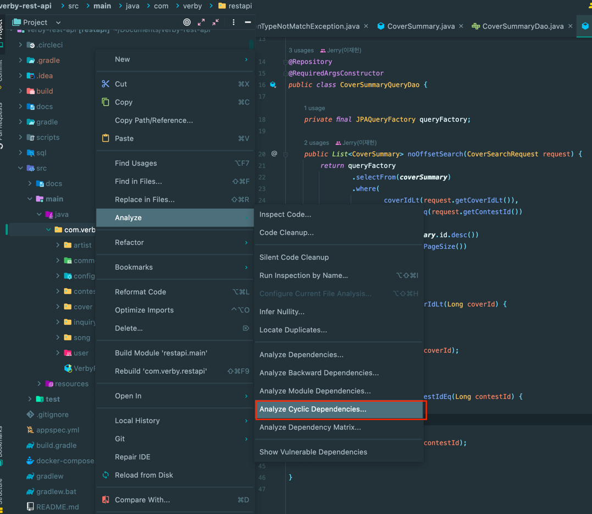
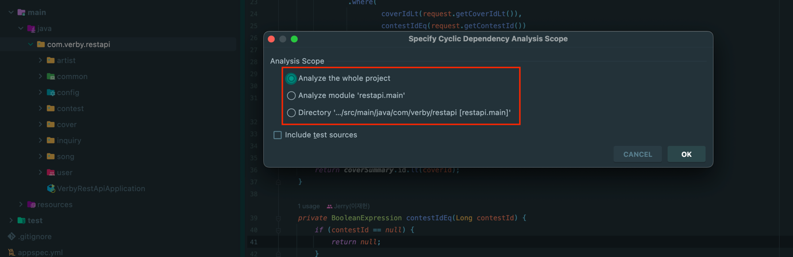
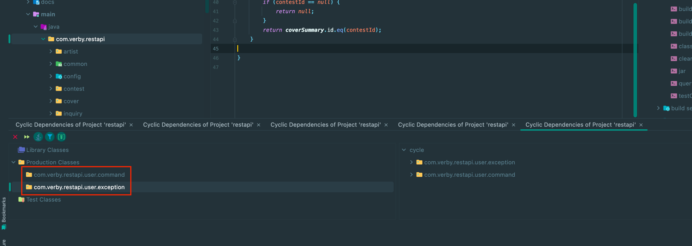
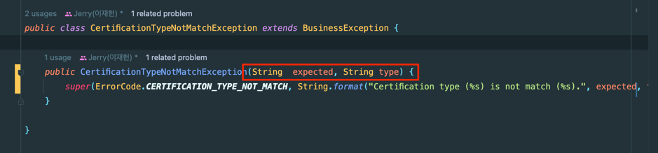
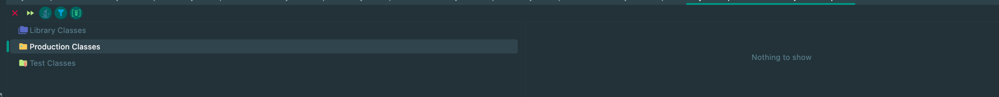

## IntelliJ로 패키지 의존성 사이클 검사 및 개선하기!

우아한 테크 세미나에서 발표한 **우아한 객체지향 by 우아한형제들 개발실장 조영호님** 강연을 무척 재밌게 봤다.
- Link: https://www.youtube.com/watch?v=dJ5C4qRqAgA&t=5217s

해당 영상에는 패키지 의존성 관련 내용이 주를 이룬다.

추가로 얼마 전 백기선님께 공개 코드 리뷰를 받으면서 패키지 의존성 관련해서 대화를 많이 나눴다.
- Link: https://jaehoney.tistory.com/276

얼마전부터 진행하던 사이드 프로젝트가 있는데 해당 프로젝트의 패키지 의존성 사이클이 있는 지 검사해보기로 하였다.

## IntelliJ - Analyze Cyclic Dependencies

 IntelliJ에서는 패키지 의존성 사이클을 검사해주는 기능이 존재한다.
 - ArchUnit을 사용해서 의존성 검사를 자동화할 수도 있다.
   - Custom한 Layered architecture(계층화 아키텍처)가 지켜지고 있는 지 검사
   - 패키지 의존성 사이클 검사
   - 네이밍 룰 검사
   - ...

해당 포스팅에서는 IntelliJ의 기능을 사용해서 의존성을 검사한다.

위와 같이 `검사하고자 하는 패키지에 우 클릭 -> Analyze -> Analyze Cyclic Dependencies...`을 실행하면 된다.

이후에는 3가지 설정이 나온다.
- 프로젝트 전체를 검사
- Main 소스만 검사
- 선택한 디렉토리 내부만 검사

선택하고 확인하면 아래와 같이 순환 참조가 발생하는 패키지의 목록이 전부 나온다. (아래는 참고에서 가져온 예시)

나는 프로젝트 전체를 검사했고 아래와 같은 결과를 얻을 수 있었다.

최초 프로젝트를 개발할 때 DDD 형태로써 **모든 패키지를 바운디드 컨텍스트 단위로 분리하려고 의도**하였다.

추가로 DIP 원칙을 엄격하게(?) 고수하는 탓에 의도했던 대로 다른 바운디드 컨텍스트와의 순환 참조는 발생하지 않았다.

(~~설명이 약간 이상한 것 같기도 하다. 패키지 의존과는 조금 거리가 있는 얘기가 맞다.~~)

클래스가 자신이 속해야 하는 도메인에는 잘 속해있어서 가능한 것이라 생각한다.

### 문제는!

user.command 패키지와 user.exception 패키지 간의 의존성 사이클이 돌고 있다.

그래서 순간 의문이 들었다.

**바운디드 컨텍스트 내부에서도 패키지 의존성 사이클을 끊어야 하나?!**

**그렇다. 끊어야 한다!!**

두 패키지 간의 의존성 사이클이 돈다는 것은 user.command 패키지와 user.exception 패키지가 함께 변경됨을 의미한다.

그럼 이와 같은 설계가 왜 잘못된 설계일까?!
- 두 패키지가 함께 변경되어야 한다면 같은 패키지에 존재해야 한다.
- 두 패키지가 함께 변경되지 않아야 한다면 패키지 의존성 사이클이 돌면 안된다. 

그래서, 이때 할 수 있는 선택은 두 가지가 있었다.
- Exception을 Domain(도메인)으로 취급하고 패키지를 Domain으로 이동(Move)한다.
- 패키지의 양방향 의존을 끊는다.

사실 전자도 나쁘지는 않다고 생각했지만, Domain에서 터지는 Exception이 있고 Service(Business)에서 터지는 Exception도 있었다.
Business Exception을 Domain으로 포함 시키는 것을 원하지 않았다. 

그래서 나는 후자를 택했다.

## 의존 끊기

해당 의존성 사이클에서는 당연히도(?) 2가지의 의존이 존재한다.
- domain에서 exception을 의존
- exception에서 domain을 의존

## Domain <- Exception 의존

첫 번째로 **Domain이 exception에 의존하는 것이 옳을까..?**를 생각해보자.

아래 코드를 보면 Domain인 VerificationToken이 ExpiredVerificationTokenException에 의존하고 있다.

OOP의 객체의 자율화에 의하면 모든 도메인은 자신의 상태를 검증해야 한다. 즉, Exception을 발생하는 것은 맞아보인다.

이때 도메인 모델에서 IllegalStateException을 사용하면 내 패키지의 exception에는 의존하지 않을 수 있다.

하지만 IllegalStateException 등 자바에서 제공하는 Exception을 사용하면 아래의 문제가 있다.
- 예외를 잡아서 처리하기가 곤란하다. -> 코드가 지저분해질 수 있다.
- 사실상 IllegalStateException에 의존하게 되므로 아키텍처 개선으로 볼 수 없다.

즉, Domain에서 Exception을 의존하는 구조는 유지하기로 한다.

## Exception <- Domain 의존

의존을 끊을 지 여부를 판단하기 전에 먼저 의존에 대해서 알 필요가 있다.

**A가 B를 의존**한다는 것은 **B가 변경되었을 때 -> A도 변경된다는 것**을 의미한다.

즉, **도메인이 변경되었을 때 Exception도 변경되어야 하는가?**를 알면 된다.

나는 **1. 변경을 분리하기 위해서** **2. 패키지 의존성 사이클**을 끊기 위해서 해당 의존을 끊기로 했다.

해당 Exception은 Domain인 CertificationType에 의존하고 있다.

Exception의 생성자의 매개변수를 String으로 변경해서 Domain에 대한 의존을 제거할 수 있었다.

## 결과

다시 IntelliJ의 패키지 의존성 사이클 검사를 실행한 결과는 아래와 같다. 모든 패키지 의존성 사이클이 제거되었음을 확인할 수 있었다.

추가로 해당 개선 작업을 하면서 **추가 개선**점을 한 가지 확인할 수 있었다.

Domain Exception과 Business Exception은 성격이 다르다.

성격이 다른 두 Exception을 하나의 패키지에서 관리하면서 의존 설계가 불편한 결과를 야기하게 되었다.
- 추후 해당 부분을 개선을 고려해볼 수 있을 것 같다.

## 참고
- https://www.youtube.com/watch?v=dJ5C4qRqAgA&t=5217s
- https://www.youtube.com/watch?v=w3QKOHSIZig&t=4192s