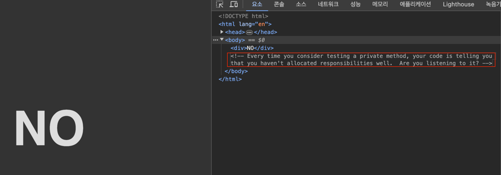

서비스 단위 테스트를 작성할 때 발생할 수 있는 모든 예외 케이스에 대해 테스트를 하려고 한다. 그러다가 private method를 테스트하고 싶을 때가 있다.

어떻게 처리할 수 있는 지 알아보자. 아래는 예시로 사용할 class이다.

```java
public class Magician {
    
    private int level;
    private int exp;
    
    private void levelUp() {
        if(exp >= 100) {
            int count = exp / 100;
            this.level += count;
            exp -= 100 * count;
        }
    }
    
}
```

## Reflection을 활용한 테스트

리플렉션을 활용하면 private method에 접근할 수 있다.

Spring Framework에서는 `ReflectionTestUtils` 클래스를 제공한다.
- org.springframework.test.util 패키지 내부에 있다.
- 개인적으로 Repository.save()를 Mocking할 때 Autoincrement대신 id를 설정해주기 위한 용도로 많이 사용했다.

아래의 예시를 보자.

```java
public class MagicianTest {
    
    @Test
    private void levelUp() {
        // given
        Magician magician = new Magician(1, 100);
        
        // when
        ReflectionTestUtils.invokeMethod(magician, "levelUp");
        
        // then
        assertThat(magician.getLevel()).isEqualTo(2);
    }
    
}
```
해당 테스트를 보면 코드가 깔끔해보인다.

하지만 테스트할 메서드의 이름이나 파라미터, 구현이 바뀔 경우 테스트가 깨질 수 있고 관리가 어려워진다.

## 접근이 가능한 메서드에서 테스트

첫 번째는 private method에 대해 테스트를 진행하지 않는 방법이다. 즉, 해당 private method를 호출하는 접근이 가능한 메서드(public, protected, ...)를 테스트하면서 private method를 간접적으로 테스트할 수 있다.

JUnit 창시자 중 한 명이자, TDD 창시자인 켄트 백(Kent Beck)은 이러한 물음에 아래와 같은 Tweet을 남기기도 했다.


해당 링크를 누르면 No라고 소개한다.
- http://shoulditestprivatemethods.com

주석에는 아래와 같은 문구가 적혀있다.



직역하면 아래와 같다.

> 너가 private method를 테스트하는 것을 고려할 때마다 너의 코드는 "너가 코드의 책임을 잘 할당하지 않았어"라고 말하고 있어. 듣고 있어?

단위 테스트는 거짓 양성이나 거짓 음성이 발생하면 안되고, 리팩토링 내성을 가져야한다. 즉, 테스트 코드는 구현에 의존해서는 안되기에 private method에 의존해서는 안된다.

테스트의 대상은 **상세한 구현**이 아닌 **동작**이 되어야 한다. 그래서 private 메서드를 호출하는 접근이 가능한 메서드를 테스트하는 것이 좋다.

## 참고
- https://yearnlune.github.io/java/java-private-method-test/
- https://www.devkuma.com/docs/junit/private-method-test/
- https://okky.kr/articles/860464
- https://mangkyu.tistory.com/235