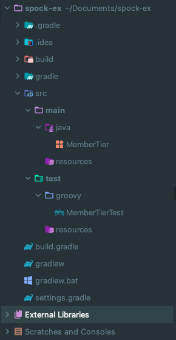
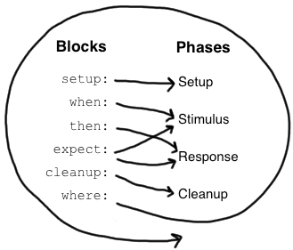
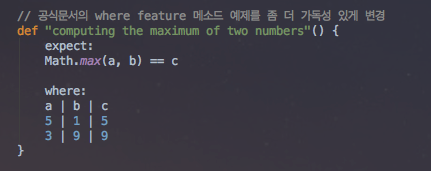

## JUnit5 - Spock으로 BDD 테스트하기!

## Spock
Spock은 **BDD(Behaviour-Driven Development)** Framework입니다.

TDD프레임워크인 JUnit과 비슷한 점이 많으나, 기대하는 동작과 테스트 의도를 더 명확하고 간결하게 드러내주는 큰 장점이 있습니다.

해당 포스팅에서는 Spock을 사용할 때의 이점과 사용 방법에 대해 알아보겠습니다.

## 테스트
아래의 MemberTier라는 enum에 대한 테스트를 진행하겠습니다.

MemberTier는 각 멤버의 등급마다 다른 할인율을 적용해서 계산해주는 함수형 인터페이스를 필드로 가지고 있습니다.

```Java
public enum MemberTier {

    BRONZE("할인율 0%", (price) -> {
        validPrice(price);
        return calPrice(price, 0);
    }),

    SILVER("할인율 10%", (price) -> {
        validPrice(price);
        return calPrice(price, 0.1);
    }),

    GOLD("할인율 20%", (price) -> {
        validPrice(price);
        return calPrice(price, 0.2);
    }),

    DIAMOND("할인율 30%", (price) -> {
        validPrice(price);
        return calPrice(price, 0.3);
    });

    private String description;
    private Function<Long, Long> expression;

    MemberTier(String description, Function<Long, Long> expression) {
        this.description = description;
        this.expression = expression;
    }

    private static void validPrice(long amount) {
        if(amount < 0) {
            throw new IllegalArgumentException("음수는 허용되지 않습니다.");
        }
    }

    private static long calPrice(long amount, double discountRate) {
        return (long) (amount * (1 - discountRate));
    }

    public long calcPrice(long amount) {
        return expression.apply(amount);
    }

}
```
이제 Enum의 각 타입이 계산을 올바르게 거치는 지 테스트 코드를 작성해보겠습니다.

## Junit 테스트
```java
@Test
public void 각_유저의_티어마다_할인율이_적용된다 () {
    // given
    MemberTier silver = MemberTier.SILVER;

    // when & then
    final long case1 = silver.calcPrice(500);
    assertThat(case1, is(450L));

    final long case2 = silver.calcPrice(1000);
    assertThat(case2, is(900L));

    final long case3 = silver.calcPrice(-500);
    assertThat(case3, is(-450L));

    final long case4 = silver.calcPrice(-1000);
    assertThat(case4, is(-900L));
}
```
이때 몇 가지 문제점을 만나게됩니다.
1. assertThat 메서드가 많아서 어떤 것을 써야할 지 찾아야 한다.
2. is 메서드도 많아서 어떤 것을 써야할 지 찾아야 한다.
3. 파라미터만 변경되고 동일한 과정이 계속되는데 과정을 재사용할 수 없다.
4. 예외 throw 테스트를 할 때 해당 검증 코드가 어떤 것인지 찾기가 어렵다.

JUnit을 사용하면 위와 같은 단점들이 존재합니다. Spock은 이런 불편한 점을 해결합니다.

## Spock 테스트
Spock을 사용하기 위해서는 groovy 플러그인이 추가되어야 합니다.
```
apply plugin: 'groovy'
```
추가로 spock 의존성을 추가합니다.
```
testCompile 'org.spockframework:spock-spring:2.1-groovy-3.0'
testCompile 'org.spockframework:spock-core:2.1-groovy-3.0'
```
아래는 새롭게 구성한 groovy 테스트 경로입니다.



spock 테스트는 groovy라는 언어로 작성하기 때문에 테스트 명을 문자열로 작성할 수 있습니다.

즉, 한글이나 띄어쓰기, 특수문자 등을 자유롭게 사용할 수 있습니다.

```groovy
class MemberTierTest extends Specification {

    def "실버 등급의 회원이 500원 품목을 구매하면 450원으로 할인이 적용된다" () {
       given:
       MemberTier 실버_등급 = MemberTier.SILVER;
       long 금액 = 500L;

       when:
       long 할인_금액 = 실버_등급.calcPrice(금액);

       then:
       할인_금액 == 450
    }

}
```

몇가지 예약어를 소개해드리자면
- Specification: 상속하면 Spock Test 클래스가 됩니다.
- def: groovy의 동적 타입 선언(메소드, 변수에 모두 사용. var과 유사)
- given, when, then: Spock의 feature 메소드

Spock의 feature 메소드는 setup, when, then, expect, cleanup, where 6단계의 라이프사이클을 가집니다.
- 

아래는 생소할 수 있는 where 블록에 대한 예시입니다.



1. Math.max(a, b) == c 테스트 코드의 a, b, c에 각각 5, 1, 5와 3, 9, 9가 입력된 후
2. expect: 메소드가 실행됩니다.

즉, where는 feature 메소드를 파라미터화해서 실행합니다.

___

## 참고
- https://jojoldu.tistory.com/228?category=1036934 (강추)

