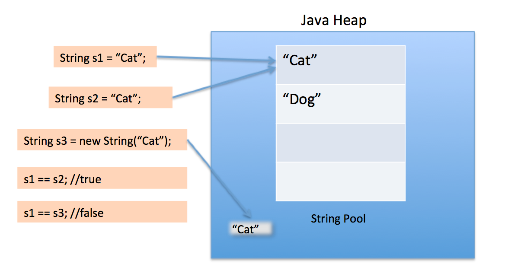

## String Constant Pool이란 무엇일까?

Java에서 String 객체를 생성하는 방법은 크게 2가지가 있다.
- String literal(큰 따옴표 " ")
- new 연산자

## 차이
```java
String str1 = "abcd";
String str2 = "abcd";
System.out.println(str1 == str2); // true
```
String literal을 사용하면 동일성 비교를 할 때 true가 나온다.

```java
String str1 = new String("abcd");
String str2 = new String("abcd");
System.out.println(str1 == str2); // true
```
new 연산자로 생성한 String에 대해서 동일성 비교를 하면 false가 나온다.

우선 동일성(==)에 대해서 알고 가자.
- 동일성은 두 인스턴스가 완전히(주소까지) 같다는 것을 말한다.
- 동등성은 두 인스턴스가 가지고 있는 내용이 같은 것을 말한다.

> 참고: https://steady-coding.tistory.com/534

즉, 동일성이 같으려면 두 인스턴스의 주소가 같아야 한다. 그럼 String Literal을 사용한 방식은 어떻게 두 변수의 주소가 같을까?

## String Constant Pool

이유는 JVM의 Heap 영역에 있는 String Constant Pool에 있다.



자바는 String literal로 문자열을 생성하면 동일한 문자열은 String Constant Pool에 저장해두고 재사용하지만,

new 연산자로 문자열 생성하면 같은 내용이라도 새로운 인스턴스를 생성해서 사용한다.

> 해당 처리는 Native Method를 사용했기에 가능하다. (https://www.latera.kr/blog/2019-02-09-java-string-intern/)

## 결론

궁금해서 찾아보다 보니까 String Constant Pool이라는 공간에 대해서와 JNI(Java Native Interface)도 조금 알게 되었다.

불변성(Immutable)을 가진 String에 대해서 메모리를 효율적으로 사용하기 위해서 자바는 String Constant Pool을 사용한다.

그래서 String은 가능한 Literal로 생성해서 String Constant Pool의 이점을 살리는 것이 좋을 듯하다.

## 참고
- https://starkying.tistory.com/entry/what-is-java-string-pool