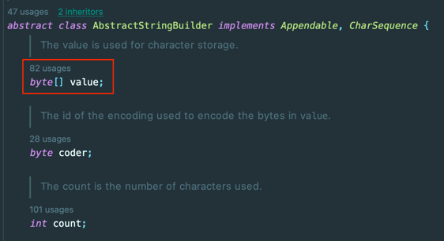

## Java - (JDK17에서는) String vs StringBuilder

Java를 잘 아는 지 확인할 때 주로 묻는 것이 String이 어디에 저장되는 지 + StringBuilder의 차이를 묻는 경우가 많다.

번외이지만 잘못된 질문과 답이 아주 많다고 생각한다.

대표적인 것 중 CheckedException과 UncheckedException의 대표적인 차이가 트랜잭션이 롤백된다는 것이다.
- 해당 부분은 정말 큰 오류이다.
- 사실 CheckedException과 UnCheckedException은 근본적으로 트랜잭션과 아무 관련이 없다
- (https://www.youtube.com/watch?v=_WkMhytqoCc)

해당 String과 StringBuilder의 차이도 너무 무지성으로 외우는 경우가 많다. (나도 그랬다.) 최근에 알게 된 내용이 있어서 공유하고자 한다.

## 탄생

Java의 String은 초기 버전인 JDK 1.0부터 존재했고, StringBuilder는 JDK 1.5 버전에 추가되었다.

원래는 가변 문자열을 다루기 위해서 StringBuffer가 있었는데 이는 동기화를 지원하기 때문에 단일 스레드에서는 불필요한 성능 저하를 초래할 수 있었다.

그래서 단일 스레드 환경이나 지역 변수에서 사용할 가변할 문자열을 저장할 때 StringBuffer의 성능 낭비가 된다는 점 때문에 탄생했다고 볼 수 있다.

(추가로 StringBuilder 클래스는 내부 버퍼의 크기를 동적으로 조정할 수 있기 때문에 StringBuffer에 비해 유연한 문자열 처리를 제공한다.)

## 불변과 가변

String과 StringBuilder의 가장 큰 차이는 용도와 그에 맞는 내부 동작이다.

String 클래스는 고정된 문자열을 저장하고 참조하는 용도로 설계되었다. 따라서 내부 동작이 불변(Immutable)하게 설계되었다.

가령 아래의 코드를 보자.

```java
String A = "12";
String B = "45";
String C = a + b;
```


반면 StringBuilder 클래스는 문자열을 동적으로 변경하거나 조작하는 용도로 설계되었다. 따라서 내부 동작이 가변(Mutable)하게 설계되었다. 내부적으로 바이트 버퍼를 가지고 있으며 해당 버퍼를 확장/축소/수정 하여 새로운 문자열 인스턴스를 위한 공간을 생성하지 않더라도 문자열을 변경할 수 있다.



코드로 보면 다음과 같다.

```java
StringBuilder sb = new StringBuilder();
sb.append("12");
sb.append("34");
```

아래 그림과 같이 아까 String과 다르게 인스턴스를 세개나 생성해서 공간을 차지하거나 GC를 수행할 필요가 없게 된다.


## 기본 클래스인 String이 불변인 이유

자바의 문자열 기본 클래스인 String을 불변으로 설계한 이유는 다음과 같다.

- 스레드 안전성을 제공하고 동시성 문제를 피할 수 있다.
- 보안이 뛰어나다. (암호 등을 외부에서 변경하면 문제가 생길 수 있음)
- 문자열 리터럴의 재사용이 가능
  - 여러 객체에서 문자열을 공유할 수 있음
- 최적화 기회를 많이 제공함 (컴파일러에서 불변을 가정할 수 있기 떄문)
  - (불변 객체 GC 최적화 내용: https://jaehoney.tistory.com/305)

## 현재 버전에서도 동일할까?

이 부분이 사실 해당 포스팅에서 가장 중요한 부분일 것 같다.

현재도 동일한가..?

String 클래스의 불변성과 StringBuilder 클래스의 가변성은 자바의 기본적인 개념 중 하나로 버전이 변경되어도 변하지 않는다.

그렇지만 JDK 5버전부터는 원래 String의 + 연산에 StringBuilder로 활용하도록 변환해준다.

추가로 JDK 9버전부터는 String 클래스의 내부 구현 방식이 바뀌어서, 불변이지만 일부 문자열에서 StringBuilder나 StringBuffer보다 효율적으로 동작할 수 있다.

JDK 9 이전에서는 String이 문자열을 char 배열로 저장했지만, JDK 9버전 이후부터는 Byte 배열에 저장하고 캐시된 해시코드를 사용하고, 문자열 덧셈 연산에 StringConcatFactory 클래스의 makeConcatWithConstants 메서드를 호출한다.
- 동적으로 호출되는 Bootstrap method를 호출함으로써 상황에 따른 최적화된 코드를 생성한다.
  - StringBuilder보다 효율적인 방식으로 문자열을 연결하며, 메모리 사용량을 최소화한다.
- 일반적으로 작은 문자열을 연결할 때는 StringBuilder보다 성능이 뛰어나다.
  - Constant Pool 활용
  - StringBuilder Pool 활용
  - Indify (바이트 배열 기반의 최적화 기법)
  - Intrinsics (JIT 컴파일러가 처리할 수 있는 본질적 함수로 메서드 호출 오버헤드 감소)
- 참고: (https://june0122.tistory.com/2)

Bootstrap method를 호출한다는 것이 무슨 의미냐면, "a" + "b" + "c" + "b" + "d"와 같은 연산을 수행할 때, 기존에는 하나씩 더해가면서 새로운 인스턴스를 만들었지만, 이제는 하나의 배열에 모든 문자열을 전부 저장한 후 한번에 연결한다.

즉, 현재 기준으로는 반복문에서 1000회 이상씩 반복문으로 문자열을 생성하는 경우 등이 아니라면, StringBuilder가 반드시 String보다 우수하다고 말하기는 힘들며, 간단 문자열 연결에서는 String이 더 나은 선택일 수 있다.

## 참고
- https://june0122.tistory.com/2
- https://velog.io/@ifi9/JDK-%EB%B2%84%EC%A0%84-%EB%B3%84-String-%EC%97%B0%EC%82%B0
- https://dejavuhyo.github.io/posts/java-9-compact-string
- https://parkadd.tistory.com/m/140