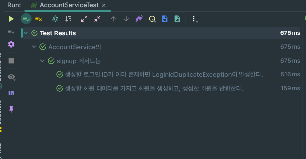

# JUnit5 - Nested Class를 사용해서 우아하게 서비스 테스트 작성하기!

서비스 단위 테스트(Unit Test)를 작성할 때 구조를 미리 잡는 것도 중요하다.

나중을 생각하지 않고 테스트 코드를 지저분하게 작성했을 때 본인이 혼자 개발한다면 적당한 시기에 리팩토링을 진행할 수 있다.

하지만, 여럿이서 협업을 진행하다 보면 잠깐 자리를 비운 사이 다른 사람이 지저분한 구조를 계속 가져가면서 코드를 많이 작성해서 겉잡기가 힘들어질 수 있다.

해당 포스팅에서는 Nested 클래스를 사용해서 서비스 테스트를 우아하게 작성하는 방법에 대해 다룬다.

## 기존의 테스트 코드
먼저 비교를 위해 기존의 테스트 코드를 보자. 
```java
@SpringBootTest
class AccountServiceTest {

    @Autowired
    AccountService accountService;
    
    @Autowired
    AccountRepository accountRepository;

    @Test
    @DisplayName("signUp메서드는 생성할 회원 데이터를 가지고 회원을 생성하고, 생성한 회원을 반환한다.")
    void signUp_success() {
        // given
        SignUpRequest signUpRequest =
                new SignUpRequest("violetbeach13", "password1234", "Honey");

        // when
        AccountInfo accountInfo = accountService.signUp(signUpRequest);

        // then
        assertThat(accountInfo).isNotNull();
    }

    @Test
    @DisplayName("signUp메서드는 생성할 로그인 ID가 이미 존재하면 LoginIdDuplicateException이 발생한다.")
    void signUp_fail_duplicateLoginId() {
        // given
        String duplicatedLoginId = "violetbeach13";
        Account account = new Account(duplicatedLoginId,
                "password1234",
                "nickname12"
        );
        accountRepository.save(account);

        SignUpRequest signUpRequest =
                new SignUpRequest(duplicatedLoginId, "password1234", "Honey");

        // when & then
        assertThatThrownBy(() -> accountService.signUp(signUpRequest))
                .isInstanceOf(LoginIdDuplicateException.class);
    }
    
}
```
위 코드를 보면 문제가 없는 코드라고 보일 수 있다.

하지만 나중에 여러가지 문제점이 생길 수 있다.

### 테스트 케이스가 늘어나면 유지보수가 힘들다.

만약 AccountService에 아래의 기능들이 있다고 가정하자.
- 회원 가입
- 로그인
- ID 찾기
- PW 찾기

각 기능에는 성공과 실패 등 다양한 Case에 대한 테스트를 진행해야 한다.

그러면 해당 테스트 클래스가 매우 지저분해질 수 있다.
- 회원가입 성공 메서드
- 회원가입 실패 메서드 (ID 중복)
- 회원가입 실패 메서드 (PW 불일치)
- 회원가입 실패 메서드 (휴대폰 번호 중복)
- 로그인 성공 메서드
- 로그이 실패 메서드 (PW 불일치)
- ...

테스트 클래스가 지저분해지면 원하는 테스트를 찾기 어렵고 문제가 발생했을 때 빠르게 해결할 수 없게 된다.

### Setup & Teardown을 정의하기 까다롭다.

위 구조는 다른 메서드에 대한 테스트도 모두 동일 Class의 Method로 정의된다.

이때 각 테스트마다 필요한 데이터나 초기화 로직이 다를 수 있다.

해당 부분 구현을 위해서 Class 단위로 Setup & Teardown을 정의할 수 있다.
```java
@SpringBootTest
class AccountServiceTest {

    @Autowired
    AccountService accountService;
    
    @Autowired
    AccountRepository accountRepository;
    
    Account account;
    
    SignupRequest signupRequest;
    
    @BeforeEach
    void setup() {
        account = generateAccount("loginId11"); // ID 찾기 메서드를 위한 데이터 생성
        signupRequest = new SignupRequest("loginId", "password", "nickname"); // 회원 가입을 위한 데이터 생성
    }

    @Test
    void signUp_success() {
        // 생략
    }

    @Test
    void signUp_fail_duplicateLoginId() {
        // 생략
    }
    
    @Test
    void findLoginId_success() {
        // 생략
    }
    
}
```

해당 방법은, 특정 테스트를 실행할 때만 필요한 데이터 초기화 과정이 다른 테스트에도 영향을 줄 것이다.

그렇다고 각 테스트 메서드 내부에서 Setup & Teardown을 진행한다면 코드가 의미없이 반복되면서 테스트 메서드가 매우 지저분해지는 결과를 낳는다.

## 변경한 테스트 코드
위의 문제점들을 해결하기 위해 Nested 클래스를 사용할 수 있다. 예시를 살펴보자.
```java
@SpringBootTest
@DisplayName("AccountService의")
class AccountServiceTest {

    @Autowired
    AccountService accountService;
    @Autowired
    AccountRepository accountRepository;

    @Nested
    @DisplayName("signup 메서드는")
    class signup {

        @Test
        @DisplayName("생성할 회원 데이터를 가지고 회원을 생성하고, 생성한 회원을 반환한다.")
        void success() {
            // given
            SignUpRequest signUpRequest =
                    new SignUpRequest("violetbeach13", "password1234", "Honey");

            // when
            AccountInfo accountInfo = accountService.signUp(signUpRequest);

            // then
            assertThat(accountInfo).isNotNull();
        }

        @Test
        @DisplayName("생성할 로그인 ID가 이미 존재하면 LoginIdDuplicateException이 발생한다.")
        void fail_duplicateLoginId() {
            // given
            String duplicatedLoginId = "violetbeach13";
            Account account = new Account(duplicatedLoginId,
                    "password1234",
                    "nickname12"
            );
            accountRepository.save(account);

            SignUpRequest signUpRequest =
                    new SignUpRequest(duplicatedLoginId, "password1234", "Honey");

            // when & then
            assertThatThrownBy(() -> accountService.signUp(signUpRequest))
                    .isInstanceOf(LoginIdDuplicateException.class);
        }

    }

}
```
이제 각 테스트할 메서드에 계층(Nested Class)을 둠으로써 원하는 테스트 메서드를 쉽게 찾을 수 있다.

더불어서 아래와 같이 Setup & Teardown을 각 테스트할 메서드에 적용할 수 있으니, 각 메서드 마다 필요한 데이터를 깔끔하게 생성할 수 있다.
```java
@SpringBootTest
@DisplayName("AccountService의")
class AccountServiceTest {

    @Autowired
    AccountService accountService;
    @Autowired
    AccountRepository accountRepository;

    @Nested
    @DisplayName("signup 메서드는")
    class signup {
        
        private Account account;
        private SignupRequest signupRequest;
        
        @BeforeEach
        void setup() {
            //F fields 데이터 초기화
        }

        @Test
        @DisplayName("생성할 회원 데이터를 가지고 회원을 생성하고, 생성한 회원을 반환한다.")
        void success() {
            // 생략
        }

        @Test
        @DisplayName("생성할 로그인 ID가 이미 존재하면 LoginIdDuplicateException이 발생한다.")
        void fail_duplicateLoginId() {
            // 생략
        }

    }

}
```

아래는 Nested 클래스를 사용했을 때의 테스트 결과이다.


