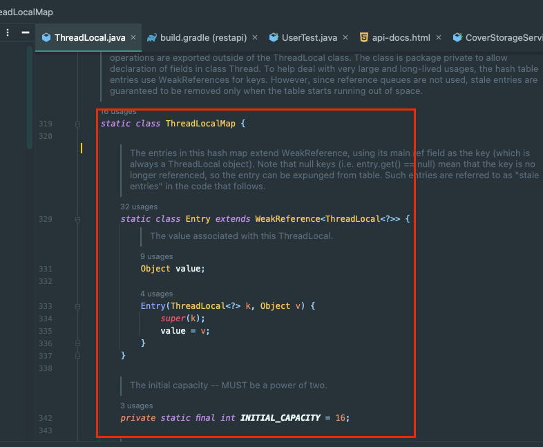
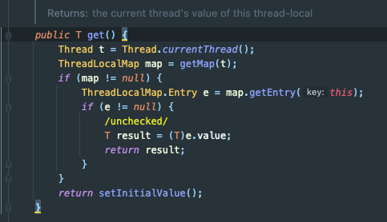
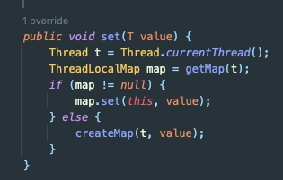
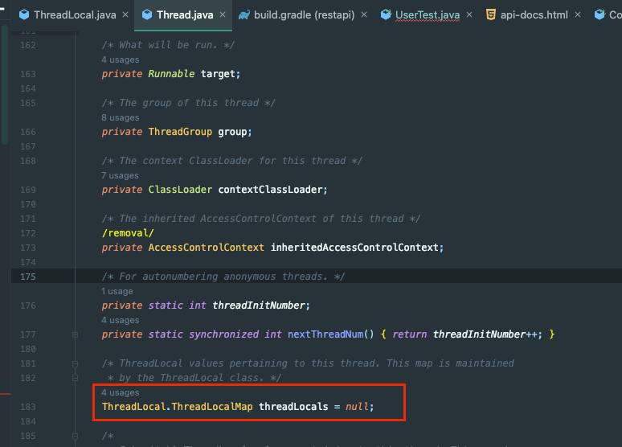
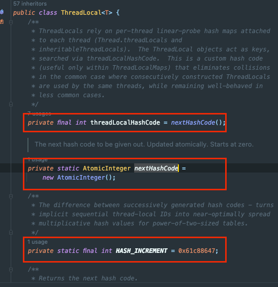

## Java - ThreadLocal 동작 원리 이해하기!

지난 번에 샤딩을 앱 서버에서 처리하기 위해 ThreadLocal이라는 공간에 매핑될 DB 서버 정보를 넣어줬다.
- https://jaehoney.tistory.com/180

그렇다면 ThreadLocal은 도대체 어떻게 동작하는 걸까..?

알아보자.

## ThreadLocal

ThreadLocal은 java.lang에서 지원하는 클래스로 Thread-Safety하다고 알려져있다.

나도 **ThreadPool에서 Tomcat에서 Thread를 꺼내면 해당 Thread는 ThreadLocal이라는 공간을 가진다. ThreadLocal의 데이터는 Thread-Safety 하다.** 정도로만 알고 있었다.

그런데 이상한 점이 있다. 나는 분명 ThreadLocal을 정적 필드로 사용했다. 그런데 왜 Thread-Safety 한 건지 의아했다.



ThreadLocal 내부를 분석해보면 ThreadLocalMap이라는 클래스를 구현하고 있다. (필드로 가지지는 않는다.)





그리고 get()과 set() method를 통해 해당 ThreadLocalMap에 접근을 제공한다.

그렇다면 ThreadLocal은 어디에 있을까?!



바로 Thread의 인스턴스 필드로 ThreadLocalMap이 있다.

즉, 하나의 Thread는 여러 개의 ThreadLocal을 Map 형태로 가질 수 있다.

그래서 ThreadLocal의 동작을 정리하자면 이렇다.
- ThreadLocal은 Thread.currentThread()로 Heap에서 해당 Thread를 조회한다.
- 이후 해당 Thread 안에 있는 ThreadLocalMap을 불러온다.
- 그리고 자기 자신(ThreadLocal)을 key로 value를 가져오거나 set한다.

그렇다면 이제 ThreadLocal이 왜 인스턴스를 생성하는 방식으로 동작하는 지 이해가 된다!



ThreadLocal의 내부를 분석해보면 인스턴스 변수는 다음 3개 밖에 없다.
- final int threadLocalHashCode = nextHashCode();
- static int nextHashCode = new AtomicInteger();
- static final int HASH_INCREMENT = 0x61c88647;

보면 ThreadLocal은 nextHashCode를 **static**으로 가지고 있다.

그리고 각 ThreadLocal을 구분하기 위한 용도로 nextHashCode()를 사용해서 threadLocalHashCode를 새롭게 할당해서 해시 충돌이 발생하지 않게 한다.
- nextHashCode는 Thread-Safety를 위해 AtomicInteger로 감싼 것
  - 관련해서는 이전에 포스팅한 Atomic Variable 관련 글(https://jaehoney.tistory.com/112)을 참고
- HASH_INCREMENT는 각 해시 코드를 다르게 설정하기 위해 증가시키는 부분

## remove

만약 해당 Thread의 Stack에 값을 넣었고 해당 Thread가 재사용된다면 해당 Stack에 있는 자원을 그대로 가진 채로 동작하게 된다.

그래서 반드시 ThreadLocal을 다룰 때는 사용 이후, 혹은 set 이전에 ThreadLocal을 날려주는 처리가 필요하다.

## 비동기

로직 진행중에 특정 부분에서 비동기로 다른 쓰레드에게 작업을 위임할 수 있다.

만약 @Async 등을 사용해서 비동기로 별도 스레드에서 처리하는 경우를 생각해보자.

이때 작업을 위임받은 Thread는 기존 쓰레드의 ThreadLocalMap을 가지지 않게 된다. 즉, 비동기 Thread에서 ThreadLocal에 접근한다면 원치 않는 결과륿 받을 수 있다.

이 경우 TaskExecutor에 Custom한 TaskDecorator를 설정하면 해결이 가능하다.

```java
@Component
public class TaskDecoratorImpl implements TaskDecorator {

    @Override
    public Runnable decorate(Runnable task) {
        RequestAttributes requestAttributes = RequestContextHolder.getRequestAttributes();

        return() -> {
            RequestContextHolder.setRequestAttributes(requestAttributes);
            runnable.run();
        };
    }
}
```

Task Decorator는 작업(Task)를 시작하기 직전에 진행하는 작업을 추가할 수 있도록 만든 interface이다.

위 코드는 비동기로 작업을 시작하기 전에 Thread가 가진 정보를 복사해서 옮겨준다. 

```java
@Configuration
@EnableAsync
@RequiredArgsConstructor
public class AsyncConfig {
    
    private final TaskDecorator taskDecorator;
    
    @Bean 
    public TaskExecutor taskExecutor() {
        ThreadPoolTaskExecutor taskExecutor = new ThreadPoolTaskExecutor();
        taskExecutor.setCorePoolSize(20);
        taskExecutor.setMaxPoolSize(50);
        taskExecutor.setQueueCapacity(200);
        taskExecutor.setTaskDecorator(taskExecutor);
        taskExecutor.setThreadNamePrefix("async-task-");
        return taskExecutor;
    }

}
```
taskExecutor.setTaskDecorator() 메서드로 정의한 TaskDecorator를 사용하도록 설정한다.

## 참고
- https://blog.gangnamunni.com/post/mdc-context-task-decorator 
- https://cano721.tistory.com/208
- https://kwonnam.pe.kr/wiki/springframework/async


