## 이슈

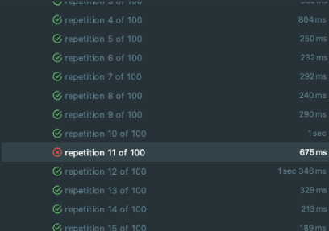

어느날 메일 API의 특정 메일 첨부파일을 읽어오는 end-point에서 OOM이 터졌다.

오잉..? 아직까지 일부 사용자에게만 운영중인 서버라서 OOM이 터지는 것은 뭔가가 잘못되었다는 것을 의미한다.

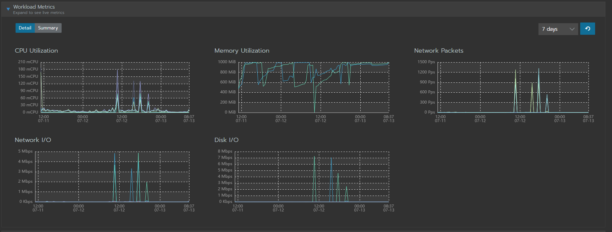

**Rancher**를 확인한 결과 실제로 메모리가 들쑥날쑥했고, OOM으로 인해 파드가 여러번 재실행되었다.

### 본문 내용

해당 본문을 확인해본 결과 아래와 같았다.
- 원문 크기: 38MB
- Part (첨부파일): 총 10개 - 하나 당 3~4MB 정도

### 첨부파일 조회 Flow

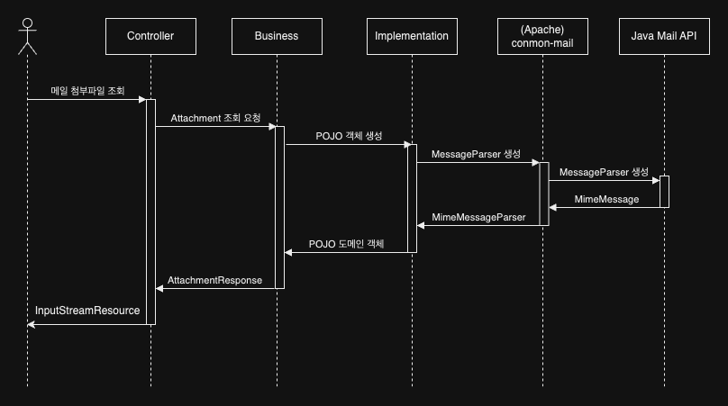

해당 원문과 Flow를 그려보니 바로 떠오르는 원인을 알 수 있었다.

조금 더 넓은 범위의 Flow를 그려보자.

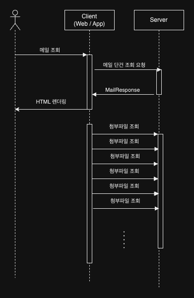

즉, HTML 원문 조회 과정에서 **첨부파일에 대한 조회가 많이 발생**했고, 이로 인해서 서버가 터졌다.

정상적인 경우라면 서버가 터지면 안되는 상황이었다. (사용자가 그렇게 많지 않기 때문)

그래서 **Rancher**를 확인해보니 해당 **38MB** 짜리 원문을 조회하는 데 Memory 사용량이 **312MB** 정도 급증하고 있었다.

## Memory 급증

Memory 급증 원인을 찾기 위해 `MimeMessage`를 생성하는 테스트 코드를 짜고 profiler를 돌려봤다.

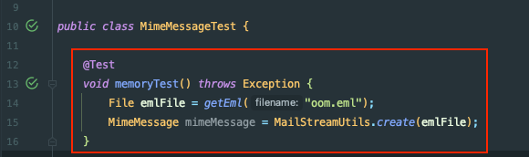

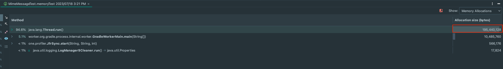

오잉.. 그냥 `MimeMessage`만 생성했는데 **186MB**를 할당하고 있었다.

그래서 사용중인 라이브러리 `Apache-commons-mail`의 `MimeMessageParser.parse()`도 실행해봤다.

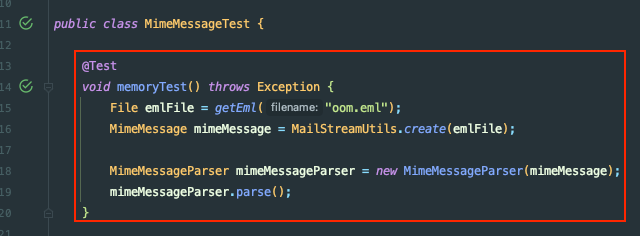
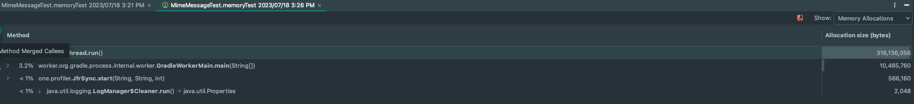

그 결과 **301MB** 정도의 엄청난 메모리를 할당하고 있었다.

즉, 원인을 분석해보면 eml 파일의 첨부파일 1개만 조회하는 데 **메모리 할당이 터무니없이 많이 발생**하고 있었다.

(메모리 사용량은 아래에서 분석한다.)

## SharedInputStream

첫 번째 테스트의 Call Tree 확인한 결과는 아래와 같다.

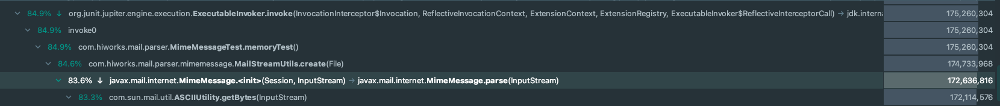

`MimeMessage`의 생성자가 호출하는 `parse()` 메서드에서 메모리를 많이 할당함을 알 수 있었다.

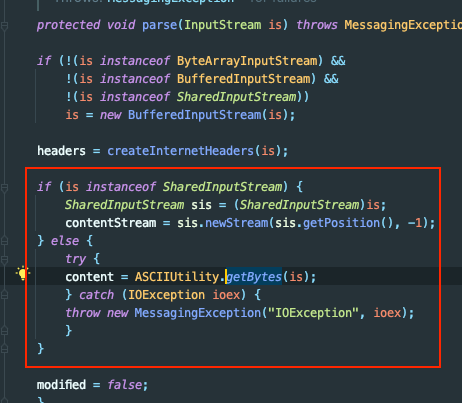

해당 코드 내부를 보면 `InputStream`이 `SharedInputStream`이 아닐 경우 **`byte[]`** 형태로 읽어와서 새롭게 저장한다.

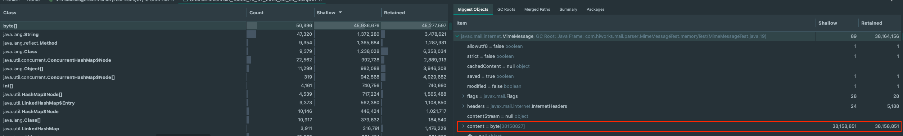

힙 스냅샷에서 확인한 결과 약 **37MB ~ 38MB**의 `byte[]`를 메모리에 저장하고 있었다.

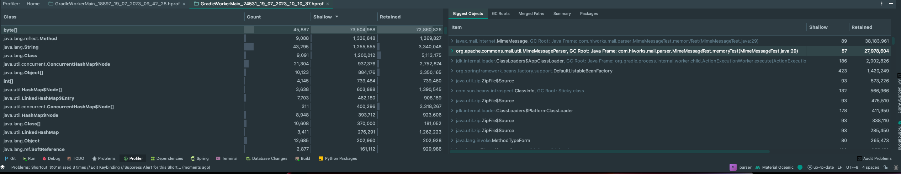

`MimeMessageParser.parse()`를 사용하면 더 많은 메모리(대략 **70MB** 정도)를 저장한다.

사용자 입장에서 **메일 1개를 조회**해서 브라우저 렌더링하면 **첨부파일 10개를 동시에 조회**하므로 **서버에 700MB 정도의 메모리 급증이 일어나게 된다.** (본문 조회까지 하면 x11..)

즉, `byte[]`가 아니라 `File`만 가지고 있다가 **Stream**으로 읽어오던지, 조회할 첨부파일만 메모리에 할당하던지 하는 처리가 필요하다.


다시 코드를 보면 `inputStream`이 `SharedInputStream`을 구현할 경우 `byte[]`에 데이터를 **할당하지 않는다.** 

`SharedInputStream`은 하위 `InputStream`을 만드는 기능을 제공하여, 사용 측에서는 `InputStream`을 여러번 읽는 것처럼 동작한다.
- https://docs.oracle.com/javaee/7/api/javax/mail/internet/SharedInputStream.html

아래는 `SharedInputStream`의 구현체들이다.
- SharedByteArrayInputStream
- SharedFileInputStream
- WritableSharedFile

기존에 `FileInputStream`을 사용하고 있었으니까 **`SharedFileInputStream`** 으로 교체하면 해결할 수 있을 것 같았다.

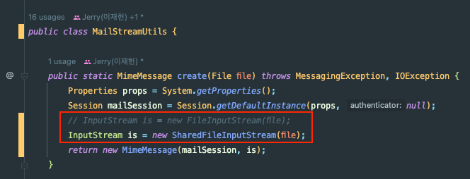

위와 같이 `MimeMessage`를 생성할 때 사용하던 `FileInputStream`을 `SharedFileInputStream`으로 교체한 결과

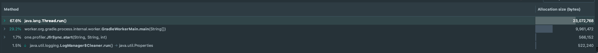

첫 번째 `MimeMessage`를 생성하는 테스트의 경우 Memory 할당이 **186MB -> 22MB**로 줄어들었고,

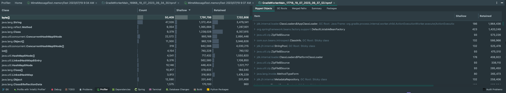

**메모리 사용량**의 경우 **기존 38MB에서 수정 후 거의 사용하지 않았다.**

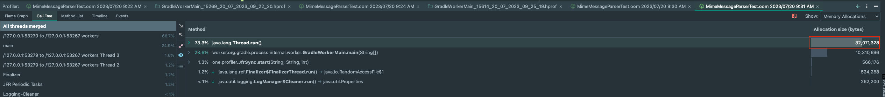

`MimeMessageParser.parse()`에서는 메모리 할당이 **301MB -> 32MB**으로 줄어들었고,

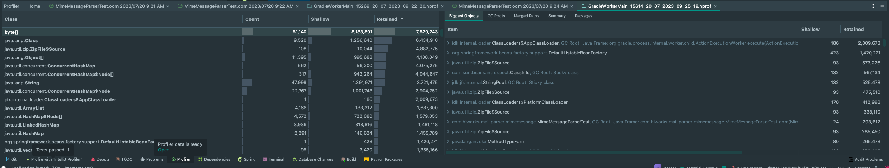

**메모리 사용량**도 **70MB에서 수정 후 거의 사용하지 않는다.**

그래서 해당 부분까지 적용해보기로 했다.

## 테스트 실패..

모듈의 테스트 코드는 **All Pass**였다. (**파싱은 잘된다**!)

`SharedFileInputStream`으로 바꾼 모듈을 사용처(Api Server)에서 의존을 받아서 테스트 코드를 돌려봤다.

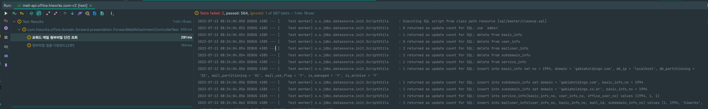

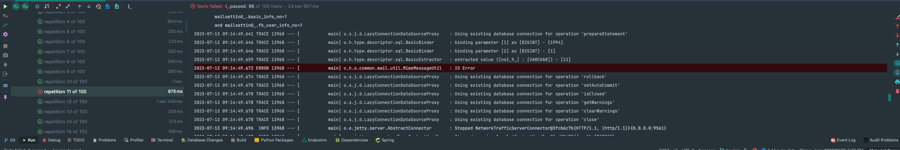

**결과 일부 테스트가 깨졌고**, 다시 돌리니까 재현이 안되어서 `@RepeatedTest`를 돌려보니 **간헐적으로 테스트가 실패**하는 것을 확인할 수 있었다.

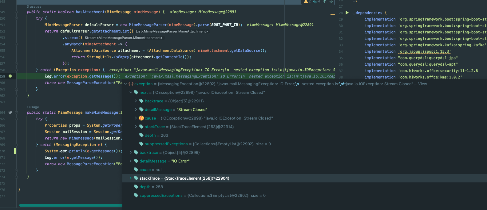

에러 메시지는 `Stream Closed`라고 한다.

## finalize

그래서 **정확한 원인 확인**을 위해 삽질을 하다가 아래의 테스트가 깨지는 것을 발견했다.

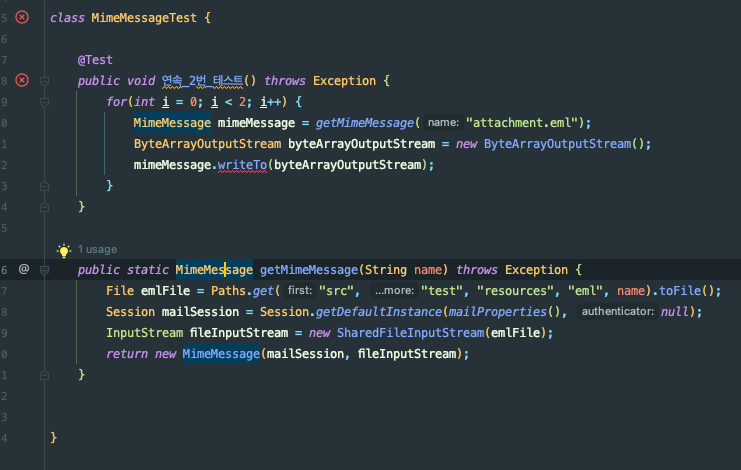

두번 연속 동일한 파일에 대해 `mimeMessage.writeTo()`를 호출하면 테스트가 깨진다. for문을 제거해도 깨지고, 동기로 해도, 비동기로 해도 깨진다.

가끔 테스트가 성공할 때도 있으며, Stack Trace도 매번 다르다.

**가장 신기했던 것은** 아래 코드는 **실패**하는데,

```java
@Test
public void 연속_2번_테스트() throws Exception {
   for(int i = 0; i < 2; i++) {
       File emlFile = Paths.get("src", "test", "resources", "eml", "oom.eml").toFile();
       Session mailSession = Session.getDefaultInstance(mailProperties(), null);
    
       MimeMessage mimeMessage = new MimeMessage(mailSession, new SharedFileInputStream(emlFile));
       
       ByteArrayOutputStream byteArrayOutputStream = new ByteArrayOutputStream();
       mimeMessage.writeTo(byteArrayOutputStream);
   }
}
```

아래 코드는 **성공**한다는 것이다.

```java
@Test
public void 연속_2번_테스트() throws Exception {
    for(int i = 0; i < 2; i++) {
        File emlFile = Paths.get("src", "test", "resources", "eml", "oom.eml").toFile();
        Session mailSession = Session.getDefaultInstance(mailProperties(), null);
        
        InputStream is = new SharedFileInputStream(emlFile);
        MimeMessage mimeMessage = new MimeMessage(mailSession, is);
        
        ByteArrayOutputStream byteArrayOutputStream = new ByteArrayOutputStream();
        mimeMessage.writeTo(byteArrayOutputStream);
    }
}
```

다른 점은 InputStream을 **인자**로 넣어 줄 지 **블록 내**에서 선언할 지 밖에 없다.

더 자세히 디버깅해본 결과 두 테스트가 `SharedFileInputStream` **인스턴스의 생명주기가 다른 것**의심 했다.
`MimeMessage`는 자식 **`SharedInputStream`** 에 대한 참조는 가지고 있지만, 부모 `SharedInputStream`에 대한 참조는 가지고 있지 않았다.

`SharedFileInputStream`은 부모가 `close`되면 자식도 `close`된다.

즉, 내 **가설**을 정리하면 다음과 같다.
- 첫 번째 코드: MimeMessage 인스턴스 생성이 완료되면 SharedFileInputStream은 더 이상 참조가 없으므로 `finalize()` 호출
- 두 번째 코드: 블록이 종료될 때 SharedFileInputStream의 `finalize()` 호출

그런데 그렇게 생각하기엔 아직 풀리지 않은 미스테리가 있었다.
- 왜 반복문의 두 번째에서 예외가 터지는가..?
- 첫 번째로 생성할 떄도 `write()`시점에 부모 SharedInputStream이 닫힌다면 예외가 터져야 하는 것이 아닌가..?

그래서 가설을 하나 더 세웠다.

## GC의 finalize() 실행은 보장되지 않는다!

즉, `finalize()`가 **생명주기가 끝났다고 해서 반드시 실행되지는** 않는다. **언제 실행될 지도** 보장되지 않는다.

**두 가설을 증명**하기 위해 **아래의 테스트 코드**를 작성했다.

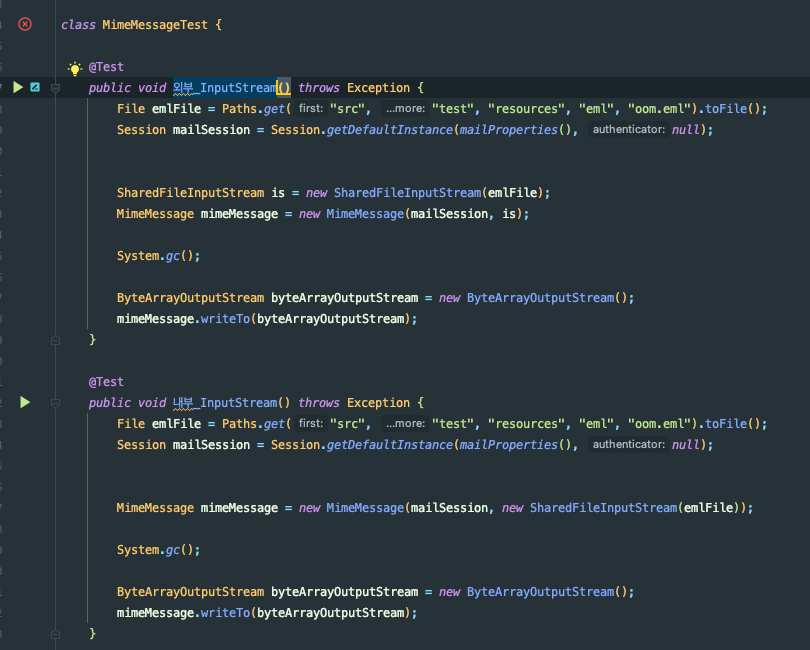

`System.gc()`를 통해 명시적으로 **GC**를 수행해줬으니까 생성자 밖에서 InputStream을 생성한 **첫 번째 테스트는 성공해야 하고**, 인자에서 InputStream을 생성한 **두 번째 테스트에서는 예외가 발생해야 한다.**

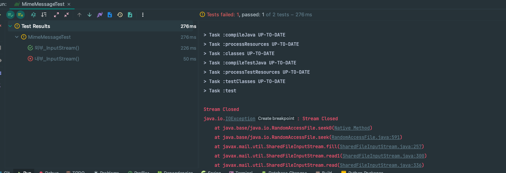

크.. **예상했던 대로 두 번째 테스트에서만 테스트가 깨지고 있다**.. 감격 😭😭

## 상속으로 해결

이제 해결 방법을 고민해야 한다. 떠오르는 방법은 아래의 방법이 있었다.

- `MimeMessage`를 상속해서 `finalize()` 재정의
- `MimeMessage`를 상속해서 필드로 `rawInputStream`을 가지기
- `SharedFileInputStream`을 상속해서 필드로 `parentInputStream`을 가지기
- `InputStream`을 따로 Map 같은 곳에 보관하기
- ...

해당 부분은 `MimeMessage`를 상속하고 **`rawInputStream`** 에 대한 레퍼런스를 가지고 있도록 결정했다.

결과적으로 구현한 코드는 아래와 같다.

```java
public class SharedMimeMessage extends MimeMessage {

    private InputStream rawInputStream;
    
    public HiworksMimeMessage(Session session) {
        super(session);
    }

    public HiworksMimeMessage(Session session, InputStream is) throws MessagingException {
        super(session, is);
        if(is instanceof SharedInputStream) {
            rawInputStream = is;
        }
    }

    public HiworksMimeMessage(MimeMessage source) throws MessagingException {
        super(source);
    }

    protected HiworksMimeMessage(Folder folder, int msgnum) {
        super(folder, msgnum);
    }

    protected HiworksMimeMessage(Folder folder, InputStream is, int msgnum) throws MessagingException {
        super(folder, is, msgnum);
        if(is instanceof SharedInputStream) {
            rawInputStream = is;
        }
    }

    protected HiworksMimeMessage(Folder folder, InternetHeaders headers, byte[] content, int msgnum) throws MessagingException {
        super(folder, headers, content, msgnum);
    }
}
```

그 결과

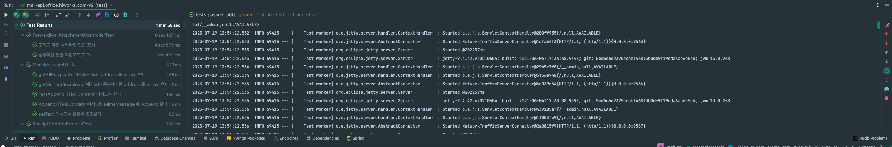

**모든 테스트에 성공했다! 몇 번을 돌려도 성공한다.**

## 개선 결과

결과적으로 아래의 개선을 할 수 있었다.

- **메모리 할당**:
  - `new MimeMessage()`: 186 MB -> 22MB
  - `MimeMessageParser.parse()`: 301 MB -> 32MB
- **메모리 사용량**:
  - `new MimeMessage()`: 38MB -> 0 MB (근삿값)
  - `MimeMessageParser.parse()`: 70MB -> 0 MB (근삿값)

반영 결과 Client의 조회 1건으로 메모리 사용량이 **312MB 정도 튀고 OOM이 터지던 것**이
**수정 후에는 30MB 정도** 튀는 것을 확인했다.

이제 **실서버에 적용**하자.

## 실서버 적용


개선 전 아래와 같이 적용 이전에 렌더링 한 번에 메모리가 312MB 정도가 튀던 것들이
- (스테이징 서버의 자원 부족으로 OOM이 터져서 첨부파일 4개는 응답도 못받았다.)

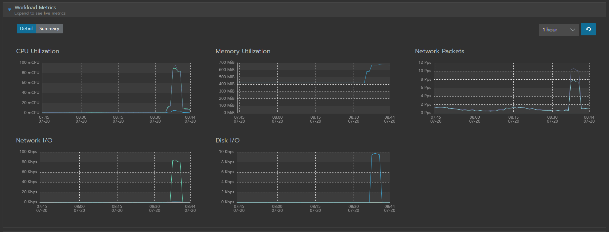

아래와 같은 동일한 요청에

```
2023-07-26 10:00:23.956 DEBUG 28 --- [io-8080-exec-16] o.s.w.f.CommonsRequestLoggingFilter      : Incoming Request: GET /v2/mails/826122601]
2023-07-26 10:00:24.507 DEBUG 28 --- [io-8080-exec-21] o.s.w.f.CommonsRequestLoggingFilter      : Incoming Request: GET /v2/mails/826122601/attachments/1.4]
2023-07-26 10:00:24.519 DEBUG 28 --- [io-8080-exec-15] o.s.w.f.CommonsRequestLoggingFilter      : Incoming Request: GET /v2/mails/826122601/attachments/1.9]
2023-07-26 10:00:24.525 DEBUG 28 --- [io-8080-exec-20] o.s.w.f.CommonsRequestLoggingFilter      : Incoming Request: GET /v2/mails/826122601/attachments/1.11]
2023-07-26 10:00:24.527 DEBUG 28 --- [io-8080-exec-10] o.s.w.f.CommonsRequestLoggingFilter      : Incoming Request: GET /v2/mails/826122601/attachments/1.8]
2023-07-26 10:00:24.531 DEBUG 28 --- [io-8080-exec-19] o.s.w.f.CommonsRequestLoggingFilter      : Incoming Request: GET /v2/mails/826122601/attachments/1.10]
2023-07-26 10:00:24.712 DEBUG 28 --- [io-8080-exec-11] o.s.w.f.CommonsRequestLoggingFilter      : Incoming Request: GET /v2/mails/826122601/attachments/1.5]
2023-07-26 10:00:25.259 DEBUG 28 --- [nio-8080-exec-6] o.s.w.f.CommonsRequestLoggingFilter      : Incoming Request: GET /v2/mails/826122601/attachments/1.6] 
2023-07-26 10:00:26.041 DEBUG 28 --- [nio-8080-exec-3] o.s.w.f.CommonsRequestLoggingFilter      : Incoming Request: GET /v2/mails/826122601/attachments/1.3]
2023-07-26 10:00:26.051 DEBUG 28 --- [io-8080-exec-13] o.s.w.f.CommonsRequestLoggingFilter      : Incoming Request: GET /v2/mails/826122601/attachments/1.7]
2023-07-26 10:00:26.061 DEBUG 28 --- [io-8080-exec-13] o.s.w.f.CommonsRequestLoggingFilter      : Incoming Request: GET /v2/mails/826122601/attachments/1.12]
2023-07-26 10:00:26.078 DEBUG 28 --- [io-8080-exec-16] o.s.w.f.CommonsRequestLoggingFilter      : Incoming Request: GET /v2/mails/826122601/attachments/1.2]
```

아래와 같이 메모리가 튀지 않는다! (1MB~2MB만 움직인다.)


이제 실서버에 배포해야곘다!


## 참고
- https://aroundck.tistory.com/4551
- https://hbase.tistory.com/287
