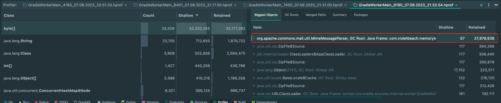
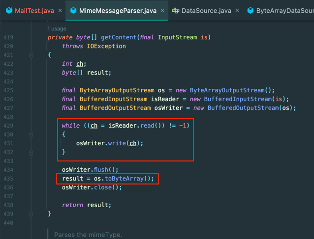
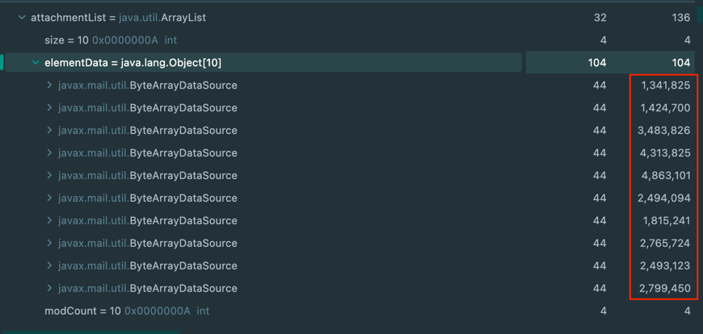
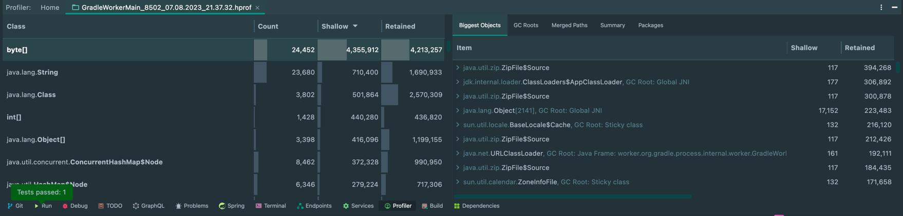

Hello.

OOM occurred in the mail service developed using Apache-commons-email.

I debugged and found that the mail lookup function was wasting memory!

#### Problem

Below is a test for reproducing the problem.

```java
@Test
void memoryTest() throws Exception {
    FileInputStream is = new FileInputStream("/test/oom.eml");
    Session session = Session.getInstance(System.getProperties());
    MimeMessage mimeMessage = new MimeMessage(session, is);
    MimeMessageParser parser = new MimeMessageParser(mimeMessage).parse();
}
```

Below is the memory usage.



I was thinking of using Attachments as a buffer for OutputStream when I really need them.

However, it is becoming a problem by putting all bytes[] in memory.





#### Sugest

So i modified these processes to use AttachmentDataSource.

As a result, you can get a big advantage in memory usage as you want.



> I worked hard to fix it. Feel free to let me know if you have any advice or lack!

Thanks very much. 🙇
