## 이슈


어느날 메일의 첨부파일을 읽어오는 end-point에서 OOM이 터졌다.

오잉..? 아직까지 일부 사용자(신 모바일 애플리케이션 사용자)에게만 운영중인 서버라서 OOM이 터지는 것은 뭔가가 잘못되었다는 것을 의미한다.


Rancher를 확인한 결과 실제로 메모리가 들쑥날쑥했고, OOM으로 인해 파드가 여러번 재실행되었다.

## 이해

### 본문 내용

해당 본문을 확인해본 결과 아래와 같았다.
- 원문 크기: 38MB
- Part (첨부파일): 총 10개 - 하나 당 3~4MB 정도

### 첨부파일 조회 Flow


해당 원문과 Flow를 그려보니 바로 떠오르는 원인을 알 수 있었다.

조금 더 넓은 범위의 Flow를 그려보자.


즉, HTML 원문 조회 과정에서 첨부파일에 대한 조회가 많이 발생했고, 이로 인해서 서버가 터졌다.

여기서 정상적인 경우라면 서버가 터질 수가 없는 상황이었다. (사용자가 그렇게 많지 않음)

그래서 직접 Client로 테스트를 해보니 해당 38MB 짜리 원문을 조회하는 데 Memory 사용량이 **312MB** 정도 급증하고 있었다.

## Memory 급증

Memory 급증 원인을 찾기 위해 `MimeMessage`를 생성하는 테스트 코드를 짜고 profiler를 돌려봤다.


오잉.. 그냥 `MimeMessage`만 생성했는데 **186MB**를 할당하고 있었다.

그래서 사용중인 라이브러리 (apache-commons-mail)의 `MimeMessageParser.parse()`도 테스트해봤다.


그 결과 **301MB** 정도의 메모리를 할당하고 있었다.

사용자가 해당 메일 1개를 조회할 때, 첨부파일 조회 end-point를 10번 호출하기 때문에 훨씬 더 많은 메모리 할당이 일어났고, 서버가 죽었다.

## SharedInputStream

첫 번째 테스트의 Call Tree 확인한 결과는 아래와 같다.


결과 `MimeMessage`의 생성자가 호출하는 parse() 메서드에서 메모리를 많이 할당 하고 있었다.

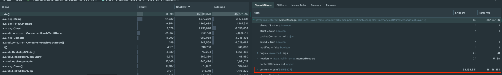

해당 코드 내부를 보면 InputStream이 SharedInputStream이 아닐 경우 byte[] 형태로 읽어와서 새롭게 저장한다.
- 약 37MB ~ 38MB 정도를 메모리에 저장한 상태

- 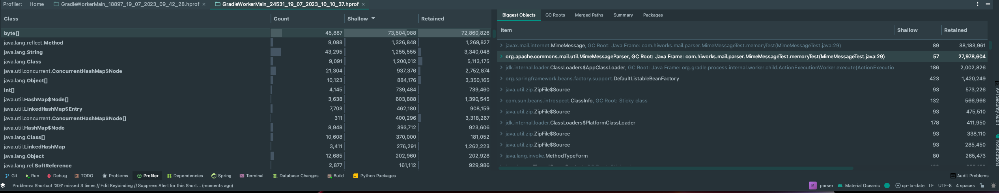

- `MimeMessageParser.parse()`를 사용하면 더 많은 메모리(대략 70MB 정도)를 저장해야 한다.

즉, 첨부파일 10개를 동시에 조회하므로 서버에 700MB 정도의 메모리 급증이 일어나게 된다. (본문 조회까지 하면 x11..)


SharedInputStream은 하위 InputStream을 만드는 기능을 제공하여, 사용 측에서는 InputStream을 여러번 읽는 것처럼 동작한다.
- https://docs.oracle.com/javaee/7/api/javax/mail/internet/SharedInputStream.html

아래는 SharedInputStream의 구현체들이다.
- SharedByteArrayInputStream
- SharedFileInputStream
- WritableSharedFile

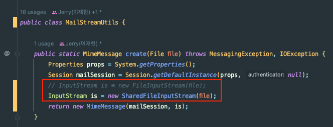

그래서 `MimeMessage`를 생성할 때 사용하던 `FileInputStream`을 `SharedFileInputStream`으로 교체한 결과

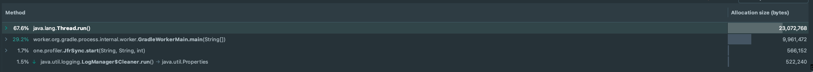

첫 번째 `MimeMessage`를 생성하는 테스트의 경우 Memory 할당이 186MB -> 22MB로 줄어들었고,

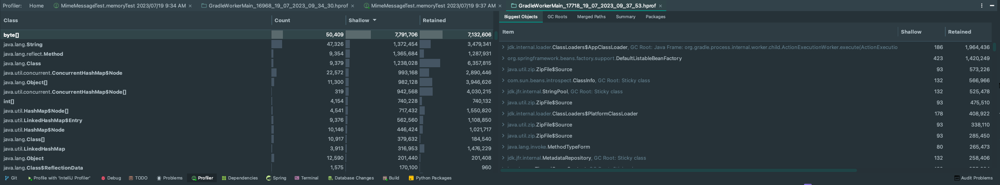

메모리도 거의 사용하지 않았다.

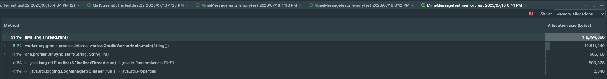

`MimeMessageParser.parse()`에서는 메모리 할당이 **331MB -> 113 MB**으로 줄어들었다.

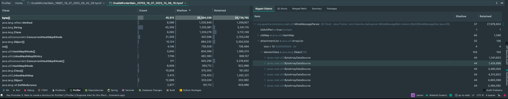

메모리 사용량도 **70MB -> 27MB** 정도로 줄었다.

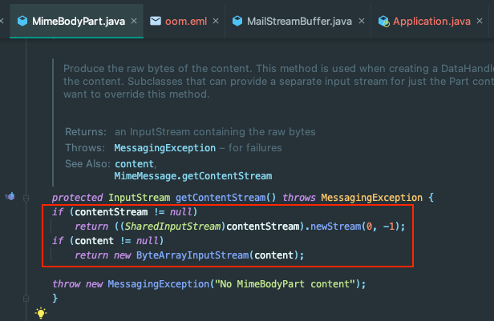

메모리 사용량을 더 줄이고 싶었지만, `base64`로 인코딩된 첨부파일에 대해서는 byte[]를 저장해야 했다.
1. `MimePartDataSource` 에서 `encoding`여부가 true라면 DecoderStream을 반환한다. (`BASE64DecoderStream`, `QPDecoderStream`, `UUDecoderStream`)
2. `Base64DecoderStream, ...`은 `SharedInputStream`을 상속하지 않으므로 `is InstanceOf SharedInputStream`에서 false 반환
3. `content`(byte[]) 저장


'조금 더 튜닝이 필요하진 않을까..?' 고민되지만, 지속적으로 계속 시도해왔던 부분이고,
사실 방금 테스트한 부분 모두 라이브러리(JavaMailAPI, Apache Commons Mail)를 활용한 부분이고, 내부 구현은 전혀 없다.

eml 파일에서 메일과 첨부파일을 따로 분리하여 저장하면 좋을 것 같다고 피드백을 드렸었는데, 고칠 부분이 너무 많고 마이그레이션도 어려워서 현실적으로 어렵다고 한다 ㅠ

그래서 우선 해당 부분까지만 해도 개선은 충분히 있으니 적용해보기로 했다.

## 테스트 실패..

모듈의 테스트 코드는 All Pass였다. (파싱은 잘된다!)

`SharedFileInputStream`으로 바꾼 모듈을 사용처(Api Server)에서 의존을 받아서 테스트 코드를 돌려봤다.


결과 일부 테스트가 깨졌고, 다시 돌리니까 또 성공했고 재현이 안되어서 `@RepeatedTest`를 돌려보니 간헐적으로 테스트가 실패하는 것을 확인할 수 있었다.


에러 메시지는 `Stream Closed`라고 한다..

## RandomAccessFile

다시 모듈로 와서 새로운 테스트 케이스를 작성했다.

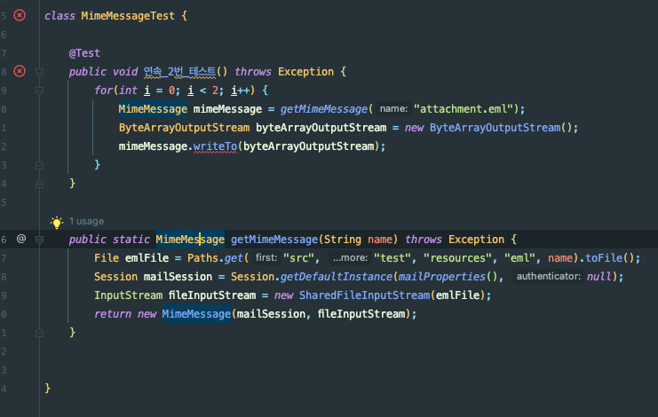

두번 연속 동일한 파일에 대해 `mimeMessage.writeTo()`를 호출하면 테스트가 깨진다. for문을 제거해도 깨지고, 동기로 해도, 비동기로 해도 깨진다.

가끔 테스트가 성공할 때도 있으며, Stack Trace도 매번 다르다.

**가장 신기한 것은** 아래 코드는 실패하는데,

```java
@Test
public void 연속_2번_테스트() throws Exception {
   for(int i = 0; i < 2; i++) {
       File emlFile = Paths.get("src", "test", "resources", "eml", "oom.eml").toFile();
       Session mailSession = Session.getDefaultInstance(mailProperties(), null);
    
       MimeMessage mimeMessage = new MimeMessage(mailSession, new SharedFileInputStream(emlFile));
       
       ByteArrayOutputStream byteArrayOutputStream = new ByteArrayOutputStream();
       mimeMessage.writeTo(byteArrayOutputStream);
   }
}
```

아래 코드는 성공한다는 것이다.

```java
@Test
public void 연속_2번_테스트() throws Exception {
    for(int i = 0; i < 2; i++) {
        File emlFile = Paths.get("src", "test", "resources", "eml", "oom.eml").toFile();
        Session mailSession = Session.getDefaultInstance(mailProperties(), null);
        
        InputStream is = new SharedFileInputStream(emlFile);
        MimeMessage mimeMessage = new MimeMessage(mailSession, is);
        
        ByteArrayOutputStream byteArrayOutputStream = new ByteArrayOutputStream();
        mimeMessage.writeTo(byteArrayOutputStream);
    }
}
```

각 테스트를 디버깅해본 결과 SharedFileInputStream 인스턴스의 생명주기가 다르다는 것을 알 수 있었다. MimeMessage는 자식 SharedInputStream에 대한 참조는 가지고 있지만, 부모 SharedInputStream에 대한 참조는 가지고 있지 않았다.

즉, 내가 생각한 이유는 아래와 같았다.
- 첫 번째 코드: MimeMessage 인스턴스 생성이 완료되면 SharedFileInputStream의 `finalize()` 호출
  - mimeMessage의 인스턴스 필드에서 사용하는 InputStream에서는 인자로 전달된 SharedFileInputStream의 **자식 Stream**을 생성해서 주입한다.
- 두 번째 코드: 블록이 종료될 때 SharedFileInputStream의 `finalize()` 호출

그런데 그렇게 생각하기엔 아직 풀리지 않은 미스테리가 있었다.
- 첫 번째 코드에서 왜 두 번째로 생성할 때 예외가 터지는가..?
- 첫 번째로 생성할 떄도 `write()`시점에 부모 SharedInputStream이 닫혀서 예외가 터져야 하는 것이 아닌가..?

그래서 가설을 하나 세웠다.

## GC의 finalize() 실행은 보장되지 않는다!

즉, `finalize()`가 생명주기가 끝났다고 해서 반드시 실행되지는 않는다. 언제 실행될 지도 보장되지 않는다.

이 부분이 원인임을 증명하기 위해 아래의 테스트 코드를 짰다.

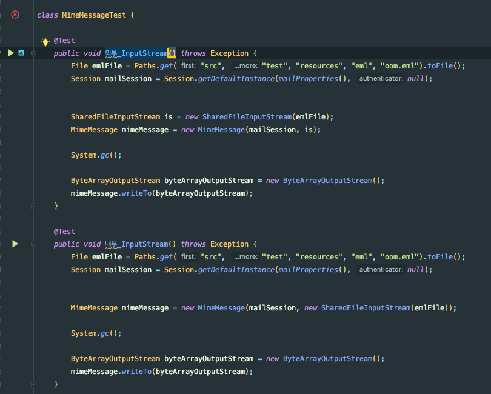

`System.gc()`를 통해 명시적으로 GC를 수행해줬으니까 생명 주기가 다른 **첫 번째 테스트는 성공해야 하고**, **두 번째 테스트에서는 예외가 발생해야 한다.**

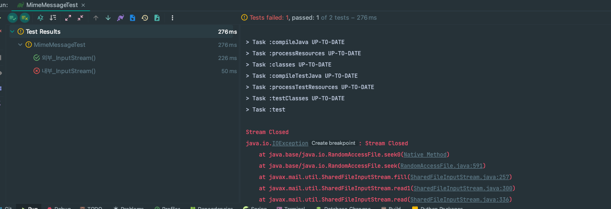

크.. 예상했던 대로 두 번째 테스트에서만 테스트가 깨지고 있다.. 감격 😭😭

## 상속으로 해결

이제 해결 방법을 고민해야 한다. 떠오르는 방법은 아래의 방법이 있었다.

- `MimeMessage`를 상속해서 `finalize()` 재정의
- `MimeMessage`를 상속해서 필드로 `rawInputStream`을 가지기
- `SharedFileInputStream`을 상속해서 필드로 `parentInputStream`을 가지기
- `InputStream`을 따로 Map 같은 곳에 보관하기
- ...

해당 부분은 팀원 분들과 상의를 해서 `MimeMessage`를 상속하고 `rawInputStream`에 대한 레퍼런스를 가지고 있도록 결정을 했다.

결과적으로 구현한 코드는 아래와 같다.

```java
public class SharedMimeMessage extends MimeMessage {

    private InputStream rawInputStream;
    
    public HiworksMimeMessage(Session session) {
        super(session);
    }

    public HiworksMimeMessage(Session session, InputStream is) throws MessagingException {
        super(session, is);
        if(is instanceof SharedInputStream) {
            rawInputStream = is;
        }
    }

    public HiworksMimeMessage(MimeMessage source) throws MessagingException {
        super(source);
    }

    protected HiworksMimeMessage(Folder folder, int msgnum) {
        super(folder, msgnum);
    }

    protected HiworksMimeMessage(Folder folder, InputStream is, int msgnum) throws MessagingException {
        super(folder, is, msgnum);
        if(is instanceof SharedInputStream) {
            rawInputStream = is;
        }
    }

    protected HiworksMimeMessage(Folder folder, InternetHeaders headers, byte[] content, int msgnum) throws MessagingException {
        super(folder, headers, content, msgnum);
    }
}
```

그 결과

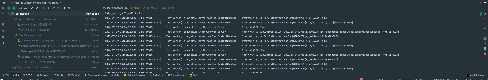

모든 테스트에 성공했다! 몇 번을 돌려도 성공한다.

후.. 이제 실서버에 적용하고 후기를 추가해야겠다. 👍👍

## 참고
- https://aroundck.tistory.com/4551
- https://hbase.tistory.com/287
