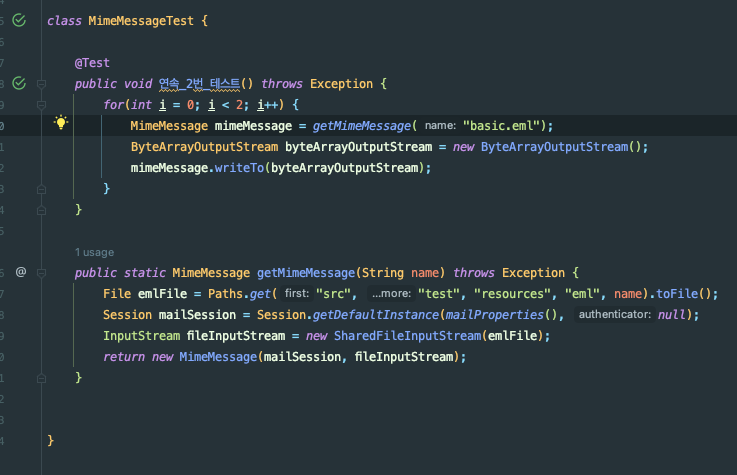

## 이슈


어느날 메일의 첨부파일을 읽어오는 end-point에서 OOM이 터졌다.

오잉..? 아직까지 일부 사용자(신 모바일 애플리케이션 사용자)에게만 운영중인 서버라서 OOM이 터지는 것은 뭔가가 잘못되었다는 것을 의미한다.


Rancher를 확인한 결과 실제로 메모리가 들쑥날쑥했고, OOM으로 인해 파드가 여러번 재실행되었다.

## 이해

### 본문 내용

해당 본문을 확인해본 결과 아래와 같았다.
- 원문 크기: 38MB
- Part (첨부파일): 총 10개 - 하나 당 3~4MB 정도

### 첨부파일 조회 Flow


해당 원문과 Flow를 그려보니 바로 떠오르는 원인을 알 수 있었다.

조금 더 넓은 범위의 Flow를 그려보자.


즉, HTML 원문 조회 과정에서 첨부파일에 대한 조회가 많이 발생했고, 이로 인해서 서버가 터졌다.

여기서 정상적인 경우라면 서버가 터질 수가 없는 상황이었다. (사용자가 그렇게 많지 않음)

그래서 직접 Client로 테스트를 해보니 해당 38MB 짜리 원문을 조회하는 데 Memory 사용량이 **312MB** 정도 급증하고 있었다.

## Memory 급증

Memory 급증 원인을 찾기 위해 `MimeMessage`를 생성하는 테스트 코드를 짜고 profiler를 돌려봤다.


오잉.. 그냥 `MimeMessage`만 생성했는데 **186MB**를 사용하고 있었다. 뭐지..?

그래서 사용중인 라이브러리 (apache-commons-mail)의 `MimeMessageParser.parse()`도 테스트해봤다.


그 결과 **301MB** 정도의 메모리를 사용하고 있었다.

사용자가 해당 메일 1개를 조회할 때, 첨부파일 조회 end-point를 10번 호출하기 때문에 훨씬 더 많은 메모리 할당이 일어났고, 서버가 죽었다.

## SharedInputStream

첫 번째 테스트의 Call Tree 확인한 결과는 아래와 같다.


결과 `MimeMessage`의 생성자가 호출하는 parse() 메서드에서 메모리를 많이 할당 하고 있었다.


해당 코드 내부를 보면 InputStream이 SharedInputStream이 아닐 경우 byte[] 형태로 읽어와서 새롭게 저장한다.

SharedInputStream은 하위 InputStream을 만드는 기능을 제공하여, 사용 측에서는 InputStream을 여러번 읽는 것처럼 동작한다.
- https://docs.oracle.com/javaee/7/api/javax/mail/internet/SharedInputStream.html

아래는 SharedInputStream의 구현체들이다.
- SharedByteArrayInputStream
- SharedFileInputStream
- WritableSharedFile


그래서 `MimeMessage`를 생성할 때 사용하던 `FileInputStream`을 `SharedFileInputStream`으로 교체한 결과


첫 번째 `MimeMessage`를 생성하는 테스트의 경우 Memory 할당이 186MB -> 22MB로 줄어들었고,


`MimeMessageParser.parse()`에서는 메모리 할당이 **331MB -> 113 MB**으로 줄어들었다.

'해당 부분 이상으로도 튜닝이 필요하진 않을까..?' 고민되지만, 지속적으로 계속 시도해왔던 부분이고,
사실 방금 테스트한 부분 모두 라이브러리(JavaMailAPI, Apache Commons Mail)를 활용한 부분이고, 내부 구현은 전혀 없다.

- 메일 조회 및 첨부파일 조회가 모두 원문(eml) 파일을 조회하는 구조이다.
- eml 파일에서 메일과 첨부파일을 따로 분리하여 저장하면 좋을 것 같다고 피드백을 드렸었는데, 고칠 부분이 너무 많고 마이그레이션도 어려워서 현실적으로 어렵다고 한다 ㅠ

그래서 우선 해당 부분을 반영해서 테스트를 돌려보자!

## 테스트 실패..

모듈의 테스트 코드는 All Pass였다. (파싱은 잘된다!)

`SharedFileInputStream`으로 바꾼 모듈을 사용처(Api Server)에서 의존을 받아서 테스트 코드를 돌려봤다.


결과 일부 테스트가 깨졌고, 다시 돌리니까 또 성공했고 재현이 안되어서 `@RepeatedTest`를 돌려보니 간헐적으로 테스트가 실패하는 것을 확인할 수 있었다.


에러 메시지는 `Stream Closed`라고 한다..

## RandomAccessFile

다시 모듈로 와서 새로운 테스트 케이스를 작성했다.


두번 연속 동일한 파일에 대해 `mimeMessage.writeTo()`를 호출하면 테스트가 깨진다.

for문을 제거해도 깨지고, 동기로 해도, 비동기로 해도 깨진다.



메일 원문에 첨부파일이 없으면 테스트가 성공한다.

다시 에러 내용을 살펴보자.

```java
Stream Closed
java.io.IOException: Stream Closed
	at java.base/java.io.RandomAccessFile.seek0(Native Method)
	at java.base/java.io.RandomAccessFile.seek(RandomAccessFile.java:591)
	at javax.mail.util.SharedFileInputStream.fill(SharedFileInputStream.java:257)
	at javax.mail.util.SharedFileInputStream.read1(SharedFileInputStream.java:300)
	at javax.mail.util.SharedFileInputStream.read(SharedFileInputStream.java:339)
```

`SharedFileInputStream.read()` -> `SharedFileInputStream.fill()` -> `RandomAccessFile.seek()` 메서드순으로 진행하다가 **seek()** 메서드가 실패했다고 한다.


