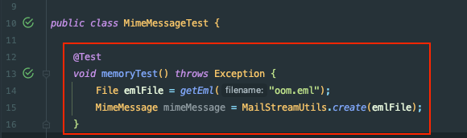

## 이슈

어느날 메일의 첨부파일을 읽어오는 end-point에서 OOM이 터졌다.

오잉..? 아직까지 일부 사용자(신 모바일 애플리케이션 사용자)에게만 운영중인 서버라서 OOM이 터지는 것은 뭔가가 잘못되었다는 것을 의미한다.

Rancher를 확인한 결과 실제로 메모리가 들쑥날쑥했고, OOM으로 인해 파드가 여러번 재실행되었다.

## 이해

### 본문 내용

해당 본문을 확인해본 결과 아래와 같았다.
- 원문 크기: 38MB
- Part (첨부파일): 총 10개 - 하나 당 3~4MB 정도

### 첨부파일 조회 Flow

해당 원문과 Flow를 그려보니 바로 떠오르는 원인을 알 수 있었다.

조금 더 넓은 범위의 Flow를 그려보자.

즉, HTML 원문 조회 과정에서 첨부파일에 대한 조회가 많이 발생했고, 이로 인해서 서버가 터졌다.

여기서 정상적인 경우라면 서버가 터질 수가 없는 상황이었다. (사용자가 그렇게 많지 않음)

그래서 직접 Client로 테스트를 해보니 해당 38MB 짜리 원문을 조회하는 데 Memory 사용량이 **312MB** 정도 급증하고 있었다.

## Memory 급증

Memory 급증 원인을 찾기 위해 MimeMessage를 생성하는 테스트 코드를 짜고 profiler를 돌려봤다.

오잉.. 그냥 MimeMessage만 생성했는데 **186MB**를 사용하고 있었다. 뭐지..?

그래서 사용중인 라이브러리 (apache-commons-mail)의 `MimeMessageParser.parse()`도 테스트해봤다.

그 결과 **301MB** 정도의 메모리를 사용하고 있었다.

사용자가 해당 메일 1개를 조회할 때, 첨부파일 조회 end-point를 10번 호출하기 때문에 훨씬 더 많은 메모리 할당이 일어났고, 서버가 죽었다.

## MimeMessage

첫 번째 테스트의 Call Tree 확인한 결과는 아래와 같다.

결과 MimeMessage의 생성자가 호출하는 parse() 메서드에서 메모리를 많이 할당 하고 있었다.

해당 코드 내부를 보면 InputStream이 SharedInputStream이 아닐 경우 byte[] 형태로 읽어와서 새롭게 저장한다.

