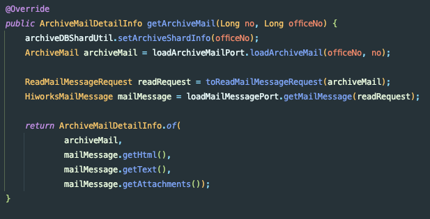
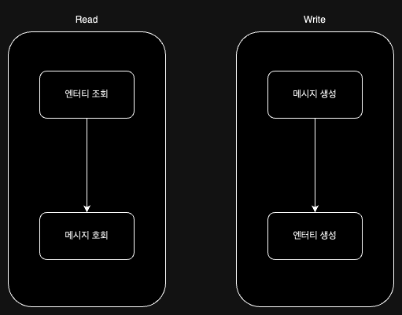
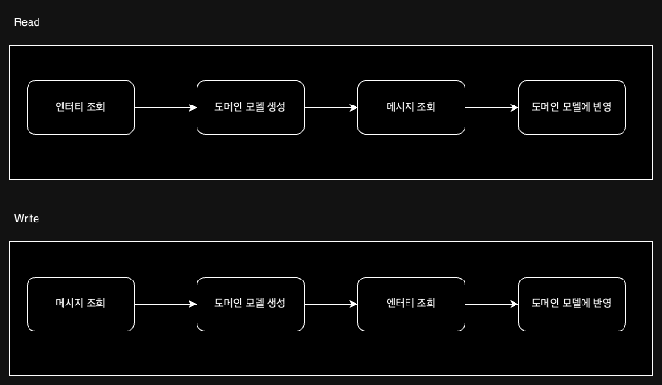
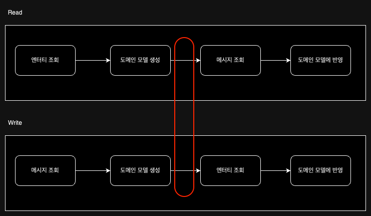
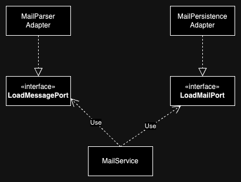
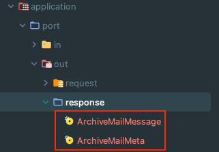

## 기존 로직

## 특정 모듈 의존

`Parser`를 사용하는 구현은 **Port**와 **Adapter**를 사용해서 충분히 분리가 되었습니다.

하지만 `HiworksMailMessage`의 경우 타 모듈에서 가져온 `POJO` 객체입니다.

**POJO**이긴 하지만, 여전히 외부 모듈의 변경이 도메인으로 전파되어 도메인이 불안정한 코드가 됩니다.

## 도메인 모델을 만들자

그래서 `HiworksMailMessage`도 도메인 모델로의 변환이 필요합니다.
- `HiworksMailMessage`는 **외부**에 해당하는 **Adapter**까지만 사용

사실.. 뭐 어려운 점은 없는 데 고민이 한 가지 있었습니다.
- 도메인 모델을 현재와 같이 분리할 지
- 도메인 모델을 함께 사용할 지

### 기존 코드 - 읽기, 쓰기

기존 로직은 요약하면 아래와 같습니다.

**[Read]**
- 엔터티를 먼저 조회한 후
- 계정 정보, 파일 위치 정보로 메시지를 조회한다.
- Response 객체로 조합하여 반환한다.

**[Write]**
- 메시지를 먼저 생성한 후
- 계정 정보, Content를 제외한 메시지 정보를 조합해서 엔터티를 생성한다.
- Response 객체로 조합하여 반환한다.

읽기/쓰기 모두 엔터티, 메시지가 둘다 필요하다.
- 검색을 할 때는 메시지를 사용하지 않는다.
- 단, 이때는 MailSummary 모델을 사용한다.

### 생성 후 반영..?

가장 처음 생각난 방식은 아래와 같이 도메인 모델을 먼저 생성한 후에, 나중에 코드를 반영해주는 방식입니다.

이 경우 Message를 Lazy하게 반영할 수 있다는 장점이 있습니다.
즉, 도메인 모델을 하나만 사용하면 조회 모델, 생성 모델, Summary 모델 모두 처리할 수 있었습니다.

그렇지만 저는 도메인 모델이 특정 시점에 불안정한 채로 있는 게 싫었습니다.

해당 시점에 도메인 모델이 계정 정보나 메시지 정보 등이 없는 채로 존재합니다.

즉, 스스로 검증하지 못하게 되버린 것이죠..!

### 한 번에 생성

그래서 각 Port에서 조회한 **포트의 Model**을 조합해서 Service에서 도메인 모델을 생성하자!

다이어그램은 아래와 같다.

기존에는 `LoadMessagePort`가 외부 모듈의 객체를 반환했고, `LoadMailPort`에서 도메인을 만들었다.

수정 후에는 아래와 같이 **Port가 반환할 모델**을 생성했다.

