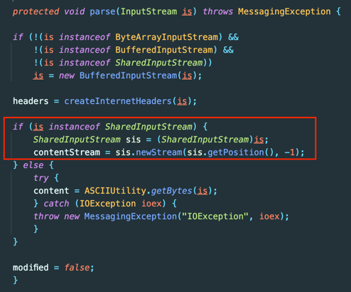
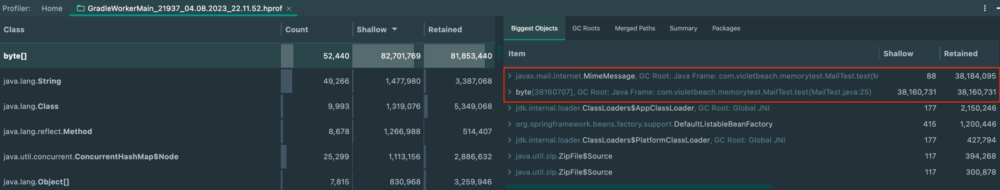
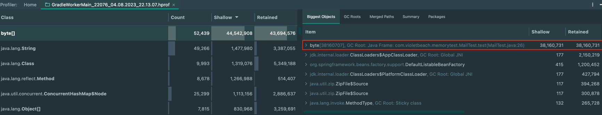

## SharedInputStream

`Java Mail API` provides a mechanism to save memory usage.



If you use `SharedByteInputStream`, you can use it as a **Call by Reference** without assigning a new byte[] of the factor.

### Before

Memory snapshot for the test below.

```java
@Test
void memoryTest() throws Exception {
    FileInputStream fileInputStream = new FileInputStream("/test/oom.eml");
    byte[] bytes = fileInputStream.readAllBytes();
    Session session = Session.getInstance(System.getProperties());
    MimeMessage mimeMessage = new MimeMessage(session, new ByteArrayInputStream(bytes));
}
```



### After

Memory snapshot for the test below.

```java
@Test
void memoryTest() throws Exception {
    FileInputStream fileInputStream = new FileInputStream("/test/oom.eml");
    byte[] bytes = fileInputStream.readAllBytes();
    Session session = Session.getInstance(System.getProperties());
    MimeMessage mimeMessage = new MimeMessage(session, new SharedByteArrayInputStream(bytes));
}
```



Thanks.