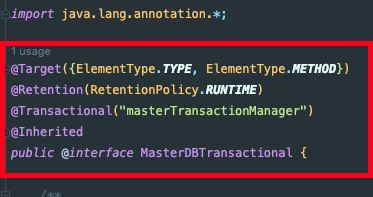

### 다중 데이터 소스

다중 데이터 소스 환경에서 Transaction과 Querydsl을 사용하는 방법에 대해 알아보자.

먼저 **데이터소스**부터 보자.

```java
@Configuration
@EnableJpaRepositories(
    basePackageClasses = { OrderRepository.class },
    entityManagerFactoryRef = "masterEntityManagerFactory",
    transactionManagerRef = "masterTransactionManager"
)
@EnableTransactionManagement
public class MasterDatasourceConfiguration {

    @Autowired
    private Environment env;

    @Bean
    public LocalContainerEntityManagerFactoryBean masterEntityManagerFactory(
      final JpaProperties customerJpaProperties ) {
        EntityManagerFactoryBuilder builder =
                createEntityManagerFactoryBuilder(customerJpaProperties);

        return builder.dataSource(masterDataSource()).packages(Order.class)
                .persistenceUnit("masterEntityManager").build();
    }

    @Bean
    public PlatformTransactionManager masterTransactionManager(
      @Qualifier("masterEntityManagerFactory") final EntityManagerFactory factory) {
        return new JpaTransactionManager(factory);
    }

    private EntityManagerFactoryBuilder createEntityManagerFactoryBuilder(
      JpaProperties customerJpaProperties) {
        JpaVendorAdapter jpaVendorAdapter = new HibernateJpaVendorAdapter();
        return new EntityManagerFactoryBuilder(
            jpaVendorAdapter, customerJpaProperties.getProperties(), null);
    }

    @Bean
    public DataSource masterDataSource() {
        return DataSourceBuilder
                .create()
                .url(env.getProperty("app.db.master.url"))
                .username(env.getProperty("app.db.master.username"))
                .password(env.getProperty("app.db.master.password"))
                .driverClassName("com.mysql.cj.jdbc.Driver")
                .build();
    }

}
```

트랜잭션을 걸거나 엔터티매니저를 사용할 때 해당 데이터소스에 있는 빈을 꺼내서 사용하게 된다. 데이터 소스가 하나라면 걱정할 필요가 없다.

하지만 다중 데이터소스에서는 등록한 빈의 이름도 중요하다. 아래는 빈 이름의 예시이다.

**MasterDataSource**

- entityManagerFactory: masterEntityManagerFactory
- entityManager: masterEntityManager
- transactionManager: masterTransactionManager

**SlaveDataSource**

- entityManagerFactory: slaveEntityManagerFactory
- entityManager: slaveEntityManager
- transactionManager: slaveTransactionManager

### 트랜잭션 사용 방법

**\[TransactionManager 명시\]**

가장 간단한 방법은 해당 DataSource의 TransactionManager를 명시하는 방법이다.

MasterDataSource의 데이터베이스에 트랜잭션을 사용하려면 아래와 같은 애노테이션을 명시하면 된다.

```java
@Transactional("masterTransactionManager");
```

SlaveDataSource의 데이터베이스에 트랜잭션을 사용하려면 아래와 같이 명시한다.

```java
@Transactional("slaveTransactionManager");
```

문자열을 하드코딩하면 실수를 유발하기 쉬우니까 상수로 각 데이터소스의 TransactionManager를 등록해서 사용할 수 있다.

```java
private static final String masterTransactionManager = "masterTransactionManager";
```

그러면 상수를 사용해서 Transaction Manager Bean을 명시할 수 있다.

```java
@Transactional(masterTransactionManager)
```

Transactional 애노테이션을 새롭게 정의하는 방법도 있다.



### QueryDSL 사용 방법

QueryDSL을 사용할 때는 데이터소스에서 등록한 persistenceUnit 즉 EntityManager 빈의 이름이 중요하다. 먼저 두개의 JpaQueryFactory를 빈으로 등록한다.

```java
@Configuration
public class QueryDslConfig {

    @PersistenceContext(unitName = "masterEntityManager")
    private EntityManager masterEntityManager;

    @PersistenceContext(unitName = "slaveEntityManager")
    private EntityManager slaveEntityManager;

    @Bean
    public JPAQueryFactory masterJpaQueryFactory() {
        return new JPAQueryFactory(masterEntityManager);
    }

    @Bean
    public JPAQueryFactory slaveJpaQueryFactory() {
        return new JPAQueryFactory(slaveEntityManager);
    }
}
```

해당 JPAQueryFactory를 주입받아서 사용하면 된다.

```java
@Repository
public class MasterExRepository {

    private final JPAQueryFactory queryFactory; 

    public MasterExRepository(
        @Qualifier("masterJpaQueryFactory") JPAQueryFactory queryFactory) {
        this.queryFactory = queryFactory;
    }
}
```

그런데 Repository에서 EntityManager도 사용하게 되는 경우가 많다. 그때는 위에 QueryDslConfig에서 EntityManager만 빈으로 등록하고 아래와 같이 사용할 수 있다.

```java
@Repository
public class MasterExRepository {

    private final EntityManager em;
    private final JPAQueryFactory queryFactory; 

    public MasterExRepository(@Qualifier("masterEntityManager") EntityManager em) {
        this.em = em;
        this.jpaQueryFactory = new JPAQueryFactory(em);
    }
}
```

---

### Reference

- [https://supawer0728.github.io/2018/03/22/spring-multi-transaction/](https://supawer0728.github.io/2018/03/22/spring-multi-transaction/)
- [https://abbo.tistory.com/205](https://abbo.tistory.com/205)
