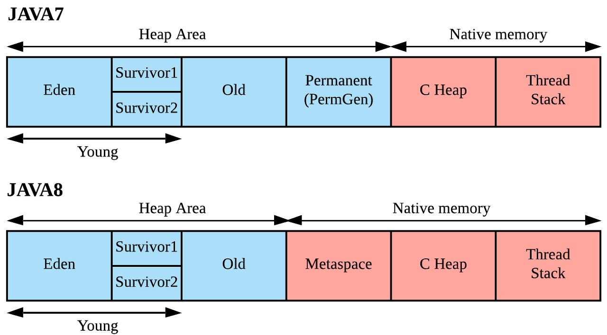

JDK 8부터는 Java Heap에서 PermGen이라는 영역이 제거되었고, Metaspace라는 영역이 Native Memory에 추가되었다.

기존에 Perm 영역 크기로 인한 **java.lang.OutOfMemory**가 뜨는 경우가 많았다.

PermGen이라는 영역이 제거되고 Metaspace 영역이 생기면서 이제는 해당 문제를 보기 어려워졌다. 그 이유를 알아보자.

## Perm

PermGen(이하 Perm) 영역은 상수와 static 변수,  **런타임 중에 읽은 클래스와 메소드의 메타데이터를 저장**한다. PermGen 영역의 크기는 JVM이 사이즈를 지정한다. 앱이 실행되면 **최대 사이즈는 변경되지 않는다.**

동적으로 클래스들이 로드되고 Static 변수나 상수가 Perm영역에 쌓이게 되면서 **OOM**이 자주 발생했다.
- (Static 변수가 JDK 8 이전에는 Heap이 아닌 Perm 영역에 저장되었다.) 

그래서 Perm 영역에서 관리하던 것들을 JVM에서 관리하는 Java Heap이 아닌 **Native Memory**로 옮기게 되었다. 

Static 변수는 Heap 영역으로 옮겨져서 GC의 대상이 되었다.

## Metaspace

Perm영역이 Metaspace로 옮겨졌고, 가장 큰 차이는 **Heap과 Native Memory의 차이**다.

Metaspace에서는 **클래스 로더가 런타임 중에 읽어온 정보**가 저장된다.
- Class 구조
- Method 정보, Exception 정보, 바이트 코드
- Constant Pool
- Annotation

Heap 영역은 JVM에 의해 관리되는 영역이며, Native Memory는 **OS에 의해 관리**되는 영역이다.

Native Memory 영역에 있는 Metaspace는 OS가 자동으로 크기를 조절하기 때문에 개발자가 영역 확보를 의식할 필요가 없게 되었다.
- 즉, 기존의 OOM 문제는 발생하기 어렵다.

그렇지만 OS의 Native Memory를 사용하므로 동일한 서버에 다른 프로세스에 영향을 줄 수 있다.
- k8s를 사용하고 있다면 동일 컨테이너의 메모리를 최대한 빌려와서 다른 Pod 전체에 영향을 줄 수 있다.

이 때는 Metaspace의 크기를 제한하는 `-XX:MetaspaceSize, -XX:MaxMetaspaceSize` 옵션을 제공한다.

### Reference

-   [https://1-7171771.tistory.com/140](https://1-7171771.tistory.com/140)
-   [https://johngrib.github.io/wiki/java8-why-permgen-removed/](https://johngrib.github.io/wiki/java8-why-permgen-removed/)