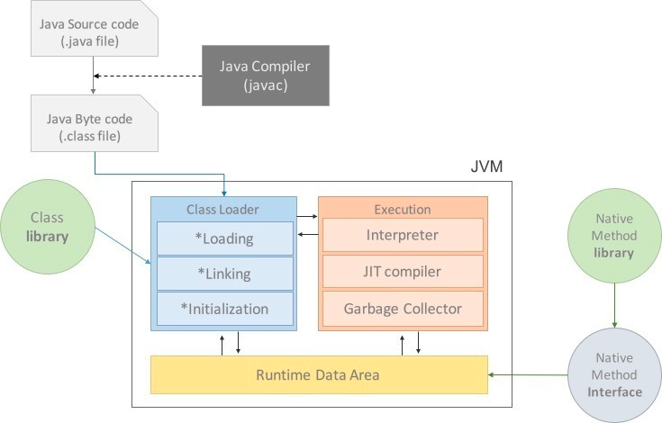
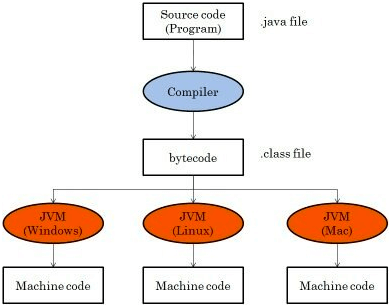
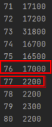

### JVM이란

JVM(Java Virtual Machine)은 자바 프로그램의 실행하기 위해 물리적 머신과 유사하게 소프트웨어로 구현한 것이다.

JVM 역할은 자바 애플리케이션을 클래스 로더를 통해 읽어 들여 자바 API와 함께 실행하는 것이다. JVM은 JAVA와  OS사이에서 중개자 역할을 수행하여 JAVA가 OS에 구애받지 않고 재사용을 가능하게 해준다.

그리고 메모리관리, Garbage collection을 수행한다.

추가적으로 JVM은 스택 기반의 VM(가상머신)이다. Lua VM, Dalvik VM 등은 레지스터 기반으로 동작하는데 비해 JVM은 스택 기반으로 동작한다.

## 스택 기반 VM

스택 기반 VM은 다음과 같은 장점을 가진다.

-   코드 작성과 컴파일이 쉽다.
    -   속도는 레지스터 기반 VM보다 느리지만 명령어의 크기가 작다.
-   대다수의 가상머신이 스택 기반 VM을 채용한다.
-   하드웨어(레지스터, CPU 등)에 대해 직접 다루지 않아서 다양한 하드웨어에서 사용할 수 있다.
-   피연산자가 스택 포인터에 의해 암시적으로 처리된다.

### 왜 자바 가상머신을 알아야 하는가?

한정된 메모리를 효율적으로 사용하여 최고의 성능을 내기 위해서이다. 메모리 효율성을 위해 메모리 구조를 알아야 하기 때문이다.

동일한 기능의 프로그램이더라도 메모리 관리에 따라 성능이 좌우된다. 메모리 관리가 되지 않은 경우 속도저하 현상이나 튕김 현상 등이 일어날 수 있다. 그래서, 알아두면 좋다를 넘어서 알아야 하는 것이다.


### JVM 구조



**JVM은 크게 아래 4가지로 구성된다.**

1.  자바 인터프리터(interpreter)
2.  클래스 로더(class loader)
3.  JIT 컴파일러(Just-In Time compiler)
4.  가비지 컬렉터(garbage collector)

### 자바 프로그램 실행과정

1. 프로그램이 실행되면 JVM은 OS로부터 이 프로그램이 필요로 하는 메모리를 할당받는다. JVM은 이 메모리를 용도에 따라 여러 영역으로 나누어 관리한다.
2. 자바 컴파일러(javac)가 자바 소스코드(.java)를 읽어들여 자바 바이트코드(.class)로 변환시킨다.
3. Class Loader를 통해 class파일들을 JVM으로 로딩한다.
4. 로딩된 class파일들은 Execution engine을 통해 해석된다.
5. 해석된 바이트코드는 Runtime Data Areas 에 배치되어 실질적인 수행이 이루어지게 된다. 이러한 실행과정 속에서 JVM은 필요에 따라 Thread Synchronization과 GC같은 관리작업을 수행한다.


즉, 자바 컴파일러가 `.java`파일을 자바 바이트코드(`.class`)로 변환시켜준 이후 **JVM** 내부로 들어오게 된다.

### 자바 바이트 코드(Java bytecode)

자바 바이트 코드(Java bytecode)는 자바 가상 머신이 이해할 수 있는 언어로 변환된 자바 소스 코드이다.

자바 컴파일러에 의해 변환되는 코드의 명령어 크기가 1byte라서 바이트 코드라고 불리고 있다.

확장자는 .class이며 JVM만 설치되어 있으면 어떤 운영체제라도 각 운영체제에 맞는 실행 파일로 변환하여 실행할 수 있다.



단, JVM은 운영체제에 종속적이므로 각 운영체제에 맞는 JVM을 설치해야 한다.

### 자바 인터프리터(interpreter)

자바 컴파일러에 의해 변환된 바이트 코드를 읽고 한 줄씩 기계어로 해석하는 역할을 하는 것이 자바 인터프리터(interpreter)이다.

원래 JVM에서는 인터프리터 방식만 사용하다가 성능 이슈가 발생해서 JIT 컴파일러를 추가해서 성능을 끌어올렸다. 현재는 컴파일과 인터프리터 방식을 병행해서 사용한다.

### 클래스 로더(class loader)

자바는 동적으로 클래스를 읽어오기 때문에 프로그램이 실행중인 런타임에서 JVM과 연결된다.

한 번에 메모리에 모든 클래스를 로드하는 것이 아닌, 필요한 순간에 해당 클래스(.class) 파일을 찾아 메모리에 로딩해주는 역할을 하는 것이 바로 클래스 로더(class loader) 이다.

### JIT 컴파일러(Just-In Time compiler)

인터프리터 방식의 단점을 보완하기 위해 도입된 JIT 컴파일러이다. JIT 컴파일러는 실행 시점에 인터프리터 방식으로 기계어 코드를 생성할 때 자주 사용되는 메소드의 경우 컴파일하고 기계어를 캐싱한다. 그리고 해당 메소드가 여러 번 호출할 때 매번 해석하는 것을 방지한다.

### 컴파일 임계치
컴파일 임계치(Compile Threshold)  
- JIT 컴파일러가 메소드가 자주 사용되는 지 체크하는 방식으로 컴파일 임계치를 사용합니다.
- 컴파일 임계치가 초과하면 JIT 컴파일이 트리거되어서 기계어를 캐싱한다.
- 컴파일 임계치는 아래 두 가지의 합계를 말한다.
    - method entry counter (JVM 내에 있는 메서드가 호출된 횟수)
    - back-edge loop counter (메서드가 종료된 횟수)

정리하면 프로그램이 실행 중인 런타임 중에 여러번 호출되는 메소드들을 미리 만들어 둔 해석본을 이용해서 컴파일하는 역할을 하는 것이 JIT 컴파일러이다.

아래 예시를 보자.

```java
for (int i = 0; i < 500; ++i) {
    long startTime = System.nanoTime();

    for (int j = 0; j < 1000; ++j) {
        new Object();
    }

    long endTime = System.nanoTime();
    System.out.printf("%d\t%d\n", i, endTime - startTime);
}
```

아래 결과를 보면 특정 시점부터 실행시간 간격이 급격히 줄어드는 것을 볼 수 있다.



컴파일 임계치를 넘어서 JIT 컴파일러로 인해 캐싱된 기계어를 불러왔기 때문에 실행 시간이 짧아진 것이다.

### 가비지 컬렉터(garbage collector)

가비지 컬렉터(garbage collector)는 메모리 관리를 자동으로 해줘서 개발자가 비즈니스 로직에 더 집중할 수 있게 도와준다.

## Reference

-   [http://www.tcpschool.com/java/java\_intro\_programming](http://www.tcpschool.com/java/java_intro_programming)
-   [https://asfirstalways.tistory.com/158](https://asfirstalways.tistory.com/158)
-   [https://beststar-1.tistory.com/3](https://beststar-1.tistory.com/3)
-   [https://velog.io/@jaeyunn\_15/OS-Compiler-vs-Interpreter](https://velog.io/@jaeyunn_15/OS-Compiler-vs-Interpreter)