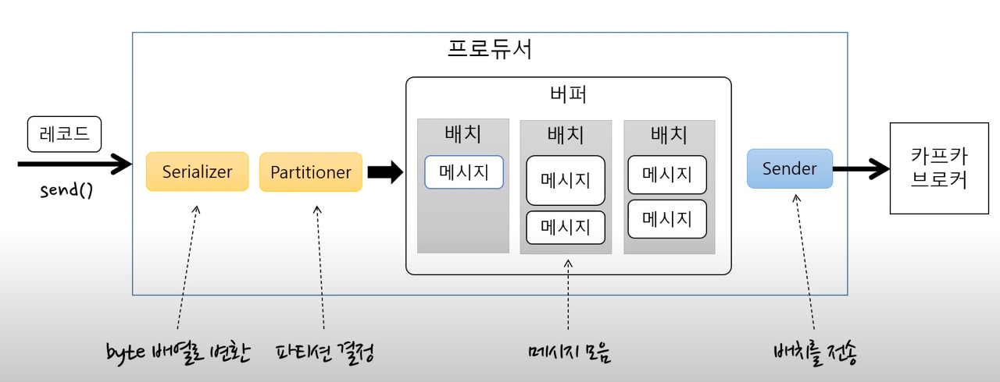
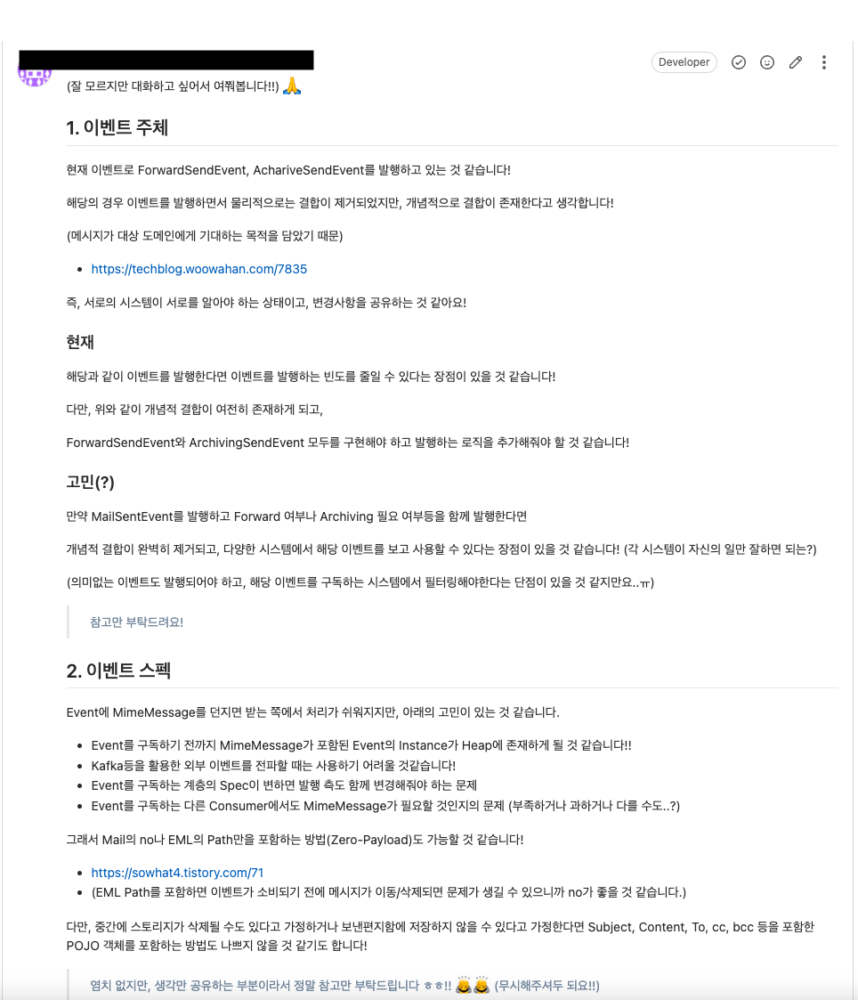
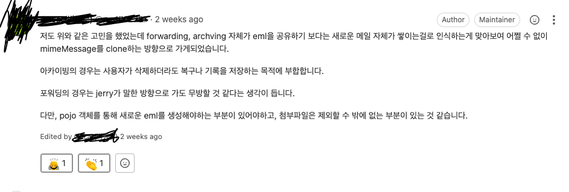

아래는 이벤트 처리를 위해 Kafka Producer, Consumer를 설계하고 적용한 내용을 정리한 것이다.

Kafka 자체에 대한 내용은 이전 포스팅을 참고하자.

- 참고: [https://jaehoney.tistory.com/197](https://jaehoney.tistory.com/197)

### 비즈니스 설명

필요한 비즈니스는 아래와 같이 표현할 수 있다.


메일 API가 사용자에게 요청을 받아서 발송 서버로 요청을 한다.

발송 서버는 메일을 발송한 후 비동기 이벤트를 통해 Kafka로 메시지를 전파한다.

Consumer는 해당 메일 정보를 받아서 사용자 설정(Archive 설정)에 따라 메일을 영구히 보관한다.

## Producer 구현

### 1\. 처리량

아래는 Kafka Producer의 구성 요소 및 동작이다.



프로듀서는 Serializer를 사용해서 byte 배열로 변환한 후 배치로 버퍼에 저장을 한다. Sender는 별도 쓰레드로 배치가 찼는지 여부에 상관없이 브로커로 버퍼를 전달한다.

이때 sender와 batch에 대한 설정이 처리량에 영향을 준다.

- batch.size: 배치의 크기. 배치가 다 차면 바로 전송한다. (default: 16KB)
- linger.ms: 전송 대기 시간 (2m)
    - 대기 시간이 없으면 배치를 바로 전송
    - 대기 시간을 주면 그 시간 만큼 배치가 찰 때까지 기다렸다가 전송한다.

해당 설정들은 잘 모르기도 하고 운영 중에 조정할 수 있겠다는 생각에서 우선 default로 유지했다.

### 2\. 이벤트 주체

어떤 메시지를 발행할 것인지에 대한 고민이 필요했다.

사실 기존 프로젝트에서는 팀장님께서 개발하셨던 코드에 의해 이벤트를 발생하고 있었다.

- ForwardSendEvent
- ArchiveSendEvent

해당 이벤트는 Forward Send, Archive Send가 필요하다는 기대 결과를 담은 메시지이다. 작업에 나는 아래의 리뷰를 남겼었다..!



즉, Forward가 필요하다는 메시지가 아니라, 메일이 발송되었다는 메시지를 발송해야 하는 것이 아니냐는 생각이었다!

하지만 발송을 1건할 때마다 이벤트를 1건 발행해버리면 구독자가 그 만큼 많이 필요하고 이벤트를 필터링해야 하는데, 서비스가 그렇게 크지 않고 자원은 한정되어 있었다.

그래서 이벤트는 아쉽지만 메시지 주체로 MailArchivedEvent를 사용하고, 발행하는 측에서 아카이빙 여부를 판단하여 발행하는 쪽으로 설계했다.

- 팀장님께서는 추후에 이벤트를 충분히 사용하게 되면 통합하자고 하셨다!

### 3\. 이벤트 스펙

이벤트 주체 뿐만 아니라 이벤트 스펙에도 고민이 있었다.

리뷰를 남긴 이유는 기존 이벤트 Spec으로 MimeMessage를 사용하는 부분이 확장성이 떨어진다고 생각했기 때문이다. (위 리뷰 참조)

해당 부분에 대해 아래와 같이 리뷰를 받았다!



Archiving Consumer의 경우 **ZeroPayload**가 가장 이상적이라고 생각했지만 해당 부분을 적용할 수 없었다.

- Consumer가 이벤트를 소비하기 전에 메일이 삭제되어선 안된다는 요구사항
- 메일을 저장하지 않고 발송할 수 있음
    - DB에 데이터가 저장되지 않음

그래서 논의 후에 **임시 폴더에 데이터를 카피**한 후 **해당 Path도 이벤트 스펙에 포함**시키기로 했다.

```java
@Getter
public class ExternalArchivedEvent implements Serializable {
    private Long mailNo;
    private String path;

    public ExternalArchivedEvent(Long mailNo, Path path) {
        this.mailNo = mailNo;
        this.path = path.toString();
    }
}
```

결과적으로 `MimeMessage`에 종속적이지 않을 수 있었고, 메모리도 절약할 수 있었고, 컨슈머는 `id`로 필요한 만큼의 정보만 조회할 수 있게 되었다.

### 4\. 실패 처리

대부분 프로젝트의 **Producer에서는 실패 처리**가 작성되지 않았다. Producer도 메시지 발행 중에 실패할 수 있었다.

- 전송 과정에서 실패
    - 전송 타임 아웃
    - 리더 다운에 의한 새 리더 선출 진행 중인 경우
    - 브로커 설정 메시지 크기 한도 초과
- 전송 전에 실패
    - 직렬화 실패
    - 프로듀서 자체 요청 크기 제한 초과
    - 프로듀서 버퍼가 차서 기다린 시간이 최대 대기 시간 초과

**Producer의 전송 결과를 확인**하기 위해서는 두 가지 방법이 있다.

- Future 활용
    - 처리량이 크게 저하된다.
    - 블로킹으로 인해 Batch에 메시지가 쌓일 수 없기 때문
- Callback 활용
    - 처리량 저하 없음

Callback을 사용하면 낭비되는 스레드 없이 Kafka를 발송 완료한 스레드가 Callback을 실행한다. 추가로 블로킹 없이 비동기로 호출해서 처리량 저하가 발생하지 않기 때문에 아래와 같이 Callback을 사용했다.

```java
@Async("ArchiveEventAsyncExecutor")
@TransactionalEventListener(phase = TransactionPhase.AFTER_COMMIT)
public void publishArchivedEvent(MailArchivedEvent event) {
    Path savedPath = archiveMessageRepository.saveFile(event.getUserId(), event.getMessage());

    ExternalArchivedEvent externalArchivedEvent = new ExternalArchivedEvent(event.userId(), savedPath);
    objectKafkaTemplate.send(ARCHIVED_TOPIC, externalArchivedEvent)
            .addCallback(new ListenableFutureCallback<>() {
                    public void onSuccess(SendResult<String, Object> result) {}

                    public void onFailure(Throwable ex) {
                        log.error("Failed to send message to Kafka topic: " + ARCHIVED_TOPIC + ". officeNo: {}, officeUserNo: {}, archived eml: {}.", event.getOfficeNo(), event.getOfficeUserNo(), externalArchivedEvent.getPath(), ex);
                    }
            });
}
```

발송 실패 시에는 로그를 남기고 있다.

- 메인 트랜잭션에서 Log(Event)를 DB에 Insert해주면 문제가 생겼을 때 추적이 쉽고 Batch를 돌려서 후속 처리도 쉽다고 생각했다.
- 자원 부족으로 우선은 Log만 남기도록 협의했다.

#### Ack

Ack 속성으로는 적당히 높은 처리량과 안정성을 위해 1을 사용했다.

- 0 - 서버 응답을 기다리지 않음 (메시지 유실 가능)
- 1 - 파티션의 리더에 저장되면 성공 (기본값)
    - 팔로워에서 복제되지 않은 시점에 리더에 장애 발생 가능
    - 팔로워가 리더로 승격하면서 메시지 유실
- all(-1) - 모든 리플리카에 저장되면 성공
    - min.insync.replicas 에 따라 다를 수 있음
    - ack가 all일 때 저장에 성공으로 처리할 리플리카의 최소 개수

#### 재시도

Kafka Producer는 기본적으로 **재시도**를 수행한다.
- retires 속성 (프로듀서가 에러가 났을 때 재시도할 횟수. default = Integer.MAX\_VALUE)

`retries` 속성을 설정해서 재시도 횟수를 설정하는 것이 좋다고 해서 `retries`를 10으로 설정했었는데, 아래 문서에서는 delivery.timeout.ms를 사용하라고 권장한다.

- [https://www.conduktor.io/kafka/kafka-producer-retries](https://www.conduktor.io/kafka/kafka-producer-retries)

단순히 retries를 10으로 설정했다면, Brocker가 죽어있을 짧은 시간 동안 10번 재시도하고 말 것 같아서 delivery.timeout.ms를 사용하도록 설정했다.

- default를 유지: 2 minute까지 100ms 마다 retry

재시도로 인해 **아래의 문제가 생길 수 있다.**

- 메시지가 **중복으로 전송**될 수 있다. (eg. 브로커 응답이 늦게 온 경우)
    - enable.idempotence로 멱등성 보장 가능항
    - Consumer가 **멱등한 처리**를 하기 때문에 문제가 없었다! 👍

- 재시도가 발생하면서 **메시지의 순서가 바뀔 수 있음**
    - max.inflight.request.per.connection으로 순서 보장 가능
    - 메시지 순서는 개발 중인 로직에서 중요하지 않았다!

## Consumer 설계

#### 1\. Group

토픽 파티션은 컨슈머 그룹 단위로 할당된다.

- 그룹 내 컨슈머 수가 파티션 개수보다 많으면 컨슈머가 아무 작업도 하지 못하게 된다.
- 즉, 파티션의 개수는 컨슈머 그룹의 컨슈머 수보다 작아야 한다.

해당 기능에서는 파티션 수를 6, 그룹 내 컨슈머 수를 2개로 설정하고 필요 시 조정한다.

staging 서버와 master 서버에서 동일한 Kafka Brocker를 사용하기 때문에 환경별로 컨슈머 그룹을 분리하고 staging에서는 로그만 찍도록 처리했다.

#### 2\. 커밋과 오프셋

메시지를 소비할 때는 Offset을 신경써야 한다.

- 컨슈머 그룹은 이전 커밋 Offset이 있으면 그 이후에 poll한 메시지의 마지막 Offset을 커밋한다.

만약 처음 접근하거나 커밋한 오프셋이 없는 경우 아래의 설정을 따른다.

- auto.offset.reset 설정으로 제어할 수 있다.
    - earliest - 맨 처음 오프셋 사용
    - latest - 가장 마지막 오프셋 사용 (default)
    - none - 컨슈머 그룹에 대한 이전 커밋이 없으면 익셉션 발생 (일반적으로 사용하지 않음)

해당 설정은 이벤트 사용처의 확장을 고려하여 **earliest**를 사용했다.

**자동 커밋**

- enabled.auto.commit - 커밋은 크개 두 가지 방법이 있다.
    - true (자동 커밋) - 일정 주기로 컨슈머가 읽은 오프셋을 커밋한다. (default)
    - false (수동 커밋) - 수동으로 커밋을 실행한다.
- auto.commit.interval.ms (default: 5s)
    - 자동 커밋 시 주기
- poll(), close() 메서드 호출 시 자동 커밋 실행

해당 로직의 경우 자동 커밋을 수행하면 되었다.

#### 3\. 처리량

컨슈머의 처리량에 영향을 주는 옵션은 크게 3가지가 있다.

- fetch.min.bytes (default: 1)
    - 조회 시 브로커가 전송할 최소 데이터 크기
    - 이 값이 크면 대기 시간이 늘지만 처리량이 증가
- fetch.max.wait.ms (default: 500)
    - 데이터가 최소 크기가 될 때까지 기다릴 시간
    - **브로커가 리턴할 때까지 기다리는 시간으로 poll() 메서드의 대기시간과 다르다.**
- max.partition.fetch.bytes (default: 1MB)
    - 파티션 당 서버가 리턴할 수 있는 최대 크기를 지정
- concurrency (default: 1)
    - 멀티 스레드로 여러 개의 파티션을 처리할 지 여부
    - 일반적으로 파티션 개수랑 맞추는 것이 효율적
- max-poll-record (default: 500)
    - 한 번에 읽을 수 있는 메시지의 개수

해당 부분들은 처리량을 위해 적정 값을 찾는 것이 좋다.

- concurrency: 3 (Consumer당 파티션 수와 동일하도록)
- max-poll-record: 50 - 메시지 소비에 시간이 많이 소요되기 때문에 낮게 잡았다.

#### 4\. 멱등성

컨슈머는 아래의 상황에 동일한 메시지를 **중복으로 소비**할 수 있다.

- 일시적 커밋 실패
- 리밸런스

컨슈머의 멱등성(idempotence)를 고려해서 설계해야 한다.

그래서 Consumer의 서비스 로직을 아래와 같이 설계했다.

- 저장된 Path에서 파일을 먼저 옮긴다.
- DB에 데이터를 삽입한다.
    - 실패 처리 고려

처리 로직은 아래와 같다.

```java
@Service
@RequiredArgsConstructor
class ArchiveService implements SaveArchiveMailUseCase {

    private final MoveMailMessagePort moveMailMessagePort;
    private final PostArchiveMailPort postArchiveMailPort;
    private final MailMessageParser mailMessageParser;
    private final LoadPolicyPort loadPolicyPort;

    public void archive(ArchiveRequest request) {
        Path path = moveMailMessagePort.moveEml(request.sourcePath(), request.officeNo(), request.officeUserNo(), request.messagePartition());
        MailMessage mailMessage = getMailMessage(path);

        Policy policy = loadPolicyPort.loadPolicy(request.officeNo());

        PostArchiveMailRequest postArchiveMailRequest = new PostArchiveMailRequest(
                request.officeNo(),
                request.officeUserNo(),
                mailMessage,
                path.getFileName().toString(),
                policy.getArchiveYear()
        );

        postArchiveMailPort.postArchiveMail(postArchiveMailRequest);
    }

    private MailMessage getMailMessage(Path path) {
        try {
            return mailMessageParser.parse(path.toFile());
        } catch (IOException e) {
            throw new StorageJobException(ErrorCode.ARCHIVE_STORAGE_ERROR, e.getMessage());
        }
    }

}
```

처음에 전달받은 파일부터 옮기면 **메시지가 중복으로 소비되더라도 1개만 성공**되므로 괜찮다고 판단했다.

#### 5\. 연결

컨슈머는 HeartBeat를 전송해서 연결을 유지한다. 브로커는 일정시간 컨슈머로부터 HeartBeat가 없으면 컨슈머를 그룹에서 빼고 리밸런스를 수행한다.

- session.timeout.ms: 세션 타임 아웃 시간 (default: 10s)
- heartbeat.interval.ms: 하트비트 전송 주기 (default: 3s)
    - 일반적으로 session.timeout.ms의 1/3 이하가 권장된다.
- max.poll.interval.ms (default: 5m)
    - 파티션 무한 점유를 막기 위한 설정
    - 해당 시간이 지나도록 poll()를 수행하지 않으면 컨슈머를 그룹에서 빼고 리밸런스를 수행
    - 로직이 오래걸리는 경우 해당 설정을 로직 수행시간보다는 늘려야 불필요한 리밸런스를 막을 수 있다.

해당 부분은 기본 값을 유지하도록 한다.

#### 6\. 실패 처리

Spring Kafka의 Consumer는 기본적으로 메시지 소비에 실패할 시 10회까지 재시도를 수행한다.

추가로 해당 부분이 재시도를 모두 실패했을 경우에 대한 처리가 필요했다.

- 많이 사용하는 방법 중에 재시도가 모두 실패했을 때 DLQ(Dead Letter Queue)에 넣고 후처리하는 방법이 있다.

여기서도 DLQ를 사용하면 추적 및 후처리가 편리하겠다고 판단했다. 설정은 아래와 같다.

```java
@Slf4j
@Configuration
@RequiredArgsConstructor
public class KafkaConsumerConfig {
    private final KafkaProperties kafkaProperties;

    @Bean
    ConcurrentKafkaListenerContainerFactory<?, ?> kafkaListenerContainerFactory(ConsumerFactory<String, String> consumerFactory, KafkaTemplate<String, Object> objectKafkaTemplate) {
        ConcurrentKafkaListenerContainerFactory<String, String> factory =
                new ConcurrentKafkaListenerContainerFactory<>();
        factory.setConsumerFactory(consumerFactory);
        factory.setConcurrency(kafkaProperties.getListener().getConcurrency());
        factory.setMessageConverter(new JsonMessageConverter());
        factory.setCommonErrorHandler(customErrorHandler(objectKafkaTemplate));
        factory.setMessageConverter(messageConverter());
        return factory;
    }

    @Bean
    public ConsumerFactory<String, String> consumerFactory() {
        return new DefaultKafkaConsumerFactory<>(consumerProps());
    }

    private Map<String, Object> consumerProps() {
        Map<String, Object> props = new HashMap<>();
        props.put(ConsumerConfig.BOOTSTRAP_SERVERS_CONFIG, kafkaProperties.getBootstrapServers());
        props.put(ConsumerConfig.GROUP_ID_CONFIG, kafkaProperties.getConsumer().getGroupId());

        props.put(ConsumerConfig.KEY_DESERIALIZER_CLASS_CONFIG, StringDeserializer.class);
        props.put(ConsumerConfig.VALUE_DESERIALIZER_CLASS_CONFIG, StringDeserializer.class);

        props.put(ConsumerConfig.AUTO_OFFSET_RESET_CONFIG, kafkaProperties.getConsumer().getAutoOffsetReset());
        props.put(ConsumerConfig.MAX_POLL_RECORDS_CONFIG, kafkaProperties.getConsumer().getMaxPollRecords());
        return props;
    }

    private DefaultErrorHandler customErrorHandler(KafkaTemplate<String, Object> kafkaTemplate) {
        DeadLetterPublishingRecoverer dlqRecover = new DeadLetterPublishingRecoverer(kafkaTemplate,
                (record, e) -> {
                    log.error("topic: {}, cause: {}, value: {}", record.topic(), e.getMessage(), record.value());
                    return new TopicPartition(record.topic() + ".dlc", record.partition());
                });

        return new DefaultErrorHandler(dlqRecover, new FixedBackOff(0L, 2L));
    }

    public MessageConverter messageConverter() {
        return new StringJsonMessageConverter();
    }

}
```

해당 코드의 경우 메시지 소비에 실패할 시 2회까지 즉시 재시도를 하고 모두 실패 시 로그를 찍고 DLQ에 메시지를 그대로 삽입한다.

그래서 메시지의 발행 / 구독이 일시적으로 잘못된 경우 DLQ에서 잘못된 메시지를 소비하는 컨슈머를 개발해서 후처리할 수 있다. 

## 마무리

결과적으로 테스트를 마쳤고 실제 배포까지 완료했다. 8개월이 지났으나 현재까지 실패 건은 1건도 없다. (최초 테스트를 위해 발행했던 4건만 실패한 상태)

Batch를 활용하거나 메인 트랜잭션에서 Log(Event)를 메인 DB에 저장하는 등 아카이브 성격 상 더 확실한 처리가 필요하다.

- 아직은 비관심사에 해당한다고 피드백을 받았고, 추가적인 인프라를 사용할 정도의 상황이 아니라고 한다.
- (사내에는 아직 Spring Batch를 활용한 서버가 없다.)

재처리나 추적 가능성은 좋아지겠지만, 일괄 처리는 아니라서 Batch를 무조건 사용해야 하는 사항이 아니기도 하다.
그래서 아직은 Log 및 DLQ를 활용해서 추적이나 재처리만 가능한 정도이다.

사실 Kafka의 Producer와 Consumer는 기존에 사내에서도 일부 사용하고 있었는데, 코드가 너무 간단하게..(?) 작성되어 있었다. 그래서 실패 처리라던지 Kafka를 더 잘 사용하려고 노력한 부분으로 봐주시면 감사할 것 같다! 🙏

감사합니다! 🙇