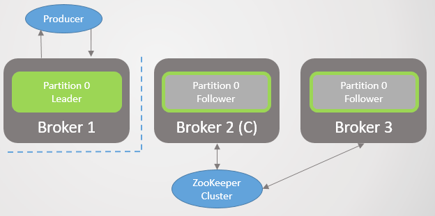

[##_Image|kage@bPhmze/btrCsjVG3IX/WTSYEZIJ1NL9U0YtEykq60/img.png|CDM|1.3|{"originWidth":225,"originHeight":225,"style":"alignCenter"}_##]

### 카프카(Kafka)란?

**카프카(Kafka)**는 Pub-Sub 모델의 메시지 큐의 한 종류이다.

2011년 미국 링크드인(Linkedin)에서 개발했다. 더 자세히 살펴보자.

다음은 카프카 개발 전 링크드인의 데이터 처리 시스템이다.

[##_Image|kage@enQ0ac/btrCsdumnmS/ykikggZHkMoZ7Fuxi1rtG0/img.png|CDM|1.3|{"originWidth":768,"originHeight":427,"style":"alignCenter","width":860,"height":478}_##]

기존 링크드인의 데이터 처리 시스템은 각 파이프라인이 파편화되고 시스템 복잡도가 높아서 새로운 시스템을 확장하기 어려웠다.

이로 인해 새로운 시스템의 개발 필요성이 높아졌고, 다음과 같은 목표를 가지고 새로운 시스템을 개발했다.

-   프로듀서와 컨슈머의 분리
-   메시징 시스템과 같이 영구 메시지 데이터를 여러 컨슈머에게 적용
-   높은 처리량을 위한 메시지 최적화
-   트래픽 증가에 따른 스케일아웃이 가능한 시스템

다음은 카프카를 적용한 후 링크드인의 데이터 처리 시스템이다.

[##_Image|kage@kS7jl/btrCoWnDujb/Gu3aHEG3fyDbzzq1BVj0bK/img.png|CDM|1.3|{"originWidth":768,"originHeight":584,"style":"alignCenter"}_##]

한 눈에 보기에도 훨씬 간결해진 것을 알 수 있다. 카프카를 적용함으로써 모든 이벤트/데이터의 흐름을 중앙에서 관리할 수 있게 되었다.

카프카는 데이터 파이프라인, 스트리밍 분석, 데이터 통합 및 미션 크리티컬 애플리케이션을 위해 설계된 **고성능 분산 이벤트 스트리밍 플랫폼**이다.

카프카는 **Pub-Sub 모델의 메시지 큐** 형태로 동작하며 분산환경에 특화되어 있다.

Fortune 100개 기업 중 80% 이상이 Kafka를 사용한다. 국내에서도 많이 사용하는 추세다.

### 구성요소

다음은 카프카(Kafka)의 구성도를 그림으로 표현것이다.

[##_Image|kage@u1Kn4/btrCoWHVJfB/HSQD4ho51PJVFGfT7ofnB1/img.png|CDM|1.3|{"originWidth":1200,"originHeight":628,"style":"alignCenter"}_##]

카프카의 각 구성요소에 대해 상세히 알아보자.

**\# Topic**

-   각각의 메시지를 목적에 맞게 구분할 때 사용한다.
-   메시지를 전송하거나 소비할 때 Topic을 반드시 입력한다.
-   Consumer는 자신이 담당하는 Topic의 메시지를 처리한다.
-   한 개의 토픽은 한 개 이상의 파티션으로 구성된다.

**\# Partition**

-   분산 처리를 위해 사용된다.
-   Topic 생성 시 partition 개수를 지정할 수 있다. (파티션 개수 변경 가능. \*추가만 가능)
-   파티션이 1개라면 모든 메시지에 대해 순서가 보장된다.
-   파티션 내부에서 각 메시지는 offset(고유 번호)로 구분된다.
-   파티션이 여러개라면 Kafka 클러스터가 라운드 로빈 방식으로 분배해서 분산처리되기 때문에 순서 보장 X
-   파티션이 많을 수록 처리량이 좋지만 장애 복구 시간이 늘어난다.

**\# Producer**

-   메시지를 만들어서 카프카 클러스터에 전송한다.
-   메시지 전송 시 Batch 처리가 가능하다.
-   key값을 지정하여 특정 파티션으로만 전송이 가능하다.
-   전송 acks값을 설정하여 효율성을 높일 수 있다.
    -   ACKS=0 -> 매우 빠르게 전송. 파티션 리더가 받았는 지 알 수 없다.
    -   ACKS=1 -> 파티션 리더가 받았는지 확인. 기본값
    -   ACKS=ALL -> 파티션 리더 뿐만 아니라 팔로워까지 메시지를 받았는 지 확인

**\# Consumer**

-   카프카 클러스터에서 메시지를 읽어서 처리한다.
-   메세지를 Batch 처리할 수 있다.
-   한 개의 컨슈머는 여러 개의 토픽을 처리할 수 있다.
-   메시지를 소비하여도 메시지를 삭제하지는 않는다. (Kafka delete policy에 의해 삭제)
-   한 번 저장된 메시지를 여러번 소비도 가능하다.
-   컨슈머는 컨슈머 그룹에 속한다.
-   한 개 파티션은 같은 컨슈머그룹의 여러 개의 컨슈머에서 연결할 수 없다.

**#  Broker**

-   실행된 카프카 서버를 말한다.
    -   프로듀서와 컨슈머는 별도의 애플리케이션으로 구성되는 반면, 브로커는 카프카 자체이다.
    -   Broker(각 서버)는 Kafka Cluster 내부에 존재한다.
-   서버 내부에 메시지를 저장하고 관리하는 역할을 수행한다.

**#  Zookeeper**

-   분산 애플리케이션 관리를 위한 코디네이션 시스템
-   분산 메시지큐의 메타 정보를 중앙에서 관리하는 역할

### Kafka 특징

-   디스크에 메시지를 저장해서 영속성(persistency)를 보장한다.
-   프로듀서와 컨슈머를 분리하고 멀티 프로듀서와 멀티 컨슈머를 지원한다.
-   프로듀서와 컨슈머 모두 배치 처리가 가능해서 네트워크 오버헤드를 줄일 수 있다.
-   높은 성능과 고가용성과 확장성을 가진다.
-   메시지 보장 여부를 선택할 수 있다.

### Kafka 활용

-   서비스간 결합도를 낮추기 위해 사용한다.
-   모든 데이터를 한 곳으로 집중할 때 유리하다. (ex. 로그 통합, 실시간 접속 분석, 서버 모니터링)
-   실시간 스트리밍 서비스에 적합하다. (ex. 알림 전송 등)
-   대규모 서비스와 배치 시스템에 적합하다.
-   트래픽의 변화가 큰 곳에서 유용하다.

## Replication

Kafka Cluster에서는 Leader 파티션의 Follower 파티션을 추가로 구성할 수 있다.

다만, Follower 파티션은 실제로 Produce, Consume 모두 일어나지 않으며 장애를 대비한 백업 용도로 사용한다.

Leader 파티션에 문제가 생긴다면 Kafka Cluster 내의 모듈이 이를 탐지하여 Follower 파티션이 Leader 파티션으로 승격하게 된다.

## 사용 사례

### User Activity Tracking

- 고객의 페이지 뷰, 클릭 등의 구체적인 행위를 수집해서 고객 행동을 분석/모니터링한다.
- 주 관심사는 아니므로 비동기 Batch 전송 등을 활용하여 사용자 경험에 영향을 끼치지 않아야 한다.
- 데이터 규모가 매우 크고 폭발적으로 늘어날 수 있음을 고려해야 한다.
- 유실없는 완벽한 수집보다는 빠르고 지속적인 수집에 좀 더 관심. (ack=1)

### Event Sourcing (+ CQRS)
- 애플리케이션의 상태에 대한 모든 변경사항을 일련의 이벤트로 표현
- 대규모의 MSA 아키텍쳐에서 CQRS 패턴과 결합하여 도입되는 추세

### 파티션 추가

운영중인 Topic의 파티션을 추가할 때는 Partition을 reblancing하는 과정에서 시스템 성능에 영향을 끼칠 수 있다. (Effect가 적은 시간에 수행해야 한다.)

추가로 특정 Key-Partition 기반한 Consumer를 운영중이라면 메시지의 유실 가능성도 있으므로 신규 Topic을 생성하여 Migration 하는 것이 나은 선택일 수도 있다.

topic 최초 생성 시 데이터 확장 규모를 충분히 고려해서 partition을 여유있게 생성하는 것이 좋다.

## 데이터 마이그에리션

a. 신규 Cluster 용 Broker를 기존 Cluster에 추가하고, partition을 reassign 한 후, 기존 Cluster를 shutdown
b. MimrrorMaker2를 세팅하여 기존 Cluster에서 새로운 Cluster로 실시간으로 데이터를 동기화
c. Kafka Connect 등을 이용해서 기존 Cluster에서 새로운 Cluster로 재전송
d. Application 레벨에서 2개의 Kafka Cluster에 Dual Write/Dual Read로 처리

### Reference

-   [https://velog.io/@jaehyeong/Apache-Kafka%EC%95%84%ED%8C%8C%EC%B9%98-%EC%B9%B4%ED%94%84%EC%B9%B4%EB%9E%80-%EB%AC%B4%EC%97%87%EC%9D%B8%EA%B0%80](https://velog.io/@jaehyeong/Apache-Kafka%EC%95%84%ED%8C%8C%EC%B9%98-%EC%B9%B4%ED%94%84%EC%B9%B4%EB%9E%80-%EB%AC%B4%EC%97%87%EC%9D%B8%EA%B0%80)
-   [https://www.tibco.com/ko/reference-center/what-is-apache-kafka](https://www.tibco.com/ko/reference-center/what-is-apache-kafka)