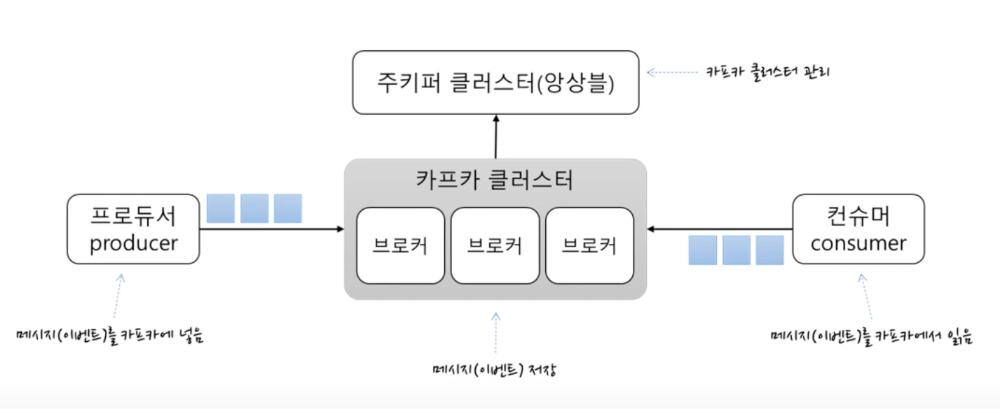
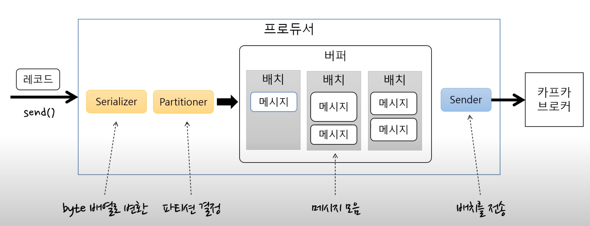

## 카프카 더 이해하기

## 토픽

토픽은 메시지를 구분할 때 사용한다. (파일 시스템의 폴더와 유사)

1개의 토픽은 1개 이상의 파티션으로 구성된다.

## 파티션

파티션은 추가만 가능한(append-only) 파일이다.
- 각 메시지 저장 위치를 offset이라고 한다.
- 프로듀서가 넣은 메시지는 파티션의 맨 뒤에 추가된다.
- 컨슈머는 오프셋 기준으로 메시지를 순서대로 읽는다.
- 메시지는 삭제되지 않는다. (설정에 따라 일정 시간이 지난 뒤 삭제)

프로듀서는 라운드로빈 또는 키로 파티션을 선택한다.
- 같은 키를 갖는 메시지는 같은 파티션에 저장 -> 같은 키끼리 순서를 보장

## 프로듀서

(Kafka 조금 아는척하기 강의 내용)

프로듀서는 Serializer를 사용해서 byte 배열로 변환한 후 배치로 버퍼에 저장을 한다.

이후 Sender는 별도 쓰레드로 배치가 찼는지 여부에 상관없이 브로커로 버퍼를 전달한다.

그래서 sender와 batch에 대한 설정이 처리량에 영향을 준다.
- batch.size: 배치의 크기. 배치가 다 차면 바로 전송한다.
- linger.ms: 전송 대기 시간
  - 대기 시간이 없으면 배치를 바로 전송
  - 대기 시간을 주면 그 시간 만큼 배치가 찰 때까지 기다렸다가 전송한다.

추가로 전송 결과를 확인하기 위해서는 아래의 방법이 있다.
- Future를 사용
  - 처리량이 크게 저하된다.
  - 블로킹으로 인해 Batch에 메시지가 쌓일 수 없기 때문
- Callback 사용
  - 처리량 저하 없음
- ack 속성
  - 0 -> 서버 응답을 기다리지 않음 (메시지 유실 가능)
  - 1 -> 파티션의 리더에 저장되면 성공 (기본값)
    - 팔로워에세 복제되지 않은 시점에 리더에 장애 발생 가능
    - 팔로워가 리더로 승격하면서 메시지 유실
  - all(-1) -> 모든 리플리카에 저장되면 성공
    - min.insync.replicas 에 따라 다를 수 있음
    - ack가 all일 때 저장에 성공으로 처리할 리플리카의 최소 개수

[에러 유형]
- 전송 과정에서 실패
  - 전송 타임 아웃
  - 리더 다운에 의한 새 리더 선출 진행 중인 경우
  - 브로커 설정 메시지 크기 한도 초과
  - ...
- 전송 전
  - 직렬화 실패
  - 프로듀서 자체 요청 크기 제한 초과
  - 프로듀서 버퍼가 차서 기다린 시간이 최대 대기 시간 초과

[실패 대응]
- 재시도
  - 기본적으로 재시도를 수행
    - retires 속성 (프로듀서가 에러가 났을 때 재시도할 횟수. default = Integer.MAX_VALUE)
    - delivery.timeout.ms를 사용하라고 권장 (https://www.conduktor.io/kafka/kafka-producer-retries)
      - retries는 무한이지만, delivery.timeout.ms로 인해 재시도 수행 시간 조정 
  - send() 메서드에서 익셉션 발생 시 send() 재호출하는 방법
  - 콜백 메서드에서 익셉션을 받으면 타입에 따라 send() 재호출
  - **주의 사항**
    - 메시지가 중복으로 전송될 수 있음
      - ex. 브로커 응답이 늦게 온 경우
      - enable.idempotence 속성으로 완화 가능
    - 재시도 시점에 따라 메시지의 순서가 바뀔 수 있음
      - 순서를 보장하려면 max.inflight.request.per.connection을 1로 지정해야 함
      - 블로킹없이 한 커넥션에서 전송할 수 있는 최대 전송중인 요청 개수
    - 무한 재시도는 절대 하면 안됨!
- 기록
  - 트랜잭션 범위 안에서 별도 파일, DB 등으로 실패한 메시지를 기록
  - send() 메서드 내(+ Future/Callback)에서 익셉션 발생 시 기록
  - 추후에 Batch 등을 통해 자동으로 보정

## 컨슈머

컨슈머는 컨슈머 그룹에 속한다.

**한 개 파티션 컨슈머 그룹의 한 개 컨슈머에만 연결이 가능하다.**
- 즉, 컨슈머 그룹에 속한 컨슈머들은 한 파티션을 공유할 수 없음
- (목적) 한 컨슈머 그룹 기준으로 파티션의 메시지는 순서대로 처리되는 것을 보장

## Performance

Kafka가 처음 뜨게 된 이유 중 성능이 매우 크다고 한다.

- 파티션 파일의 OS 페이지 캐시를 사용한다.
  - 파티션에 대한 파일 IO를 메모리에서 처리
- Zero Copy
  - 디스크 버퍼에서 네트워크 버퍼로 직접 데이터 복사
- 단순한 브로커
  - 메시지 필터, 메시지 재전송과 같은 일은 브로커가 하지 않음
    - 프로듀서, 컨슈머가 직접 해야 함
  - 브로커는 컨슈머와 파티션 간 매핑만 관리
- batch로 인한 처리량 증가
  - Producer: 일정 크기만큼 메시지르 모아서 전송 가능
  - Consumer: 최소 크기만큼 메시지를 모아서 조회 가능
- 확장에 유리
  - 스토리지 한계 -> 브로커 추가, 파티션 추가
  - 컨슈머 처리량 저하 -> 컨슈머 추가 (+파티션 추가)

## Replica

Kafka에서는 장애를 대응하기 위해 파티션을 복제함
- 서로 다른 브로커에 같은 토픽의 파티션이 생김
  - 리더와 팔로워로 구성 (팔로워는 리더로부터 복제)
- HA를 제공 (리더가 속한 브로커 장애시 다른 팔로워가 리더로 승격)

## 참고
- https://www.youtube.com/watch?v=0Ssx7jJJADI
- https://www.youtube.com/watch?v=geMtm17ofPY

