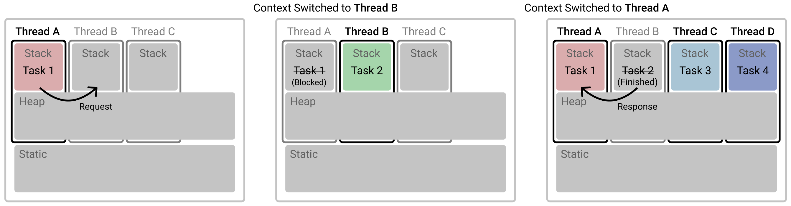
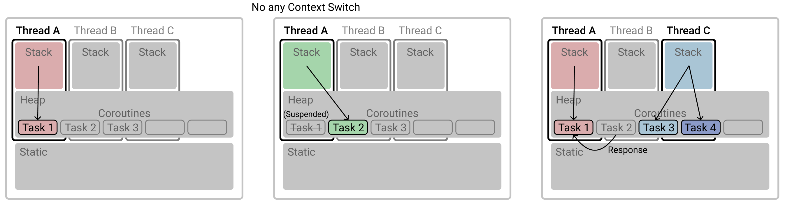
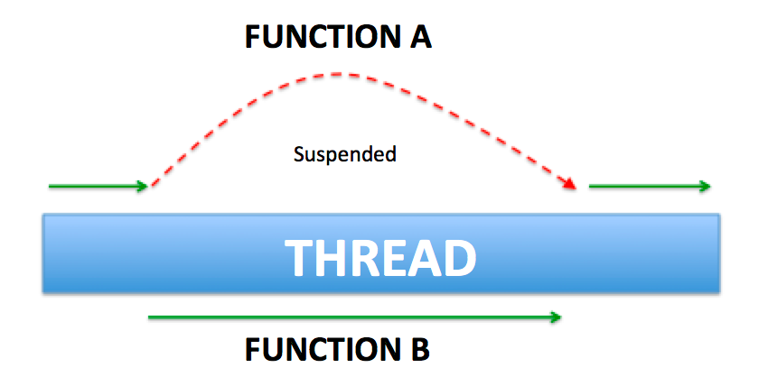

## 코루틴

코루틴(Coroutine)은 일시 중단이 가능한(Suspendable) 작업 객체이다.

## vs Thread

코루틴은 **경량 쓰레드**라고 부른다.

아래는 여러 개의 쓰레드로 여러 개의 작업을 실행하는 방식이다.



코루틴은 작업 하나하나에 Thread를 할당하는 것이 아니라 **Object**를 할당학고, 쓰레드가 Object를 스위칭함으로써 Context Swiching 비용을 대폭 줄인다.



## suspend 키워드

suspend는 코루틴 안에서만 실행할 수 있는 코루틴 전용 메서드에 사용한다.



suspend를 사용하면 해당 작업을 suspend 시키고, 그 시간 동안 다른 작업에 Thread를 할당할 수 있다.

## CoroutineDispatcher

코루틴을 어떤 Thread에게 보낼 지 결정하는 컴포넌트를 Dispatcher라고 한다.

- Dispatcher.Default
  - 리스트를 정렬하거나 Json Parsing 등 가공 작업에 주로 사용
  - CPU를 많이 사용하는 무거운 작업에 최적화
  - CPU 개수 만큼 스레드를 생성
  - 현재는 CommonPool이 사용되며, 쓰레드 풀의 최대 크기가 시스템 코어수-1이다.
- Dispatcher.Main
  - 화면 UI 작업을 위해 사용
- Dispatcher.IO
  - 네트워크 DB 작업할 경우 사용
  - 읽기, 쓰기 작업에 최적화
  - Thread를 Block할 필요가 있는 경우

## Scope

코루틴은 **구조화된 도잇성 원칙**을 따른다. 코루틴은 수명을 제한하는 특정 **코루틴 Scope** 내에서 실행되어야 하는 원칙이다.

코루틴 스코프는 스코프 내의 코루틴이 모두 완료될 때까지 종료되지 않으므로 코루틴이 손실되지 않는 것을 보장한다.

- GlobalScope
- ViewModelScope
- LifecycleScope
- LiveData

#### Context

코루틴은 항상 컨텍스트 안에서 실행된다. 컨텍스트는 코루틴이 어떻게 실행되고 동작해야 하는 지를 정의할 수 있게 된다.

그 중 Dispatcher가 대표적이다.
- newSingleThreadContext(): 단일 스레드로 디스패처를 생성한다. 여기에서 실행되는 코루틴은 항상 같은 스레드에서 실행되고 재개된다.
- newFinxedThreadPoolContext(): 지정된 크기의 스레드 풀이 있는 디스패처를 생성한다. 디스패처는 런타임에 코루틴을 실행하고 재개할 스레드를 결정한다.

```kotlin
fun main(args: Array<String>) = runBlocking {
    val netDispatcher = newSingleThreadContext(name = "ServiceCall")
    val task = GlobalScope.launch(netDispatcher) {
        printCurrentThread()
    }
    task.join()
}
```

#### Exception Handler

코루틴은 CoroutineExceptionHandler를 사용해서 공통적으로 사용할 익셉션 핸들러를 정의할 수 있다.

```kotlin
fun main(args: Array<String>) = runBlocking { 
    val handler = CoroutineExceptionHandler({ context, throwable ->
        println("Error captured in $context")
        println("Message: ${throwable.message}")
    })
    GlobalScope.launch(handler) { 
        // 구현
    }
}
```

#### NonCancellable

아래와 같이 NonCancellable을 사용하면 코루틴이 취소되도 중지되지 않는다.

```kotlin
withContext(NonCancellable) { 
    println("cancelled, will delay finalization now")
    delay(5000)
    println("delay completed, bye bye")
}
```

#### 컨텍스트 조합, 분리

아래와 같이 컨텍스트를 조합할 수도 있다.

```kotlin
val dispatcher = newSingleThreadContext("myDispatcher")
val handler = CoroutineExceptionHandler { _, throwable ->
    println("Message: ${throwable.message}")
}

val context = dispatcher + handler
GlobalScope.launch(context) {
    println("Running in ${Thread.currentThread().name}")
}.join()
```

분리는 아래와 같이 수행할 수 있다.

```kotlin
val onlyHandler = context.minus(dispatcher.key)
```

## 코루틴 빌더

코루틴 빌더는 suspend 람다를 받아서 그것을 실행시키는 코루틴 생성 함수이다.

#### runBlocking

Main Thread를 Blocking 한 채 구문 내 작업을 새 Thread에 할당하여 수행한다.

일반적으로 다수의 async {}로 구성하는데, 이 경우 해당 작업들이 모두 완료되고 반환되면 Main Thread의 Blocking을 해제한다.

#### launch

Main Thread를 Unblocking 한 채 {} 구문 내 작업을 수행한다.

```kotlin
fun main(args: Array<String>) = runBlocking {
    val task = GlobalScope.launch {
        doSomething()
    }
    task.join()
    println("Success")
}
```

`launch()`는 결과를 반환하지 않는다. 연산이 실패한 경우 통보를 받을 수 있다.

#### async

Main Thread를 Unblocking 한 채 {} 구문 내 작업을 수행하고 결과 값을 반환한다. 내부적으로 Non-Blocking cancellable future를 의미한다.

```kotlin
val result = GlobalScope.async {
    isPalindrome(word = "Sample")
}
result.await()
```

async는 코루틴 내부에서 일어나는 모든 예외를 캡쳐해서 결과에 넣기 때문에 조심해서 사용해야 한다.

아래 프로세스는 수행 중 정지되지 않는다. 예외는 코루틴의 결과에 첨부되기 때문이다.

```kotlin
fun main(args: Array<String>) = runBlocking {
    val task = GlobalScope.async {
        doSomething()
    }
    task.join()
    println("Completed")
}
fun doSomething() {
    throw UnsupportedOperationException("Can't do")
}
```

반면 아래 코드는 중간에 애플리케이션이 비정상적으로 중단된다.

```kotlin
fun main(args: Array<String>) = runBlocking {
    val task = GlobalScope.async {
        doSomething()
    }
    task.await()
}
```

`join`은 예외를 전파하지 않지만, `await()`는 호출하는 것 만으로도 예외를 전파하기 때문이다.


#### withContext

코루틴 중 Context를 변경할 때 사용한다.

아래는 withContext를 사용하지 않는 코드이다. 

```kotlin
override fun onCreate(savedInstanceState: Bundle?) {
    super.onCreate(savedInstanceState)

    CoroutineScope(Dispatchers.Main).launch {
        exampleSuspend()
    }
}

suspend fun exampleSuspend() {
    val job = CoroutineScope(Dispatchers.IO).async {
        delay(1000)
    }

    job.await()
}
```

아래는 withContext를 사용한 코드이다.

```kotlin
override fun onCreate(savedInstanceState: Bundle?) {
    super.onCreate(savedInstanceState)

    CoroutineScope(Dispatchers.Main).launch {
        exampleSuspend()
    }
}

suspend fun exampleSuspend() {
    withContext(Dispatchers.IO) {
        delay(1000)
    }
}
```

withContext도 suspend 함수이기 때문에 withContext가 전부 실행될 때까지 정지된다.

즉, withContext는 async와 다르게 병렬 처리가 불가능하고 순차 처리만 가능하다.

## 라이프사이클

다음은 코루틴 잡의 라이프 사이클이다.
- New: 존재하지만 실행되지 않은 상태
- Active: 실행중인 상태
- Completed: 완료된 상태
- Canceling: 취소중인 상태
- Cancelled: 실행이 완료된 상태

New상태에 대해 생소하게 생각할 수 있는데, 코루틴은 잡을 생성할 때 Lazy를 사용할 수 있다.

```kotlin
fun main(args: Array<String>) = runBlocking { 
    val job = GlobalScope.launch(start = CoroutineStart.LAZY) { 
        println("Hi")
    }
    job.start() // 중단이 불가능 (suspend 무시)
    job.join // 일시중단 가능
} 
```

## Deferred

Deferred는 결과를 수신하는 비동기 작업이다. 아래는 Kotlin의 Deferred 인터페이스의 명세이다.

```kotlin
public interface Deferred<out T> : Job {
    public suspend fun await(): T
    public val onAwait: SelectClause1<T>
    ..
}
```

Deferred는 async 블록을 통해 생성된다.

`await()`는 IO Thread에서 Deferred의 결과가 수신될 때까지 일시 중단한다.

발생한 예외도 `await()`가 발생할 때 전파된다.

#### 명시

코루틴에서 Deferred를 내장할 때는 아래와 같이 사용할 수 있다.

```kotlin

interface ProfileServiceRepository {
    fun asyncFetchByName(name: String) : Deferred<Profile>
    fun asyncFetchbyId(id: Long) : Deferred<Profile>
}
```

```kotlin
class ProfileServiceClient : ProfileServiceRepository {
    override suspend fun fetchByName(name: String) : Profile { 
        return Profile(1, name, 28)
    }
    override suspend fun fetchById(name: String) : Profile { 
        return Profile(id, "Susan", 28)
    }
}
```

이때 몇가지 제약이 있다.
- 메서드 명으로 async 개념을 명시해주는 것이 중요하다.
- 호출 직후에 반드시 await() 호출이 따라온다.
- 구현이 Deferred에 종속적이다.

그래서 아래와 같이 **suspend를 활용하기를 권장**한다.

```kotlin
interface ProfileServiceRepository { 
    suspend fun fetchByName(name: String) : Profile
    suspend fun fetchById(id: Long) : Profile
}
```

Defferred에 종속적이지 않고, await()륿 반드시 호출하는 번거로움도 사라진다.

**구현이 Job에 종속적인 설계를 피해야 한다.**

#### produce

시퀀스와 이터레이터는 실행 중에 일시 중단할 수 없다. 실행 중에 일시 중단할 수 없다는 제한이 있다.

프로듀서는 값이 생성된 후 일시 중단되며, 새로운 값이 요청될 때 다시 재개된다.

```kotlin
val producer = GlobalScope.produce {
    send(1)
}
```

```kotlin
runBlocking {
    producer.consumeEach {
        println(it)
    }
}
```
## 참고
- https://www.charlezz.com/?p=45962
- https://incheol-jung.gitbook.io/docs/study/undefined-4/1