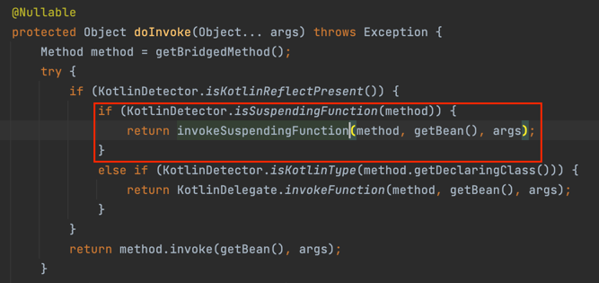

`suspend` 함수는 `suspend` 함수 내부나 코루틴 내부에서만 실행이 가능하다.

Controller에서 suspend 함수를 호출해야 한다면 어떻게 할까?

## Spring Webflux

Spring Webflux에서는 Controller의 suspend 함수를 지원한다.

```kotlin
@RestController
@RequestMapping("/hello")
class HelloController {
    private val log = logger<HelloController>()

    @GetMapping
    suspend fun hello() {
        log.info("context: {}", coroutineContext)
        log.info("thread: {}", Thread.currentThread().name)
    }
}
```

해당 컨트롤러에 요청을 보내보면 아래 로그가 찍힌다.

```kotlin
34:31 [reactor-http-nio-2] - context:
    [Context1{reactor.onDiscard.local= reactor.core.publisher.Operators$$Lambda/0x0000000123657b60@7bbfcea9}, 
    MonoCoroutine{Active}@35a52e8a, Dispatchers.Unconfined]
34:31 [reactor-http-nio-2] - thread: reactor-http-nio-2
```

코루틴 컨텍스트에는 Reactor가 제공하는 `Context`가 들어있고, `MonoCoroutine`이라는 타입으로 동작하고 있고, Dispatcher는 `Unconfined`를 사용하고 있다.
쓰레드 이름은 `reactor-http-nio-2`이다.

실제로 `spring-web` 라이브러리를 보면 suspend 함수에 대해서 아래와 같이 `invoke`를 통해 처리하고 있다.



`invokeSuspendingFunction()`는 `Mono`로 감싸서 함수를 처리하게 된다.

## Mono 변환

아래와 같이 `suspend` 함수가 있고, Mono를 반환하는 곳에서 해당 함수를 활용해야 한다면 어떻게 처리할까

```kotlin
suspend fun hello(): String {
    delay(1000)
    return "hello"
}

fun getHello(): Mono<String> {
    // TODO
}
```

`kotlin-coroutines-reactor`에서는 `mono()`를 제공한다. 해당 함수는 파라미터로 suspend 함수를 실행해서 Mono를 반환해준다.

```kotlin
public fun <T> mono(
    context: CoroutineContext = EmptyCoroutineContext,
    block: suspend CoroutineScope.() -> T?
): Mono<T> {
    require(context[Job] === null) {
        "Mono context cannot contain job in it." + 
        "Its lifecycle should be managed via Disposable handle. Had $context" }
    return monoInternal(GlobalScope, context, block)
}
```

그래서 아래와 같이 구현할 수 있다.

```kotlin
suspend fun hello(): String {
    delay(1000)
    return "hello"
}

fun getHello(): Mono<String> {
    return mono { hello() }
}
```

## 참고

- https://fastcampus.co.kr/courses/216172