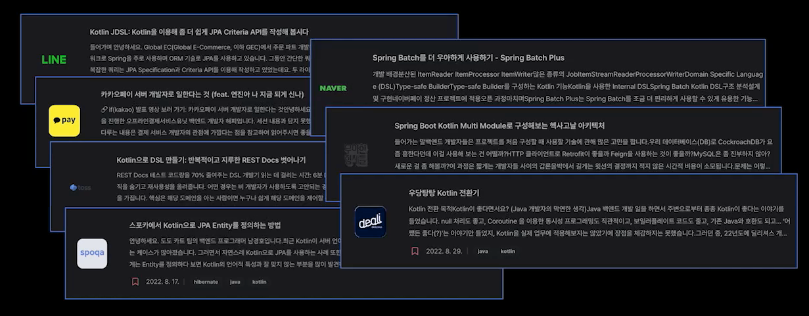

## 코틀린

코틀린은 러시아의 상트페테르부르크의 섬 이름이다. 해당 지역 출신의 깨발자가 많아서 코틀린이 되었다.

코틀린은 안전성, 간결성, 상호 운용성을 강조하는 다중 패러다임, 다중 플랫폼 프로그래밍 언어이다. 다중 패러다임은 객체지향 프그래밍이나 함수형 프로그래밍 방식 등을 말한다.

코틀린의 주 목적은 자바가 사용되는 모든 용도에 더 간결하고, 생산적이고, 안전한 언어를 제공하는 것이다.

## JVM 언어

코틀린은 JVM언어 중 하나이다.

그렇다고 코틀린이 직접 바이너리 프로그램을 작성하는 것은 아니고, 빌드의 산출물이 클래스 파일이다.



코틀린은 자바 프로그램을 작성하는 언어라고 보는 것이 맞고, 컴파일 후 java 명령어로 해당 코드를 실행한다.

## 새로운 개념

아래는 자바를 기준으로 한 코틀린의 새로운 개념이다. 

#### 타입 추론

코틀린은 변수 타입을 지정하지 않아도 **타입추론**으로 컴파일되고 실행된다.

코틀린은 **강한 타입 지정 언어**임에도 개발자가 불필요한 타입 정보를 코드에 추가하지 않을 수 있다.

#### 변수와 함수

코틀린에서는 클래스 외부에도 변수나 함수를 선언할 수 있다.

#### 프로퍼티

자바에서 클래스가 가지는 멤버변수를 기본적으로 필드라고 불렀다.

코틀린에서는 프로퍼티라고 부른다.

클래스 내부에 프로퍼티를 선언하면 게터, 세터가 자동으로 생성된다. (val 변수는 게터만 자동으로 생성된다.)

## 문법

자바를 기준으로 해서 코틀린 문법을 알아보자.

#### 세미콜론

세미콜론을 생략할 수 있다.

```kotlin
println("Hello")
```
#### 불변 & 가변

- 불변 변수 - val (value)
- 가변 변수 - var (variable)

#### 논리

- 논리합 즉시(eager) 계산: or
- 논리합 지연(lazy) 계산: || 
- 논리곱 즉시(eager) 계산: and
- 논리곱 지연(lazy) 계산: &&

중요한 점은 즉시 계산이 먼저 수행된다는 점이다. 즉시 계산의 경우 자바의 `&`나 `|`와 동일하다. 즉, 비트 연산도 해당 연산자로 가능하다.

#### 문자열

아래와 같은 문자열 템플릿을 제공한다.

```kotlin
val name = "john"
println("Hello, $name! ${Date()}")
```

코틀린에서 `"""`를 사용하면 이스케이프 문자를 사용하지 않아도 된다.
`"""(.+)/(.+)\\.(.+)"""`


#### 배열

배열 선언 시 new 연산자를 사용하지 않는다. 

```kotlin
val a = emptyArray<String>()            // Array<String> (원소 0개)
val b = arrayOf("Hi", "Hello", "Aloha") // Array<String> (원소 2개)
```

아래와 같이 배열 덧셈도 가능하다.

```kotlin
val a = intArrayOf(1,2) + 3
val b = intArrayOf(1,2) + intArrayOf(3,4)
```

비교는 아래와 같이 할 수 있다.

```kotlin
a.contentEquals(b)
```

#### Null

```kotlin
val a = readLine()!!.toInt()
```

`!!`는 null이 아님을 단언(assertion)하는 것이다. `readLine()`의 결과가 null일 경우 예외를 발생한다.

아래는 다른 문법이다.
- ? - null 허용 (기본적으로 허용 X)
- ?. - Null이 아닌 경우에만 호출 (null인 경우 null 반환)
- ?: - null이 아닌 사용자 정의 값을 반환하고 싶을 때 사용
- !! - null이 아님을 컴파일러에게 보증 (null이면 NPE)

#### 조건

```kotlin
// if (someObject != null && status) {
//    doThis()
// }

someObject?.takeIf{ status }?.doThis()
```

코틀린에서는 `taskIf`를 사용해서 조건 절에 null을 활용할 수 있다. `taskIf`는 인자인 predicate가 true일 경우 그 값을 return하고, 아닐 경우 null을 return한다.

반대로 `takeUnless`는 인자로 들어오는 predicate가 false일 경우 그 값을 return 한다.

#### Type

코틀린의 모든 타입은 Any의 하위 타입이다.

Float, Double은 INFINITY 연산도 지원한다.

##### Unit

코틀린은 자바의 void 대신 Unit이라는 클래스를 사용한다.

코틀린은 primitive type을 일체 사용하지 않고, 모든 타입을 클래스로 만들어서 사용한다.
- 컴파일 시 자바의 primitive과 wrapper 중 효율적인 방식으로 자동 변환된다.
- null이 될 수 있는 경우 wrapper 타입으로 컴파일

그래서 모든 타입은 Any(자바의 Object)를 상속받고 있고, void의 경우 Unit으로 래핑해서 사용하고 있다.

##### 변환

코틀린은 타입의 자동 변환을 지원하지 않는다. 

```kotlin
val i = 1
val l: Long = i //Error: type mismatch 컴파일 에러 발생
```

대신 Boolean을 제외한 모든 타입에 대한 변환 메서드를 제공한다.

```kotlin
val i = 1
val l: Long = i.toLong()
```

##### 파라미터

코틀린에서는 파라미터가 널(Null)을 허용할 지 여부를 `?`로 나타낸다.
- `override fun onCreate(savedInstanceState: Bundle?) {}`

#### Class

클래스 앞에 아래 키워드를 붙일 수 있다.
- open: 상속이 가능 (final의 반대. Kotlin은 final이 default라고 이해하면 된다.)
  - 코틀린의 철학은 의도한 것이 아니라면 모두 final 클래스로 만들어야 한다는 것이다.
- sealed: 추상 클래스와 유사 (내부적으로 여러 클래스를 가짐)
  - when 구문을 사용할 때 모든 내부 클래스를 명시하면 else를 사용하지 않아도 된다.
- data:
    - toString, hashCode, equals, copy를 자동으로 구현
    - 불변을 의미하지는 않음

**object 키워드**

```kotlin
object HelloPrinter {
    fun print(content: String) : Unit {
        println("Hello $content")
    }
}
```

```kotlin
HelloPrinter.print("VioletBeach")
```

object 키워드는 환경에 따라 주입 관계를 바꾸기가 어려우므로 DI 프로젝트와 클래스를 사용하는 것이 더 좋은 설계가 될 가능성이 크다.

싱글톤 클래스를 정의할 때 사용한다. 사용처에서는 아래와 같이 자바의 static 클래스를 사용하는 듯하게 사용한다.

익명 객체를 만들 때도 아래와 같이 object 키워드를 사용한다.

```kotlin
val listener = object : MouseAdapter() {
    override fun mouseClicked(e: MouseEvent) { ... }
    override fun mouseEntered(e: MouseEvent) { ... }
}
```

**생성자**

아래는 모두 코틀린의 생성자의 문법이다.

```kotlin
class User constructor(nickname:String){
    val nickname: String
    init {
        nickname = nickname
    }
}

class User(nickname: String){
  val nickname = nickname;
}

class User(val nickname: String)

class User(val nickname: String, val isSubscribed: Boolean = true)

class User {
  val name: String
  val age: Int

  constructor(name: String): this(name, 0) {}

  constructor(name: String, age: Int) {
    this.name = name
    this.age = age
  }
}
```

#### when

코틀린은 switch 대신 when 구문을 사용한다. 

```kotlin
fun main() {
    val x = 5

    when (x) {
    	1 -> println("x는 1이다")
    	2, 3 -> println("x는 2 또는 3이다")
    	in 4..10 -> println("x는 4와 10 사이에 있다")
    	else -> println("x는 다른 수이다")
    }
}
```

when은 switch랑 다르게 상수 뿐 아니라 객체의 사용도 허용한다.

#### is

코틀린은 instanceof 대신 is를 사용하여 변수 타입을 검사한다.

```kotlin
fun floatToInt(e: Number): Int {
    if (e is Float) {
        return e.toInt();
    }
    throw IllegalArgumentException("Unknown expression")
}
```

위에서 보면 코틀린은 자바에서 처럼 (Num)과 같이 명시적으로 캐스팅하지 않아도 된다.

이를 **스마트 캐스트**라고 한다.

#### 상수

코틀린에서는 `static`이나 `const` 키워드를 사용하지 않는다.

상수를 정의하는 방법은 2가지가 있다.

첫 번째로 companion object를 사용하는 방식이다.

```kotlin
class Rule{
    companion object{
        const val Admin:Int = 1

        fun printAdmin() {
            println(Admin)
        }
    }
}
```

두 번째는 **패키지 변수**로 선언하는 방식이다.

```kotlin
package org.violetbeach.rule.constants

val Admin:Int = 1

fun printAdmin() {
    println(Admin)
}
```

## 확장 함수

코틀린은 다른 클래스의 인스턴스 메서드를 추가할 수 있다. 이를 **확장 함수**라고 한다.

```kotlin
fun String.lastChar(): Char = this.get(this.length - 1)
```

그러면 아래와 같이 String 객체의 인스턴스 메서드처럼 호출이 가능해진다.

```kotlin
println("Hello".lastChar())
```

확장 함수는 오버라이드가 안되고, 이름과 파라미터가 같을 경우 멤버 함수가 호출된다.

이를 활용하면 자바에서 복잡한 디자인 패턴을 적용하지 않고도, 써드 파티 라이브러리에 함수를 추가할 수 있다.

## 컬렉션

코틀린의 컬렉션은 자바와 같은 클래스를 사용함에도 더 확장한 API를 제공한다.

그렇다. 확장 함수를 사용하기 때문이다.

다양한 메서드는 기본이고, 가변 인자도 사용할 수 있고, 배열과의 자유로운 변환도 가능하다.

## lazy

lateinit은 나중에 값을 할당할 경우 사용할 수 있다. 예를 들어 아래 코드를 보자.

```kotlin
fun initialize() {
    var str: String = "";
    if(age < 10) {
        str = "아이입니다."
    }
    if(age > 20) {
        str = "성인입니다."
    }
    description = str;
}
```

여기서 실수로 str이 초기값인 ""가 될 수 있다. 기본값을 사용하지 않고 반드시 초기화를 해야 함을 명시하려면 아래와 같이 사용할 수 있다.

```kotlin
fun initialize() {
    lateinit var str: String
    if(age < 20) {
        str = "아이입니다."
    }
    if(age >= 20) {
        str = "성인입니다."
    }
    description = str;
}
```

lateinit은 var 속성에 사용하고, lazy 는 람다를 받는다.

```kotlin
lateinit var inputValue : String
val x : Int by lazy { inputValue.length }
inputValue = "Initialized!"
println(x)
```

x가 처음 사용되는 순간 lazy 문의 결과로 초기화시킨다.

## by

by 키워드를 사용하면 delegate 패턴과 유사하게 특정 동작을 다른 클래스에 위임할 수 있다.

```kotlin
class CountingSet<T>(
        val innerSet: MutableCollection<T> = HashSet<T>()
) : MutableCollection<T> by innerSet {

    var objectsAdded = 0

    override fun add(element: T): Boolean {
        objectsAdded++
        return innerSet.add(element)
    }

    override fun addAll(c: Collection<T>): Boolean {
        objectsAdded += c.size
        return innerSet.addAll(c)
    }
}
```

해당 메서드에서는 `add()`, `addAll()`을 제외하고 innserSet에 메서드 구현을 위임한다.

## inline

인라인 함수를 사용하면 람다식을 사용할 때 무의미한 객체 생성을 막을 수 있다.

```kotlin
inline fun inlined(block: () -> Unit) {
    block()
}

fun doSomething() {
    inlined { println("do something") } 
}
```

## sequence

코틀린의 Collection 연산은 즉시(eager) 발생한다. Sequence 연산은 지연(lazy) 처리된다. 그렇다. 자바의 Stream과 매우 유사하다.

가령, Sequence의 경우 `first()`와 같은 메서드로 원하는 원소를 찾은 즉시 종료할 수 있다.

## 람다 전달

아래는 동일한 문장이다.

```kotlin
postponComputation(1000, object : Runnable { 
    override fun run() { 
        println(42) 
    }
})

postponComputation(1000) { println(42) }  
```

argument가 여러 개일 경우 아래와 같이 사용할 수 있다.

```kotlin
val sumUsingReduce = numbers.reduce {total, num -> 
    total + num
}
```

#### with

with을 사용하여 중복된 변수명을 제거할 수 있다.

```kotlin
fun alphabet(): String {
    val stringBuilder = StringBuilder()
    return with(stringBuilder) {
        for (letter in 'A'..'Z') {
            this.append(letter)
        }
        append("\\nNow I know the alphabet!")
        this.toString()
    }
}
```

this를 사용해 수신 객체에 접근할 수 있다.

만약 수신 객체 자체를 반환해야 한다면 **apply**를 사용한다.

apply를 활용한 buildString과 같은 표준 라이브러리 함수도 지원한다.

```kotlin

fun alphabet() = buildString {
    for (letter in 'A'..'Z') {
        append(letter)
    }
    append("\\nNow I know the alphabet!")
}
```


## 참고
- https://0391kjy.tistory.com/57
- https://kotlinlang.org/docs/jvm-get-started.html
- https://incheol-jung.gitbook.io/docs/study/kotlin-in-action/1