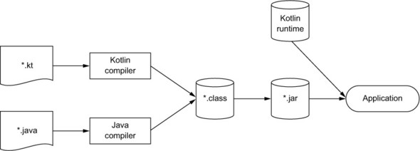

## 코프링

코틀린은 JVM 기반 언어로 자바(Java)와 100% 호환되도록 설계되었다.

코틀린은 간결한 문법, 안정성, 다양한 기능이 있다는 장점을 가졌고, 스프링 프레임워크와의 조합인 **코프링**을 많이 사용하게 되었다.

코틀린을 배워야 할까..? 아래의 부분은 코틀린을 시작하기 꺼려지는 요소이다.
- 스프링 프레임워크는 자바로 작성된 오픈소스
- 정상적으로 사용하기 위해서 추가 플러그인이 필요
- 자바도 계속 발전하고 있다.

하지만 **기업 기술 블로그의 코프링 관련 포스트가 증가하고 있다.**

그 뿐 아니라 코틀린을 지원하는 프로젝트가 자바 오픈소스가 늘고 있고, 코틀린으로 작성된 오픈소스도 증가하고 있다.

코틀린의 장점을 정리하면 아래와 같다.
- 자바 대비 간결한 문법
- 언어 레벨에서 지원하는 다양한 기능
  - null safety, infix function, scope function, coroutine
- 지속적인 업데이트 및 활발한 커뮤니티
- IDE 레벨에서의 강력한 지원

코프링의 장점은 아래와 같다.
- 스프링 진영의 적극ㅈ거인 지원
- 국내 많은 IT 기업에서 도입
- 증가하고 있는 레퍼런스

## 학습

아래 방법들을 활용하면 Kotlin에 대해 경험해보고 학습할 수 있다.

- Kotlin Koans
- Effective Kotlin
- Kotlin 공식 문서
- Spring 공식 문서의 코틀린 관련 챕터 👍

## WebFlux

The Reactive Manifesto (리액티브 선언문)
- 큰 시스템은 더 작은 규모의 시스템들로 구성되어 있기에 구성 요소의 리액티브 특성에 의존
- 리액티브 애플리케이션의 모든 구성 요소가 리액티브하게 동작해야 한다.

R2DBC (Reactive Relational Database Connectivity)
- 리액티브 프로그래밍을 RDBMS에서 지원하기 위해 만든 스펙
- 스프링 진영에서는 **Spring Data R2DBC**를 지원

r2dbc-mysql
- 공식 벤더가 관리하지 않는 **서드 파티 오픈소스**이다.
  - 잠재적 병목 가능성
- 버전이 낮아서 레퍼런스가 부족

## Kotest

코틀린 멀티플랫폼 테스트 프레임워크

- Spec 클래스를 활용한 다양한 테스트 스타일 지원
- 가독성 좋은 Assertions 라이브러리, 풍부한 

## MockK

코틀린을 위해 만들어진 Mocking 라이브러리
- final class에 대한 Mock 객체 생성 및 Stubbing 지원
- 간결하고 직관적인 문법, 풍부한 DSL

## Fixture Monkey

테스트 객체를 편하게 자동으로 생성해주는 라이브러리
- 대상 클래스에 대한 필드를 임의의 값으로 채워 생성
- 다양한 커스터마이징 기능 및 starter 의존성 지원

## 참고
- https://www.inflearn.com/course/lecture?courseSlug=%EC%9D%B8%ED%94%84%EC%BD%982023-%EB%8B%A4%EC%8B%9C%EB%B3%B4%EA%B8%B0&unitId=177910