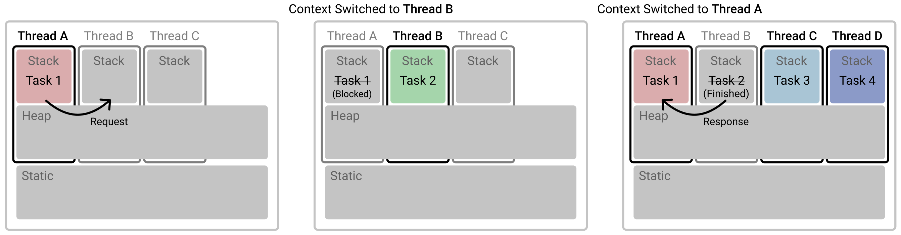
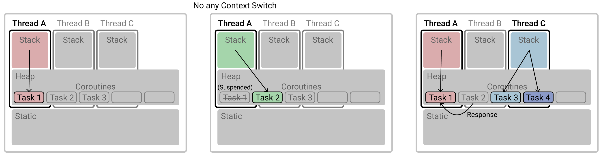
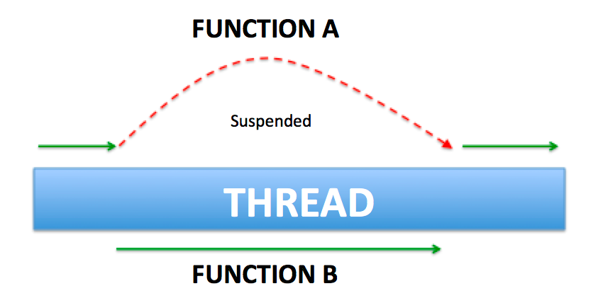

## 코루틴

코루틴(Coroutine)은 Co(함께, 서로) + routine(규칙적 작업의 집합) 2개가 합쳐진 단어로 함께 동작하며 규칙이 있는 작업의 집합을 의미한다.

왜 `Koroutine`이 아니라 `Coroutine`인지 의아할 수 있는데 코루틴은 코틀린만의 것이 아니다. Python, C#, Go, Javascript 등 다양한 언어에서 지원하는 개념이다.

JS의 async, await도 동일한 개념이고 코루틴은 프로그래밍 초창기부터 존재하던 개념이다.

## Kotlin Coroutines

코틀린에서는 코루틴을 위한 공식 라이브러리(`kotlinx.coroutines`)를 지원한다.

아래는 Kotlin Coroutines에 대한 설명이다.
- 동시성을 위한 기능을 제공
- Async Non-blocking으로 동작하는 코드를 동기 방식으로 작성할 수 있도록 지원
  - 코틀린 컴파일러에서 바이트 코드를 비동기 방식으로 변경
- CoroutineContext를 통해 Dispatcher, error handling, threadLocal 등을 지원
- CoroutineScope를 통해 structured concurrency, cancellation 제공
- flow, channel 등의 심화 기능 제공

## vs Thread

코루틴은 **경량 쓰레드**라고 부른다.

아래는 여러 개의 쓰레드로 여러 개의 작업을 실행하는 방식이다.



코루틴은 작업 하나하나에 Thread를 할당하는 것이 아니라 **Object**를 할당하고, 쓰레드가 Object를 스위칭함으로써 Context Swiching 비용을 대폭 줄인다.



## suspend

suspend는 코루틴 안에서만 실행할 수 있는 코루틴 전용 메서드에 사용한다.



코루틴은 `suspend` 키워드를 사용해서 특정 지점에서 일시중지(suspend) 하고, Thread는 다른 작업을 수행할 수 있다.

## CoroutineContext

CoroutineContext는 coroutine에 필요한 정보를 제공해준다.
- Coroutine 이름
- CoroutineDispatcher
- ThreadLocal
- CoroutineExceptionHandler

#### CoroutineDispatcher

코루틴을 어떤 Thread에게 보낼 지 결정하는 컴포넌트를 Dispatcher라고 한다.

- Dispatcher.Default
    - 리스트를 정렬하거나 Json Parsing 등 가공 작업에 주로 사용
    - CPU를 많이 사용하는 무거운 작업에 최적화
    - CPU 개수 만큼 스레드를 생성
    - 현재는 CommonPool이 사용되며, 쓰레드 풀의 최대 크기가 시스템 코어수-1이다.
- Dispatcher.Main
    - 화면 UI 작업을 위해 사용
- Dispatcher.IO
    - 네트워크 DB 작업할 경우 사용
    - 읽기, 쓰기 작업에 최적화
    - Thread를 Block할 필요가 있는 경우

#### CoroutineExceptionHandler

CoroutineExceptionHandler는 코루틴 내부의 Exception을 핸들링하는 기능을 제공한다.

아래 코드를 보자.

```kotlin
runBlocking {
    val context = CoroutineName("custom name") +
            CoroutineExceptionHandler { _, e ->
                log.error("custom exception handle: {${e.javaClass}}")
            }

    CoroutineScope(Dispatchers.IO).launch(context) {
        throw IllegalStateException()
    }
    
}
```

결과는 아래와 같다.

```
22:10 [DefaultDispatcher-worker-1] - custom exception handle: {class java.lang.IllegalStateException}
```

예시 코드에서 Scope를 생성한 이유는 `runBlocking {}`에서는 GlobalScope를 사용하고 있는데, GlobalScope의 CoroutineExceptionHandler는 대체가 불가능하기 때문이다.


#### ThreadLocal

다른 쓰레드에서 코루틴을 실행할 때 threadLocal을 유지할 수 있는 방법이 있다.

아래 코드는 `Dispatcher.IO`를 사용해서 별도 Thread에서 코루틴을 수행한다.

```kotlin
val threadLocal = ThreadLocal<String>()
threadLocal.set("hello")
log.info("thread: {}", Thread.currentThread().name)
log.info("threadLocal: {}", threadLocal.get())

runBlocking {
    val context = CoroutineName("custom name") +
            Dispatchers.IO +
            threadLocal.asContextElement()

    launch(context) {
        log.info("thread: {}", Thread.currentThread().name)
        log.info("threadLocal: {}", threadLocal.get())
        log.info("coroutine name: {}",
            coroutineContext[CoroutineName])
    }
}
```

하지만 결과는 코루티 내부에서도 아래와 같이 threadLocal 값이 잘 할당되어 있다.

```kotlin
12:31 [main] - thread: main
12:31 [main] - threadLocal: hello
12:31 [DefaultDispatcher-worker-1] - thread: DefaultDispatcher-worker-1
12:31 [DefaultDispatcher-worker-1] - threadLocal: hello
12:31 [DefaultDispatcher-worker-1] - coroutine name: CoroutineName(custom name)
```

해당 부분은 `threadLocal.asContextElement()`를 사용했기 때문이다. `kotlinx.coroutines.ThreadContextElement`를 사용하면 ThreadLocal을 보존할 수 있다.

## Structured concurrency

아래 비동기 코드를 보자.

```kotlin
private fun nonStructured() {
    log.info("step 1")
    CompletableFuture.runAsync {
        Thread.sleep(1000)
        log.info("Finish run1")
    }
    log.info("step 2")
    CompletableFuture.runAsync {
        Thread.sleep(100)
        log.info("Finish run2")
    }
    log.info("step 3")
}

fun main() {
    log.info("Start main")
    nonStructured()
    log.info("Finish main")
    Thread.sleep(3000)
}
```

실행 결과는 아래와 같다.

```
18:39 [main] - Start main
18:39 [main] - step 1
18:39 [main] - step 2
18:39 [main] - step 3
18:39 [main] - Finish main
18:39 [ForkJoinPool.commonPool-worker-2] - Finish run2
18:40 [ForkJoinPool.commonPool-worker-1] - Finish run1
```

비동기 코드는 실행하는 채로 흐름을 그대로 가져가고 있다.

다음은 코루틴 코드를 보자.

```kotlin
private suspend fun structured() = coroutineScope {
    log.info("step 1")
    launch {
        delay(1000)
        log.info("Finish launch1")
    }
    log.info("step 2")
    launch {
        delay(100)
        log.info("Finish launch2")
    }
    log.info("step 3")
}

fun main() = runBlocking {
    log.info("Start runBlocking")
    structured()
    log.info("Finish runBlocking")
}
```

아래는 실행 결과이다.

```
20:54 [main] - Start runBlocking
20:54 [main] - step 1
20:54 [main] - step 2
20:54 [main] - step 3
20:54 [main] - Finish launch2
20:55 [main] - Finish launch1
20:55 [main] - Finish runBlocking
```

비동기 코드와 결과가 다른 점이 있는데, 코드의 마지막에 호출한 `Finish runBlocking`이 마지막에 호출된다는 것이다.

이를 **구조화된 동시성(Structured concurrency)**이라고 한다. `coroutineScope` 키워드를 사용함으로써 **자식 코루틴(별도 쓰레드의 동작들)이 모두 종료되어야 해당 코루틴이 끝난 것으로 처리**된다. 

구조화된 동시성의 또 하나의 특징은 **cancel이 발생하면 자식 coroutine까지 전파**한다는 점이다.

아래 코드를 보자.

````kotlin
private suspend fun structured() = coroutineScope {
    launch {
        try {
            delay(1000)
            log.info("Finish launch1")
        } catch (e: CancellationException) {
            log.info("Job1 is cancelled")
        }
    }

    launch {
        try {
            delay(500)
            log.info("Finish launch2")
        } catch (e: CancellationException) {
            log.info("Job2 is cancelled")
        }
    }
    
    this.cancel()
}

fun main() = runBlocking {
    log.info("Start runBlocking")
    try {
        structured()
    } catch (e: CancellationException) {
        log.info("Job is cancelled")
    }
    log.info("Finish runBlocking")
}
````

`structured()`를 보면 마지막에 `cancel()`을 호출하고 있다. 아래는 실행 결과이다.

```
26:57 [main] - Start runBlocking
26:57 [main] - Job1 is cancelled
26:57 [main] - Job2 is cancelled
26:57 [main] - Job is cancelled
26:57 [main] - Finish runBlocking
```

내부 코루틴에서도 `CancellationException`이 발생해서 로그가 찍힌 것을 볼 수 있다.

## 심화

#### flow

코틀린은 Reactor의 `Flux`와 유사한 `Flow`를 제공한다. Flow를 사용하여서 block 내에서 suspend 함수를 실행한다.

```kotlin
private fun range(n: Int): Flow<Int> {
    return flow {
        for (i in 0 until n) {
            delay(100)
            emit(i)
        }
    }
}

fun main() = runBlocking {
    log.info("Start runBlocking")
    range(5).collect {
        log.info("item: {}", it)
    }
    log.info("Finish runBlocking")

}
```

`emit`을 통해 값을 전달하면 받는 쪽에서 `collect`를 사용해서 item을 사용할 수 있다.

Flux처럼 다양한 연산도 제공하고 있다.
- 중간 연산자 - map, flatMap, take, drop, transform
- 종료 연산자 - collect, toList, toSet, reduce, fold, first, single

#### channel

채널은 파이프라인을 생각하면 된다. 채널은 아래 특징을 가진다.
- send와 receive가 가능하다.
- 여러 coroutine, thread에서 동시에 실행해도 안전하다.
- capacity와 BufferOverflow 인자를 전달하여 크기를 조절할 수 있다.

아래 코드를 보자.

```kotlin
suspend fun main() = runBlocking {
    val channel = Channel<Int>()
    launch {
        delay(100)

        for (i in 0 until 5) {
            channel.send(i)
        }
        channel.close()
    }

    delay(500)

    for (i in channel) {
        log.info("item: {}", i)
    }
}
```

for를 사용해서 channel의 값을 꺼내어서 사용할 수 있다.

Channel을 사용하면 실시간으로 값을 공유하고 전달받아야 할 때 유용하게 사용할 수 있다.

## 참고

- https://fastcampus.co.kr/courses/216172