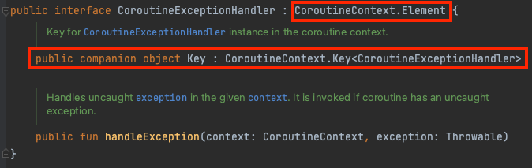
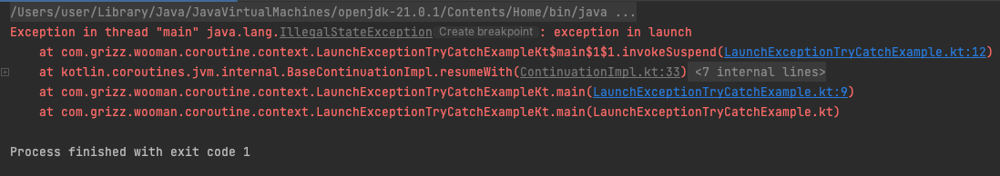
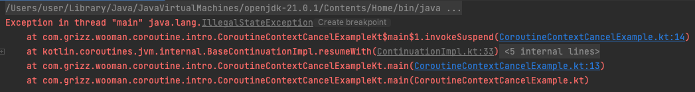

## 코루틴

코루틴(Coroutine)은 Co(함께, 서로) + routine(규칙적 작업의 집합) 2개가 합쳐진 단어로 함께 동작하며 규칙이 있는 작업의 집합을 의미한다.

왜 `Koroutine`이 아니라 `Coroutine`인지 의아할 수 있는데 코루틴은 코틀린만의 것이 아니다. Python, C#, Go, Javascript 등 다양한 언어에서 지원하는 개념이다.

JS의 async, await도 동일한 개념이고 코루틴은 프로그래밍 초창기부터 존재하던 개념이다.

## Kotlin Coroutines

코틀린에서는 코루틴을 위한 공식 라이브러리(`kotlinx.coroutines`)를 지원한다.

아래는 Kotlin Coroutines의 특징이다.
- 동시성을 위한 기능을 제공
- Async Non-blocking으로 동작하는 코드를 동기 방식으로 작성할 수 있도록 지원
  - 코틀린 컴파일러에서 바이트 코드를 비동기 방식으로 변경
- CoroutineContext를 통해 Dispatcher, Error handling, ThreadLocal 등을 지원
- CoroutineScope를 통해 Structured concurrency, Cancellation 제공
- flow, channel 등의 심화 기능 제공

## CoroutineContext

이전 포스팅에서 코틀린 컴파일러는 `suspend` 키워드가 있는 함수를 `Continuation` 인터페이스 기반의 CPS를 구현해준다고 했다.

```kotlin
public interface Continuation<in T> {
    public val context: CoroutineContext
    public fun resumeWith(result: Result<T>)
}
```

`Continuation`은 1개의 CoroutineContext를 포함한다. CoroutineContext는 자식 코루틴에 상태와 동작을 전파한다.
- Coroutine 이름
- CoroutineDispatcher
- ThreadLocal
- CoroutineExceptionHandler

자식 코루틴이 코루틴 컨텍스트를 꺼내는 방법은 아래와 같다.
- Scope를 통한 접근
- Continuation을 통한 접근

예시 코드는 아래와 같다.

```kotlin
fun main() {
    runBlocking {
        log.info("context (Scope를 통한 호출): {}", this.coroutineContext)
        sub()
    }
}
private suspend fun sub() {
    log.info("context (Continuation를 통한 호출): {}", coroutineContext)
}
```

CoroutineContext는 병합하거나 분해할 수 있다.
- EmptyCoroutineContext: Element가 없는 상태
- Element: Element가 하나인 상태
- CombinedContext: Element가 2개 이상인 상태
- Key: Element를 구분할 때 사용하는 식별자

아래는 CoroutineContext 인터페이스이다.

```kotlin
public interface CoroutineContext {
    public operator fun <E : Element> get(key: Key<E>): E?

    public fun <R> fold(initial: R, operation: (R, Element) -> R): R
    
    public operator fun plus(context: CoroutineContext): CoroutineContext
    
    public fun minusKey(key: Key<*>): CoroutineContext
    
    public interface Key<E : Element>
}
```

아래 코드를 실행해보자.

```kotlin
fun main() {
    val handler = CoroutineExceptionHandler { _, e ->
        log.error("exception caught in handler")
    }

    val context1 = CoroutineName("custom name") +
            Dispatchers.IO +
            Job() +
            handler
    log.info("context: {}", context1)

    val context2 = context1.minusKey(CoroutineExceptionHandler)
    log.info("context2: {}", context2)

    val context3 = context2.minusKey(Job)
    log.info("context3: {}", context3)

    val context4 = context3.minusKey(CoroutineDispatcher)
    log.info("context4: {}", context4)

    val context5 = context4.minusKey(CoroutineName)
    log.info("context5: {}", context5)
}
```

아래는 결과이다. 
```kotlin
22:43 [main] - context: [CoroutineName(custom name), JobImpl{Active}@5c1a8622, com.grizz.wooman.coroutine.context.ContextMinusExampleKt$main$$inlined$CoroutineExceptionHandler$1@5ad851c9, Dispatchers.IO]
22:43 [main] - context2: [CoroutineName(custom name), JobImpl{Active}@5c1a8622, Dispatchers.IO]
22:43 [main] - context3: [CoroutineName(custom name), Dispatchers.IO]
22:43 [main] - context4: CoroutineName(custom name)
22:43 [main] - context5: EmptyCoroutineContext
```

아래와 같이 각 코루틴 컨텍스트의 요소들은 `Element`를 상속하고, 내부적으로 가진 Key를 통해 관리된다.



이를 활용하면 코루틴 내부에서 값을 전달할 때 사용하는 것도 가능하다.

다음은 Job에 대해 알아보자.

## Job

CoroutineContext의 요소중 하나인 Job이다. Job은 Coroutine의 생명주기를 관리한다.

아래는 코드를 보자.

```kotlin
public interface Job : CoroutineContext.Element {
    public companion object Key : CoroutineContext.Key<Job>
    
    public val parent: Job?
    
    public val isActive: Boolean
    
    public val isCompleted: Boolean
    
    public val isCancelled: Boolean
    
    public fun start(): Boolean
    
    public fun cancel(cause: CancellationException? = null)

    public val children: Sequence<Job>
}
```

CoroutineContext의 Job에 대한 설명은 아래와 같다.

- Active, Completed, Cancelled와 같은 상태를 갖는다.
- 명시적으로 시작이나 취소를 할 수 있다.
- child를 통해서 다른 Job의 생명주기를 관리한다.
- launch, async 등의 coroutine builder를 통해 자식 Job을 생성가능하다.

#### CoroutineDispatcher

CoroutineDispatcher는 코루틴을 어떤 Thread에게 보낼 지 결정한다.

- Dispatcher.Default
  - CPU 개수 만큼 스레드를 생성
  - 리스트를 정렬하거나 Json Parsing 등 가공 작업에 주로 사용
  - CPU를 많이 사용하는 무거운 작업에 최적화
  - 현재는 CommonPool이 사용되며, 쓰레드 풀의 최대 크기가 시스템 코어수-1이다.
- Dispatcher.Main
    - 화면 UI 작업을 위해 사용
    - Android 개발 모듈에서 주로 사용하고, 일반적으로 서버 개발에서는 사용할 수 없다.
- Dispatcher.IO
  - 최대 64개까지 늘어나는 가변 크기의 쓰레드 풀을 가진다.
  - 네트워크 DB 작업할 경우 사용 (I/O 블로킹을 메인 쓰레드에서 격리시키기 위해 사용)
  - 읽기, 쓰기 작업에 최적화
  - Thread를 Block할 필요가 있는 경우

Default와 IO 디스패처 간 차이는 쓰레드 풀의 쓰레드 개수 설정에 있다.
복잡한 연산의 경우 CPU를 많이 사용하므로 쓰레드 개수가 많이 필요하지 않다. 반면, I/O 작업의 경우 CPU를 많이 점유하지 않고 쓰레드를 많이 필요로 한다.

Dispatcher는 작업의 특성에 맞게 적절히 선택해야 한다고 생각하면 된다. (필요한 경우 ThreadPoolExecutor를 생성한 후 그걸 사용해서 Dispatcher를 생성하면 된다.)

#### Default와 IO가 쓰레드가 동일한 이유

아래 코드를 실행해보면 어떻게 될까?

```kotlin
fun main() {
    runBlocking {
        withContext(Dispatchers.Default) {
            log.info("thread: {}", Thread.currentThread().name)
            log.info("dispatcher: {}", this.dispatcher())
        }

        withContext(Dispatchers.IO) {
            log.info("thread: {}", Thread.currentThread().name)
            log.info("dispatcher: {}", this.dispatcher())
        }
    }
}
```

아래는 결과이다.

```
11:42 [DefaultDispatcher-worker-1] - thread: DefaultDispatcher-worker-1
11:42 [DefaultDispatcher-worker-1] - dispatcher: Dispatchers.Default
11:42 [DefaultDispatcher-worker-1] - thread: DefaultDispatcher-worker-1
11:42 [DefaultDispatcher-worker-1] - dispatcher: Dispatchers.IO
```

Dispatchers.Default와 Dispatchers.IO는 **동일한 쓰레드 풀**을 사용한다. 대신 **동시에 수행 가능한 쓰레드 수**가 다른 것이다.


## ThreadLocal

아래 코드를 실행해보자.

```kotlin
fun main() {
    val threadLocal = ThreadLocal<String>()
    threadLocal.set("hello")

    runBlocking {
        log.info("thread: {}", Thread.currentThread().name)
        log.info("threadLocal: {}", threadLocal.get())

        launch(Dispatchers.IO) {
            log.info("thread: {}", Thread.currentThread().name)
            log.info("threadLocal: {}", threadLocal.get())
        }
    }
}
```

아래는 실행 결과이다.

```
34:21 [main] - thread: main
34:21 [main] - threadLocal: hello
34:21 [DefaultDispatcher-worker-1] - thread: DefaultDispatcher-worker-1
34:21 [DefaultDispatcher-worker-1] - threadLocal: null
```

`runBlocking`의 경우 main 쓰레드가 동작하고, `launch`에서는 `Dispatchers.IO`륾 명시해서 `DefaultDispatcher-worker-1` 스레드에서 코루틴이 실행되고 있다. 당연히 ThreadLocal에서 값을 꺼낼 수 없다.

다른 쓰레드에서 코루틴을 실행할 때 threadLocal을 유지할 수 있는 방법이 있다. `ThreadLocalElement`를 활용하면 된다.

아래 코드는 `Dispatcher.IO`를 사용해서 별도 Thread에서 코루틴을 수행한다.

```kotlin
val threadLocal = ThreadLocal<String>()
threadLocal.set("hello")
log.info("thread: {}", Thread.currentThread().name)
log.info("threadLocal: {}", threadLocal.get())

runBlocking {
    val context = CoroutineName("custom name") +
            Dispatchers.IO +
            threadLocal.asContextElement()

    launch(context) {
        log.info("thread: {}", Thread.currentThread().name)
        log.info("threadLocal: {}", threadLocal.get())
        log.info("coroutine name: {}",
            coroutineContext[CoroutineName])
    }
}
```

하지만 결과는 코루티 내부에서도 아래와 같이 threadLocal 값이 잘 할당되어 있다.

```kotlin
12:31 [main] - thread: main
12:31 [main] - threadLocal: hello
12:31 [DefaultDispatcher-worker-1] - thread: DefaultDispatcher-worker-1
12:31 [DefaultDispatcher-worker-1] - threadLocal: hello
12:31 [DefaultDispatcher-worker-1] - coroutine name: CoroutineName(custom name)
```

해당 부분은 `threadLocal.asContextElement()`를 사용해서 `ThreadLocalElement`를 만들어서 CoroutineContext에 추가했기 때문이다.
`kotlinx.coroutines.ThreadContextElement`를 사용하면 해당 ThreadLocal을 보존할 수 있다.


#### CoroutineExceptionHandler

Coroutine에서의 Exception을 알아보자.

아래 코드를 보자.

```kotlin
fun main() {
    runBlocking {
        try {
            launch {
                throw IllegalStateException("exception in launch")
            }
        } catch (e: Exception) {
            log.error("not caught maybe")
        }
    }
}
```

결과를 보면 예외가 Catch 되지 않는다.



Coroutine은 Job을 통해서 Exception을 전파하는 방식이기 때문이다.

**CoroutineExceptionHandler**는 CoroutineContext 요소 중 하나이고, 코루틴 내부의 Exception을 핸들링하는 기능을 제공한다.

아래 코드를 보자.

```kotlin
fun main() {
    val handler = CoroutineExceptionHandler { _, e ->
        log.error("not caught maybe")
    }
    runBlocking {
        CoroutineScope(handler).launch {
            throw IllegalStateException("exception in launch")
        }
    }
}
```

결과 아래와 같이 잘 에러가 핸들링된다.

```
24:40 [DefaultDispatcher-worker-1] - not caught maybe
```

#### 주의사항

CoroutineExceptionHandler는 아래의 주의사항이 있다.
- main runBlocking에서 launch되는 코루틴에서는 동작하지 않는다.
  - 자식 코루틴에서 Exception이 발생하면 부모 코루틴이 취소되어 Exception을 Handling 할 수 없다.
  - 자세한 내용은 [공식 문서](https://kotlinlang.org/docs/exception-handling.html#cancellation-and-exceptions)를 읽어보길 권장한다.
- 루트가 아닌 코루틴에 적용되는 핸들러는 무시된다.
- async에는 적용할 수 없다.

아래 코드를 보자.

```kotlin
fun main() {
    val handler = CoroutineExceptionHandler { _, e ->
        log.error("custom exception handle: {${e.javaClass}}")
    }
    runBlocking(handler) {
        throw IllegalStateException()
    }
}
```



Exception이 핸들링 되지 않는다.

아래에서는 CoroutineScope를 로 별도로 추가해서 사용했다.

```kotlin
runBlocking {
    val context = CoroutineName("custom name") +
            CoroutineExceptionHandler { _, e ->
                log.error("custom exception handle: {${e.javaClass}}")
            }

    CoroutineScope(Dispatchers.IO).launch(context) {
        throw IllegalStateException()
    }
    
}
```

결과는 아래와 같다.

```
22:10 [DefaultDispatcher-worker-1]
    custom exception handle: {class java.lang.IllegalStateException}
```

Exception이 잘 핸들링 되었다.

## Structured concurrency

아래 비동기 코드를 보자.

```kotlin
private fun nonStructured() {
    log.info("step 1")
    CompletableFuture.runAsync {
        Thread.sleep(1000)
        log.info("Finish run1")
    }
    log.info("step 2")
    CompletableFuture.runAsync {
        Thread.sleep(100)
        log.info("Finish run2")
    }
    log.info("step 3")
}

fun main() {
    log.info("Start main")
    nonStructured()
    log.info("Finish main")
    Thread.sleep(3000)
}
```

실행 결과는 아래와 같다.

```
18:39 [main] - Start main
18:39 [main] - step 1
18:39 [main] - step 2
18:39 [main] - step 3
18:39 [main] - Finish main
18:39 [ForkJoinPool.commonPool-worker-2] - Finish run2
18:40 [ForkJoinPool.commonPool-worker-1] - Finish run1
```

비동기 코드는 실행하는 채로 흐름을 그대로 가져가고 있다.

다음은 코루틴 코드를 보자.

```kotlin
private suspend fun structured() = coroutineScope {
    log.info("step 1")
    launch {
        delay(1000)
        log.info("Finish launch1")
    }
    log.info("step 2")
    launch {
        delay(100)
        log.info("Finish launch2")
    }
    log.info("step 3")
}

fun main() = runBlocking {
    log.info("Start runBlocking")
    structured()
    log.info("Finish runBlocking")
}
```

아래는 실행 결과이다.

```
20:54 [main] - Start runBlocking
20:54 [main] - step 1
20:54 [main] - step 2
20:54 [main] - step 3
20:54 [main] - Finish launch2
20:55 [main] - Finish launch1
20:55 [main] - Finish runBlocking
```

비동기 코드와 결과가 다른 점이 있는데, 코드의 마지막에 호출한 `Finish runBlocking`이 마지막에 호출된다는 것이다.

이를 **구조화된 동시성(Structured concurrency)** 이라 한다. `coroutineScope` 키워드를 사용함으로써 **자식 코루틴(별도 쓰레드의 동작들)이 모두 종료되어야 해당 코루틴이 끝난 것으로 처리**된다. 

구조화된 동시성의 또 하나의 특징은 **cancel이 발생하면 자식 coroutine까지 전파**한다는 점이다.

아래 코드를 보자.

````kotlin
private suspend fun structured() = coroutineScope {
    launch {
        try {
            delay(1000)
            log.info("Finish launch1")
        } catch (e: CancellationException) {
            log.info("Job1 is cancelled")
        }
    }

    launch {
        try {
            delay(500)
            log.info("Finish launch2")
        } catch (e: CancellationException) {
            log.info("Job2 is cancelled")
        }
    }
    
    this.cancel()
}

fun main() = runBlocking {
    log.info("Start runBlocking")
    try {
        structured()
    } catch (e: CancellationException) {
        log.info("Job is cancelled")
    }
    log.info("Finish runBlocking")
}
````

`structured()`를 보면 마지막에 `cancel()`을 호출하고 있다. 아래는 실행 결과이다.

```
26:57 [main] - Start runBlocking
26:57 [main] - Job1 is cancelled
26:57 [main] - Job2 is cancelled
26:57 [main] - Job is cancelled
26:57 [main] - Finish runBlocking
```

내부 코루틴에서도 `CancellationException`이 발생해서 로그가 찍힌 것을 볼 수 있다.

## 심화 기능

#### flow

코틀린은 Reactor의 `Flux`와 유사한 `Flow`를 제공한다. Flow를 사용하여서 block 내에서 suspend 함수를 실행한다.

```kotlin
private fun range(n: Int): Flow<Int> {
    return flow {
        for (i in 0 until n) {
            delay(100)
            emit(i)
        }
    }
}

fun main() = runBlocking {
    log.info("Start runBlocking")
    range(5).collect {
        log.info("item: {}", it)
    }
    log.info("Finish runBlocking")

}
```

`emit`을 통해 값을 전달하면 받는 쪽에서 `collect`를 사용해서 item을 사용할 수 있다.

Flux처럼 다양한 연산도 제공하고 있다.
- 중간 연산자 - map, flatMap, take, drop, transform
- 종료 연산자 - collect, toList, toSet, reduce, fold, first, single

#### channel

채널은 파이프라인을 생각하면 된다. 채널은 아래 특징을 가진다.
- send와 receive가 가능하다.
- 여러 coroutine, thread에서 동시에 실행해도 안전하다.
- capacity와 BufferOverflow 인자를 전달하여 크기를 조절할 수 있다.

아래 코드를 보자.

```kotlin
suspend fun main() = runBlocking {
    val channel = Channel<Int>()
    launch {
        delay(100)

        for (i in 0 until 5) {
            channel.send(i)
        }
        channel.close()
    }

    delay(500)

    for (i in channel) {
        log.info("item: {}", i)
    }
}
```

for를 사용해서 channel의 값을 꺼내어서 사용할 수 있다.

Channel을 사용하면 실시간으로 값을 공유하고 전달받아야 할 때 유용하게 사용할 수 있다.

## 참고

- https://fastcampus.co.kr/courses/216172
- https://kotlinlang.org/docs/coroutines-overview.html