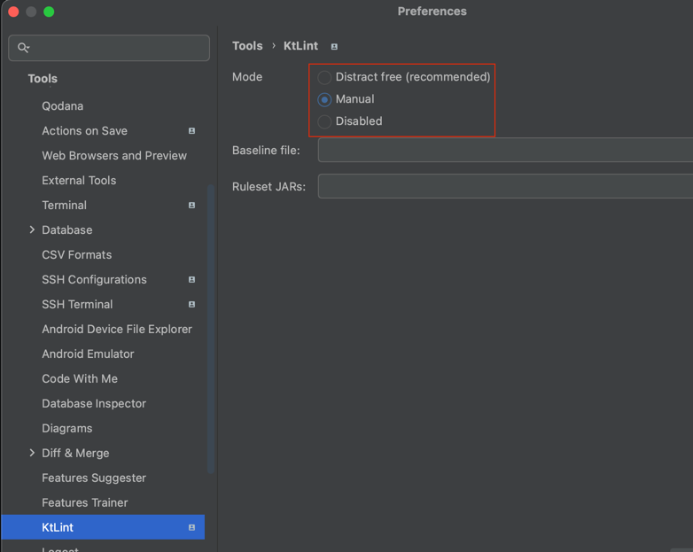
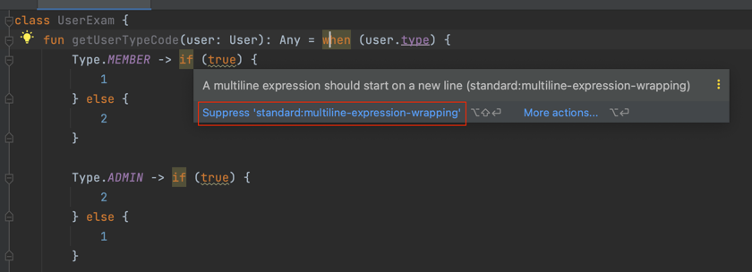
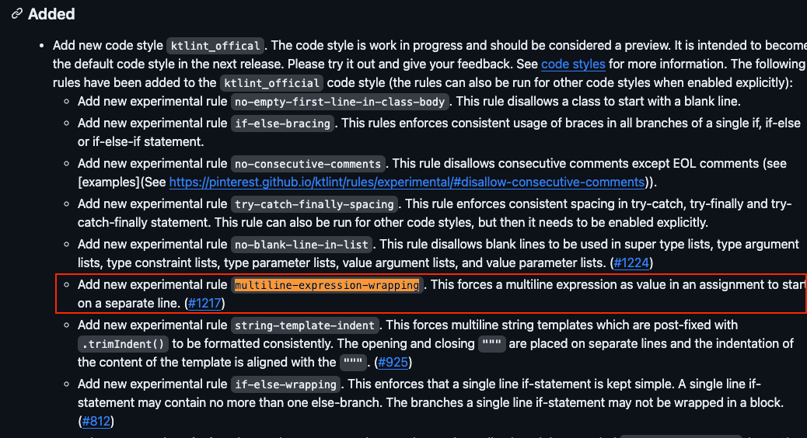
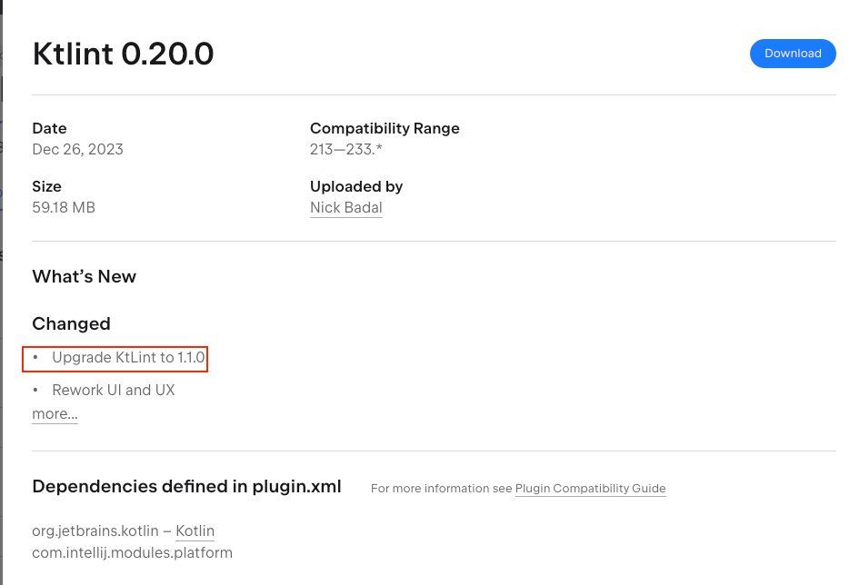
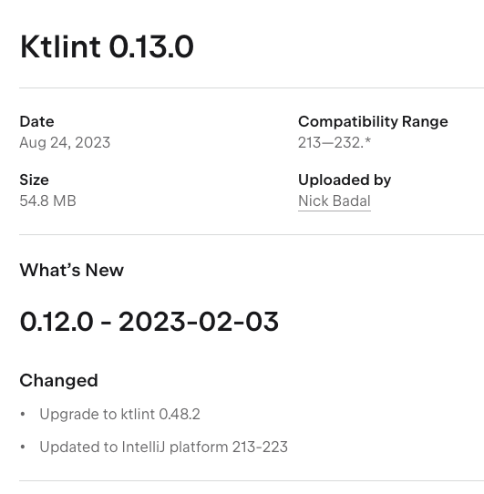
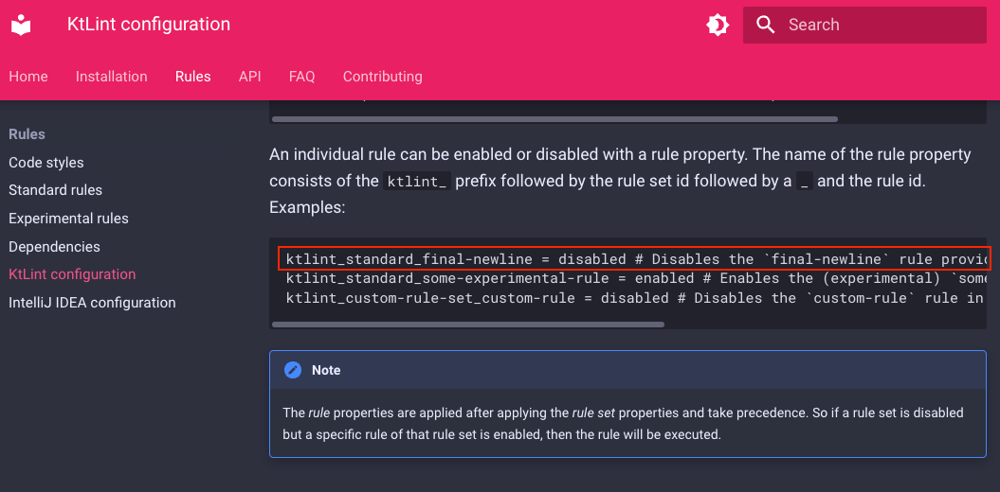

새로 합류한 팀에서 ktlint를 적용하다가 생긴 문제와 해결 방법에 대해 공유한다.

현재 팀에서 **IntelliJ의 Ktlint 플러그인**을 사용하고 있고 **Actions on Save 기능**을 사용해서 코드를 저장할 때마다 코드 스타일을 반영한다.

그런데 **나한테만 기존 코드의 변경사항이 너무 많았다.** 자꾸 **라인이 아래와 같이 추가**되고 있었다.

## 라인 추가되는 이슈

아래는 기존의 코드이다.

```kotlin
fun getUserTypeCode(user: User): Any = when (user.type) {
    Type.MEMBER -> if (true) { 1 } else { 2 }
    Type.ADMIN -> if (true) { 2 } else { 1 }
}
```

다른 팀원들 모두 이슈가 없는데, 내가 저장하면 아래와 같이 코드가 변경된다.

```kotlin
fun getUserTypeCode(user: User): String =
        when (user.type) {
            Type.MEMBER ->
                if (true) {
                    1
                } else {
                    2
                }

            Type.ADMIN ->
                if (true) {
                    2
                } else {
                    1
                }
        }
```

처음에는 CodeStyle이 문제인 줄 알았는데, Ktlint를 끄니까 변경되지 않는 것을 확인했다.

즉, Ktlint가 문제였다.

## 원인 확인

Ktlint 공식문서를 뒤져보다가 아래 부분을 발견했다.
- https://pinterest.github.io/ktlint/0.49.1/rules/experimental/#multiline-expression-wrapping

해당 기능이 내가 겪는 문제와 매우 유사했다. 우변이 Multi-line이면 NewLine에서 시작하게 해주는 기능이라고 한다.

문서에도 아래와 같이 설명이 나와있었다.

```kotlin
// AS-IS
val foo = foo(
        parameterName = "The quick brown fox "
                .plus("jumps ")
                .plus("over the lazy dog"),
)

// TO-BE
val foo =
        foo(
                parameterName =
                "The quick brown fox "
                        .plus("jumps ")
                        .plus("over the lazy dog"),
        )
```

Ktlint 플러그인의 Mode를 Manual로 바꾸면 저장할 때 코드를 반영하지 않고, 경고를 표시해준다.



경고를 보니까 실제로도 multiline-expression-wrapping 룰 때문에 문제가 되는 것을 알 수 있었다.



그런데 왜 문제가 나한테만 적용될까 하는 것이었다.

나는 그 원인을 Ktlint의 Github Repository의 `CHANGELOG.md`에서 찾았다.
- https://github.com/pinterest/ktlint/blob/master/CHANGELOG.md

## 버전 이슈

`multiline-expression-wrapping` 키워드로 검색한 결과 라이브러리 버전 **`0.49.0`**부터 해당 rule이 도입되었다는 것을 알 수 있었다.



내가 사용하는 Ktlint 플러그인은 `0.20.0` 버전이라서 라이브러리 기준 `1.1.0` 버전이다.



반면, 다른 팀원들이 사용하는 Ktlint 플러그인 버전은 `0.13.0` 버전이라서 라이브러리 기준 **`0.48.2`** 버전이었다.

팀원들의 Ktlint 버전은 라이브러리 기준 0.49.0 이전이라서 해당 옵션이 지원되지 않아 줄 변경이 없었던 것이다.



정리하면 IntelliJ 버전에 따른 Ktlint 플러그인의 버전 차이였다. 나는 신규 버전의 IntelliJ를 설치했었다.

## 해결

해당 사항을 팀원들에게 공유했고, IntelliJ를 업그레이드 한 분도 있었고 유지하시는 분도 있었다.

그래서 해당 Option을 끌 수 있는 방법을 찾기로 했다. 과거 버전을 쓰는 팀원을 위해서도 있지만, 애초에 newLine이 생소하고 가독성이 떨어진다는 의견이 많았다.

Ktlint는 `.editorconfig` 파일을 사용하므로 Project의 root에 해당 파일을 생성한다.

그리고 공식 문서에 룰을 설정하는 방법이 있다. 해당 옵션의 경우 StandardRule 이라서 아래와 같이 작성하면 된다. 



```
[*.{kt,kts}]
# 우변이 Multi Line일 경우 새로운 Line에서 시작 (off)
ktlint_standard_multiline-expression-wrapping: disabled
# 함수 파라미터 각각 새로운 Line 할당 (off)
# 함수 정의 시 반환 값 Line을 새로운 Line에서 시작 (off)
ktlint_standard_function-signature: disabled
```

반영 후 더 이상 문제가 재현되지 않았다.

## 마무리

협업하는 팀원들끼리의 Coding Convention을 위해 CodeStyle과 Ktlint 같은 도구를 많이 사용한다.
- (혹시 사용하지 않고 있다면, 강력하게 추천한다!!)

버전의 차이로 인해서 팀원과 Rule이 다른 부분이 발생할 수 있다.

이 부분은 `.editorconfig`에서 Rule을 명시하거나 버전을 맞추면 해결할 수 있다.
