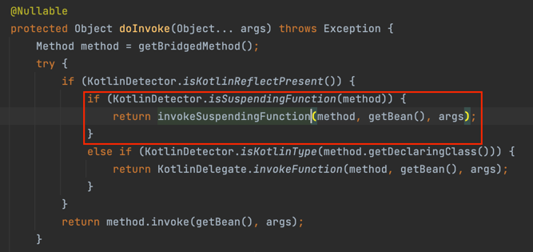
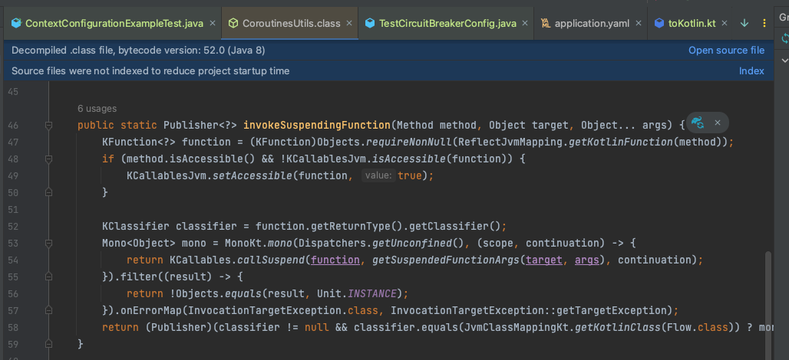

## runBlocking 제거하기

기존재하던 프로젝트에 투입되어서 코틀린과 코루틴을 처음 접하는 경우가 많을 것이다.

코틀린과 코루틴이 익숙하지 않을 때 대부분 Controller 메서드의 시작이 `runBlocking()`이 되어있고, 사실상 코루틴은 `runBlocking()`, `runCatching()` 밖에 존재하지 않는 경우가 대다수이다.  

나도 동일한 상황이었고 그랬고, '코루틴을 사용할 때의 이점을 하나도 못누리고 있는 것은 아닐까..?' 하는 생각을 가지게 되었다.

## runBlocking

아래는 `runBlocking`에 대한 docs의 일부이다.

> Runs a new coroutine and blocks the current thread interruptibly until its completion.

해당 docs를 읽어보면 `runBlocking`은 실행한 Thread를 작업이 완료할 때까지 Blocking 한다는 것을 알 수 있다. 즉, 기존의 동기코드와 동일하게 동작한다는 것이다.

## Problem

일반적으로 코루틴을 사용하는 이유는 병렬 프로그래밍을 쉽고 편리하게 하기 위해서이다. `runBlocking` 만을 사용한다면 동기 코드를 더 복잡하게만 만드는 행위일 수 있다.

아래는 공식 문서의 설명이다.

> The name of `runBlocking` means that the thread that runs it (in this case — the main thread) gets **blocked** for the duration of the call, until all the coroutines inside `runBlocking { ... }` complete their execution. You will often see `runBlocking` used like that at the very top-level of the application and quite rarely inside the real code, as threads are expensive resources and blocking them is inefficient and is often not desired.

가장 중요한 부분은 아래와 같다.

> 쓰레드는 값비싼 자원이고, 이를 차단하는 것은 일반적으로 비효율적이다. 그렇기 때문에  최상위 수준에서 사용되는 `runBlocking`은 실제로 거의 사용되지 않는다.

즉, `runBlocking`을 Controller method처럼 상위에서 사용하는 것은 코루틴의 이점을 활용하지 못한다는 것을 의미한다.

## Spring MVC (+Webflux)

Spring Webflux가 Controller의 suspend 메서드를 지원하는 것은 익히 알고 있다. Spring Webflux를 사용한다면 Controller 메서드에서는 `runBlocking` 메서드를 호출할 필요가 없다.

```kotlin
@RestController
@RequestMapping("/hello")
class HelloController {
    private val log = logger<HelloController>()

    @GetMapping
    suspend fun hello() {
        log.info("context: {}", coroutineContext)
        log.info("thread: {}", Thread.currentThread().name)
    }
}
```

해당 컨트롤러에 요청을 보내보면 아래 로그가 찍힌다.

```kotlin
34:31 [reactor-http-nio-2] - context:
    [Context1{reactor.onDiscard.local= reactor.core.publisher.Operators$$Lambda/0x0000000123657b60@7bbfcea9}, 
    MonoCoroutine{Active}@35a52e8a, Dispatchers.Unconfined]
34:31 [reactor-http-nio-2] - thread: reactor-http-nio-2
```

실제로 `spring-web` 라이브러리를 보면 suspend 함수에 대해서 아래와 같이 `invoke`를 통해 처리하고 있다.



`invokeSuspendingFunction()`는 내부적으로 `Mono`로 감싸서 함수를 처리하게 된다.



즉, Spring Webflux에서 쓰레드 모델의 역할을 어느정도 책임지겠다는 것이다.

그렇다면 Spring Mvc에서는 어떻게 할까?
