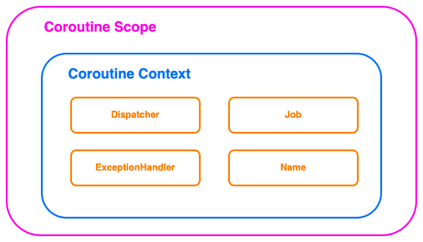

코루틴 스코프에 대해 이해하기 전에 코루틴의 Spec에 대해 알아보자.

## AbstractCoroutine

모든 Coroutine은 AbstractCoroutine을 상속한다.

```kotlin
public abstract class AbstractCoroutine<in T>(
    parentContext: CoroutineContext,
    initParentJob: Boolean,
    active: Boolean
) : JobSupport(active), Job, Continuation<T>, CoroutineScope { ... }
```

아래는 Coroutine의 특징이다.
- Coroutine은 Job, Continuation, CoroutinScope를 구현한다.
- CoroutineScope: Coroutine builder로 자식 Coroutine을 생성하고 관리

## CoroutineScope

CoroutineScope는 Coroutine들에 대한 Scope를 정의한다.
- 각 Coroutine들은 Scope를 가진다.
- Scope는 자식 Coroutine들에 대한 생명주기를 관리한다.
- 자식 Coroutine이 모두 완료되어야 Scope도 완료된다.
- 내부 CoroutineContext에 Job을 반드시 포함되어야 한다.

CoroutineScope는 CoroutineContext를 가지는 범위라고 생각하면 된다. Scope를 통해 자식 코루틴에게 CoroutineContext를 전파할 수 있는 것이다.



## Coroutine Builder

Coroutine Builder는 CoroutineScope로부터 Coroutine을 생성한다. 생성된 Coroutine은 비동기로 동작하게 된다.

대표적인 예시로 launch가 있다.

#### launch

launch의 동작은 아래와 같다.

```kotlin
public fun CoroutineScope.launch(
    context: CoroutineContext = EmptyCoroutineContext,
    start: CoroutineStart = CoroutineStart.DEFAULT,
    block: suspend CoroutineScope.() -> Unit
): Job {
    // 새로운 Context를 생성
    val newContext = newCoroutineContext(context)
    // 새로운 Context로 코루틴 생성
    val coroutine = if (start.isLazy)
        LazyStandaloneCoroutine(newContext, block) else
        StandaloneCoroutine(newContext, active = true)
    coroutine.start(start, coroutine, block)
    return coroutine
}
```

기존 Context를 활용해서 새로운 Context를 만든다.

아래 코드를 보자.

```kotlin
fun main() {
    runBlocking {
        val cs = CoroutineScope(EmptyCoroutineContext)
        log.info("job: {}", cs.coroutineContext[Job])

        val job = cs.launch {
            // coroutine created
            delay(100)
            log.info("context: {}", this.coroutineContext)
            log.info("class name: {}", this.javaClass.simpleName)
            log.info("parentJob: {}", this.coroutineContext[Job]?.parent)
        }
        log.info("start")
        job.join()
        log.info("finish")
    }
}
```

실행 결과는 아래와 같다.

```
40:43 [main] - job: JobImpl{Active}@229d10bd
40:43 [main] - start
40:43 [DefaultDispatcher-worker-1] - context: [StandaloneCoroutine{Active}@15439c7c, Dispatchers.Default]
40:43 [DefaultDispatcher-worker-1] - class name: StandaloneCoroutine
40:43 [DefaultDispatcher-worker-1] - parentJob: JobImpl{Active}@229d10bd
40:43 [main] - finish
```

launch를 실행한 Job과 launch 자식 Context Job의 부모가 동일함을 알 수 있다.

다음으로 아래 코드를 보자.

```kotlin
fun main() {
    runBlocking {
        val parent = launch {
            launch {
                delay(100)
                log.info("finish sub1")
            }
            launch {
                delay(100)
                log.info("finish sub2")
            }
            launch {
                delay(100)
                log.info("finish sub3")
            }
        }

        log.info("parent start")
        parent.join()
        log.info("parent end")
    }
}
```

아래는 결과이다.

```kotlin
35:16 [main] - parent start
35:16 [main] - finish sub1
35:16 [main] - finish sub2
35:16 [main] - finish sub3
35:16 [main] - parent end
```

sub 잡이 모두 실행된 후 `parent.join()`이 완료로 처리된다. 이는 부모 Job이 자식 Job의 생명주기를 관리한다는 것을 의미한다.

launch는 비동기적으로 동작한다. 하지만, `join()`이 완료될 때까지 suspend가 되어서 end는 잡이 실행된 이후에 실행된다.

#### async

launch와 유사한 메서드로 async가 있다.

```kotlin
public fun <T> CoroutineScope.async(
    context: CoroutineContext = EmptyCoroutineContext,
    start: CoroutineStart = CoroutineStart.DEFAULT,
    block: suspend CoroutineScope.() -> T
): Deferred<T> {
    val newContext = newCoroutineContext(context)
    val coroutine = if (start.isLazy)
        LazyDeferredCoroutine(newContext, block) else
        DeferredCoroutine<T>(newContext, active = true)
    coroutine.start(start, coroutine, block)
    return coroutine
}
```

launch와의 유일한 차이는 Job을 반환하는 것이 아니라 Deffered를 반환하는 것이다.

Deffered 인터페이스는 아래와 같다.

```kotlin
public interface Deferred<out T> : Job {
    public suspend fun await(): T
}
```

Deffered는 `await()`을 통해 원하는 시점 반환하는 값에 접근할 수 있다.

## Structured concurrency

동시성 코드를 구조적으로 작성하는 **동시성 프로그래밍 패러다임**을 Structured Concurrency라고 부른다.

CoroutineScope는 Structured concurrency를 적용하고 있다.

아래 비동기 코드를 보자.

```kotlin
private fun nonStructured() {
    log.info("step 1")
    CompletableFuture.runAsync {
        Thread.sleep(1000)
        log.info("Finish run1")
    }
    log.info("step 2")
    CompletableFuture.runAsync {
        Thread.sleep(100)
        log.info("Finish run2")
    }
    log.info("step 3")
}

fun main() {
    log.info("Start main")
    nonStructured()
    log.info("Finish main")
    Thread.sleep(3000)
}
```

실행 결과는 아래와 같다.

```
18:39 [main] - Start main
18:39 [main] - step 1
18:39 [main] - step 2
18:39 [main] - step 3
18:39 [main] - Finish main
18:39 [ForkJoinPool.commonPool-worker-2] - Finish run2
18:40 [ForkJoinPool.commonPool-worker-1] - Finish run1
```

비동기 코드는 실행하는 채로 흐름을 그대로 가져가고 있다. 주목해야 할 점은 "Finish main"보다 "Finish run"이 늦게 출력된다.

다음은 코루틴 코드를 보자.

```kotlin
private suspend fun structured() = coroutineScope {
    log.info("step 1")
    launch {
        delay(1000)
        log.info("Finish launch1")
    }
    log.info("step 2")
    launch {
        delay(100)
        log.info("Finish launch2")
    }
    log.info("step 3")
}

fun main() = runBlocking {
    log.info("Start runBlocking")
    structured()
    log.info("Finish runBlocking")
}
```

아래는 실행 결과이다.

```
20:54 [main] - Start runBlocking
20:54 [main] - step 1
20:54 [main] - step 2
20:54 [main] - step 3
20:54 [main] - Finish launch2
20:55 [main] - Finish launch1
20:55 [main] - Finish runBlocking
```

비동기 코드와 결과가 다른 점은 "Finish runBlocking"이 마지막에 출력된다는 것이다.

이렇게 여러 동시성 코드를 같은 생명주기를 갖게 만들고, 해당 동작들이 모두 완료되어야 다음 동작을 수행한다. 코루틴도 **자식 코루틴(별도 쓰레드의 동작들)이 모두 종료되어야 해당 코루틴이 끝난 것으로 처리**된다.

이를 **구조화된 동시성(Structured concurrency)** 이라 한다.

## Cancellation

구조화된 동시성의 또 하나의 특징은 **cancel이 발생하면 자식 coroutine까지 전파**한다는 점이다.

아래 코드를 보자.

````kotlin
private suspend fun structured() = coroutineScope {
    launch {
        try {
            delay(1000)
            log.info("Finish launch1")
        } catch (e: CancellationException) {
            log.info("Job1 is cancelled")
        }
    }

    launch {
        try {
            delay(500)
            log.info("Finish launch2")
        } catch (e: CancellationException) {
            log.info("Job2 is cancelled")
        }
    }
    
    this.cancel()
}

fun main() = runBlocking {
    log.info("Start runBlocking")
    try {
        structured()
    } catch (e: CancellationException) {
        log.info("Job is cancelled")
    }
    log.info("Finish runBlocking")
}
````

`structured()`를 보면 마지막에 `cancel()`을 호출하고 있다. 아래는 실행 결과이다.

```
26:57 [main] - Start runBlocking
26:57 [main] - Job1 is cancelled
26:57 [main] - Job2 is cancelled
26:57 [main] - Job is cancelled
26:57 [main] - Finish runBlocking
```

자식 코루틴에서도 `CancellationException`이 발생해서 로그가 찍힌 것을 볼 수 있다.

#### 방향

Job의 실패는 부모에서 자식으로는 전파되지만, 자식에서 부모로 전파되지는 않는다.

아래 코드를 보자.

```kotlin
fun main() {
    runBlocking {
        val parentJob = launch {
            val job1 = launch {
                try {
                    delay(1000)
                    log.info("job1 Success")
                } catch (e: Exception) {
                    log.info("job1 Cancelled")
                }
            }

            launch {
                try {
                    delay(1000)
                    log.info("job2 Success")
                } catch (e: Exception) {
                    log.info("job2 Cancelled")
                }
            }
            delay(100)
            job1.cancel()
        }
        parentJob.join()
        log.info("job is cancelled: {}", parentJob.isCancelled)
    }
}
```

실행 결과는 아래와 같다.

```bash
23:39 [main] - job1 Cancelled
23:40 [main] - job2 Success
23:40 [main] - job is cancelled: false
```

주목해야할 점은 아래와 같다.
- Job1을 취소했을 때 Job2는 취소되지 않았다.
- Job1을 취소했을 때 ParentJob은 취소되지 않았다.

Cancellation은 부모에서 자식으로는 전파되지만, 자식에서 부모로는 전파되지 않는다.

#### Exception

Cancellation은 자식에서 부모로 전파되지 않는다. 하지만 **예외가 터지는 경우**는 다르다.

아래 코드를 보면 parentJob이 job1, job2를 가지고, job1에서 예외를 발생시킨다.

```kotlin
fun main() {
    lateinit var job2: Job
    runBlocking {
        val parentJob = CoroutineScope(Dispatchers.Default).launch {
            launch {
                delay(100)
                throw IllegalStateException()
            }

            job2 = launch {
                try {
                    delay(1000)
                    log.info("job2 success")
                } catch (e: Exception) {
                    log.info("job2 Exception")
                }
            }
        }

        parentJob.join()
        log.info("job2 is cancelled: {}", job2.isCancelled)
        log.info("parentJob is cancelled: {}", parentJob.isCancelled)
    }
}
```

결과는 아래와 같다.

```bash
50:44 [DefaultDispatcher-worker-2] - job2 Exception
Exception in thread "DefaultDispatcher-worker-2" java.lang.IllegalStateException
	at com.grizz.wooman.coroutine.scope.LeafCoroutineExceptionExampleKt$main$1$parentJob$1$1.invokeSuspend(LeafCoroutineExceptionExample.kt:14)
	at kotlin.coroutines.jvm.internal.BaseContinuationImpl.resumeWith(ContinuationImpl.kt:33)
	at kotlinx.coroutines.DispatchedTask.run(DispatchedTask.kt:106)
	at kotlinx.coroutines.scheduling.CoroutineScheduler.runSafely(CoroutineScheduler.kt:584)
	at kotlinx.coroutines.scheduling.CoroutineScheduler$Worker.executeTask(CoroutineScheduler.kt:793)
	at kotlinx.coroutines.scheduling.CoroutineScheduler$Worker.runWorker(CoroutineScheduler.kt:697)
	at kotlinx.coroutines.scheduling.CoroutineScheduler$Worker.run(CoroutineScheduler.kt:684)
	Suppressed: kotlinx.coroutines.internal.DiagnosticCoroutineContextException: [StandaloneCoroutine{Cancelling}@7cbbb8d9, Dispatchers.Default]
50:44 [main] - job2 is cancelled: true
50:44 [main] - parentJob is cancelled: true
```

Job1에서 Exception이 발생해서 parentJob을 cancel 했고, parentJob의 자식인 Job2도 Cancel로 처리되었다. 자식 코루틴에서 Exception이 발생하면 부모까지 전파가되어서 Cancel이 되는 것이다.

참고로 `SupervisorJob`을 사용하면 Exception이 발생해도 Cancellation이 자식으로만 전파되고, 부모로는 전파되지 않는다.  

이렇게 부모 Job과 자식 Job 간의 생명주기(완료 여부, 취소 여부 등)를 어떻게 설정할 지 명시하는 것이 CoroutineScope로 이해하면 될 것 같다.

## 참고

- https://fastcampus.co.kr/courses/216172