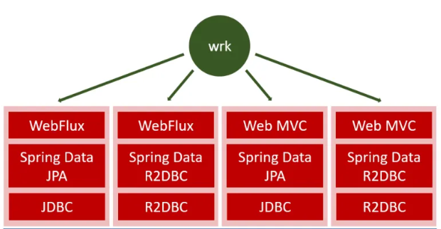

코루틴에서 트랜잭션을 적용하는 데 어려움을 겪는 케이스가 많다.

코루틴 + JPA 환경에서 `@Transactional` 애노테이션이 미동작했고, 해당 부분으로 인해 알게된 내용을 공유한다.

Spring I/O 2024에서 언급하는 내용도 참고했다.

## 스프링 - 트랜잭션 관리 방식


스프링에서 지원하는 트랜잭션 방식에 따라 크게 2가지로 방식이 있다.
- 선언적 트랜잭션
- 프로그래밍적 트랜잭션

선언적 트랜잭션(Declarative Transaction)이란 `@Transactional`과 같은 애노테이션을 기반으로 트랜잭션을 처리하는 방식을 말한다.

프로그래밍적 트랜잭션은(Programmatic Transaction)은 실제 로직에서 트랜잭션을 수행하는 방식을 말한다.

## 선언적 트랜잭션 vs 프로그래밍 트랜잭션

[공식문서](https://docs.spring.io/spring-framework/reference/data-access/transaction/tx-decl-vs-prog.html)를 보면 아래와 같이 명시되어있다.


해당 부분을 요약하면 다음과 같다.

**프로그래밍적 트랜잭션**은 트랜잭션 수가 적을 때에 한해서 좋다. 트랜잭션을 사용하는 곳이 적다면, 사용을 위해 스프링이나 프록시와 같은 기술을 신경쓰지 않을 수 있다.

반면, 트랜잭션 작업이 많은 경우 **선언적 트랜잭션**이 좋다. 선언적 트랜잭션 관리는 비즈니스 로직에 집중할 수 있게 도와주고 트랜잭션 처리가 비교적 간단하기 때문이다.

## JPA와 코루틴

Spring JPA와 코루틴을 사용할 때 문제가 발생한다.

하나씩 알아보자.

## 1. 트랜잭션 미동작

예시 코드에서 Repository는 JpaRepository를 사용한다.

```kotlin
interface OrderRepository : JpaRepository<Order, Long>
```

아래는 Service 클래스이다.

```kotlin
@Service
class OrderService(
    private val orderRepository: OrderRepository,
) {
    @Transactional
    suspend fun submit(
        id: Long,
        throwException: Boolean = false,
    ) {
        val order = orderRepository.findById(id).get()
        order.submit()
        orderRepository.save(order)
        if (throwException) {
            throw IllegalStateException("테스트 위한 에러")
        }
    }

    @Transactional
    fun submitNotSuspend(
        id: Long,
        throwException: Boolean = false,
    ) {
        val order = orderRepository.findById(id).get()
        order.submit()
        orderRepository.save(order)
        if (throwException) {
            throw IllegalStateException("테스트 위한 에러")
        }
    }
}
```

throwException 파라미터에 true가 들어오면 예외를 발생할 것이고, 지난 변경사항을 롤백할 것이다. 2개 메서드는 동일하고 1개는 suspend 함수이고 나머지 1개는 일반 메서드이다.

아래는 데이터 Write가 정상적으로 수행되는 지와 예외가 발생했을 때 롤백이 되는 지에 대한 테스트 코드이다.

```kotlin
@SpringBootTest
class OrderServiceTest {
    @Autowired
    private lateinit var orderService: OrderService

    @Autowired
    private lateinit var orderRepository: OrderRepository
    
    @Test
    fun `정상 저장 테스트`() {
        // given
        val order =
            orderRepository.save(
                Order(
                    id = 1L,
                    status = OrderStatus.READY,
                ),
            )

        // when
        runBlocking(Dispatchers.IO) {
            orderService.submit(order.id)
        }

        // then
        val result = orderRepository.findById(order.id).get()
        assertThat(result.status).isEqualTo(OrderStatus.SUBMITTED)
    }

    @Test
    fun `롤백 동작 테스트`() {
        // given
        val order =
            orderRepository.save(
                Order(
                    id = 1L,
                    status = OrderStatus.READY,
                ),
            )

        // when
        runCatching {
            runBlocking(Dispatchers.IO) {
                orderService.submit(order.id, true)
            }
        }

        // then
        val result = orderRepository.findById(order.id).get()
        assertThat(result.status).isEqualTo(OrderStatus.READY)
    }
}
```

테스트를 실행해보면 롤백 동작 테스트가 깨진다. Exception이 발생해도 롤백이 되지 않는다.


suspend 메서드가 아닌 일반 메서드를 호출하면 테스트가 정상적으로 성공한다.


원인은 Spring Data JPA는 기본적으로 동기 프로세스에 대해서만 지원하고, 코루틴에서의 Transaction을 지원하지 않는다.

실제로 공식 Github에서 Spring MVC + JPA 환경에서 코루틴의 `@Transactional`이 동작하지 않는다고 질문한 내용이 있다.


답변은 다음과 같다.


코루틴은 Reactive Transaction을 지원하기 때문에 MVC + JDBC가 아닌 WebFlux + R2DBC에서 사용해야 한다.

[//]: # (코루틴은 내부적으로 Suspend 함수를 Continuation이라는 객체 형식으로 바꿔서 AOP가 적용된 프록시 객체를 사용하지 않기 때문에 AOP가 정상적으로 동작할 수 있다.)

결과적으로 `R2DBC`를 사용하면 된다.



R2DBC는 쉽게 설명하면 아래의 부분과 대조되는 관계형 DB를 Reactive로 연결하는 라이브러리로 생각하면 된다.
- JDBC - R2DBC
- Spring Data JPA - Spring Data R2DBC

Spring Data R2DBC는 코루틴 Repository를 포함해서 `CoroutineCrudRepository`를 사용할 수 있다.

```kotlin
@Repository
interface OrderRepository : CoroutineCrudRepository<Order, Long> {
    override suspend fun findById(id: Long): Order
}
```

그 결과 모든 테스트를 통과한다.


`R2DBC` 에서는 suspend 함수의 `@Transactional` 애노테이션까지도 지원하고 있다.

CoroutineCrudRepository와 R2DBC를 사용하면 아래 효과가 있다.
- suspend 함수에서도 AOP를 활용한 트랜잭션을 지원한다.
- 데이터 접근 시 suspend 함수를 사용해서 Blocking I/O를 방지할 수 있다.

#### 2. 원하지 않는 범위의 롤백

검증이 필요한 부분이 남았다.

JDBC의 Transaction에서는 ThreadLocal에 트랜잭션의 커넥션 정보를 저장한다.


문제는 코루틴 쓰레드는 1개의 요청만을 전담해서 처리하지 않는다.

코루틴의 쓰레드는 여러 요청의 Job을 수행하기 때문에 롤백될 때 원하지 않는 것들까지 롤백될 수 있다. (JPA의 `@Transactional`의 사용을 위해 Custom 하게 AOP를 동작하게 처리하다가 주로 발생한다.)

아래와 같이 1개 쓰레드에서 여러 개의 Job을 동시다발적으로 처리할 때도 정상적으로 동작해야 한다.

```kotlin
@Test
fun `동시성 테스트`() = runTest {
    // given
    repeat(2000) {
        orderRepository.save(Order(status = OrderStatus.READY))
    }

    // when
    val jobs = ArrayList<Job>()
    for (i in 1L..2000L) {
        val job = launch(Dispatchers.IO) {
            orderService.submit(
                id = i,
                throwException = i % 10 == 0L,
            )
        }
        jobs.add(job)
    }
    jobs.joinAll()

    // then
    val submittedOrders = orderRepository.findAll().toList().filter { it.status == OrderStatus.SUBMITTED }
    assertThat(submittedOrders).hasSize(1800)
}
```

해당 코드는 2천개의 작업 중 1800개는 주문을 제출하고, 200개는 롤백하게 코드를 구성했다.

200개의 주문을 롤백할 때 다른 주문까지 롤백된다면 주문된 결과가 1800건보다 적을 것이다.


실제로는 `CountDownLatch`를 사용해서 복잡한 검증을 하는 것이 좋겠지만, 반복적으로 확인해봤을 때 문제가 없었다.

즉, 동시성 테스트도 무사히 통과했다.

테스트가 통과한 이유는 `R2DBC`에서는 `PlatformTransactionManager`가 아닌 `ReactiveTransactionManager`를 사용하기 때문이다.

`ReactiveTransactionManager`는 `ThreadLocal`이 아닌 `Reactor`의 `Context`에 커넥션 정보를 보관한다.


`Reactor`의 `Context`는 코루틴의 `Context`와 호환된다.

결과적으로 Thread 1개가 여러 Job을 수행하더라도 각 Job 안에 커넥션 정보를 보관하기에 각 Job은 트랜잭션을 안전하게 보관할 수 있게 된다.

## 프로그래밍적 트랜잭션

프로그래밍적 트랜잭션에 대해서도 간략하게 알아보자.


스프링에서 지원하는 프로그래밍적 트랜잭션은 크게 아래 2가지 방법이 있다.
- TransactionTemplate
- TransactionalOperator


`TransactionTemplate`은 PlatformTransactionManager를 기반으로 동작한다. 즉, 동기식 코드에 적합하다.


반응형 코드에서는 `TransactionalOperator`를 권장한다. `TransactionalOperator`는 `ReactiveTransactionManager`를 기반으로 동작한다.


`TransactionalOperator`는 콜백 방식을 사용하고, `ReactiveStream`을 기반으로 동작한다.

## 정리

R2DBC를 활용하면 아래의 장점이 생긴다.
- suspend 함수에서도 선언적 트랜잭션 방식을 사용할 수 있다.
- Transaction 내부에서도 코루틴 사용이 가능하다.
- 데이터 접근을 비동기적으로 처리할 수 있다.

단점
- 선언적 트랜잭션 + AOP를 활용하기에 클래스 구조가 복잡해질 수 있다.
- 비교적 높은 난이도

만약 프로그래밍적 트랜잭션 방식을 유지하고, 반응형으로 코드를 처리하려면 TransactionalOperator를 사용하면 된다.

## 참고

- https://docs.spring.io/spring-framework/reference/data-access/transaction/tx-decl-vs-prog.html
- https://www.youtube.com/watch?v=FXHv8ROsc-o
- https://devfunny.tistory.com/916
