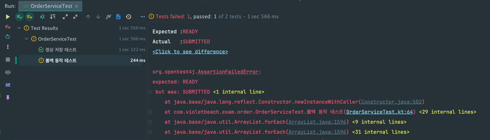
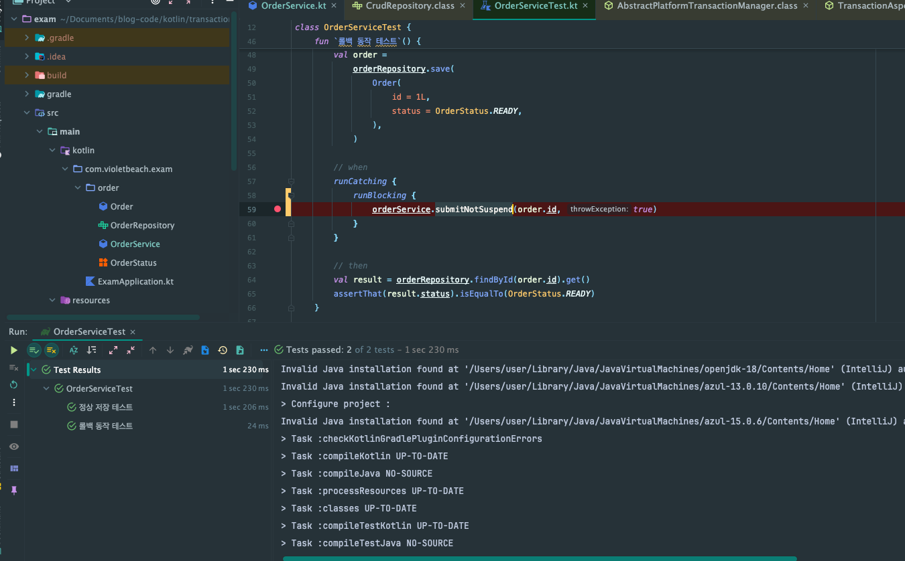
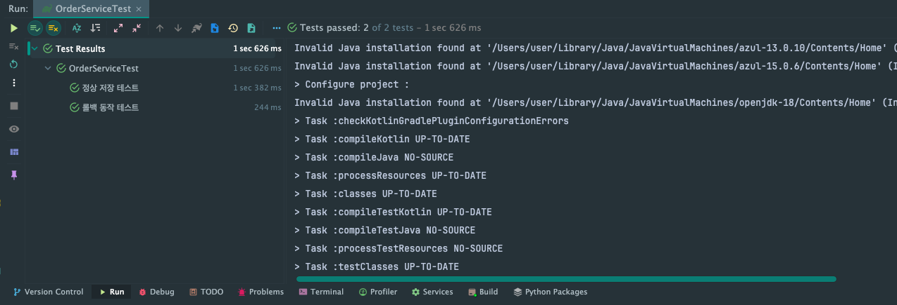
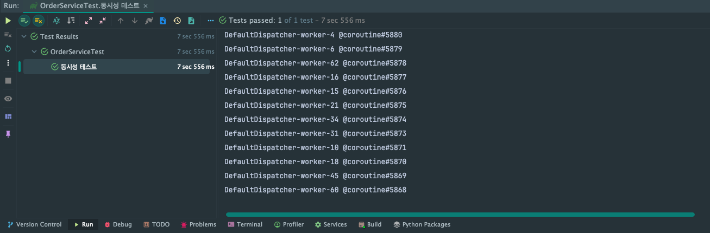

## 코루틴에서 트랜잭션을 사용하는 방법

코루틴에서 트랜잭션을 적용하는 데 어려움을 겪는 케이스가 많다. 실제로 많이 어렵다고 알려져 있다.

Sprign I/O 2024 강연에서도 해당 내용이 나왔는데, 간단하고 오피셜하게 해결할 수 있는 방법을 알아보자.

## Why Problem

Spring JPA와 코루틴을 사용할 때 여러가지 문제가 발생한다.

하나씩 알아보자.

## 1. AOP 미동작

예시 코드에서 Repository는 JpaRepository를 사용한다.

```kotlin
interface OrderRepository : JpaRepository<Order, Long>
```

아래는 Service 클래스이다.

```kotlin
@Service
class OrderService(
    private val orderRepository: OrderRepository,
) {
    @Transactional
    suspend fun submit(
        id: Long,
        throwException: Boolean = false,
    ) {
        val order = orderRepository.findById(id).get()
        order.submit()
        orderRepository.save(order)
        if (throwException) {
            throw IllegalStateException("테스트 위한 에러")
        }
    }

    @Transactional
    fun submitNotSuspend(
        id: Long,
        throwException: Boolean = false,
    ) {
        val order = orderRepository.findById(id).get()
        order.submit()
        orderRepository.save(order)
        if (throwException) {
            throw IllegalStateException("테스트 위한 에러")
        }
    }
}
```

throwException 파라미터에 true가 들어오면 예외를 발생할 것이고, 지난 변경사항을 롤백할 것입니다.

아래는 테스트 코드입니다.

```kotlin
@SpringBootTest
class OrderServiceTest {
    @Autowired
    private lateinit var orderService: OrderService

    @Autowired
    private lateinit var orderRepository: OrderRepository

    @BeforeEach
    fun setup() {
        orderRepository.deleteAll()
    }

    @Test
    fun `정상 저장 테스트`() {
        // given
        val order =
            orderRepository.save(
                Order(
                    id = 1L,
                    status = OrderStatus.READY,
                ),
            )

        // when
        runBlocking(Dispatchers.IO) {
            orderService.submit(order.id)
        }

        // then
        val result = orderRepository.findById(order.id).get()
        assertThat(result.status).isEqualTo(OrderStatus.SUBMITTED)
    }

    @Test
    fun `롤백 동작 테스트`() {
        // given
        val order =
            orderRepository.save(
                Order(
                    id = 1L,
                    status = OrderStatus.READY,
                ),
            )

        // when
        runCatching {
            runBlocking(Dispatchers.IO) {
                orderService.submit(order.id, true)
            }
        }

        // then
        val result = orderRepository.findById(order.id).get()
        assertThat(result.status).isEqualTo(OrderStatus.READY)
    }
}
```

테스트를 실행해보면 롤백 동작 테스트가 깨진다. 즉, Exception이 발생해도 롤백이 되지 않는다.



suspend 메서드가 아닌 일반 메서드를 호출하면 테스트가 정상적으로 성공한다.



JPA는 코루틴에서의 Transaction을 지원하지 않는다. 코루틴의 Transaction은 MongoDB, R2DBC 등 Reactive 모듈에서만 제공한다.


[//]: # (코루틴은 내부적으로 Suspend 함수를 Continuation이라는 객체 형식으로 바꿔서 AOP가 적용된 프록시 객체를 사용하지 않기 때문에 AOP가 정상적으로 동작할 수 있다.)

해결 방법은 간단하다. `CoroutineCrudRepository`와 `R2DBC`를 사용하면 된다.

```kotlin
@Repository
interface OrderRepository : CoroutineCrudRepository<Order, Long> {
    override suspend fun findById(id: Long): Order
}
```

그 결과 모든 테스트를 통과한다.



CoroutineCrudRepository와 R2DBC를 사용하면 아래 효과가 있다.
- 데이터 접근 시 suspend 함수를 사용해서 Blocking I/O를 방지할 수 있다.
- suspend 함수에서도 트랜잭션을 보장할 수 있다.

#### 2. 원하지 않는 범위의 롤백

JPA의 Transaction에서는 ThreadLocal에 트랜잭션의 커넥션 정보를 저장한다. 문제는 코루틴 쓰레드는 1개의 요청만을 전담해서 처리하지 않는다.

코루틴의 쓰레드는 여러 요청의 Job을 수행하기 때문에 롤백될 때 원하지 않는 것들까지 롤백될 수 있다.

즉, 아래와 같이 1개 쓰레드에서 여러 개의 Job을 동시다발적으로 처리할 때도 정상적으로 동작해야 한다. 

```kotlin
@Test
fun `동시성 테스트`() = runTest {
    // given
    repeat(2000) {
        orderRepository.save(Order(status = OrderStatus.READY))
    }

    // when
    val jobs = ArrayList<Job>()
    for (i in 1L..2000L) {
        val job = launch(Dispatchers.IO) {
            orderService.submit(
                id = i,
                throwException = i % 10 == 0L,
            )
        }
        jobs.add(job)
    }
    jobs.joinAll()

    // then
    val submittedOrders = orderRepository.findAll().toList().filter { it.status == OrderStatus.SUBMITTED }
    assertThat(submittedOrders).hasSize(1800)
}
```

걱정했던 동시성 테스트도 무사히 통과했다.



테스트가 통과한 이유는 `R2dbc`에서는 `PlatformTransactionManager`가 아닌 `ReactiveTransactionManager`를 사용한다.

`ReactiveTransactionManager`는 `ThreadLocal`이 아닌 `Reactor`의 `Context`에 커넥션 정보를 보관한다. `Reactor`의 `Context`는 코루틴의 `Context`와 호환될 것이다. 

Thread 1개가 여러 Job을 수행하더라도 각 Job 안에 커넥션 정보를 보관하기에 각 Job은 트랜잭션을 안전하게 보관할 수 있게 된다.

## 소감

잘 모르고 `@Transactional`이 미동작한다는 이유로 transactionTemplate, TransactionalOperator 등을 사용했다. (공식문서에서도 언급하지만, 나쁜 선택지는 아니다.)

잘 알고 있었더라면 `CoroutineCrudRepository`를 활용해서 `suspend` 함수의 이점을 충분히 활용할 수 있었고, 기존 AOP를 활용한 코드 스타일을 유지할 수 있었다.

기회가 되면 더 자세히 학습해봐야겠다.

## 참고

- https://www.youtube.com/watch?v=FXHv8ROsc-o
- https://devfunny.tistory.com/916
