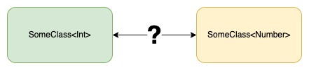
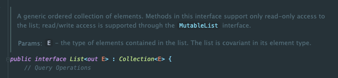
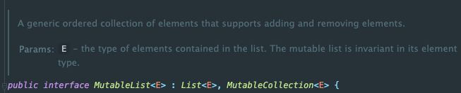
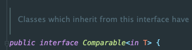

코틀린에서 제너릭을 잘 활용하기 위해서는 주요 개념 중 하나인 **변성**을 이해해야 한다.

변성에 대해 알아보자.

## 변성의 정의



`List<Int>`가 있으면 `List`가 기저 타입(Base Type)이고, `Int`가 타입 인자(Type argument)이다.

변성(Variance)은 기저 타입(Base type)이 같으면서 타입 인자(Type argument)가 다른 경우 서로 어떤 관계에 있는 지 설명할 때 사용하는 개념이다.
 
그림에서 `SomeClass<Int>`가 `SomeClass<Number>`의 하위 타입이라고 생각하기 쉽다. 그러나 그것은 개발자가 `SomeClass`에 대한 변성을 어떻게 지정하느냐에 달린 것이다.

개발자는 변성을 잘 적절하게 활용하면 확장성과 타입 안정성을 동시에 챙길 수 있다.

## 서브 타입(Sub Type)

변성을 이해하려면 먼저 **서브 타입**을 이해해야 한다.

아래 코드를 보자. 제너릭에서 `SomeClass<Int>`와 `SomeClass<Number>`는 다르다. 타입에 의한 컴파일 에러가 발생할까?
```kotlin
fun main() {
    val numbers: List<Int> = listOf(1, 2, 3)
    printList(numbers) // 컴파일 에러 X
}

private fun printList(list: List<Any>) {
    println(list.joinToString())
}
```

컴파일 에러가 발생하지 않는다. 코틀린에서 `List<Int>`는 `List<Any>`의 하위 타입이다.

다음 코드를 보자.

```kotlin
fun main() {
    val numbers: MutableList<Int> = mutableListOf(1, 2, 3) // MutableList<Int>
    printList(numbers) // 컴파일 에러 O
}

private fun printList(list: MutableList<Any>) {
    println(list.joinToString())
}
```

`List`를 `MutableList`로 바꿨을 뿐인데 컴파일 에러가 발생한다.

왜 이런 차이가 발생할까?

#### 서브 타입의 정의

A 타입의 모든 기능을 B 타입이 수행할 수 있을 때 B타입을 A타입의 **서브타입(하위 타입)**이라고 한다.

`List<Int>`는 `List<Any>`의 모든 기능을 수행할 수 있다. 즉, `List<Int>`는 `List<Any>`의 하위 타입이다.

`MutableList<Int>`는 `MutableList<Any>`의 모든 기능을 수행할 수 있을까?
- `MutableList<Any>`는 `list.add("A")`를 수행할 수 있다.
- `MutableList<Int>`는 `list.add("A")`를 수행할 수 없다.

예시처럼 가변성이 있는 `MutableList<Int>`는 `MutableList<Any>`의 하위 타입이 아니다.

확장성을 가지면서 타입 안정성을 보장하기 위해서는 변성의 유형과 특성에 대한 이해가 필요하다.


## 변성의 세 가지 유형

가변성에는 세 가지 유형이 있다. 공변성, 반공변성, 무변성이다.

1. `<out T>`: 공변(Covariance)
2. `<in T`>: 반공변(Contravariance)
3. `<T>`: 무공변(invariance)

#### 1. 공변(Covariance)

**공변(Covariance)**은 `Int`, `Number`처럼 A 타입이 B 타입의 하위 타입이고, `Covariance<Int>`도 `Covariance<Number>`의 하위 타입이 되는 경우를 말한다.

코틀린에서는 `out` 키워드를 사용해서 제너릭의 변성을 **공변**으로 지정할 수 있다.

```kotlin
class Covariance<out T: Number>
```

아까 예시에서 본 `List` 클래스가 공변에 해당한다.



그래서 `List<Any>` 파라미터의 인자로 `List<Int>`가 전달될 수 있었다. 공변은 변하지 않는 데이터에 한해 확장성을 제공해준다.

#### 2. 무공변(Invariance)

변성을 지정하지 않으면 기본적으로 **무공변** 상태가 된다.

```kotlin
class Invariance<T>
```

`MutableList`는 무공변에 해당한다.



그래서 `MutableList<Any>` 파라미터의 인자로 `MutableList<Int>`가 전달될 수 없었다.

#### 3. 반공변(Contravariance)

반공변은 공변과 반대이다. `Int`, `Number`처럼 A 타입이 B 타입의 하위 타입이지만, `Contravariance<Int>`가 `Contravariance<Number>`의 상위 타입이 되는 경우를 말한다.

코틀린에서는 `in` 키워드를 사용해서 제너릭의 변성을 **반공변**으로 지정할 수 있다.

```kotlin
class Contravariance<in T>
```

대표적인 예시는 `Comparable` 클래스이다.



`Comparable<Long>`의 모든 기능은 `Comparable<Any>`가 수행할 수 있다.
- `Comparable<Any>`는 `compareTo("A")`도 수행할 수 있지만, `compareTo(1)`도 수행할 수 있다.

반공변이 왜 필요한 지 이해해보자.

```kotlin
class AnimalComparable: Comparable<Animal> {
    override fun compareTo(other: Animal): Int {
        return 0
    }
}

// 반공변이므로, Dog에도 사용 가능
val dogComparable: Comparable<Dog> = AnimalComparable()
```

`Comparable<Dog>` 타입이 필요한 상황에서 `Comparable<Animal>` 타입의 객체를 대신 사용할 수 있다.

## 결국 목적은 다형성

프로그래밍 언어는 타입 안정성을 위해 제너릭을 지원한다. 다만, 무공변만으로는 다형성을 활용한 유연한 인터페이스를 만들기 어렵다.
- `List<Number>` 필드에 `List<Int>`를 할당할 수 없으면 **유연성**을 잃어버린다. 
- `List<*>`을 사용하면 `Number`를 꺼내서 사용할 수 없으면 **타입 안정성**을 잃어버린다.

위 내용을 잘 보면 아래의 사실을 확인할 수 있다.
- 공변(out T)은 메서드에서 T 타입의 파라미터가 없고, T 타입을 반환할 경우 사용할 수 있다.
    - List, Set, Map, ...
- 반공변(in T)은 메서드에서 T 타입을 반환하지 않고, T 타입을 입력받을 경우 사용할 수 있다.
    - Comparable, Comparator, Consumer, ...

읽기(Read)를 위한 클래스를 **공변**으로 지정하면 제너릭을 사용하는 클래스에서도 T 타입의 다형성을 이어받아서 상위, 하위 타입으로 사용할 수 있게 된다.

쓰기 및 연산(Write)을 위한 클래스를 **반공변**으로 지정하면 제너릭을 사용하는 클래스에서 T 타입의 상위 타입을 타입 인자로 가지는 클래스를 하위 타입으로 사용할 수 있게 된다.

변성을 잘 알고 사용한다면 넓은 의미의 인터페이스(Interface, Class, ...)를 보다 유연하게 만들 수 있을 것이다.

## 참고

- https://jaeyeong951.medium.com/kotlin-in-n-out-variance-변성-69204cbf27a1
- https://www.yes24.com/product/goods/55148593

