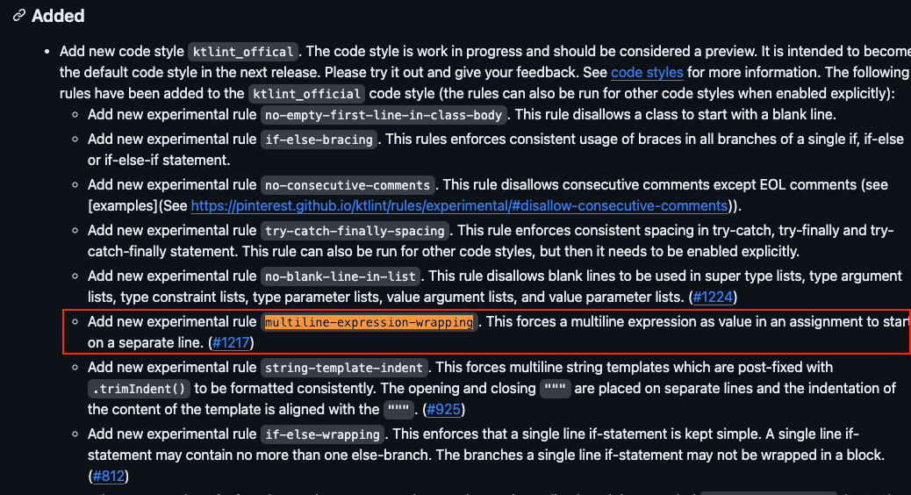
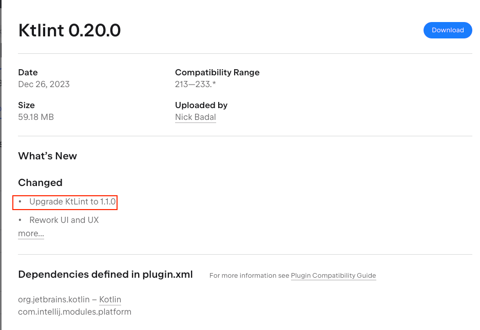
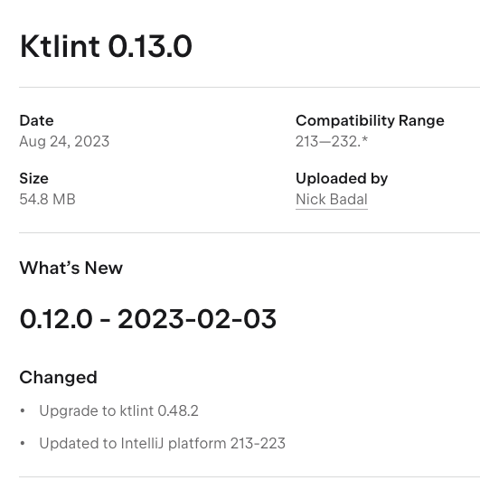

새로 합류한 팀에서 ktlint를 적용하다가 생긴 이슈에 대해 공유한다.

현재 팀에서 IntelliJ의 Ktlint 플러그인을 사용하고 있고 Actions on Save 기능을 사용해서 코드를 저장할 때마다 코드 스타일을 반영한다.

그런데 나한테만 변경사항이 너무 많았다. 자꾸 라인이 아래와 같이 추가되고 있었다.

## 라인 추가되는 이슈

아래는 기존의 코드이다.

```kotlin
fun getUserTypeCode(user: User): String = when (user.type) {
    Type.MEMBER -> if (true) { 
        return 1
    }
    Type.ADMIN -> if (true) {
        return 2
    }
}
```

다른 팀원들 모두 이슈가 없는데, 내가 저장하면 아래와 같이 코드가 변경된다.

```kotlin
fun getUserTypeCode(user: User): String =
        when (user.type) {
            Type.MEMBER ->
                if (true) {
                    return 1
                }

            Type.ADMIN ->
                if (true) {
                    return 2
                }
        }
```

처음에는 CodeStyle이 문제인 줄 알았는데, Ktlint를 끄니까 변경되지 않는 것을 확인했다.

즉, Ktlint가 문제였다.

## 이슈

Ktlint 공식문서를 뒤져보다가 아래 부분을 발견했다.
- https://pinterest.github.io/ktlint/0.49.1/rules/experimental/#multiline-expression-wrapping

해당 기능이 내가 겪는 문제와 매우 유사했다.

우변이 Multi-line이면 NewLine에서 시작하게 해주는 기능이라고 한다.

```kotlin
// AS-IS
val foo = foo(
        parameterName = "The quick brown fox "
                .plus("jumps ")
                .plus("over the lazy dog"),
)

// TO-BE
val foo =
        foo(
                parameterName =
                "The quick brown fox "
                        .plus("jumps ")
                        .plus("over the lazy dog"),
        )
```

그런데 왜 문제가 나한테만 적용될까 하는 것이었다.

나는 그 원인을 CHANGELOG.md에서 찾았다.
- https://github.com/pinterest/ktlint/blob/master/CHANGELOG.md

## 버전 이슈

`multiline-expression-wrapping` 키워드로 검색한 결과 라이브러리 버전 **`0.49.0`**부터 해당 rule이 도입되었다.



내가 사용하는 Ktlint 플러그인은 `0.20.0` 버전이라서 라이브러리 기준 `1.1.0` 버전이다.



반면, 다른 팀원들이 사용하는 Ktlint 플러그인 버전은 `0.13.0` 버전이라서 라이브러리 기준 **`0.48.2`** 버전이었다.



해당 부분은 IntelliJ 버전에 따른 Ktlint 플러그인의 버전 차이였다. 나는 신규 버전의 IntelliJ를 설치했기 때문이었다.

## 해결

해당 사항을 팀원들에게 공유했고, IntelliJ를 업그레이드 한 분도 있었고 유지하시는 분도 있었다.

그래서 해당 Option을 끌 수 있는 방법을 찾기로 했다.
과거 버전을 쓰는 팀원을 위해서도 있지만, 애초에 newLine이 생소하고 가독성이 떨어진다는 의견이 많았다.

Ktlint는 `.editorconfig` 파일을 사용하므로 root에 생성한다.

그리고 공식 문서에 룰을 설정하는 방법이 있었다. 해당 옵션의 경우 StandardRule 이라서 아래와 같이 작성하면 된다. 


```
[*.{kt,kts}]
# 우변이 Multi Line일 경우 새로운 Line에서 시작 (off)
ktlint_standard_multiline-expression-wrapping: disabled
# 함수 파라미터 각각 새로운 Line 할당 (off)
# 함수 정의 시 반환 값 새로운 Line에서 시작 (off)
ktlint_standard_function-signature: disabled
```

반영 후 더 이상 문제가 재현되지 않았다.

## 마무리

협업하는 팀원들끼리의 Coding Convention을 위해 CodeStyle과 Ktlint 같은 도구를 많이 사용한다.
- (혹시 사용하지 않고 있다면, 강력하게 추천한다!!)

버전의 차이로 인해서 팀원과 Rule이 다른 부분이 발생할 수 있다.

이 부분은 `.editorconfig`에서 Rule을 명시하거나 버전을 맞추면 해결할 수 있다.
