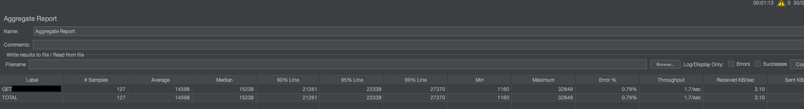

포스팅 제목을 `byte[]` 사용하지 않기라고 했는데.. 정확하게는 불필요하게 전체 byte[] 할당하지 않기라고 봐주면 좋을 것 같다.

해당 포스팅에서는 서비스 운영 중 `byte[]`로 인해 심각한 문제가 생겼고, 오픈소스 기여까지 하게된 내용을 작성한다.

## TPS가 심각하게 낮음

메일 파일(약 20MB)을 읽어서 파일의 내용 중 일부를 화면에 노출하는 기능을 개발했다.

그런데 POD 1대의 TPS가 1.7 정도밖에 나오지 않았다. 

전체 HTTP 트랜잭션은 5.42초였다.

그래서 아래와 같이 각 로직의 수행 시간을 측정해봤다.

그 결과 parse 로직이 3787ms가 걸린다는 것을 알 수 있었다.

## parse

`parse()`의 경우 외부 라이브러리(`apache-commons-email`)의 로직만을 담고 있었다. 상세한 확인으로 아래 부분이 문제가 되었음을 알 수 있었다.

해당 부분은 메일의 첨부파일을 ByteArrayDataSource에 저장하는 부분이다.

저장한 ByteArrayDataSource는 맵에 보관한다. 여기서 크게 2가지 문제가 있었다.
- 파일의 전체 바이너리 데이터를 메모리에 할당한다.
- 첨부파일을 읽지 않아도 되는 경우 성능이 낭비된다.

2가지 문제를 해결하기 위해 ByteArrayDataSource가 아니라 단순히 InputStream 기반의 DataSource를 저장하도록 코드를 수정했다.

즉, FileInputStream이 들어오면 굳이 `byte[]`에 옮겨담지 말고 그대로 Wrapping해서 DataSource를 만든것이다.

## TPS 변화

아래는 그 결과이다. 첨부파일 데이터가 필요 없는 경우 해당 데이터를 `byte[]`에 할당할 필요가 없어져서 처리량이 올라갔다. 

## 메모리 사용량

기존에는 전체 첨부파일을 `byte[]`에 옮겨담고 있었다.

코드를 수정한 후에는 아래와 같이 메모리를 사용하지 않게 되었다.

## 결과

아래는 총 개선 결과이다.
- TPS: 1.7 -> 21.7
- 메모리 사용량: 약 30MB -> 거의 X
- 평균 소요 시간: 14.82s -> 3.003s
- 90% 요청 소요 시간: 21.247s -> 5.523s

처리한 부분은 `apache-commons-email` 라이브러리에 기여하게 되었다.
- https://github.com/apache/commons-email/pull/159

큰 파일을 다룰 때는 `byte[]`나 ByteArrayInputStream 등에 전체 데이터를 담지 않도록 조심해야 한다.

Java IO나 Java NIO를 사용할 때는 최대한 Buffer를 사용해서 데이터를 주고받아 하고, 정말 필요한 순간에 데이터를 흘려보내는 것이 훨씬 효율적이다.
