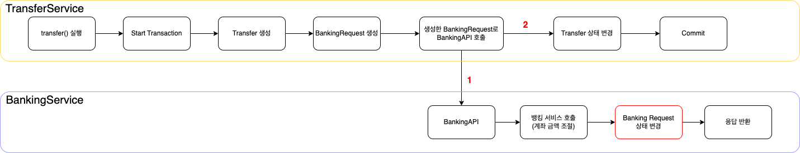
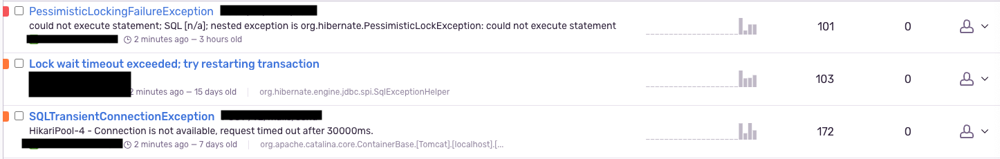
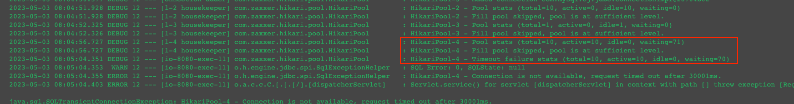
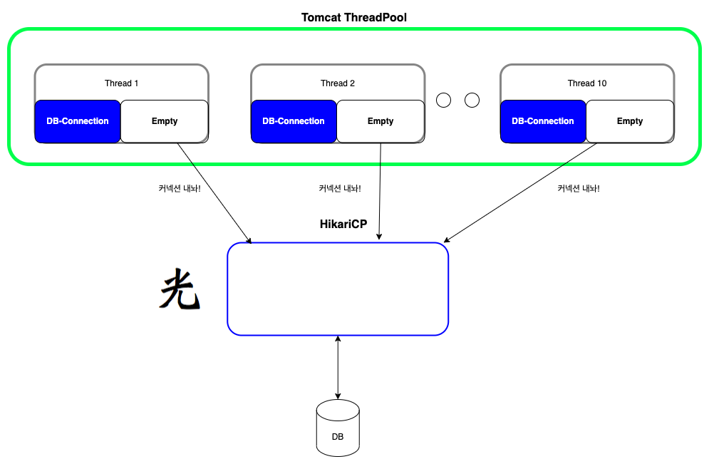

## Connection Pool Deadlock 해결하기

해당 포스팅은 실제 서비스 튜닝을 하면서 겪었던 이슈와 해결에 대해 공유한다.

아래 코드 및 내용은 예시를 위해 만든 프로젝트이다!

## 송금

송금 서비스에서 은행 API를 호출해서 송금을 한다고 가정해보자.

아래는 예시를 위한 코드이다.

```kotlin
@Service
@RequiredArgsConstructor
public class TransferService {
    private final TransferRepository transferRepository;
    private final BankingRequestRepository bankingRequestRepository;
    private final BankingApiAdaptor bankingApiAdaptor;

    @Transactional
    public void transfer(TransferRequest transferRequest) {
        // Transfer를 생성 후 저장
        Transfer transfer = new Transfer(
            transferRequest.senderAccountId(),
            transferRequest.receiverAccountId(),
            transferRequest.amount()
        );
        transferRepository.save(transfer);

        // BankRequest 생성 후 저장
        BankingRequest bankingRequest = BankingRequest.from(transfer);
        bankingRequestRepository.save(bankingRequest);

        // BankingAPIAdaptor 호출
        // BankingAPI에서 처리 후 BankingRequest의 상태를 변경
        BankingResponse response = bankingApiAdaptor.banking(bankingRequest);

        // Transfer 상태 조정
        if (response.isSuccess())
            transfer.setSuccess();
        else
            transfer.setFail();
    }
}
```

언뜻보면 문제가 없어 보이지만, 해당 코드는 정상적으로 실행되지 않는다.

BankingAPI에서 아래 로그가 찍혀있다.

```
MySQLTransasctionRollbackException:
    Lock wait timeout exceeded; try restarting transaction
```

락으로 인한 문제는 아래 SQL로 확인이 가능하다.

```mysql
# 실행중인 락 조회
SELECT * FROM performance_schema.data_locks;
# 실행중인 트랜잭션 조회
SELECT * FROM performance_schema.innodb_trx;
```

원인을 확인한 결과는 다음과 같았다.



TransferService에서 아직 `commit`을 수행하기 전이므로 BankingService에서 BankingRequest에 대한 잠금을 획득할 수 없다. 즉, 상태 변경을 할 때 Lock wait timeout이 발생하는 것이다.

## REQUIRES_NEW (문제 상황)

위 문제 때문에 팀원과 결론이 난 것이 propagation으로 REQUIRES_NEW를 사용해서 BankingRequest를 먼저 commit하는 것이다.

`@Transactional`을 제거하는 것은 기존 코드가 너무 복잡해서 할 수 없었다.

아래 코드를 보자.

```java
@Service
@RequiredArgsConstructor
public class TransferService {
    private final TransferRepository transferRepository;
    private final BankingRequestSavePort bankingRequestSavePort;
    private final BankingApiAdaptor bankingApiAdaptor;

    @Transactional
    public void transfer(TransferRequest transferRequest) {
        // Transfer를 생성 후 저장
        Transfer transfer = new Transfer(
            transferRequest.senderAccountId(),
            transferRequest.receiverAccountId(),
            transferRequest.amount()
        );
        transferRepository.save(transfer);

        // BankRequest 생성 후 저장
        BankingRequest bankingRequest = BankingRequest.from(transfer);
        bankingRequestSavePort.save(bankingRequest);

        // BankingAPIAdaptor 호출
        // BankingAPI에서 처리 후 BankingRequest의 상태를 변경
        BankingResponse response = bankingApiAdaptor.banking(bankingRequest);

        // Transfer 상태 조정
        if (response.isSuccess())
            transfer.setSuccess();
        else
            transfer.setFail();
    }
}
```

`BankingRequestRepository`를 직접적으로 호출하지 않고, `BankingRequestSavePort`를 사용해서 호출한다.

```java
@Component
@RequiredArgsConstructor
public class BankingRequestSavePort {
    private final BankingRequestRepository repository;
    
    @Transactional(propagation = Propagation.REQUIRES_NEW)
    public void save(BankingRequest bankingRequest) {
        repository.save(bankingRequest);
    }
}
```

`BankingRequestSavePort`는 `Propagation.REQUIRES_NEW`로 repository.save()를 호출하고 있다.

이제 기능이 정상적으로 동작한다. 인수 테스트도 통과를 했고 해당 코드로 배포를 했다. 그런데 **부하 테스트**를 하는데 성공하다가, 성공 건이 없이 블록되다가.. 성공하다가 블록되다가.. 를 반복했다. 아래 에러가 계속 올라왔다.



중간중간 성공하다가, 성공 건이 업싱 블록되다가.. 성공하다가 블록되다가.. 를 반복했다.

처음엔 데드락인 줄 의심했는데 생각해보면 데드락일 수가 없었다. 해당 쿼리는 단일 레코드에 대해 수행하는 쿼리였다.

이 문제의 **진짜 이유**는 아래 HikariCP 로그에서 내뿜고 있었다.



HikariPool을 보면 `active` 상태인 것이 10개이고, `idle`상태인 것이 없는 것을 확인할 수 있다.

### HikariCP 데드락 (with. Nested Transaction)

HikariCP Log를 통해 특정 DB의 커넥션이 꽉차있는 상태로 `Blocking`이 걸리는 것을 확인했다.

아래 코드를 다시 보자.

```java
@Component
@RequiredArgsConstructor
public class BankingRequestSavePort {
    private final BankingRequestRepository repository;

    @Transactional(propagation = Propagation.REQUIRES_NEW)
    public void save(BankingRequest bankingRequest) {
        repository.save(bankingRequest);
    }
}
```

해당 코드의 트랜잭션은 **메인 트랜잭션과 무관하게 반드시 커밋해야 하는 트랜잭션**이라서 **전파 수준(propagation)** 을 `REQUIRES_NEW`로 해서 **새로운 커넥션**으로 DB에 쿼리를 날리고 있었다.

메인 트랜잭션과 무관하게 반드시 커밋하는 이유는 아래와 같다.
- DB 트랜잭션 내부에서 BankingAPI로 요청을 하고 있었다.
- DB 트랜잭션에서 커밋을 하기 전에 BankingAPI에서 해당 레코드를 수정할 수 없었다.
- 그래서 전파 수준을 `REQUIRES_NEW`로 새로운 트랜잭션에서 저장하도록 처리



여기서 커넥션 풀의 **10개의 커넥션이 모두 커넥션을 하나씩 점유한 채로 하나의 커넥션을 더 요구하면서 CP 데드락**이 생겼던 것이다.
- `HikariPool - Connection is not available, required timed out after 30000ms`나 `Lock wait timeout exceeded` 에러가 중요한 지표였다.

이 문제를 해결하기 위해서는 아래의 방법들이 있었다.
1. Connection Pool 확장
2. Connection Timeout 설정
3. 트랜잭션을 커밋한 후 BankingAPI에 요청

아래 Reference를 보면 1개의 커넥션으로 실행할 수 없는 코드는 HikariCP 데드락을 유발할 수 있는 코드라고 설명한다.
- https://techblog.woowahan.com/2663/
- (Nested Transaction을 사용하지 말자!)

그래서 사실상 1번과 2번은 임시 방편에 불과했다. 비주류 기능이면 고려할 수 있겠지만, 메인 기능인 부분이라서 CP 데드락이 실제 운영 중에도 터질 수 있어서 3번을 선택했다.

### Nested Transaction 제거

정확하게는 트랜잭션을 커밋한 후 BankingAPI에 요청을 하도록 프로세스를 분리한 것이 아니라,

문제가 되는 메서드의 `propagation = REQUIRES_NEW`를 제거하고 요청 방식을 동기에서 **비동기**로 변경했다.

비동기 방식이 가능한 이유는 원래 Exception을 던지지 않았다. Banking에서 Exception이 터져도 catch해서 무조건 커밋을 하고 있었다.
- 즉, 애초에 동기로 실행할 이유가 없었던 코드이고, 어필을 하고 있던 상황이었다.

한 가지 걱정되는 것은 BankingAPI 프로세스가 돌아가는 시점에 DB에 커밋이 되어 있는 것을 보장할 수 있느냐는 것이다.
- 메인 트랜잭션에서 DB에 INSERT 하면서 락을 획득했고 **Banking API에서는 이를 기다려야 데이터를 수정**할 수 있기 때문에 순서가 보장되었다.

결과적으로 API 호출을 비동기 방식으로 변경했고, **CP 데드락이 더 이상 발생하지 않았다.**

**성능도 많이 향상**되었다. **API 호출도 병목 지점 중 하나**였던 것이다. DB 트랜잭션 내부에서 API 요청을 동기로 실행해서 처리량이 많이 낭비되고 있었다.