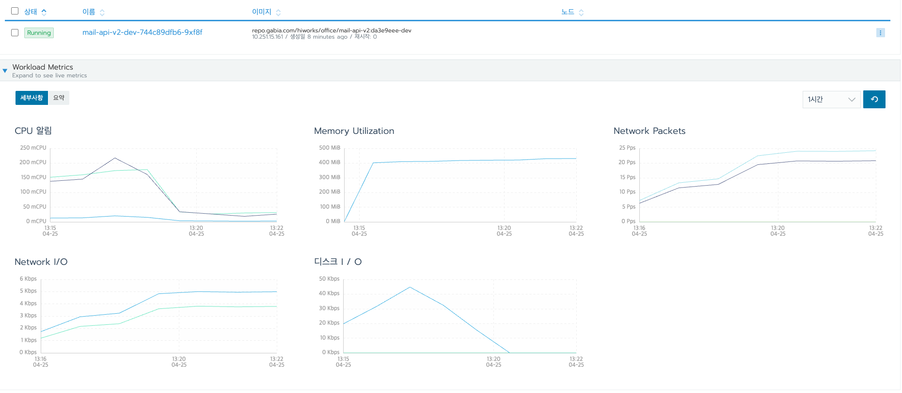

## Grapana + Prometheus + JMeter 누수 테스트하기!

사내에서 부하 테스트를 할 때 보통은 Rancher + Ngrinder를 자주 사용한다.
- 사내 dev 환경 쿠버네티스에 올리면 Rancher에서 확인할 수 있다.
- Ngrinder를 사용하면 사내 독립된 서버에서 Client에 영향없이 부하테스트를 진행할 수 있다.

하지만 Ngrinder보다 Apache JMeter로 테스트를 구성하는 게 더 쉽다.
- 각각 스레드 그룹을 생성하고, 요청을 여러개 생성해서 일괄적으로 테스트할 수 있다.
- 이를 Ngrinder로 작성하려면 복잡한 스크립트 코드가 필요하다.

그래서 Apache JMeter를 선택했다.

그리구 Rancher에서는 아래의 정보를 준다.

Rancher에서 메모리가 나오지만, 누수가 발생하는 지나 Heap과 MetaSpace 영역이 각각 어떻게 되는지, GC는 얼마나 자주 실행되는 지 등을 파악하기 어렵다.

그래서 Prometheus + JMeter를 사용했다.
- 실서버 환경에서는 적용이 어려워서 로컬 환경에서 띄워서 JMeter로 요청을 보내서, TPS나 메모리 누수(Heap, MetaSpace, ...)가 존재하지는 않는 지 확인하는 용도였다.

## 준비

Apache JMeter 사용법은 이전 포스팅(https://jaehoney.tistory.com/224)을 참고하면 된다.

Prometheus + Grapana를 설치하는 방법은 아래 레퍼런스를 참고하자.
- https://covenant.tistory.com/244