## 부하 테스트 및 성능 개선 여행기!

# 1. 메모리 누수 확인

팀내에서 메모리 누수는 뜨거운 감자였다.. 사내에서 JVM 환경의 프로젝트 개발에 대한 노하우가 부족했고, 새롭게 개발한 프로젝트에서 Heap OOM, MetaSpace OOM이 자주 터졌었기 때문이다. 그래서 지속적으로 누수를 잡았는데, 다시 한번 검사해봤다. 

사내에서 부하 테스트를 할 때 보통은 Rancher + Ngrinder를 자주 사용한다.
- 사내 dev 환경 쿠버네티스에 올리면 Rancher에서 확인할 수 있다.
- (Ngrinder를 사용하면 사내 독립된 서버에서 Client에 영향없이 부하테스트를 진행할 수 있음)

Ngrinder보다 Apache JMeter로 테스트를 구성하는 게 나한테 쉬웠다.
- 각각 스레드 그룹을 생성하고, 요청을 여러개 생성해서 일괄적으로 실제 환경을 구성해서 테스트할 수 있음.
- 이를 Ngrinder로 작성하려면 복잡한 스크립트 코드가 필요하다.

Rancher에서는 아래의 정보를 준다.

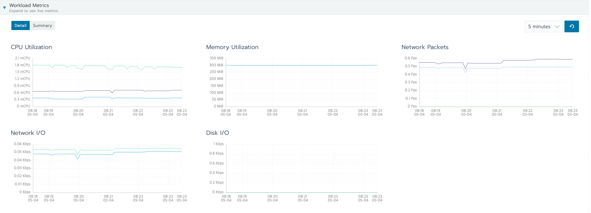

Rancher에서 메모리가 나오지만, 누수가 발생하는 지나 Heap과 MetaSpace 영역이 각각 어떻게 되는지, GC는 얼마나 자주 실행되는 지 등을 파악하기 어렵다.

그래서 Local에서 Prometheus + Grafana 를 사용해서 지표를 시각화하고, JMeter로 부하를 보내면서 메모리를 측정했다.

아래의 API 목록을 ThreadGroup 200으로 해서 무작위로 요청을 보내면서 메모리 위주로 체크했다.
- GET /v2/mailboxes
- GET /v2/mails (+ with Params)
- GET /v2/mails/:no
- GET /v2/office/:officeNo/receipt-confirm/:certKey/email/:email
- POST /v2/mails/send

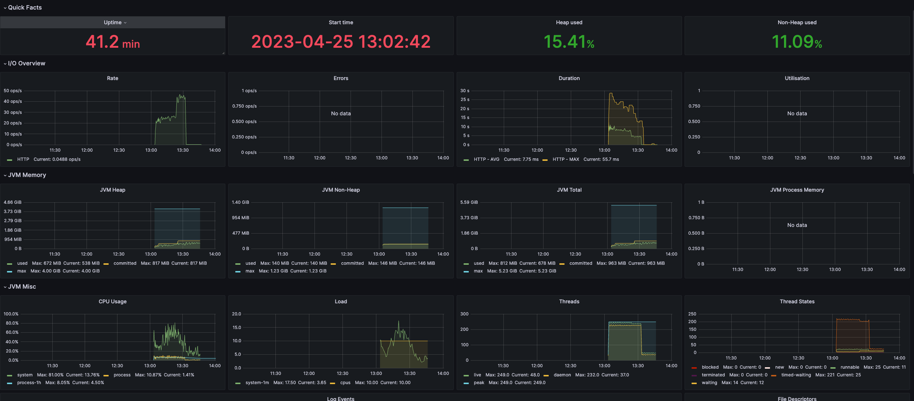
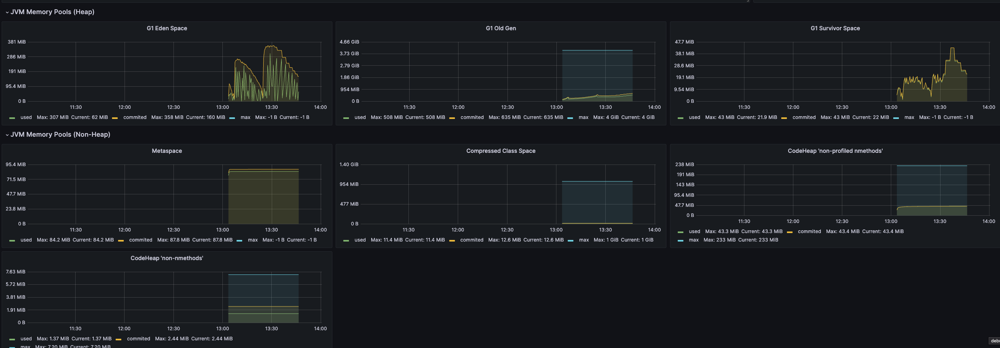

일반적으로 메모리는 아래와 같이 구성된다고 할 수 있다.
- (Heap Space) G1 Eden Space + G1 Old Gen + G1 Survivor Space
- (Non Heap Space) Metaspace + Code Cache + Symbol + Other ...

## G1 Eden Space

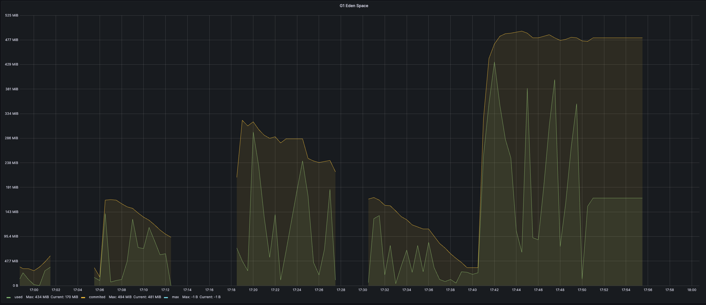

Eden의 경우 GC가 일어나는 시점에 공간이 10MB 이하로 줄기 때문에 누수는 아닐 것 같다.

(끊긴 부분은 부하가 커서 Promotheus에서 Actuator를 조회하지 못해서 생긴 부분이다.)

## G1 Survivor Space

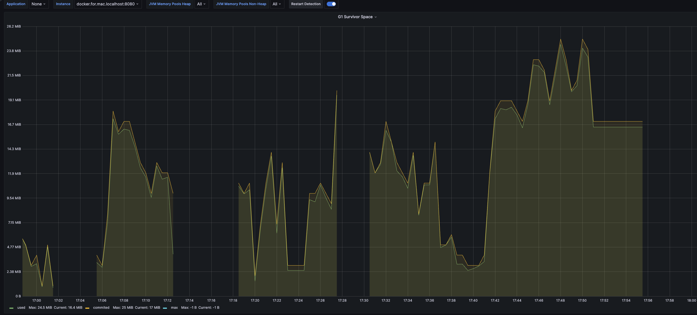

Survivor Space의 경우 용량을 크게 차지하지 않고, 잘 정리가 되는 것으로 판단됩니다.

## G1 Old Gen

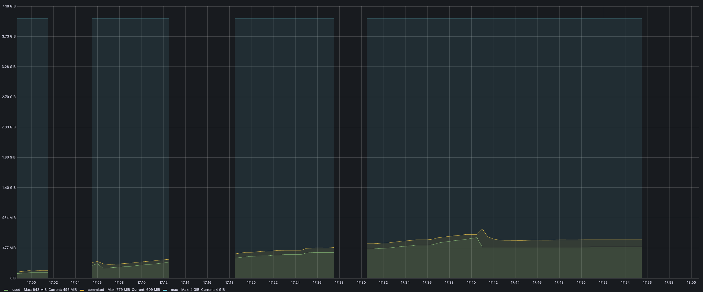

서버를 오랜시간 지속시킬 수록 OldGen이 차고 있다.

OldGen의 경우 GC가 발생해도 데이터가 많이 정리되지 않아서, 오랜 시간 데이터를 운영해야 확실하게 누수를 파악할 수 있을 것 같다.

(이 부분에 대해서는 나중에 제대로 다룬다.)

## Metaspace

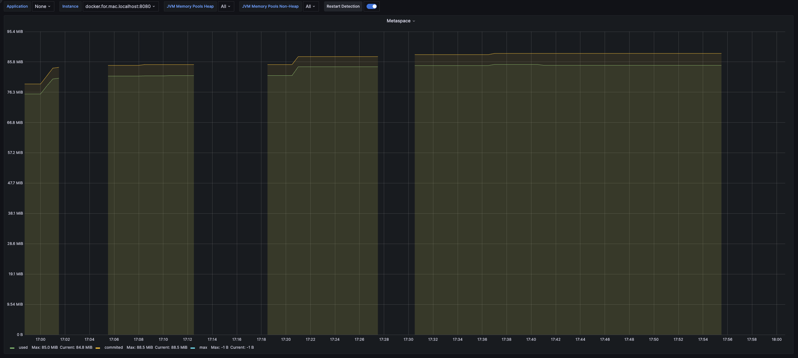

Metaspace의 경우 메모리가 눈에 띄게 쌓이지 않고 일정했다.

### 확인 결과 정리

내용을 정리하면 치명적인 메모리 누수는 찾을 수 없었다.

# 2. 부하 테스트

다음으로 dev 서버 기준으로 부하 테스트를 진행했다.
- mail-api.devoffice.hiworks.com

참고 사항
- dev 쪽은 k8s 컨테이너의 POD 1대로만 구성된다. 
- 실서버 환경과 쿼리 로그나 logging level을 낮은 레벨(info)로 수행하고 있다는 점이 다르다.

[부하 테스트 - 추가 정보]
- 다중 DataSource 활용 - X
- 다중 스키마 활용 - X

부하 테스트는 사용자들이 주요하게 사용하는 end-point에 대해서 TPS 및 특이사항(CPU, 메모리 급증) 발생 여부 등을 측정한다.

## GET /v2/mailboxes

Number of Threads (users): 550

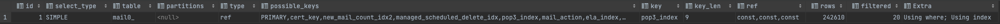

- TPS: 967.7
- 평균 소요 시간 : 544ms
- 90% 요청이 1.3s 이내에 완료

특이사항
- [ ] CPU 증가
- [ ] 메모리 증가
- [ ] sentry 이슈 발생

## GET /v2/mails with Params

/v2/mails?sort[received_date]=desc&with=approval_mail&with=receipt_confirm&with=encrypted

Number of Threads (users): 100

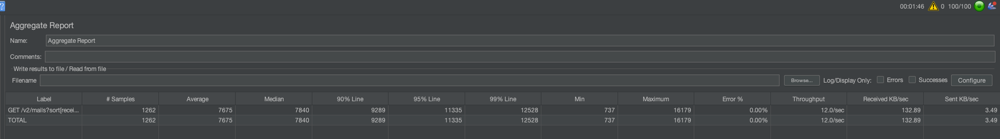

- TPS: 12.0
- 평균 소요 시간 : 7.376s
- 90% 요청이 9.289s 이내에 완료

특이사항 :
- [ ] CPU 증가
- [ ] 메모리 증가
  - 시작 시 메모리 600MB -> 최고점 823MB -> 종료 후 10분 750MB
  - 문제는 없는 것으로 판단 (로컬 그라파나에서 문제 없는 것 확인했, 재시도 시 문제 없는 것 확인)
- [ ] sentry 이슈 발생

## GET /v2/mails

/v2/mails (Query 파라미터 없음)

**1차: Number of Threads (users): 100**

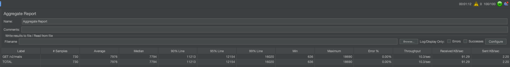

- **TPS: 10.8**
- 평균 소요 시간 : 7.914s
- 90% 요청이 11.089s 이내에 완료

특이사항 :
- [ ] CPU 증가
- [ ] 메모리 증가
  - 시작 시 메모리 600MB -> 최고점 823MB -> 종료 후 10분 750MB
  - 문제는 없는 것으로 판단 (로컬 그라파나에서 문제 없는 것 확인했, 재시도 시 문제 없는 것 확인)
- [ ] sentry 이슈 발생

## GET /v2/mails/:mailNo

#### 메일 컨텐츠는 거의 없는 상태 - 4KB

Number of Threads (users): 600

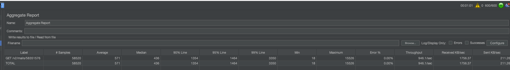

- TPS: 947.3
- 평균 소요 시간 : 595ms
- 90% 요청이 1.398s 이내에 완료

특이사항 :
- [X] CPU 증가
  - 메일함 조회때보다 2배 상승했지만, DiskIO에 의한 것으로 판단
  - 종료 시 다시 CPU 정상화
- [ ] 메모리 증가
- [ ] sentry 이슈 발생

#### 메일 컨텐츠가 적당한 상태 - 712KB

실제 고객이 보낸 샘플 데이터 (이미지 4개 정도가 포함되었고, 답글한 형태)

Number of Threads (users): 600

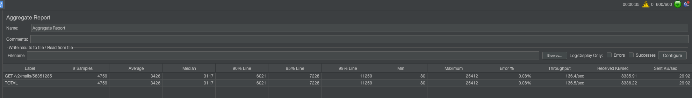

- TPS: 139.4
- 평균 소요 시간 : 3.692s
- 90% 요청이 6.198s 이내에 완료

특이사항 :
- [ ] CPU 증가
- [ ] 메모리 증가
- [ ] sentry 이슈 발생

#### 메일 컨텐츠가 큰 상태 - 22MB

**16.MB 파일 하나를 첨부한 컨텐츠가 없는 메일**

1차 - Number of Threads (users): 600 시 Heap OOM 발생
- 서버 죽음.. ㅠ (마지막 메모리 사용률 : 1.03Gib)

2차 - Number of Threads (users): 200 시 Heap OOM 발생
- 서버 죽음2 (마지막 메모리 사용률 : 1.02Gib)

- TPS: 6.3 (에러로 인해 계속 감소)
- 평균 소요 시간 : 에러로 인해 부정확하므로 생략

특이사항 :
- [ ] CPU 증가
- [X] 메모리 증가
  - 950MB까지 급증, 종료 시 873MB까지 다운
- [X] sentry 이슈 발생
  - Heap OOM
  - HikariPool-4 - Connection is not available, request timed out after 30201ms.
  - DataAccessResourceFailureException

3차 - Number of Threads (users): 30

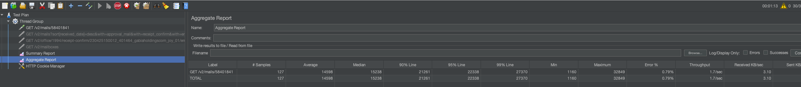

- TPS: 1.7
- 평균 소요 시간: 14.820s
- 90% 요청이 21.247s 이내 완료

4차 - Number of Threads (users): 80

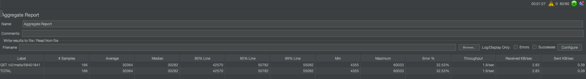

- TPS: 1.7
- 평균 소요 시간: 30s
- 90% 요청이 47.498s 이내 완료
- Error 비율: 47.81%

특이사항 :
- [ ] CPU 증가
- [X] 메모리 증가
  - 917MB까지 급증, 종료 시 889MB까지 다운 (더이상 안내려감)
  - 다른 API 호출하면서 857MB 까지 다운 (누수는 아닌걸로..)
- [X] sentry 이슈 발생
  - Heap OOM
  - HikariPool-4 - Connection is not available, request timed out after 30201ms.
  - DataAccessResourceFailureException

## GET /v2/office/:officeNo/receipt-confirm/:certKey/email/:email

Number of Threads (users): 600

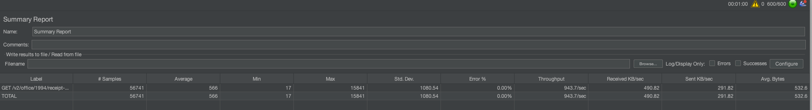

- TPS: 936.7
- 평균 소요 시간 : 603ms
- 90% 요청이 1.117s 이내에 완료

특이사항 :
- [ ] CPU 증가
- [ ] 메모리 증가
- [ ] sentry 이슈 발생

## POST /v2/mails/send

빈 내용 (3KB) 메일 발송

Number of Threads (users): 50
- 이걸 높이면 응답시간이 기하급수적으로 올라감

```yaml
{
    "cert_key": "12541212412412",
    "sender_no": 4010,
    "to": [
        "jerry22222@gabiaholdings.com"
    ],
    "cc": [],
    "bcc": [],
    "subject": "136236234636",
    "content": "contentcontent121212",
    "important": false,
    "is_save": true,
    "is_separate_send": false,
    "is_encrypt": false,
    "is_receipt_confirm": true
}
```

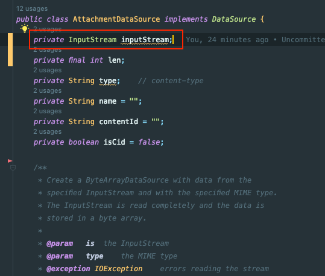

발송 부하테스트 시 위와 같이 10개 ~ 30 개 정도 요청까지 TPS 16으로 실행된 이후, Deadlock이 걸린 것처럼 요청에 대한 응답이 돌아오지 않는 현상이 발생한다.

조금 더 기다리면 아래 처럼 모조리 실패하는 것을 볼 수 있었다.

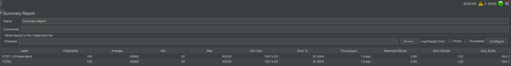

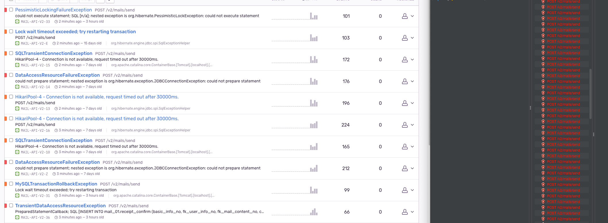

- TPS / 평균 소요 시간 / 90% Line :  (정상 측정 불가)

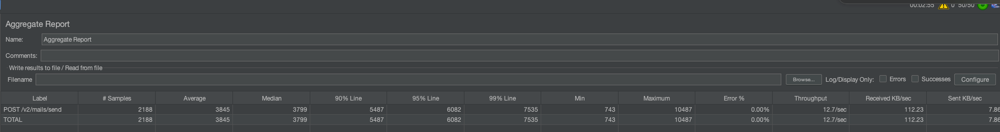

데드락을 피하고자 수신 확인 태그 저장 옵션을 끄면 아래와 같이 측정된다.

- TPS: 12.7
- 평균 소요 시간: 3.845s
- 90% 요청이 5.487s 이내 완료

특이사항 :
- [ ] CPU 증가
- [ ] 메모리 증가
- [X] sentry 이슈 발생
  - DeadLock이 발생하는 것으로 보임 

# 정리
 
**TODO**
- /mails (리스트 조회)
  - [ ] 병목 구간 확인
- /mail/:mailNo (단건 조회)
  - [ ] 파일 크기가 클 때 TPS 개선안 찾기
  - [ ] 파일 크기가 클 때 OOM 발생하는 이슈 해결방안 모색
  - [ ] HikariPool Timeout 발생하는 것 보니깐, Storage Transaction 분리 안된 것 같음 (체크)
- /mails/send (메일 발송)
  - [ ] 데드락 발생? 원인 확인

**치명적인 메모리 누수는 없는 걸로!**

## /mails 개선

```sql
select
  count(mail0_.no) as col_0_0_
from
  mail_01.mail_content mail0_
    left outer join
  mail_01.personal_mailbox personalma1_
  on (
        personalma1_.no=mail0_.mbox_no
      and mail0_.basic_info_no=personalma1_.basic_info_no
    )
where
  (
    mail0_.del_flag = 'N'
    )
  and mail0_.basic_info_no=1994
  and mail0_.fk_user_info_no=1
  and (
      personalma1_.lockinfo_type not in  (
                                          'B' , 'A'
      )
    or personalma1_.no is null
  )
;
```

구간별로 로직을 제거하고 TPS 확인을 반복한 결과 TPS 병목 구간은 해당 구간이었다.

(이상하게도 포스트맨 한번 요청할 시 0.3s밖에 안걸리는데 TPS가 12정도 밖에 안나왔다..)

원인은 SQL 실행 순서에 있었다. mail_content와 personal_mailbox는 1대 0~1 관계임에도 불구하고 Left Outer Join을 사용하면서 문제가 생겼다.
- Where 조건을 먹이기 전에 LeftOuterJoin으로 모든 mailbox를 불러온 후 매칭시켜야 하는 점

그래서 해당 쿼리를 두 개로 분리하기로 했다.
- 잠금 상태의 personal_mailbox 목록 조회
- 메일 리스트 조회 시 mailbox_id NOT IN (?)

이렇게 분리하면 Left Outer Join을 수행하지 않아도 된다.

(사실 아래와 같이 SubQuery를 사용해도 되었다.)

```sql
SELECT COUNT(mail0_.no) AS col_0_0_
    FROM mail_01.mail_content mail0_
    WHERE mail0_.del_flag = 'N'
    AND mail0_.basic_info_no=1994
    AND mail0_.fk_user_info_no=1
    AND NOT EXISTS (
        SELECT 1 FROM mail_01.personal_mailbox personalma1_
        WHERE personalma1_.no=mail0_.mbox_no
    AND mail0_.basic_info_no=personalma1_.basic_info_no
AND personalma1_.lockinfo_type IN ('B','A')
)
```

하지만 QueryDsl에서 Exists를 사용하기 어려울 뿐 아니라 유지보수 관점에서 쿼리를 분리하는 것이 낫다고 판단했다.

적용 결과 아래의 변화가 있었다.

**Number of Threads (users): 200**

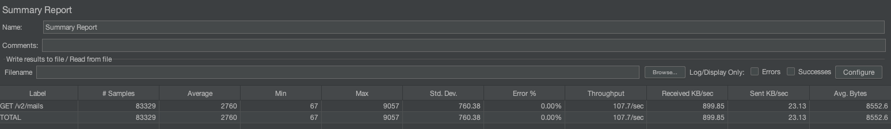

- **TPS: 10.8 -> 107.7**
- 평균 소요 시간 : 7.914s -> 2.147s
- 90% 요청이 11.089s -> 3.176s 이내에 완료

특이사항 :
- [ ] CPU 증가
- [ ] 메모리 증가
- [ ] sentry 이슈 발생

참고로 HTTP 트랜잭션 시간은 320ms -> 120ms 정도로 개선되었어요!

## /mails with Params

/v2/mails?sort[received_date]=desc&with=approval_mail&with=receipt_confirm&with=encrypted

Number of Threads (users): 200

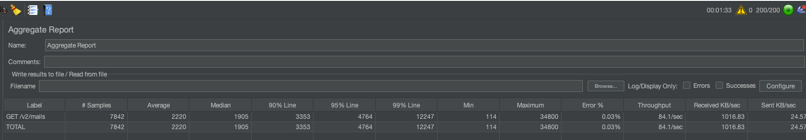

- **TPS: 10.8 -> 84.1**
- 평균 소요 시간 : 7.914s -> 2.220s
- 90% 요청이 11.089s -> 3.353s 이내에 완료

특이사항 :
- [ ] CPU 증가
- [ ] 메모리 증가
- [ ] sentry 이슈 발생

## /mails/:mailNo

#### 1. 예상대로 서비스 단위에서 Transaction이 열려서 DB 트랜잭션 안에서 스토리지에 저장하고 있었다.

그래서 Service 단위의 트랜잭션을 제거했다. (Reader에서 트랜잭션을 가지고 있다.)

아래의 에러는 이제 나타나지 않았고,
- HikariPool-4 - Connection is not available, request timed out after 30201ms.
- DataAccessResourceFailureException

TPS는 로컬 기준 1.7 -> 4.2 정도로 개선되었다.

#### 2. BufferedInputStream 활용

```java
@Component
public class MailStreamBuffer {

  public InputStream getEmlInputStream(File file) {
    InputStream inputStream = null;
    try {
      inputStream = isZip(file) ?
              getZipFileInputStream(file) :
              getFileInputStream(file);
    } catch (FileNotFoundException e) {
      throw new ResourceNotFoundException("Failed To Find Message Resource");
    } catch (IOException e) {
      throw new ResourceNotFoundException("Failed To Compress Eml File");
    }
    return replaceLineStream(inputStream);
  }

  private InputStream replaceLineStream(InputStream inputStream) {
    return new ReplacingInputStream(new ReplacingInputStream(inputStream, "\r\n", "\n"), "\n", "\r\n");
  }

}
```

위는 기존의 코드다. 반환받는 InputStream에서 BufferedInputStream을 사용하지 않는다.

이를 아래와 같이 BufferedInputStream을 사용하도록 수정하고 성능 개선을 할 수 있었다.

```java
@Component
public class MailStreamBuffer {

    public InputStream getEmlInputStream(File file) {
        InputStream inputStream = null;
        try {
            inputStream = isZip(file) ?
                    getZipFileInputStream(file) :
                    getFileInputStream(file);
        } catch (FileNotFoundException e) {
            throw new ResourceNotFoundException("Failed To Find Message Resource");
        } catch (IOException e) {
            throw new ResourceNotFoundException("Failed To Compress Eml File");
        }
        return new BufferedInputStream(replaceLineStream(inputStream));
    }

    public static InputStream removeCRInputStream(InputStream inputStream) {
        return new ReplacingInputStream(inputStream, "\r\n", "\n");
    }

    private InputStream replaceLineStream(InputStream inputStream) {
        return new ReplacingInputStream(new ReplacingInputStream(inputStream, "\r\n", "\n"), "\n", "\r\n");
    }

    private boolean isZip(File file) {
        String filename = file.getName();
        return FilenameUtils.getExtension(filename).equals("bz2");
    }
  
}
```

수정된 코드에서는 마지막에 반환하기 전에 BufferedInputStream을 사용한다.
- ReplacingInputStream에서 어차피 순회해서 큰 의미가 없었다.
- ReplaceingInputStream은 비즈니스 요구사항을 위해 사용하고 있고, 사용하지 않아도 드라마틱한 변화는 없다.  

TPS는 로컬 기준 4.2 -> 10.1로 개선되었다.


### dev는 여전히 터짐..

그래서 Local 환경에서 TPS 4.2 -> 10.1 인 것을 확인하고 dev에 반영했는데, dev에서는 해당 TPS가 나오지 않고 계속 서버가 터졌다.
- Users를 30으로 해도, TPS를 3.0 정도 유지하다가 서버가 터짐

정확한 원인을 찾기 위해 그라파나를 dev와 동일한 환경인 feature에 붙여서 확인했다.

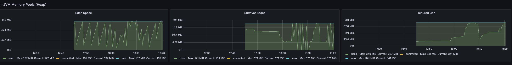

결과 Eden, Survivor, Old Gen 모두 가득차서 더이상 Heap에 공간이 없는 사태가 존재한다.

이때 빠르게 MajorGC가 일어나길 기대하지만.. 그렇지 않았고, MajorGC가 일어나더라도 80~200MB 정도의 공간만 생겼다.

마음에 거리는 것은 크게 세 가지가 있었다.
1. Serial GC를 사용하는 점
2. 메모리 누수가 발생한 경우
3. 그냥 요구사항 및 특성에 따른 Heap Size가 모자란 경우

## 1. Serial GC를 사용하는 점

로컬에서랑 다르게 부하 테스트 중인 Dev 서버의 경우 Serial GC를 사용하고 있었다. (다중 코어 프로세스가 아닌 경우에 해당한다. 1개 Pod는 단일 코어로 구성되어 있었다.)

여기서 드는 의문이 실제 운영 환경에서 SerialGC를 사용해도 되냐는 것이다.

GC를 위해 강제로 코어를 올리는 것은 권장되지 않는다. 대신 메모리 사용량을 최적화하고 JVM 튜닝을 통해 메모리 사용을 최소화하는 것이 중요하다.

일반적으로 Serial GC는 작은 힙/단일 코어에만 적합하다. k8s에 배포된 Java 애플리케이션의 경우 사실 멀티 코어 애플리케이션이며, 항상 많은 스레드가 실행된다. 그래서 Heap 크기로 보나, 서버 특성으로 보나 SerialGC는 적합하지 않았고, Z1GC를 사용하는 것이 적합하다.
- -XX:+UseG1GC

참고
- https://pretius.com/blog/jvm-kubernetes/

## 2. Heap Size가 모자란 경우

일반적인 API Server의 경우 적당한 Heap Size가 1GB ~ 2GB 정도라고 한다.

현재 개발중인 Mail API Server의 경우는 512M을 사용하고 있었는데, 너무나 작았던 것 같다. 근거는 아래와 같다.
- 너무 다양한 역할
  - MultiModule을 초기에 도입하지 못해서 해당 프로젝트에는 너무 많은 책임이 있었다. (Schedule, EventListener, ..., 도메인도 다수)
- 메일 본문 조회
  - 메일을 조회할 때 EML 원문을 조회하는데 1KB ~ 25MB 까지도 될 수 있었다.
- 가장 많이 사용되는 서비스
  - 메일 서비스는 하이웍스 내에서 가장 많이 사용되고, 가장 많은 트래픽이 발생되는 서비스이다.
  
스레드 5~10개에서 20MB 본문 조회 요청만 해도 OOM이 발생하면서 심각한 문제를 야기한다. 즉, 요구사항이나 본문을 조회하는 로직을 개선하기 전에는 HeapSize 512MB은 턱없이 부족했다.

우선 GC 알고리즘은 내버려두기로 하고, HeapSize를 1GB로 늘리기로 했다.

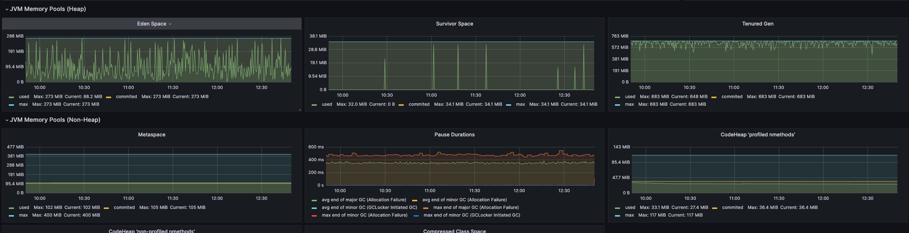

그 결과 Number of Threads (users)가 10일때도 OOM이 계속 터지던 것이 30으로 해도 꽤 안정적으로 돌아간다.

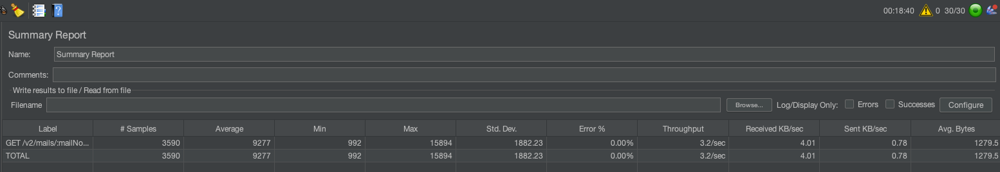

- TPS: 1.7 -> 3.2
- 평균 소요 시간: 14.820s -> 9s
- 90% 요청이 51.498s -> 11.557s 이내 완료
- Error 비율: 47.81% -> 0%

처음에 측정한 경우에서는 샘플 수가 적었던 것(에러 터지기 전까지 측정)과 에러 비율이 높은 것을 측정하면 TPS 측면에서도 꽤 개선이 되었다.

그래도 로컬에서는 TPS가 14.1정도는 나오는데.. dev 서버쪽은 3.2 밖에 안나왔고 스토리지 I/O에 문제가 있다고 하는데, 정확히는 잘 모르겠다.
- 다른 end-point에서는 로컬 확녕이 dev 서버에 비해 TPS가 1/3 정도 밖에 안나온다.
- 단건 HTTP 트랜잭션 시간은 local, dev가 비슷한데, 부하 테스트때 TPS가 안나오는 거라서 CPU나 Disk I/O 리소스 문제인 것으로 추정.
- 정확한 원인을 알게 되면 내용을 추가하자..!

## 3. 메모리 누수가 발생한 경우

맨 처음에 메모리 누수를 어렴풋이 확인할 수 있었는데, dev쪽에서만 Heap OOM이 계속 터지는 상황이었고, 요청 하나를 처리하지도 못하는 상황까지도 이르렀다.

그래서 dev쪽만 누수가 생긴 것은 아닐까? 의심을 하게 되었다.

아래 사이트를 참고해보면 Memory leak은 Full GC/Major GC가 발생했음에도 Heap이 그대로일 때 발생했다고 추리할 수 있다고 한다.
- https://techblog.woowahan.com/2628/

해당 부분은 동료 분의 의견을 듣고 오전에는 부하를 계속 보내고 있다가 메모리가 빠지는 지를 우선 체크하기로 했다.

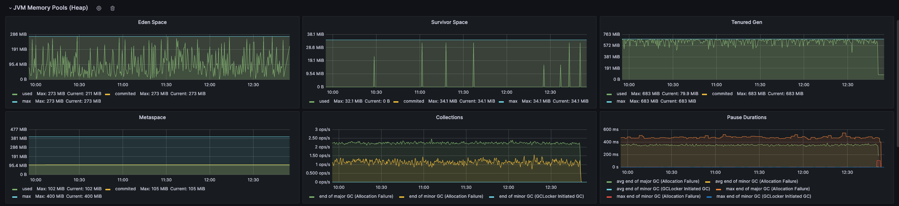

3시간 가량 동안 JMeter로 요청을 보냈으나 MajorGC에서 Heap 사이즈는 매번 비슷한 수준으로 잘 빠졌다.

추가로 오후에 요청을 중지하니깐 급격하게 메모리 사용량이 줄어드는 것도 확인했다.

아래는 요청을 중지한 후 1분 정도 경과했을 때의 메모리 사용량이다.

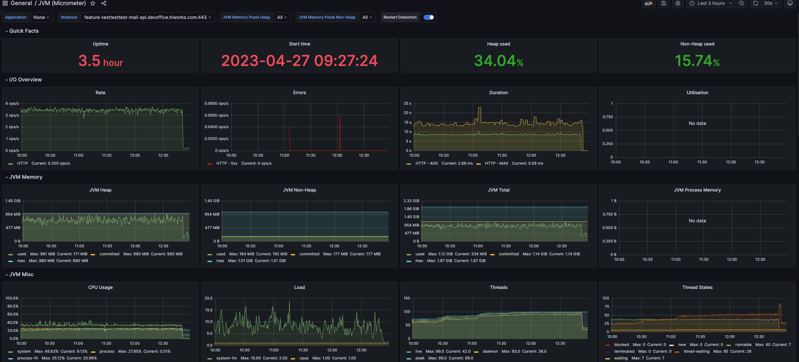

결과적으로 메모리 누수는 없었던 것 같다.

### TPS 별 효과 없음..

Heap을 향상 시켰고, 메모리 누수는 없었다. 그런데 dev 기준으로는 TPS가 드라마틱한 변화가 없었다. (1.7 -> 3.2) 

그래서 로직 중 가장 병목이 심한 곳이 어디인지 체크해봤다.

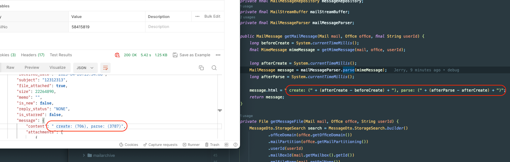

그 결과 병목이 발생하는 구간은 MimeMessage를 읽어서 POJO(Response)로 변환하는 parse 메서드에서 가장 심하다는 것을 알 수 있었다.
- (위 캡쳐는 TPS로 부하테스트 중에 PostMan으로 별도로 요청을 보낸 것이다. 일반적인 환경에서는 58ms, 320ms 정도가 나온다.)

그리고 parse 과정 중에 가장 부하가 큰 부분은 아래 부분이다.

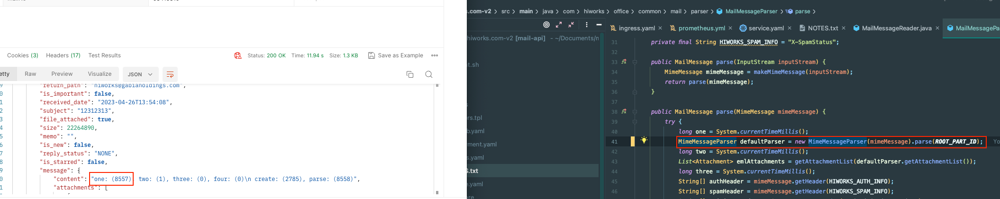

해당 메서드를 계속 타고 내려간 끝에 아래의 부분에서 막대한 처리 시간이 필요하다는 것을 알게 되었다!

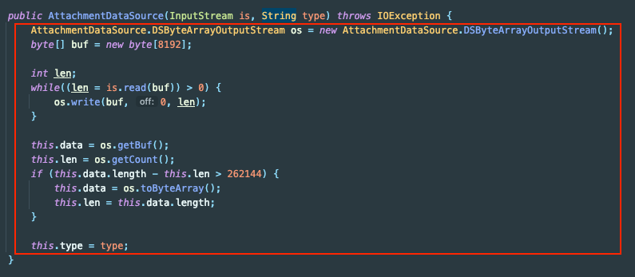

팀에서 개발했던 라이브러리의 parser가 사용하지도 않을 첨부파일의 byte[]를 전부 읽어서 저장하고 있었다. 즉, MimeMessage는 헤더정도만 읽고, 데이터는 InputStream을 보관하던 것이 Custom하면서 전체 바이너리 데이터를 Heap에 올리고 있었던 것이다.

첨부파일의 경우 별도의 end-point를 통해 다운로드 하기 때문에 바이너리 데이터가 필요가 없다.
- 읽기와 발송 등을 모두 가능하게 하려다가 읽기의 성능을 고려하지 못한 것 같다.

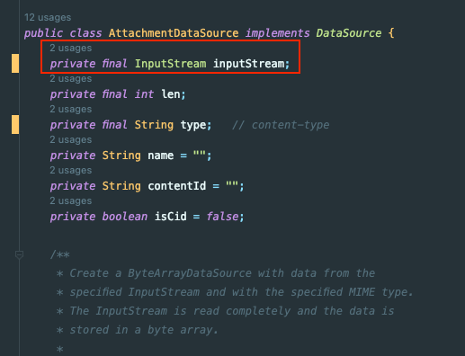

그래서 위와 같이 InputStream을 내장하고 Byte[]를 읽지 않아도 되도록 변경했다.

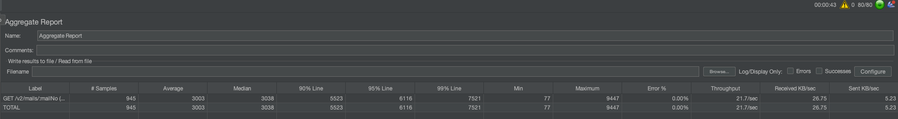

변경 이후에는 TPS가 눈에띄게 상승했다.

Number of Threads (users): 70

- TPS: (최초) 1.7 -> 21.7
- 평균 소요 시간: 14.820s -> 3.003s
- 90% 요청이 21.247s -> 5.523s 이내 완료

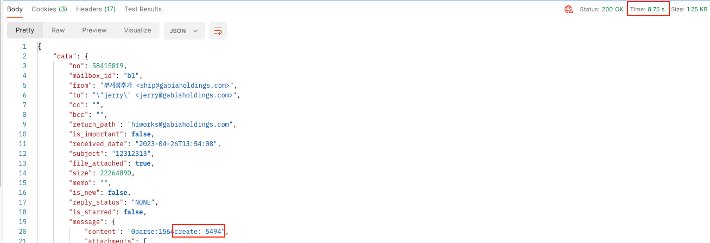

더 개선할 수는 없을까? 고민하면서 부하 상황에서 디버깅 해봤는데, 전체 트랜잭션 8.71s 중에 대부분인 5.4s를 create에 사용하고 있었고,

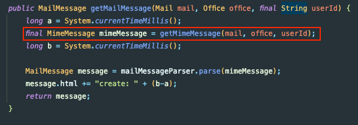

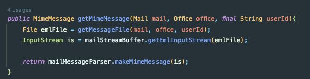

create의 경우 javax.MimeMessage를 생성하는 부분이라서 우리가 제어할 수 있는 부분이 아니었다.

그래서 GET /mails/:mailNo의 경우 이 정도로 개선하기로 했다.

## /mails/send

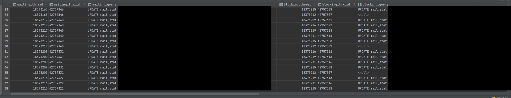

예상대로 부하 테스트 중 락이 쌓여 있었다. 그래서 문제가 되는 트리거를 비활성화 한 다음 다시 테스트를 돌려봤는데, 여전히 같은 현상이 발생했다.
- 데드락 관련 익셉션만 사라진 상황

추가로 해당 쿼리는 트리거에서 단일 쿼리로 동작하기 때문에 데드락이 될 수 없었다. 그리고 일부 쿼리의 blocking_query가 출력되지 않았던 것이 의아했다.


이후 HikariCP Log를 통해 특정 DB의 커넥션이 꽉차있고, 다른 DB에만 계속 조회가 쌓이고, 그 특정 DB에게 요청만 하지 못하고 대기하는 상황인 것을 발견했다.

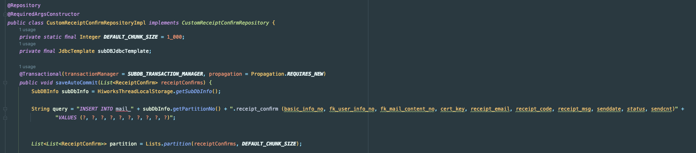

그래서 Rancher를 뒤져서 쿼리 로그를 따라 가고 보니깐 위 쿼리 이전에서 병목이 걸려있었다. 메인 트랜잭션이랑 무관하게 반드시 필요한 처리여서 고립 수준을 REQUIRES_NEW로 해서 새로운 커넥션으로 DB에 커밋까지 하는 코드였다.

- 아하! 총 10개의 커넥션이 모두 커넥션을 하나씩 점유한 채로 하나의 커넥션을 더 요구하면서 데드락이 생겼었다.

REQUIRES_NEW로 사용하게 된 이유가 메인 코드에서 수신 확인 태그를 DB에 생성하고 발송 서버에 동기로 요청을 보내는데, DB 트랜잭션 안에 발송 요청이 포함되어 있기 때문에 생성한 데이터를 DB에 Commit 하지 않은 시점에서 발송 서버에서 조회를 하면서 데드락이 걸리는 현상이 발생했었다.
- REQUIRES_NEW로 먼저 해당 데이터는 반드시 커밋하게 하기 위함

이 문제를 해결하기 위해서는 아래의 방법들이 있었다.
1. Connection Pool 확장
2. Connection Timeout 설정
3. 코드 분리
4. 비동기 실행

아래 Reference를 보면 1개의 커넥션으로 실행할 수 없는 코드는 HikariCP 데드락을 유발할 수 있는 코드라고 설명한다.
- https://techblog.woowahan.com/2663/
- (Nested Transaction을 사용하지 말자!)

그래서 사실상 1번과 2번은 임시 방편에 불과했고, 나는 4번을 선택했다. 해당 로직을 비동기로 처리했다는 것은 아니다.

### 해결 방법

그래서 해당 메서드의 propagation = REQUIRES_NEW를 제거하고, 발송을 비동기 발송으로 변경했다.

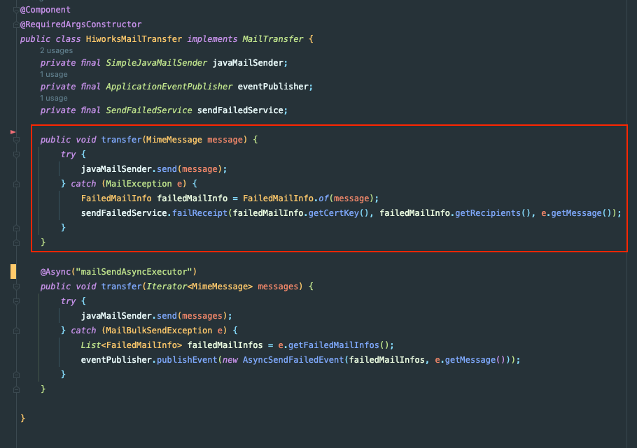

그게 가능했던 이유는 원래 Exception을 던지지 않고, 발송 요청에서 Exception이 터져도 catch해서 무조건 커밋을 하고 있었다.

사실 그렇다면 요청을 기다릴 이유가 원래 없었던 것이고, 비동기로 요청을 수행해도 무방했다.

한 가지 걱정되는 것은 발송 서버의 프로세스가 돌아가는 시점에 DB에 커밋이 되어 있는 것을 보장할 수 있느냐는 것이다.
- 이에 대해서는 메인 트랜잭션에서 DB에 INSERT 하면서 락을 획득했고, 발송 서버에서는 이를 기다려야 데이터를 수정할 수 있기 때문에 순서가 보장된다고 판단했다.

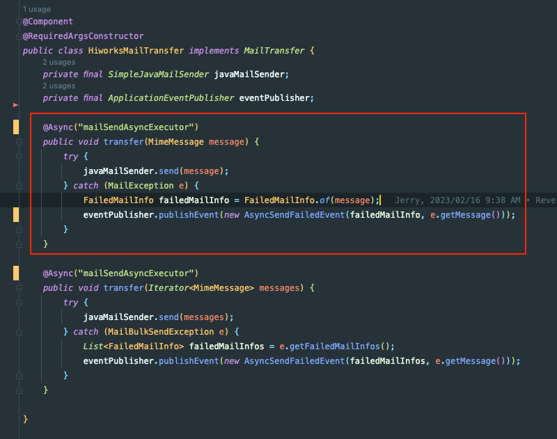

그래서 위와 같이 수정할 수 있었고, 성능도 많이 향상되었다. 발송 서버가 병목 지점 중 하나였다.

Number of Threads (users): 150

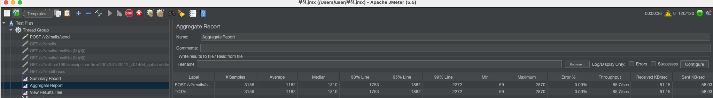

아래에서 기준 값은 수신확인 태그 옵션을 false로 한 채로 발송했을 때이다. (데드락 발생 안하는 경우)
- TPS: 12.7 -> 85.7
- 평균 소요 시간: 3.845s -> 1.182s
- 90% 요청이 5.487s -> 1.683s 이내 완료

아래는 수신확인 태그 옵션을 true로 발송했을 때이다.

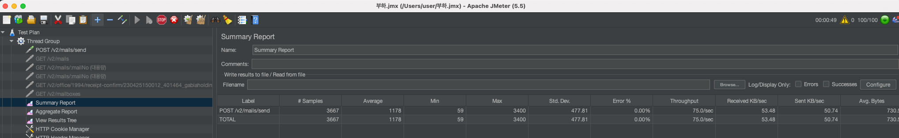
- TPS: (측정 불가) -> 75.0
- 평균 소요 시간: (측정 불가) -> 1.178s
- 90% 요청이 (측정 불가) -> 1.683s 이내 완료
- CP 데드락 해결