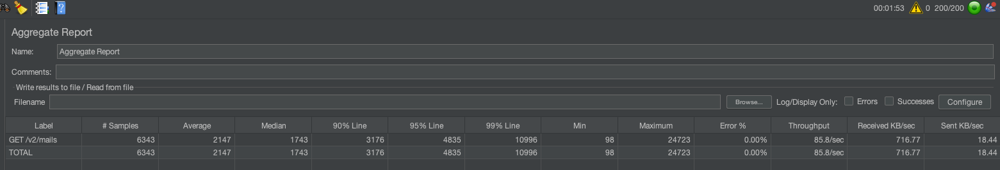

# 메모리 누수 확인

사내에서 부하 테스트를 할 때 보통은 Rancher + Ngrinder를 자주 사용합니다.
- 사내 dev 환경 쿠버네티스에 올리면 Rancher에서 확인할 수 있습니다.
- (Ngrinder를 사용하면 사내 독립된 서버에서 Client에 영향없이 부하테스트를 진행할 수 있음)

Ngrinder보다 Apache JMeter로 테스트를 구성하는 게 저한테는 쉽습니다.
- 각각 스레드 그룹을 생성하고, 요청을 여러개 생성해서 일괄적으로 실제 환경을 구성해서 테스트할 수 있음.
- 이를 Ngrinder로 작성하려면 복잡한 스크립트 코드가 필요하다.

Rancher에서는 아래의 정보를 줍니다.


Rancher에서 메모리가 나오지만, 누수가 발생하는 지나 Heap과 MetaSpace 영역이 각각 어떻게 되는지, GC는 얼마나 자주 실행되는 지 등을 파악하기 어렵다.

그래서 Prometheus + JMeter를 사용했습니다.
- 다양한 지표와 높은 Thread 수로 1시간 정도 확인을 했지만, 메모리 누수는 확인할 수 없었습니다.


일반적으로 메모리가 아래와 같이 구성된 것 같습니다.
- G1 Eden Space + G1 Old Gen + G1 Survivor Space
- Metaspace

## G1 Eden Space


Eden의 경우 GC가 일어나는 시점에 공간이 10MB 이하로 줄기 때문에 누수는 아닐 것 같습니다.

## G1 Old Gen


서버를 오랜시간 지속시킬 수록 OldGen이 차고 있습니다.

OldGen의 경우 GC가 발생해도 데이터가 많이 정리되지 않아서, 오랜 시간 데이터를 운영해야 확실하게 누수를 파악할 수 있을 것 같습니다.

## G1 Survivor Space


Survivor Space의 경우 용량을 크게 차지하지 않고, 잘 정리가 되는 것으로 판단됩니다.

## Metaspace


Metaspace의 경우 메모리가 눈에 띄게 쌓이지 않고 일정해서 누수는 없을 것 같습니다.

### 누수 확인 결과

누수 확인 결과 치명적인 문제는 찾을 수 없었습니다.

# 부하 테스트

dev 서버 기준으로 부하테스트를 진행했습니다.
- mail-api.devoffice.hiworks.com

log 관련 프로퍼티를 끄면 성능이 소량 향상될 것으로 보입니다.

[추가 정보]
- 다중 DataSource 활용 - X
- 다중 스키마 활용 - X

## GET /v2/mailboxes

Number of Threads (users): 550


- TPS: 967.7
- 평균 소요 시간 : 544ms
- 90% 요청이 1.3s 이내에 완료

특이사항
- [ ] CPU 증가
- [ ] 메모리 증가
- [ ] sentry 이슈 발생

## GET /v2/mails with Params

/v2/mails?sort[received_date]=desc&with=approval_mail&with=receipt_confirm&with=encrypted

Number of Threads (users): 100


- TPS: 12.0
- 평균 소요 시간 : 7.376s
- 90% 요청이 9.289s 이내에 완료

특이사항 :
- [ ] CPU 증가
- [ ] 메모리 증가
  - 시작 시 메모리 600MB -> 최고점 823MB -> 종료 후 10분 750MB
  - 문제는 없는 것으로 판단 (로컬 그라파나에서 문제 없는 것 확인했, 재시도 시 문제 없는 것 확인)
- [ ] sentry 이슈 발생

## GET /v2/mails

/v2/mails (Query 파라미터 없음)

**1차: Number of Threads (users): 100**


- **TPS: 10.8**
- 평균 소요 시간 : 7.914s
- 90% 요청이 11.089s 이내에 완료

특이사항 :
- [ ] CPU 증가
- [ ] 메모리 증가
  - 시작 시 메모리 600MB -> 최고점 823MB -> 종료 후 10분 750MB
  - 문제는 없는 것으로 판단 (로컬 그라파나에서 문제 없는 것 확인했, 재시도 시 문제 없는 것 확인)
- [ ] sentry 이슈 발생

## GET /v2/mails/:mailNo

#### 메일 컨텐츠는 거의 없는 상태 - 4KB

Number of Threads (users): 600


- TPS: 947.3
- 평균 소요 시간 : 595ms
- 90% 요청이 1.398s 이내에 완료

특이사항 :
- [X] CPU 증가
  - 메일함 조회때보다 2배 상승했지만, DiskIO에 의한 것으로 판단
  - 종료 시 다시 CPU 정상화
- [ ] 메모리 증가
- [ ] sentry 이슈 발생

#### 메일 컨텐츠가 적당한 상태 - 712KB

실제 고객이 보낸 샘플 데이터 (이미지 4개 정도가 포함되었고, 답글한 형태)

Number of Threads (users): 600


- TPS: 139.4
- 평균 소요 시간 : 3.692s
- 90% 요청이 6.198s 이내에 완료

특이사항 :
- [ ] CPU 증가
- [ ] 메모리 증가
- [ ] sentry 이슈 발생

#### 메일 컨텐츠가 큰 상태 - 22MB

**16.MB 파일 하나를 첨부한 컨텐츠가 없는 메일**

1차 - Number of Threads (users): 600 시 Heap OOM 발생
- 서버 죽음.. ㅠ (마지막 메모리 사용률 : 1.03Gib)

2차 - Number of Threads (users): 200 시 Heap OOM 발생
- 서버 죽음2 (마지막 메모리 사용률 : 1.02Gib)

- TPS: 6.3 (에러로 인해 계속 감소)
- 평균 소요 시간 : 에러로 인해 부정확하므로 생략

특이사항 :
- [ ] CPU 증가
- [X] 메모리 증가
  - 950MB까지 급증, 종료 시 873MB까지 다운
- [X] sentry 이슈 발생
  - Heap OOM
  - HikariPool-4 - Connection is not available, request timed out after 30201ms.
  - DataAccessResourceFailureException

3차 - Number of Threads (users): 30


- TPS: 1.7
- 평균 소요 시간: 14.820s
- 90% 요청이 21.247s 이내 완료

4차 - Number of Threads (users): 80


- TPS: 1.7
- 평균 소요 시간: 30s
- 90% 요청이 47.498s 이내 완료
- Error 비율: 47.81%

특이사항 :
- [ ] CPU 증가
- [X] 메모리 증가
  - 917MB까지 급증, 종료 시 889MB까지 다운 (더이상 안내려감)
  - 다른 API 호출하면서 857MB 까지 다운 (누수는 아닌걸로..)
- [X] sentry 이슈 발생
  - Heap OOM
  - HikariPool-4 - Connection is not available, request timed out after 30201ms.
  - DataAccessResourceFailureException

## GET /v2/office/:officeNo/receipt-confirm/:certKey/email/:email

Number of Threads (users): 600


- TPS: 936.7
- 평균 소요 시간 : 603ms
- 90% 요청이 1.117s 이내에 완료

특이사항 :
- [ ] CPU 증가
- [ ] 메모리 증가
- [ ] sentry 이슈 발생

## POST /v2/mails/send

빈 내용 (3KB) 메일 발송

Number of Threads (users): 50
- 이걸 높이면 응답시간이 기하급수적으로 올라감

```yaml
{
    "cert_key": "12541212412412",
    "sender_no": 4010,
    "to": [
        "jerry22222@gabiaholdings.com"
    ],
    "cc": [],
    "bcc": [],
    "subject": "136236234636",
    "content": "contentcontent121212",
    "important": false,
    "is_save": true,
    "is_separate_send": false,
    "is_encrypt": false,
    "is_receipt_confirm": true
}
```


- TPS: 12.7
- 평균 소요 시간 : 3.821s
- 90% 요청이 5.404s 이내에 완료

특이사항 :
- [ ] CPU 증가
- [ ] 메모리 증가
- [ ] sentry 이슈 발생

# 정리
 
**TODO**
- /mails (리스트 조회)
  - [ ] 병목 구간 확인
- /mail/:mailNo (단건 조회)
  - [ ] 파일 크기가 클 때 TPS 개선안 찾기
  - [ ] 파일 크기가 클 때 OOM 발생하는 이슈 해결방안 모색
  - [ ] HikariPool Timeout 발생하는 것 보니깐, Storage Transaction 분리 안된 것 같음 (체크)
- /mails/send (메일 발송)
  - [ ] 병목구간 확인.. 빈 메일임에도 너무 처리량이 낮음 (TPS 12)
  - (HikariPool-4 - Connection is not available, request timed out after 30005ms.)가 터진다는 건 서비스 로직 진입 이후이기 때문에 외부 호출에 대한 병목이 있는 것으로 보임

**치명적인 메모리 누수는 없는 걸로!**


## /mails 개선

```sql
select
  count(mail0_.no) as col_0_0_
from
  mail_01.mail_content mail0_
    left outer join
  mail_01.personal_mailbox personalma1_
  on (
        personalma1_.no=mail0_.mbox_no
      and mail0_.basic_info_no=personalma1_.basic_info_no
    )
where
  (
    mail0_.del_flag = 'N'
    )
  and mail0_.basic_info_no=1994
  and mail0_.fk_user_info_no=1
  and (
      personalma1_.lockinfo_type not in  (
                                          'B' , 'A'
      )
    or personalma1_.no is null
  )
;
```

구간별로 로직을 제거하고 TPS 확인을 반복한 결과 TPS 병목 구간은 해당 구간이었다.

(이상하게도 포스트맨 한번 요청할 시 0.3s밖에 안걸리는데 TPS가 12정도 밖에 안나왔다..)

원인은 SQL 실행 순서에 있었다. mail_content와 personal_mailbox는 1대 0~1 관계임에도 불구하고 Left Outer Join을 사용하면서 문제가 생겼다.
- Where 조건을 먹이기 전에 LeftOuterJoin으로 모든 mailbox를 불러온 후 매칭시켜야 하는 점

그래서 해당 쿼리를 두 개로 분리하기로 했다.
- 잠금 상태의 personal_mailbox 목록 조회
- 메일 리스트 조회 시 mailbox_id NOT IN (?)

이렇게 분리하면 Left Outer Join을 수행하지 않아도 된다.

(사실 아래와 같이 SubQuery를 사용해도 되었다.)

```sql
SELECT COUNT(mail0_.no) AS col_0_0_
    FROM mail_01.mail_content mail0_
    WHERE mail0_.del_flag = 'N'
    AND mail0_.basic_info_no=1994
    AND mail0_.fk_user_info_no=1
    AND NOT EXISTS (
        SELECT 1 FROM mail_01.personal_mailbox personalma1_
        WHERE personalma1_.no=mail0_.mbox_no
    AND mail0_.basic_info_no=personalma1_.basic_info_no
AND personalma1_.lockinfo_type IN ('B','A')
)
```

하지만 QueryDsl에서 Exists를 사용하기 어려울 뿐 아니라 유지보수 관점에서 쿼리를 분리하는 것이 낫다고 판단했다.

적용 결과 아래의 변화가 있었다.

**Number of Threads (users): 200**



- **TPS: 10.8 -> 85.8**
- 평균 소요 시간 : 7.914s -> 2.147s
- 90% 요청이 11.089s -> 3.176s 이내에 완료

특이사항 :
- [ ] CPU 증가
- [ ] 메모리 증가
- [ ] sentry 이슈 발생

참고로 HTTP 트랜잭션 시간은 320ms -> 120ms 정도로 개선되었어요!

## /mails with Params

/v2/mails?sort[received_date]=desc&with=approval_mail&with=receipt_confirm&with=encrypted

Number of Threads (users): 200


- **TPS: 10.8 -> 84.1**
- 평균 소요 시간 : 7.914s -> 2.220s
- 90% 요청이 11.089s -> 3.353s 이내에 완료

특이사항 :
- [ ] CPU 증가
- [ ] 메모리 증가
- [ ] sentry 이슈 발생

## /mails/:mailNo

#### 1. 예상대로 서비스 단위에서 Transaction이 열려서 DB 트랜잭션 안에서 스토리지에 저장하고 있었다.

그래서 Service 단위의 트랜잭션을 제거했다. (Reader에서 트랜잭션을 가지고 있다.)

#### 2. BufferedInputStream 활용

```java
@Component
public class MailStreamBuffer {

  public InputStream getEmlInputStream(File file) {
    InputStream inputStream = null;
    try {
      inputStream = isZip(file) ?
              getZipFileInputStream(file) :
              getFileInputStream(file);
    } catch (FileNotFoundException e) {
      throw new ResourceNotFoundException("Failed To Find Message Resource");
    } catch (IOException e) {
      throw new ResourceNotFoundException("Failed To Compress Eml File");
    }
    return replaceLineStream(inputStream);
  }

  private InputStream replaceLineStream(InputStream inputStream) {
    return new ReplacingInputStream(new ReplacingInputStream(inputStream, "\r\n", "\n"), "\n", "\r\n");
  }

  private InputStream getFileInputStream(File file) throws FileNotFoundException {
    return new BufferedInputStream(new FileInputStream(file));
  }

  private InputStream getZipFileInputStream(File file) throws IOException {
    return new BufferedInputStream(new BZip2CompressorInputStream(new FileInputStream(file)));
  }

}
```

위는 기존의 코드다. 최종적으로 반환받는 InputStream에서는 BufferedInputStream을 사용하지 않는다.

이를 아래와 같이 수정하고 성능 개선을 할 수 있었다.

```java
@Component
public class MailStreamBuffer {

    public InputStream getEmlInputStream(File file) {
        InputStream inputStream = null;
        try {
            inputStream = isZip(file) ?
                    getZipFileInputStream(file) :
                    getFileInputStream(file);
        } catch (FileNotFoundException e) {
            throw new ResourceNotFoundException("Failed To Find Message Resource");
        } catch (IOException e) {
            throw new ResourceNotFoundException("Failed To Compress Eml File");
        }
        return new BufferedInputStream(replaceLineStream(inputStream));
    }

    public static InputStream removeCRInputStream(InputStream inputStream) {
        return new ReplacingInputStream(inputStream, "\r\n", "\n");
    }

    private InputStream replaceLineStream(InputStream inputStream) {
        return new ReplacingInputStream(new ReplacingInputStream(inputStream, "\r\n", "\n"), "\n", "\r\n");
    }

    private boolean isZip(File file) {
        String filename = file.getName();
        return FilenameUtils.getExtension(filename).equals("bz2");
    }

    private InputStream getFileInputStream(File file) throws FileNotFoundException {
        return new FileInputStream(file);
    }

    private InputStream getZipFileInputStream(File file) throws IOException {
        return new BZip2CompressorInputStream(new FileInputStream(file));
    }

}
```

수정된 코드에서는 마지막에 반환하기 전에 BufferedInputStream을 사용한다. (이전 BufferedInputStream은 오히려 성능이 낭비되는 부분이 있어서 제거했다.)
- ReplacingInputStream에서 어차피 순회해서 큰 의미가 없었다.

그래서 Local 환경에서 TPS 1.3 -> 14.1 인 것을 확인하고 dev에 반영했는데, dev에서는 해당 TPS가 나오지 않고 계속 서버가 터졌다.

정확한 원인을 찾기 위해 그라파나를 dev와 동일한 환경인 feature에 붙여서 확인했다.


결과 Eden, Survivor, Old Gen 모두 가득차서 더이상 Heap에 공간이 없는 사태가 존재한다.

이때 빠르게 MajorGC가 일어나길 기대하지만.. 그렇지 않았고, MajorGC가 일어나더라도 80~200MB 정도의 공간만 생겼다.

메일의 경우 큰 파일은 20MB 정도가 되는데, Heap 전체 512MB는 파일을 많이 다루는 메일 서버의 요구사항에 비해 너무 작다고 느꼈다.


