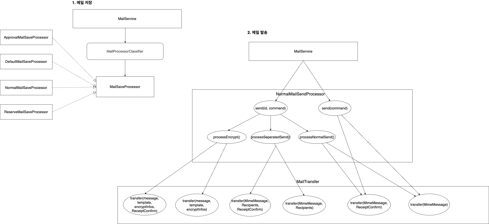
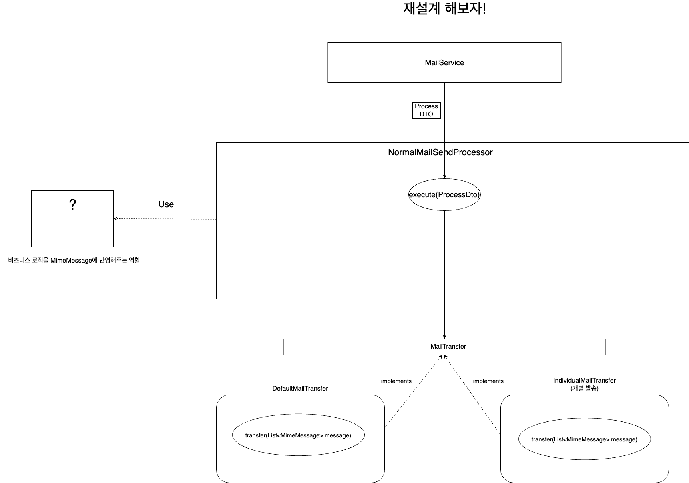
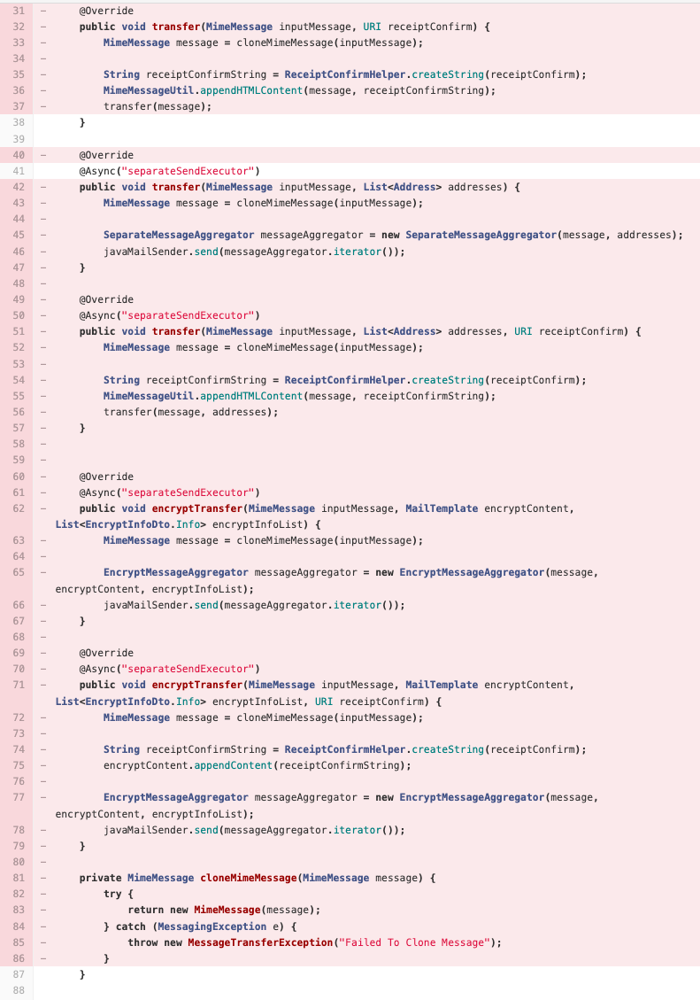

## 메일 서비스 발송 로직 개선기!

현재 메일 서비스의 레거시 개편을 동료들과 수행하고 있다.
- PHP CodeIgniter -> Java SpringBoot

그런데 요즘 느끼는 것이.. 새롭게 오픈하는 API임에도 불구하고 레거시적인 측면이 다소 남아있다.

특히 가장 복잡한 로직인 발송 로직이 가장 지저분하다. 구조를 보면 아래와 같다.



## 문제점

해당 구조가 지저분하게 보이는 이유는 발송 프로세스 쪽에 있다.
- 로직 파악이 정말 정말 어렵다.
  - send 메서드가 두개인데 무슨 차이인지 모르겠다.
  - 설계도를 보면 그나마 이해가 가능하지만, 코드를 보면 정말 신경 써야 로직이 보인다.
- 각 클래스의 책임이 모호하다.
  - SendProcessor와 Transfer의 책임의 경계가 없다.
- 절차 지향적이다.
  - SendProcessor는 각 메서드가 자신에 맞는 MailTransfer의 메서드를 호출한다.
  - 사실 상 큰 로직을 클래스를 많이 만들어서 분리한 것 밖에는 되지 않는다.
- 의미 없이 재정의한 메서드가 많다.

그래서 아래와 같이 해결하는 것을 목표로 했다!
- MailSendProcessor의 역할을 간소화 한다.
  - 메시지를 완성해서 Trasnfer를 호출하는 것 까지만 책임을 지자! (기존에는 Transfer와 책임 나눔)
- Transfer의 역할을 간소화 한다.
  - 실제로 메일을 발송하는 부분만 담당
- 필요 시 유틸성 클래스나 객체를 사용한다.
  - 비즈니스 로직을 MimeMessage에 반영하는 클래스

## 재설계

발송 프로세스를 아래와 같이 재설계를 했다.



책임은 아래와 같이 분리했다.
- SendProcessor는 MimeMessage를 만드는 책임만 진다.
- Transfer는 실제로 메일을 발송하는 책임만 진다.
  - MimeMessage 이외의 파라미터는 가지지 않는다.

추가로 SendProcessor의 send() 메서드 2개를 병합했다.
- 기존에는 저장된 메일이 있는 지 여부에 따라서 send() 메서드를 따로 호출했다.

### send() 메서드 2개 병합

```java
optionalMailNo.ifPresentOrElse(
        mailNo -> mailSendProcessor.send(mailId, processCommand),
        () -> mailSendProcessor.send(processCommand));
}
```

해당 부분의 경우 어떤 로직 상 차이가 있는지 밖에서 파악하기 힘들다.
- 저장된 메일이 없으면 암호 메일 / 승인 메일 / 예약 메일 등을 고려하지 않는다.

이는 사실 해당 프로세스 내부에서 호출하는 게 좋다고 생각해서 그냥 send만 하도록 로직을 수정했다.
```java
mailSendProcessor.send(processCommand);
```

저장 여부나 메일 id 같은 경우에는 ProcessCommand 안으로 넣었다.

### Transfer -> SendProcessor 책임 옮기기

기존에는 SendProcessor의 메서드 1개와 Transfer의 메서드 1개가 강하게 결합되어 있었다.

즉, 책임이 명확하지가 않아서 로직을 건들 수가 없었다.
- MimeMessage를 만드는 부분을 SendProcessor, Transfer가 각각 분담함 -> 강결합 -> 순서가 매우 중요하게 됨
- 1곳을 수정했을 때 영향범위가 파악하지 않음

그래서 Transfer의 메서드는 1개만 남겨놓고 전부 없애버렸다.



해당 메서드에서 하는 역할(MimeMessage를 만드는 부분)은 MailSendProcessor가 담당하는 것이 맞다고 판단했다.
- 너무 책임이 많아진다면 Util 클래스나 하위 모듈을 DI로 주입받아서 책임을 덜어줘야겠다고 우선 판단했다!

해당 부분 MailSendProcessor로 로직을 옮겨도 크게 Processor의 영향이 엄청 커지지도 않았고, 딱히 책임을 덜을 만한 부분도 없어서 Extract Method를 활용해서 리팩토링을 할 수 있었다.

## 여전히 해결 안된 부분

위 리팩토링 결과로 아래 기존의 로직이
```java
@Override
public void send(MailProcessDto.Send command) {
        Mail mail = mailReader.getMail(office.getNo(), officeUserNo, mailNo);
        MimeMessage message = command.getMessage();
        boolean withReceiptConfirm = command.isRequiredReceiptConfirm();

        // 암호 메일인 경우
        if (command.isRequiredEncrypt()) {
            processEncrypt(office, officeUserNo, mail, message, withReceiptConfirm);
            return;
        }

        // 개인별 보내기인 경우
        if (command.isRequiredSeparatedSend()) {
            processSeparatedSend(office.getNo(), mail, message, withReceiptConfirm);
            return;
        }

        processNormalSend(office.getNo(), mail, message, withReceiptConfirm);
}

@Override
public void send(MailProcessDto.Send command) {
        MimeMessage message = command.getMessage();

        if (command.isRequiredSeparatedSend()) {
            List <Address> allRecipients = MimeMessageUtil.getDistinctRecipients(message);
            mailTransfer.transfer(message, allRecipients);
            return;
        }

        mailTransfer.transfer(message);
}
```

아래와 같이 변경되었다.

```java
@Override
public void send(Office office, Long officeUserNo, MailsendCommand sendCommand) {
        MimeMessage message = sendCommand.getMessage();
        sentEvent(office, officeUserNo, message); //archiving and forwarding
        addAuthInfoHeader(message); // authInfo header add

        if(sendCommand.wasSavedMail()) {
            Mail mail = mailReader.getMail(office.getNo(), sendCommand.getSavedMailNo());

            if(sendCommand.isRequiredReceiptConfirm()) {
                attachReceiptConfirm(message, office.getNo(), mail);
            }

            if (sendCommand.isRequiredEncrypt()) {
                Iterator<MimeMessage> encryptMessages = getEncryptMessages(office, officeUserNo, mail, message);
                mailTransfer.transfer(encryptMessages);
                return;
            }

        }

        if (sendCommand.isRequiredSeparatedSend()) {
            Iterator<MimeMessage> separatedMessages = getSeperatedMessages(message);
            mailTransfer.transfer(separatedMessages);
            return;
        }

        mailTransfer.transfer(message);
}
```

결과적으로 Transfer가 Message에 관여하는 부분을 MailSendProcessor에 옮길 수 있었다.

여전히 해결되지 않은 문제가 존재하는데, send() 메서드에서 mailTransfer.transfer를 호출하는 부분이다.
- mailTransfer.transfer()가 호출되는 시점이 3개나 존재한다.

이로 인해 많은 문제가 발생했다.
- 비즈니스 로직을 조합할 수 없다. (Iterator를 만들자 마자 발송하고 return하기 때문)
  - 예약 + 암호, 암호 + 승인, 승인 + 예약, 암호 + 수신확인 태그, ...
- 로직 순서가 매우 중요하게 된다.
  - 각 로직에서 책임이 명확하지 않고, 중복된 처리를 수행하다 보니까 로직 순서에 매우 민감하게 된다.
  - 가령, seperatorSend가 encryptSend보다 먼저 실행되면 장애가 터진다.
- 결과적으로 확장성이 떨어지고, 로직을 수정하거나 손보기에 굉장히 어렵다.
  - 추가로 중복된 로직을 관리하기 어렵다.

사실 이런 문제가 발생하는 이유는 Iterator 때문이었다.

### Iterator

Iterator를 List 형태로 바꾸면 충분히 MailSendProcessor를 아래의 형태로 바꿀 수 있었다.

1. 비즈니스 규칙에 맞게 메시지를 빌드한다.
  - 승인 메일 반영
  - 암호 메일 반영
  - 예약 메일 반영
  - 수신 확인 태그 반영
2. `List<MimeMessage>` 형태로 발송한다.

문제는 List를 사용하지 못한다는 점이었다. 사용자 1명이 100명에게 메일을 개별로 발송하는 기능이 있다.

해당 기능을 사용하면 MimeMessage 100개가 전부 메모리 상에 올라가게 된다.

이런 부분을 제거하고자 Iterator를 사용해서, Message 하나만 가지고 To만 바꿔가면서 100개의 메일을 발송해서 메모리를 절약한다.

메모리를 절약하는 점이 너무 좋은 장점이지만, Iterator를 사용하면서 문제가 많이 생겼다.

### Iterator 이후에 입혀야 하는 로직

암호 메일을 발송할 때는 기존 본문을 전부 갈아 치운다. 이때 기존에 본문에 추가했던 수신 확인 태그가 날라가는 현상이 발생했다.

이를 해결하기 위해서는 암호 메일 (Iterator.get()) 이후에 수신 확인 태그를 본문에 붙여야 했다.
- 추가적인 디자인 패턴이 필요하게 됨
- 수신 확인 태그 로직이 중복될 수 있음
  - SendProcessor
  - Iterator 이후에 실행될 클래스..?

그래서 우선 수신 확인 태그 로직의 중복을 막기 위해서 클래스화를 했다.

이후에 Decorator를 입혀서 적용하도록 풀이했다.

```java
if(sendCommand.isRequiredReceiptConfirm()) { 
    URI receiptConfirmUri = receiptConfirmProcess.createReceiptConfirm(mail);
    individualMessages = new ReceiptConfirmDecorator(individualMessages, receiptConfirmProcess, mail.getCertKey());
}
```

Decorator는 아래와 같이 Iterator의 동작에 감싸서 추가 기능을 제공한다.

```java
@RequiredArgsConstructor
public class ReceiptConfirmDecorator implements Iterator<MimeMessage> {
    private final Iterator<MimeMessage> iterator;
    private final ReceiptConfirmProcess receiptConfirmService;
    private final String certKey;

    @Override
    public boolean hasNext() {
        return iterator.hasNext();
    }

    public MimeMessage next() {
        MimeMessage message = iterator.next();
        receiptConfirmService.attachReceiptConfirm(message, certKey);
        return message;
    }

}
```

결과적으로 Iterator 이후에 발행되는 기능은 Decorator를 통해 적용할 수 있었고, 책임을 하위 클래스에 위임해서 중복 로직도 막을 수 있었다.

```java

@Override
public void send(Office office, Long officeUserNo, MailSendCommand sendCommand) {
        MimeMessage message = sendCommand.getMessage();
        sentEvent(office, officeUserNo, message); //archiving and forwarding
        addAuthInfoHeader(message); // authInfo header add

        if (sendCommand.isRequiredSeparatedSend()) {
            individualSend(message, sendCommand);
        } else {
            send(message, sendCommand);
        }

}
        
private void individualSend(MimeMessage message, MailSendCommand sendCommand) {
        Mail mail = sendCommand.wasSavedMail() ?
                mailReader.getMail(office.getNo(), sendCommand.getSavedMailNo()) : null;

        Iterator<MimeMessage> individualMessages; = getSeperatedMessages(message);
        
        if(sendCommand.isRequiredEncrypt()) {
            individualMessages = new EncryptDecorator(individualMessages, encryptProcess, mail.getCertKey());
        }

        // MimeMessage에 수신 확인 태그 부착 (Reference)
        if(sendCommand.isRequiredReceiptConfirm()) {
            URI receiptConfirmUri = receiptConfirmProcess.createReceiptConfirm(mail);
            individualMessages = new ReceiptConfirmDecorator(individualMessages, receiptConfirmProcess, mail.getCertKey(), receiptConfirmUri);
        }

        mailTransfer.transfer(individualMessages);
}
```

위는 적용한 이후 MailSendProcessor의 메서드 결과이다.

복잡했던 로직이 그나마 한눈에 볼 수 있도록 어느정도 정리가 되었다.
- 기존의 transfer를 세번 호출하고, 즉시 return 하는 부분 사라짐
- 메시지를 전체 빌드 후에 전송


### 추가로 리팩토링이 필요한 부분

- 비즈니스 요구사항을 담지 않고 isRequiredReceiptConfirm(), isRecuiredEncrypt() 메서드를 호출하는 부분..
  - 선배분이 개발하신 부분인데.. 아래의 요구사항 때문이다.
  - Applier에서 RequestPayload와 Office 설정, User 설정을 조회해서 전체적으로 암호 메일 여부나 승인 메일 여부를 파악함
  - SendProcessor에서는 비즈니스 로직을 모르는 채 isRequired...만 보고 절차적으로 작업을 진행
- 해당 부분의 경우 팀 내부적으로 크게 문제가 되는 부분이 아니라서 우선 보류하기로 했다!

