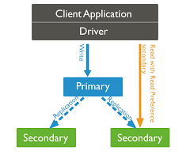
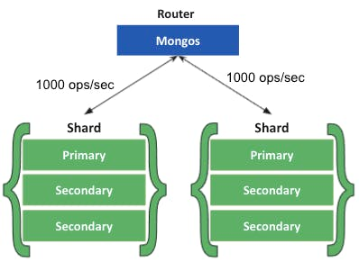

## MongoDB란 무엇인가?! (기본 이해하기!)

MongoDB는 기존에 사용하던 RDB의 확장성과 신속성 문제로 개발한 Database이다.

MongoDB는 NoSQL의 한 종류로, Document라는 형식의 자료구조를 사용한다.

현재 기준(2022년 12월)으로는 DB-Engines라는 사이트에서 매긴 DB 순위에서 NoSQL 중에서는 1위, 전체 DBMS 중에서도 5위를 차지했다. 
- 산정 기준은 검색 엔진(Google, Bing) 검색 횟수, Google 트렌드 검색 빈도, SNS(Twitter, LinkedIn), IT Q&A 사이트 (Stack Overflow) 이슈 등을 활용했다.

## SQL vs NoSQL

해당 포스팅은 NoSQL에 대한 글으로 해당 내용은 너무 상세히 다루지는 않는다.

**RDB(관계형 데이터-베이스)**에서는 효율적인 데이터 관리를 위해 **정규화**를 사용한다.
- 데이터 중복을 방지할 수 있다.
- 복잡하고 다양한 질의가 가능하다.
- 여러 테이블을 Join 해야 한다.
  - 조회가 느리다.
  - 확장이 어렵다. (Sharding을 가정했을 때 관계 테이블까지 모두 동일한 DB 서버에 보관해야 함)
- Schema 변경에 대한 공수가 크다.

아래는 RDB의 등장 배경이다.

```
RDB는 1970년대부터 사용되었는데, 당시 Disk Storage가 매우 고가의 제품으로 데이터 중복을 줄이는데 집중했다.

그때는 현재의 Scale-out 등의 기법은 고려하지 않고 만들어졌다고 할 수 있다.
```

NoSQL은 관계형 데이터베이스에서 하지 못했거나 어려운 것들을 해결하기 위해 등장했다.
- 데이터 가시성이 뛰어남 (RDB에서는 Outer Join하면 보기가 어려움 -> JSON 형태로 Document 내부에 Document를 두는 것이 가능)
- Join 없이 조회가 가능하므로 응답 속도가 빠르다.
- 스키마가 유연해서 데이터 모델을 App의 요구사항에 맞게 데이터를 수용할 수 있다.
- Scale-Out이 간편하다.
- 역정규화에 따라 데이터 중복이 발생한다.
- 스키마 설계를 못하면 성능 저하가 발생한다.

아래는 NoSQL의 등장 배경이다.
```
NoSQL은 2000년대에 등장했으며, Disk Storage는 더 이상 큰 이슈가 아니게 되었다.

다루는 데이터의 크기와 성능의 요구사항이 커지게 되었고, 분산 환경이 대중화되었다.
```

## MongoDB의 장점

MongoDB는 다음의 특징을 가진다.
- Document 지향 Database이다.
- 데이터 중복이 발생할 수 있지만, 접근성과 가시성이 좋다.
- 스키마 설계가 어렵지만, 스키마가 유연해서 Application의 요구사항에 맞게 데이터를 수용할 수 있다.
- HA와 Scale-Out Solution을 자체적으로 지원해서 확장이 쉽다.
  - Application에서는 Scale-out을 고려하지 않아도 된다.
- Secondary Index를 지원한다.
- 다양한 종류의 Index를 제공한다.
- 응답 속도가 빠르다.

## MongoDB 개념

아래 그림은 RDBMS와 대응되는 MongoDB의 개념들이다.


## MongoDB 구조

### 1. 기본 Database

MongoDB는 아래 3개의 기본 Database를 제공한다. (루트 권한 여부에 따라서 안보일 수도 있다.)
- admin
  - 인증과 권한 부여 역할을 한다.
  - shutdown 등 명령어는 해당 DB에 대한 접근이 필요하다.
- local
  - replication 절차레 필요한 oplog와 같은 컬렉션을 저장
  - instance 진단을 위한 startup_log와 같은 정보를 저장 
  - 복제 대상에서 제외된다.
- config
  - sharded cluster에서 각 shard의 정보를 저장한다.

### 2. Collection의 특징
- 동적 스키마를 가지기 때문에 스키마를 수정하려면 값을 추가/수정/삭제만 하면 된다.
  - 스키마라는 개념이 없다고 보는 것이 좋을 것 같다.
- Collection 단위로 Index를 생성할 수 있다.
- Collection 단위로 Shard를 나눌 수 있다.
  - 즉, Index나 Sharding Key 등의 활용을 하기 위해서는 Schema를 어느정도 유지를 해줘야 한다.

### 3. Document의 특징
- 저장할 때 BSON(Binary-JSON) 형태로 저장한다.
  - JSON보다 텍스트 기반 구문 분석이 빠르다. (처리가 빠르다.)
  - 공간이 효율적이다.
- 모든 Document에는 "_id" 필드가 있고, 없이 생성하면 고유한 ObjectId를 저장한다.
- 생성 시 상위 구조인 Database나 Collection이 없다면, 먼저 생성하고 Document를 생성한다.
- 최대 크기는 16MB로 고정되어 있다.

## MongoDB 배포 형태

MongoDB의 배포 형태는 크게 3가지가 있다.
- Standalone
- Replica Set
- Sharded Cluster

하나씩 살펴보자.

### Standalone

가장 일반적인 방법으로 1개의 Client가 1개의 Server에 Read/Write를 모두 하는 형태이다.

해당 DB가 죽으면 사용자들이 이용을 못하게 된다.

### Replica Set

위와 같은 문제 때문에 MongoDB에서는 Replica Set 방식의 배포를 제공한다.

Primary Database와 동일한 서버를 여러 대 띄워서 동일한 데이터를 Secondary Database에 복제한다.



여기서는 메인 DB가 죽어도 다른 DB가 무사하기에 운영을 끊지 않고 할 수 있다.
- 즉, HA(High Availability)를 보장한다.

해당 Replica Set을 구성할 때 중요한 것이 각 DB 서버를 다른 곳에 보관해야 목적에 맞게 사용할 수 있다는 점이다.
- 가령, 이번 kakao 사태에 대해 if kakao(https://www.youtube.com/watch?v=giCSm1D028s&t=1742s)에서는 이중화는 구성했지만, 다른 데이너 센터 간 이중화가 부족했다고 말했습니다. 동일한 데이터 센터의 다른 서버에 이중화를 함으로써 무용지물이 된 것입니다.
- 즉, 다른 DB 서버를 물리적으로 다른 서버에 보관해야 목적에 맞게 사용할 수 있다. 

Primary
- Read/Write 요청을 모두 처리할 수 있다.
- Write를 처리하는 유일한 멤버이다.
- Replica Set에 하나만 존재할 수 있다.

Secondary
- Read에 대한 요청만 처리할 수 있다.
- 복제를 통해 Primary와 동일한 데이터 셋을 유지한다.
- Replica Set에 여러 개 존재할 수 있다.

Replica Set은 Master-slave의 종류로 생각해도 좋을 것 같다.

### Shareded Cluster

문제는 Replica Set을 사용해도 부하는 DB 서버 1대가 받고 있는 상황이다.

해당 DB 서버가 트래픽을 받는데 무리가 있을 때 DB 서버의 부하 분산을 하게 된다.

MongoDB에서는 이러한 샤딩 처리를 위해 Sharded Cluster 배포 전략을 제공한다.



해당 방식은 Router가 어느 DB에 붙어서 처리를 할 지 정해주게 된다.
- HA(High Availability - 고가용성)
- Distiribution(분산)

(Router도 Scale out이 가능하다.)

## 참고
- https://www.mongodb.com/basics