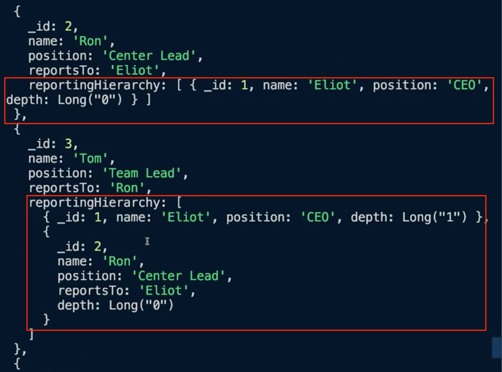

## MongoDB - 데이터 모델링의 다양한 기법!

## 너무 큰 배열 문제

아래 데이터 기반의 카페 서비스가 있다.

```mongo
db.cafe.insertMany([
    {
        _id: 1,
        name: "IT Community",
        desc: "A Cafe where developer's share information.",
        created_at: ISODate("2018-08-09"),
        last_article: ISODate("2022-06-01T10:56:32.00Z"),
        level: 5,
        members: [
            {
                id: "tom93",
                first_name: "Tom",
                last_name: "Park",
                phone: "000-0000-1234",
                joined_at: ISODate("2018-09-12"),
                job: "DBA"
            },
            {
                id: "asodsa123",
                first_name: "Jenny",
                last_name: "Kim",
                phone: "000-0000-1111",
                joined_at: ISODate("2018-10-02"),
                job: "Frontend Dev"
            },
            {
                id: "candy12",
                first_name: "Zen",
                last_name: "PKo",
                phone: "000-0000-1233",
                joined_at: ISODate("2019-01-12"),
                job: "DA"
            }
        ]
       
    }    
]);
```

여기서 문제는 1개의 카페에 members가 너무 길어질 수 있다는 점이다.

해당 경우 데이터가 커질수록 조회, 생성, 수정(members)가 매우 느려질 수 있다. 추가로 MongoDB는 1개 Document당 16MB를 최대로 하기 때문에 에러가 발생할 수 있다.
- 100,000개의 members를 가진 cafe 기준 13MB정도를 차지한다.
- 많아야 130,000개 이상의 members에서는 더이상 member를 추가할 수 없게 된다.

만약 1개 카페의 members 수의 제한이 있다면, 배열을 사용해서 한 곳에 몰아서 데이터를 보관하는 것이 좋을 수 있다.

하지만 무제한의 members가 들어갈 수 있다는 요구사항이 있다면 배열을 사용할 수 없다.

## 선형적 성능 문제

그럼 위 부분은 어떻게 해결할 수 있을까?

```mongo
db.members.insertMany([
    {
        id: "tom93",
        first_name: "Tom",
        last_name: "Park",
        phone: "000-0000-1234",
        job: "DBA",
        join_cafes: [{
            _id: 1,
            name: "IT Community",
            desc: "A Cafe where developer's share information.",
            created_at: ISODate("2018-08-09"),
            last_article: ISODate("2022-06-01T10:56:32.00Z"),
            level: 5,
            joined_at: ISODate("2018-09-12")
        }, ...]
    },
    ...
])
```

cafe가 members를 가지는 것이 아니라, member가 각각 자신이 속한 cafe를 가지도록 모델링을 할 수 있다.

이 경우 join_cafes의 경우에는 비즈니스 요구사항에 따라 최대 200개~300개 정도만 지원하도록 설계할 수 있기 때문에 충분히 가능하게 된다.

하지만 여전히 존재하는 문제가 있다. 

cafe의 정보를 수정한다고 했을 때는 아래와 같이 members에도 수정사항을 직접 반영해줘야 한다.

```mongo
db.members.updateMany(
    {
        "joined_Cafes._id": 1
    },
    {
        $set: {
            "joined_cafes.$.last_article": date
        }
    }
)
```

이때 모든 members의 join_cafes를 탐색하며 하나씩 전부 수정하기 때문에 선형적으로 작업이 필요하게 되는 문제가 발생한다.


## Conflict

인덱스를 하나만 추가하면 되게 된다. 

추가로 log를 하나씩 보관하게 되므로 16MB를 넣을 리도 없게 된다.

(Pull한 후 해결)

## 공통스펙

예시로 사용한 게임 로그 관리에서는 요소의 크기가 작아서 고려하지 않은 사항이 있다.

아래는 상품을 MongoDB에 저장한 예시이다.

```mongodb-json-query
[{
  name: "Cherry Coke 6-pack",
  manufacturer: "Coca-Cola",
  brand: "Coke",
  sub_brand: "Cherry Coke",
  price: 5.99,
  color: "red",
  size: "12 ounces",
  container: "can",
  sweetener : "sugar"
},
{
  name: "z-flip5",
  manufacturer: "Samgsung",
  brand: "Galaxy",
  price: 99.99,
  "color": "green",
  "display_size": "170.3 mm",
  "camera": "10.0 MP",
  "memory": "8G"
}]
```

이 경우 공통의 필드와, 선택적 필드 여부에 따라 아래와 같이 관리할 수 있다.

```mongodb-json-query
[{
  name: "Cherry Coke 6-pack",
  manufacturer: "Coca-Cola",
  brand: "Coke",
  sub_brand: "Cherry Coke",
  price: 5.99,
  spaces: [
    {key:  "color", value:  "red"},
    {key:  "size", value:  12, unit: "ounces"},
    {key:  "container", value:  "can"},
    {key:  "sweetener", value:  "sugar"}
  ]
},
{
  name: "z-flip5",
  manufacturer: "Samgsung",
  brand: "Galaxy",
  price: 99.99,
  spaces: [
    {key:  "color", value:  "green"},
    {key:  "display_size", value:  170.3, unit: "mm"},
    {key:  "camera", value:  10.0, unit: "MP"},
    {key:  "memory", value:  8, unit: "G"},
  ]
}]
```

## 데이터 묶기

특정 공간에서 분마다 온도 데이터를 DB에 삽입해야 하는 요구사항이 있다고 가정하자.

```mongodb-json-query
{
  sensor_id: 1,
  timestamp: time,
  temparature: temp
}
```

문제는 각각의 센서마다 분마다 document가 저장되어야 하는 문제가 있다.
- (센서 하나당) 60 per hour, 1440 per day
- 센서가 20개라면 10,000,000 per year

```mongodb-json-query
{
  sensor_id: 1,
  start_date: date,
  end_date: date,
  measurements: [
    {
      timestamp: time,
      temparature: temparature
    }, ...
  ]
}
```

해당 데이터를 1시간마다 삽입한다면 Document의 수를 크게 줄일 수 있다. 결과적으로 Storage를 절약할 수 있고, insert 문을 최소화할 수 있다.

단, 요구사항에 따라 데이터 모델링을 하는 것이 중요하다.

예를 들어 온도가 25도 이상의 데이터만 뽑고 싶다거나, 10분 단위의 데이터만 뽑고 싶다거나 하면 해당 아키텍처는 성능상 좋지못할 수 있다.

#### Time Series

MongoDB 5.0부터는 Time Series라고 하는 Collection 타입을 제공한다.

```mongodb-json-query
db.createCollection(
  "sensors",
  {
    timeseries: {
      timeField: "timestamp",
      metaField: "metadata",
      granularity: "minutes",
    }
  }
)

{
  timestamp: time,
  metadata: {
    sensor_id: 1,
    temparature: temp
  } 

}
```

TimeSeries 컬렉션은 시계열 데이터에 한해서 위와 같이 데이터를 묶는 기능을 제공한다. (스토리지가 정말 많이 절약된다. 위 방식보다 더 절약된다.)

추가로 PrimaryKey를 활용한 우수한 검색속도도 제공된다.

## Subset Pattern

배달 서비스를 MongoDB에 저장한다고 가정해보자.

아래는 식당과 리뷰에 대한 데이터이다.

```mongodb-json-query
db.shops.insertOne({
  _id: 1,
  name: "Jerry Stake house",
  desc: "Greatest Steak House Ever.",
  phone: "000-0000-1234",
  reviews: [
    {
      review_id: 1,
      user: "James",
      review: "So Good!!",
      date: new Date(),
      rating: 10
    }, ...
  ]
})
```

장사가 잘되는 식당의 경우 리뷰가 1000개 이상정도라고 가정했을 때 16MB를 넘기기엔 어려우므로 수용 가능한 스키마라고 판단할 수 있다.

하지만 처리량 저하로 인해 사용자 응답이 느려지면서 사용자 경험(UX)이 좋지 못하게 될 수 있다. 

WorkingSet이 가게 및 리뷰 데이터 전체이기 때문에 캐시 공간이 부족하게 된다.
- (음식점 클릭 -> find() -> 캐시 탐색 -> (캐시 갱신) -> 응답)

여기서는 WorkingSet을 줄여서 캐시가 부족하지 않도록 해야 한다.

일반적으로 사용자는 리뷰 페이지 전체를 한번에 다 읽을 필요가 없다. 최근 10개 정도만 보여주고, 추가적인 데이터는 추가로 조회하도록 구성할 수 있다.
- 가게는 상위 10개정도의 리뷰만 저장하고
- 리뷰는 리뷰 컬렉션에서 전체를 저장

해당 처리방식을 Subset Pattern이라고 한다.

결과적으로 데이터의 document 크기(16MB)도 신경쓸 필요가 없어지고, 캐시 메모리는 절약되고 사용자 응답은 빨라지게 된다.

## 회귀 서치와 Tree 구조

GraphLookup을 사용하면 회귀 서치나 Depth가 있는 트리 구조 서치에 유용하게 사용할 수 있다.

#### 회귀 서치

회귀 서치의 경우 결재선이나 댓글(+답글) 등의 경우 사용할 수 있다.

결재선을 예로 들어보자.
```mongodb-json-query
db.employees.insertMany([
  {
    _id: 1,
    name: "Eliot",
    position: "CEO"
  },
  {
    _id: 2,
    name: "Ron",
    position: "Team Lead",
    reportsTo: "Eliot"
  },
  {
    _id: 3,
    name: "Tom",
    position: "Team Member",
    reportsTo: "Ron"
  }
])

db.employees.aggregate([
  {
    $graphLookup: {
      from: "employees",
      startWith: "$reportsTo",
      connectFromField: "reportsTo",
      connectToField: "name",
      depthField: "depth",
      as: "reportingHierarchy"
    }
  }
])
```

아래는 aggregate의 결과이다.



각 유저가 자신의 결재선 정보를 담고 있다.  

GraphLookup은 식품, 생활, 가전 등의 카테고리가 있는 트리 구조에서도 매우 유용하게 사용할 수 있다.

## 참고
- https://fastcampus.co.kr/dev_online_bedata
- https://marsettler.com/mongodb/mongodb-study-week-5
- http://www.yes24.com/Product/Goods/103415627


