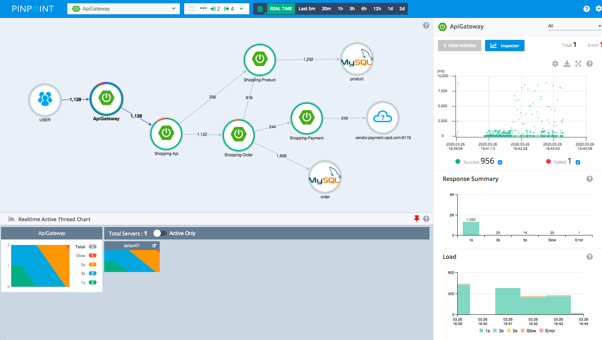

## 모니터링 3단계

- 대시보드
- 애플리케이션 추적 - 핀 포인트
- 로그

## 대시보드

전체를 한 눈에 볼 수 있는 모니터링 도구(마이크로미터, 프로메테우스, 그라파나 등)

**모니터링 대상**
- 시스템 메트릭(CPU, 메모리)
- 애플리케이션 메트릭(톰캣 쓰레드 풀, DB 커넥션 풀, 애플리케이션 호출 수)
- 비즈니스 메트릭(주문수, 취소수)

## 애플리케이션 추적

각각의 HTTP 요청 1개를 자세히 추적, MSA 환경에서 분산 추적

**제품**

핀포인트, 스카우트, 와탭, 제니퍼

**PinPoint**

PinPoint는 분산 환경에서 HTTP 트랜잭션을 추적할 수 있다.

각 요청의 CallStack까지도 정확하게 파악할 수 있다.

우측 상단에 있는 HTTP 트랜잭션 1개를 분석해서 왜 Latency가 튀었는 지를 확인할 수 있다.

## 로그

가장 세세한 추적, 원하는대로 커스텀 가능

로그가 뒤섞이지 않게 1개 고객의 1개의 HTTP 요청 내부를 묶어서 확인할 수 있는 방법을 구축하는 것이 중요
- 고객의 요청이 들어올 때 UUID를 만들어서 각 로그에 출력
- MDC 적용

**파일로 직접 로그를 남기는 경우**
- 일반 로그와 에러 로그는 파일을 구분
- 에러 로그만 확인해서 문제를 정리
 
## 알림

경고와 심각을 나누자.