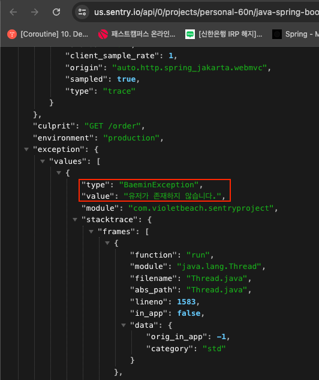

최근에 서비스의 모니터링이 점점 어려워지는 문제가 발생하고 있다. 가장 큰 문제는 **불필요한 에러 Alert이 너무 많다는 것**이다.

그 결과 신경을 더 많이 할애하게 되고, 정말 받아야 하는 Alert이 왔을 때 무신경하게 대응하게 된다.

내가 맡게 될 프로젝트의 중요도와 Risk, 트래픽 등을 고려했을 때 모니터링 개선이 반드시 필요해서 시간을 내서 학습하게 되었다.

## Sentry

Sentry은 에러 모니터링 및 성능 모니터링을 제공해주는 도구이다. 주로 에러 트래킹이나 Slack 등을 통한 Alert으로 많이 사용한다.

학습을 위해 SpringBoot 3.1.9 버전과 아래 라이브러리를 사용했다.

```groovy
implementation 'io.sentry:sentry-spring-boot-starter-jakarta:7.5.0'
``` 

yml은 아래와 같이 설정할 수 있다.

```yaml
sentry:
  dsn: https://fa1b1dc87e3eb8bee49cc2d25b06615e@o4506869937078272.ingest.us.sentry.io/4506869938913280
```

해당 키는 Sentry에 로그인하면 발급받을 수 있다.

테스트를 해보자.

```kotlin
@RestController
class Controller {

    @RequestMapping("/test")
    fun test() {
        throw RuntimeException("Error!!")
    }
}
```

이제 API를 호출하면 아래와 같이 Sentry로 예외가 전달된다.


## 이벤트 발생 기준

아래처럼 Exception을 감싸면 Sentry로 전달되지 않는다.

```kotlin
@RestController
class Controller {
    
    @RequestMapping("/test")
    fun test() {
        try {
            throw RuntimeException("catch!!")
        } catch (e: Exception) {
            println(e.message)
        }
    }
}
```

우선 Error를 전달(Capture)하는 원리와 기준에 대해 알아야 한다.

## 원리

아래는 Sentry 라이브러리에 있는 `SentryExceptionResolver`이다.
```java
public class SentryExceptionResolver implements HandlerExceptionResolver, Ordered {
    
    private final int order;
    // .. 생략
    
    @Override
    public @Nullable ModelAndView resolveException(
        final @NotNull HttpServletRequest request,
        final @NotNull HttpServletResponse response,
        final @Nullable Object handler,
        final @NotNull Exception ex) {

        final SentryEvent event = createEvent(request, ex);
        final Hint hint = createHint(request, response);

        hub.captureEvent(event, hint);

        // null = run other HandlerExceptionResolvers to actually handle the exception
        return null;
    }
    
    @NotNull
    protected SentryEvent createEvent(
        final @NotNull HttpServletRequest request, final @NotNull Exception ex) {

        final Mechanism mechanism = new Mechanism();
        mechanism.setHandled(false);
        mechanism.setType(MECHANISM_TYPE);
        final Throwable throwable =
            new ExceptionMechanismException(mechanism, ex, Thread.currentThread());
        final SentryEvent event = new SentryEvent(throwable);
        event.setLevel(SentryLevel.FATAL);
        event.setTransaction(transactionNameProvider.provideTransactionName(request));

        return event;
    }

    // org.springframework.core.Ordered 인터페이스의 메서드
    @Override
    public int getOrder() {
        return order;
    }
}
```

해당 클래스는 `HandlerExceptionResolver`를 구현한다. `HandlerExceptionResolver`는 스프링 웹에서 발생된 예외를 핸들링 할 수 있는 기능을 제공한다.

그래서 예외를 catch한 경우에는 Error가 Sentry로 전달되지 않았던 것이다.

그런데, `@ControllerAdvice`를 사용할 경우 Exception을 터트리지 않고 객체를 반환하도록 하는 경우가 많다.

스프링은 `ExceptionHandlerExceptionResolver`를 검색하면서 `AnnotationAwareOrderComparator`를 사용해서 정렬한다. 해당 클래스는 Order를 사용한다.

그래서 아래 속성으로 Order를 명시할 수 있다. default가 1이라서 `@ExceptionHandler`가 먼저 동작한다. (낮을수록 먼저 동작한다.)
```properties
sentry.exception-resolver-order: 1
```

Sentry는 ExceptionResolver 뿐만 아니라 다양한 방법으로 비동기로 Sentry 서버에 이벤트를 전달한다.
- SentryExceptionResolver
- SentrySpringFilter
- SentryWebExceptionHandler
- SentryCaptureExceptionParameterAdvice
- ...

## 설정

설정은 프로퍼티나 YML 말고도 JVM 언어 등 프로그래밍 언어로도 가능하다.

아래는 `.properties`를 사용한 예시이다.

```properties
# 추적할 Event의 비율을 설정한다. 1.0이면 100%를 캡처한다.
# (너무 높으면 리소스를 많이 사용한다.)
sentry.traces-sample-rate=1.0
# Event를 전송할 확률을 설정한다. 1.0이면 100%를 캡처한다.
# 발생시킬 Event의 태그를 지정
sentry.tags.first_tag=first-tag-value
# 무시할 Exception 정의
sentry.ignored-exceptions-for-type=java.lang.RuntimeException,java.lang.IllegalStateExceptio
# 디버그 모드 (콘솔에 정보 출력)
sentry.debug=true
# 디버그 모드의 로그 레벨 설정 (debug, info, warning, error, fatal - default: debug)
sentry.diagnosticLevel=debug
# 로컬에 저장할 envelopes 수
sentry.maxCacheItems=30
# Stack Trace를 모든 메시지에 첨부
sentry.attachStacktrace=true
# HTTP 요청 본문 캡처 여부 (never, small, medium, alwways)
sentry.maxRequestBodySize=never
# SDK가 Sentry에 이벤트를 보낼 지 여부
sentry.enable=true
# 이벤트를 전송하기 전에 호출할 함수
sentry.beforeSend: null
# 예외 해결 순서 지정, -2147483647로 설정하면 Spring 예외 처리기에서 처리된 오류는 무시한다.
sentry.exception-resolver-order: 0
...
```

## 필터링

Sentry는 올바른 정보와 합리적인 양을 가장 권장한다.

`beforeSend`는 이벤트가 서버로 전송되기 직전에 호출되기 때문에 이벤트를 편집하거나 전송하지 않을 수 있다.

BeforeSend 콜백은 `BeforeSendCallback`을 구현해서 빈으로 등록한다.

```kotlin
@Component
class CustomBeforeSendCallback : SentryOptions.BeforeSendCallback {
    override fun execute(event: SentryEvent, hint: Hint): SentryEvent? {
        // Example: Never send server name in events
        event.serverName = null
        return event
    }
}
```

hint를 사용해서 추가 데이터를 추출할 수도 있다.

```kotlin
@Component
class CustomBeforeSendCallback : SentryOptions.BeforeSendCallback {
    override fun execute(event: SentryEvent, hint: Hint): SentryEvent? {
        if (hint["my-hint-key"] != null) {
            null
        }
        return event
    }
}
```

Exception 정보로 필터링하는 것도 가능하다.

```kotlin
@Component
class CustomBeforeSendCallback : SentryOptions.BeforeSendCallback {
    override fun execute(event: SentryEvent, hint: Hint): SentryEvent? {
        if (event.throwable is SQLException) {
            event.fingerprints = listOf("database-connection-error")
        }
        return event
    }
}
```

이를 활용하면 센트리 서버의 부담을 줄일 수 있다.

## 서버에서 Ignore 처리

사실 간단한 부분의 경우에는 Sentry 서버에서 Ignore 처리하는 방법도 있다.


편리하긴 하지만, 클라리언트에서는 이벤트를 발행하고 서버에서는 적재되므로 성능이 낭비된다는 점이 있다.

## Tag를 활용한 분기

문제 해결을 위해 적용한 주요 내용이 이부분이다.

아래는 현재 사용하고 있는 Exception 구조를 요약한 것이다.

```kotlin
class BaeminException(code: ErrorCode) : RuntimeException(code.message)

enum class ErrorCode(val message: String) {
    USER_NOT_FOUND("유저가 존재하지 않습니다."),
    ORDER_NOT_FOUND("주문이 존재하지 않습니다."),
}
```

아래 Controller로 요청해보자.

```kotlin
@RestController
class Controller {
    
    @RequestMapping("/order")
    fun order(): Unit = throw BaeminException(ErrorCode.USER_NOT_FOUND)
    
}
```

SentryEvent를 보면 아래와 같이 type은 `BaeminException`, value는 `유저가 존재하지 않습니다.` 이다.



즉, 해당 에러가 왔을 때 Alert을 사용하기 위해서는 해당 메시지 문자열로 분기를 해야 하는 상황이 발생한다.


해당 메시지는 충분히 변경될 수 있는 내용이다. 즉, 메시지가 변경될 때마다 Sentry의 Alert에 동기화해줘야 한다.

더 큰 문제는 ErrorLog로 인해서 발생하는 경우이다.

Exception의 종류는 1개만 사용하고 ErrorCode로 분기를 하고 있다.


## 로그 통합

예외가 전파되면 Sentry 이벤트를 발행하겠지만, 로그 통합 기능을 사용할 수 있는 방법도 있다.

아래 의존성을 추가한다.

```groovy
implementation 'io.sentry:sentry-logback:7.6.0'
```

이후 아래 설정을 사용할 수 있다.

```properties
# 에러 수준이 error 이상일 때 이벤트 발행
sentry.logging.minimum-event-level=error
# 에러 수준이 debug 이상인 대상만 탐색에 포함
sentry.logging.minimum-breadcrumb-level=info
```

`logback-spring.xml`로 로그 설정을 통합할 수도 있다.

```xml
<?xml version="1.0" encoding="UTF-8"?>
<configuration>
  <include resource="org/springframework/boot/logging/logback/defaults.xml"/>
  <include resource="org/springframework/boot/logging/logback/console-appender.xml" />

  <appender name="SENTRY" class="io.sentry.logback.SentryAppender">
      <minimumEventLevel>ERROR</minimumEventLevel>
      <minimumBreadcrumbLevel>INFO</minimumBreadcrumbLevel>
  </appender>
          

  <root level="info">
    <appender-ref ref="CONSOLE" />
    <appender-ref ref="SENTRY" />
  </root>
</configuration>
```

위와 같이 Logback을 사용해서 `SentryAppender`를 구성할 수 있다. 

## 참고

- https://docs.sentry.io/platforms/java/guides/spring-boot
